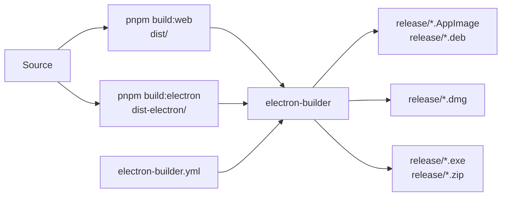
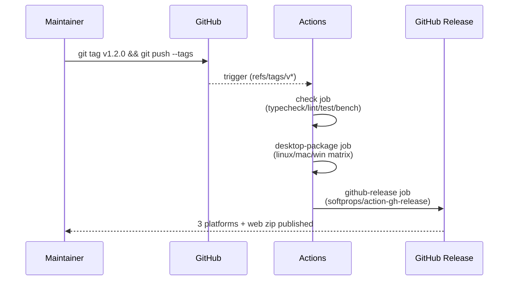

# Packaging Desktop Builds

The desktop build is Electron + electron-builder. `package.json` exposes
`package:linux` / `package:mac` / `package:win`; CI runs each on its
native runner and creates a GitHub Release on `v*` tags.

::: tip Three gates

1. **Web bundle** — `pnpm build:web` writes `dist/`.
2. **Electron main** — `pnpm build:electron` compiles TypeScript to
   `dist-electron/`.
3. **electron-builder** — packages native installers into `release/`.

`pnpm package:*` chains all three.
:::

## Goal

Produce installers for all three platforms locally:

- Linux: AppImage + .deb
- macOS: DMG (universal)
- Windows: NSIS installer + portable zip

## Prerequisites

- Node 22.22.1+, pnpm 11.5.2.
- macOS packages MUST be built on macOS (signing is local-only).
- Windows can cross-build from Linux (unsigned). Signed NSIS requires
  Windows + cert token.
- License activation flow already verified
  (see [Issuing License Keys](./issuing-license-keys)).

## Packaging pipeline



## Step-by-step

### 1. Clean Linux build

```bash
pnpm install --frozen-lockfile
pnpm package:linux
ls release/
# Apollo Map Studio-1.0.0-linux-x64.AppImage
# Apollo Map Studio-1.0.0-linux-amd64.deb
```

`release/` also contains `builder-debug.yml` and
`builder-effective-config.yaml` (builder diagnostics; CI excludes them).

### 2. `electron-builder.yml` essentials

```yaml
appId: com.apollo-map-studio.app
productName: Apollo Map Studio
directories:
  output: release
files:
  - dist/**/*
  - dist-electron/**/*
  - package.json
asar: true
extraMetadata:
  main: dist-electron/main.cjs
  dependencies: {} # critical — see warning below
publish: null
```

::: warning `dependencies: {}` is intentional
electron-builder runs `npm install` for `package.json.dependencies` by
default, but Vite already bundles all runtime code into
`dist-electron/`. Reinstalling adds hundreds of MB of dead weight.
Force-empty.
:::

### 3. macOS configuration

```yaml
mac:
  category: public.app-category.developer-tools
  target:
    - target: dmg
      arch: [x64, arm64]
    - target: zip
      arch: [x64, arm64]
  hardenedRuntime: false # dev only; release needs true + entitlements
```

```bash
pnpm package:mac
# release/Apollo Map Studio-1.0.0-mac-x64.dmg
# release/Apollo Map Studio-1.0.0-mac-arm64.dmg
```

### 4. Code signing (macOS)

Unsigned builds trigger Gatekeeper "is damaged" warnings. Sign with:

```bash
security import developer-id.p12 -P 'password'

export CSC_LINK=$(base64 < developer-id.p12)
export CSC_KEY_PASSWORD='password'
export APPLE_ID='your@dev.account'
export APPLE_APP_SPECIFIC_PASSWORD='abcd-efgh-ijkl-mnop'
export APPLE_TEAM_ID='ABCDE12345'

pnpm package:mac
```

::: danger Never commit certificates
`developer-id.p12` is never in the repo. CI uses GitHub secrets:
`secrets.MAC_CSC_LINK`, `secrets.MAC_CSC_KEY_PASSWORD`, etc.
:::

### 5. Notarization (macOS)

```yaml
mac:
  hardenedRuntime: true
  notarize:
    teamId: ABCDE12345
```

`pnpm package:mac` then auto-uploads to Apple Notary Service. Wait
2–15 min.

### 6. Windows NSIS

```yaml
win:
  target:
    - target: nsis
      arch: [x64]
    - target: zip
      arch: [x64]
  artifactName: ${productName}-${version}-${os}-${arch}.${ext}
nsis:
  oneClick: false
  perMachine: false
  allowToChangeInstallationDirectory: true
```

Code signing (EV / OV cert):

```bash
export CSC_LINK=$(base64 < windows-cert.pfx)
export CSC_KEY_PASSWORD='password'
pnpm package:win
```

::: warning EV certificates require USB tokens
EV private keys can't be exported; signing happens on the token. EV
signing in CI is painful — common pattern: sign locally before delivery
and upload to the GitHub Release.
:::

### 7. Linux AppImage / .deb

```yaml
linux:
  category: Development
  maintainer: Apollo Map Studio <maintainers@apollo-map-studio.local>
  target:
    - target: AppImage
      arch: [x64]
    - target: deb
      arch: [x64]
```

No signing required; AppImage gains incremental updates with a zsync
file (not yet enabled).

## CI release workflow



Full workflow:
[`.github/workflows/ci.yml`](https://github.com/SakuraPuare/apollo-map-studio/blob/main/.github/workflows/ci.yml).

## Files modified

| File                       | Change                         |
| -------------------------- | ------------------------------ |
| `electron-builder.yml`     | Targets, signing, notarization |
| `electron/main.cts`        | Main-process entry             |
| `electron/preload.ts`      | Renderer bridge                |
| `package.json` `scripts`   | Packaging commands             |
| `.github/workflows/ci.yml` | CI release matrix              |

## Testing checklist

- [ ] `pnpm package:linux` on Ubuntu 22.04 produces AppImage and deb;
      both launch.
- [ ] `pnpm package:mac` on macOS 14 produces DMG; opens after
      `xattr -d com.apple.quarantine`.
- [ ] `pnpm package:win` on Windows 11 produces NSIS; installer allows
      directory choice.
- [ ] First launch shows the activation dialog.
- [ ] Offline run: pull the network cable; the editor still opens
      (after first activation).
- [ ] DMG payload size < 250 MB (asar compression worked).
- [ ] Cold start < 3 s (measured with `electron --inspect`).

## Common pitfalls

### `dependencies` drags node_modules in

You forgot `extraMetadata.dependencies: {}`. If asar is over 200 MB,
suspect this first.

### macOS "App is damaged"

Unsigned / unnotarized. Self-test workaround:

```bash
xattr -d com.apple.quarantine /Applications/Apollo\ Map\ Studio.app
```

Customer-facing builds MUST be signed and notarized.

### Windows SmartScreen warning

Without an EV cert you'll see "Microsoft Defender SmartScreen blocked".
Build reputation slowly with Defender's reputation service or buy an EV
cert and ship clean immediately.

### Linux .deb missing dependencies

```yaml
linux:
  desktop:
    Categories: 'Development;Graphics'
deb:
  depends: ['libgtk-3-0', 'libnotify4', 'libnss3']
```

Electron usually infers these — occasionally one slips.

### Cross-platform path case

Linux is case-sensitive, macOS defaults to insensitive, Windows is
insensitive. Misspelled imports work locally on macOS but fail on Linux
CI. Run `pnpm build:web` on Linux before push (CI does this for you).

### `Cannot find module 'dist-electron/main.cjs'` at start

`pnpm build:electron` did not run, or `tsconfig.electron.json` changed
output path. Keep `package.json.main` and
`electron-builder.yml.extraMetadata.main` in sync.

## Source links

- [`electron-builder.yml`](https://github.com/SakuraPuare/apollo-map-studio/blob/main/electron-builder.yml)
- [`electron/main.cts`](https://github.com/SakuraPuare/apollo-map-studio/blob/main/electron/main.cts)
- [`tsconfig.electron.json`](https://github.com/SakuraPuare/apollo-map-studio/blob/main/tsconfig.electron.json)
- [`.github/workflows/ci.yml`](https://github.com/SakuraPuare/apollo-map-studio/blob/main/.github/workflows/ci.yml) — `desktop-package` matrix
- [electron-builder docs](https://www.electron.build/)

## Advanced

### Auto-update (electron-updater)

Not enabled today. To enable:

1. `pnpm add electron-updater`
2. Add `publish: { provider: 'github' }` to `electron-builder.yml`.
3. Call `autoUpdater.checkForUpdatesAndNotify()` in `electron/main.cts`.

::: warning Auto-update requires signing
Unsigned builds reject new packages to avoid MITM substitution.
:::

### Multilingual NSIS

```yaml
nsis:
  installerLanguages: ['en_US', 'zh_CN']
  language: '2052' # zh_CN
```

### Launch at startup

`electron/main.cts`:

```ts
app.setLoginItemSettings({ openAtLogin: true });
```

Expose a user-facing toggle; default off.

::: tip Release-day ritual
After tagging, spend 5 min on a manual smoke test: install → activate →
import a sample map → draw a lane → export → uninstall. If those five
steps work, your users can run it.
:::
