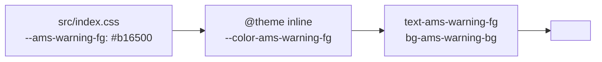

# Theming with `ams-*` Tokens

The design system uses CSS custom properties prefixed `ams-` as the
single source of truth for colors, spacing, and font sizing. Tailwind 4's
`@theme` maps them into utility classes. Components **never** hard-code
hex or rgb values.

::: tip Namespace
`ams` = Apollo Map Studio. The prefix isolates project tokens from
generic `--bg-*` / `--fg-*` and from third-party theme variables
(dockview, shadcn registry each carry their own).
:::

## Goal

Add `--ams-warning-fg` / `--ams-warning-bg` to power a "geometry
self-intersect" warning banner.

## Prerequisites

- You have read [Design System](../design/).
- You know Tailwind 4 `@theme` syntax.
- The project loads `src/index.css` via `@tailwindcss/vite`.

## Token flow



## Step-by-step

### 1. Add the token in `tokens.css`

```css
/* src/index.css */
:root {
  /* ... */
  --ams-warning-fg: #b16500;
  --ams-warning-bg: #fff4e0;
}

@media (prefers-color-scheme: dark) {
  :root {
    --ams-warning-fg: #ffae5e;
    --ams-warning-bg: #3a2a10;
  }
}
```

::: warning Always provide both light and dark
Every new token MUST have both. A missing dark value renders unreadable
when the user toggles. Verify visually in both modes.
:::

### 2. Register in `@theme`

```css
/* src/index.css */
@theme inline {
  --color-ams-warning-fg: var(--ams-warning-fg);
  --color-ams-warning-bg: var(--ams-warning-bg);
}
```

`inline` lets Tailwind expand variable references at build time, so the
runtime CSS file has no duplicates.

### 3. Use in a component

```tsx
// src/components/notifications/SelfIntersectWarning.tsx
export function SelfIntersectWarning({ message }: { message: string }) {
  return (
    <div className="text-ams-warning-fg bg-ams-warning-bg px-4 py-2 rounded-md">⚠ {message}</div>
  );
}
```

::: tip Utilities, not inline style
An inline `color: var(--ams-warning-fg)` value works but breaks Tailwind
discoverability. Use className for components; reserve `style` for
deeply custom one-offs.
:::

### 4. Story or visual example

```tsx
// src/components/notifications/__stories__/Warning.stories.tsx
export const Default = () => <SelfIntersectWarning message="Lane boundary self-intersects" />;
```

::: tip No Storybook? Use the docs site
The project does not use Storybook today. You can embed a `<ClientOnly>`
component preview in VitePress under `examples/`.
:::

### 5. Visual checks

- Toggle light/dark; text-on-background contrast stays legible.
- Selected, hover, and disabled states each look correct.
- Compare against neighboring components (toast, status bar) — no
  clashing hue.

## Existing token namespaces

| Prefix             | Purpose                        | Example                |
| ------------------ | ------------------------------ | ---------------------- |
| `--ams-bg-*`       | Background layers              | `--ams-bg-canvas`      |
| `--ams-fg-*`       | Foreground text                | `--ams-fg-default`     |
| `--ams-border-*`   | Borders                        | `--ams-border-subtle`  |
| `--ams-accent-*`   | Brand accent                   | `--ams-accent-primary` |
| `--ams-warning-*`  | Warning (added in this recipe) | `--ams-warning-fg`     |
| `--ams-error-*`    | Error                          | `--ams-error-fg`       |
| `--ams-success-*`  | Success                        | `--ams-success-fg`     |
| `--ams-grid-*`     | Grid / rulers                  | `--ams-grid-major`     |
| `--ams-lane-*`     | Lane rendering                 | `--ams-lane-fill`      |
| `--ams-junction-*` | Junction rendering             | `--ams-junction-fill`  |

## Naming rules

::: tip Semantic, not visual
`--ams-warning-fg` ✅
`--ams-orange-600` ❌ (colors get re-skinned; semantics last)

`--ams-bg-canvas` ✅
`--ams-bg-1` ❌ (numeric stacking is unclear — is 1 top or bottom?)
:::

## Migration policy

Found a hard-coded color:

```tsx
<div className="text-[#b16500] bg-[#fff4e0]"> ⚠ ... </div>
```

Process:

1. Identify the **semantic** role (warning here).
2. Add or reuse the matching token in `tokens.css`.
3. Replace the className.
4. Verify both light and dark.
5. Land as its own PR titled
   `refactor(theme): replace hex colors with ams-warning tokens`.

::: warning No mass replace
The same hex in two places might mean two different things — warning vs
highlight. Blind sed makes future re-skinning harder. Migrate manually.
:::

## Files modified

| File                              | Change                            |
| --------------------------------- | --------------------------------- |
| `src/index.css`                   | New token + `@theme` registration |
| Component files                   | Use new utility class             |
| `docs/reference/color-palette.md` | Add a row to the table            |

## Testing checklist

- [ ] Contrast meets WCAG AA in both themes (4.5:1 text, 3:1 graphics).
- [ ] No component still uses raw colors:
      `grep -r '#[0-9a-f]\{6\}' src/components`.
- [ ] Tailwind generates the utility class
      (`grep '\.text-ams-warning-fg' dist/`).
- [ ] DevTools Computed shows `color: rgb(...)` resolved through
      `var(--ams-warning-fg)`.
- [ ] Changing the token cascades to every consuming component.

## Common pitfalls

### `bg-ams-foo` produces no utility

`@theme` requires the prefix `--color-ams-foo` for colors,
`--spacing-ams-foo` for spacing, and `--font-ams-foo` for fonts.
Tailwind 4 picks the utility family from that prefix. See
[Tailwind 4 theme docs](https://tailwindcss.com/docs/theme).

### `prefers-color-scheme` ignored under dark mode

You probably set `data-theme="..."` on `<html>` instead of relying on
the system. The media query only fires when `data-theme` is unset.
Confirm or switch to a `[data-theme='dark']` selector.

### Mixing shadcn tokens with ams tokens

shadcn ships its own `--background` / `--foreground`. Don't alias the
two sets. Use shadcn tokens inside the component library, ams tokens in
business UI, and bridge via wrappers:

```tsx
<Button className="bg-ams-accent-primary text-white" />
```

### Class collision

`text-red-500` plus `text-ams-warning-fg` — CSS order decides which
wins. Standardize on ams tokens to avoid mixed states.

## Source links

- [`src/index.css`](https://github.com/SakuraPuare/apollo-map-studio/blob/main/src/index.css)
- [`vite.config.ts`](https://github.com/SakuraPuare/apollo-map-studio/blob/main/vite.config.ts) — `@tailwindcss/vite` plugin
- [Design System: Colors](../reference/color-palette)
- [Tailwind v4 theme docs](https://tailwindcss.com/docs/theme)

## Advanced

### Multi-brand support

```css
:root[data-brand='partner-x'] {
  --ams-accent-primary: #6633cc;
}
```

Switch theme by setting `<html data-brand='partner-x'>`. Every token
flips at once.

### Design tooling sync

Sync `tokens.css` with Figma:

1. Use a plugin such as Variables Bridge to import CSS variables.
2. Designers tweak in Figma, export, and PR the diff for engineering
   review.
3. Embed a token-preview table in `docs/reference/color-palette.md`.

### Brand guard script

CI:

```bash
pnpm exec lint:no-raw-colors src/components
```

A custom scanner that fails on `#xxxxxx` / `rgb(` / `hsl(`. Not yet
enabled; recommended as a P3 task.

## Design review checklist

Before shipping a new component, self-review:

- [ ] No `#xxx` / `rgb()` / `hsl()` literals.
- [ ] Colors all use ams tokens (semantic names).
- [ ] Spacing uses Tailwind's built-in scale or `--spacing-ams-*`.
- [ ] Font size uses `--font-ams-*`, not px / rem literals.
- [ ] Both light and dark themes meet AA contrast.
- [ ] `prefers-contrast: high` remains readable.
- [ ] Focus state visible (`focus-visible:ring-ams-accent-primary`).

## Integrating with maplibre rendering

maplibre layer paint cannot consume Tailwind utilities directly (it
runs its own styling system). But maplibre supports
`'paint': { 'fill-color': ['get', 'color'] }`, so let
`spatial.worker.ts` resolve tokens to hex on the main thread and stamp
the result into feature properties:

```ts
// src/core/workers/spatialFeatures.ts
import { getCssVariable } from './styleVars';

const laneFill = getCssVariable('--ams-lane-fill');
feature.properties.color = laneFill;
```

`getCssVariable` reads
`getComputedStyle(document.documentElement)` on the main thread (the
worker has no CSS context) and forwards the value. Re-run after any
theme change.

::: tip One sentence
Every color, spacing, and font size becomes an ams token; every
component reaches it via a utility class. Two rules, and theming becomes
configuration instead of code.
:::
