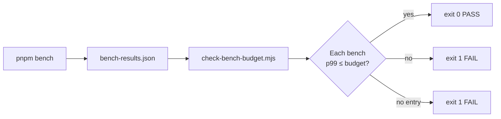

# Benchmark Budgets

This page is a per-row reading of `scripts/bench-budgets.json` plus a summary
of how `scripts/check-bench-budget.mjs` enforces it. CI runs `pnpm bench`,
collects each measured p99, and exits 1 if any value exceeds the matching
ceiling.

::: tip Reading the numbers

- **p99**: the 99th-percentile sample latency in milliseconds. More robust
  than the mean for tail-latency regression detection.
- **Budget ≠ target**: the budget is a hard "must not be slower than" line,
  with ~1.5x of GitHub Actions runner jitter baked in. Local mean values are
  typically far below.
  :::

## File locations

| Path                             | Role                                                                    |
| -------------------------------- | ----------------------------------------------------------------------- |
| `scripts/bench-budgets.json`     | Budget table — the source of truth for this page                        |
| `scripts/check-bench-budget.mjs` | The CI guard script                                                     |
| `bench-results.json`             | Output of `pnpm bench --outputJson bench-results.json`; CI scratch file |

## Verification flow



## Current budgets (`scripts/bench-budgets.json`)

```json
{
  "10-point polyline, 3.5m offset": { "p99Ms": 1 },
  "100-point polyline, 3.5m offset": { "p99Ms": 3 },
  "1000-point polyline, 3.5m offset": { "p99Ms": 40 },
  "full stitch — 10-lane linear chain": { "p99Ms": 3 },
  "full stitch — 100-lane linear chain": { "p99Ms": 6 },
  "full stitch — 100 lanes / 50 isolated junctions": { "p99Ms": 6 },
  "incremental — 100-lane chain, 1 lane decorated": { "p99Ms": 5 },
  "incremental — 100-lane chain, 3 lanes decorated": { "p99Ms": 5 },
  "overlap 5k — full mode (cold)": { "p99Ms": 25 },
  "overlap 5k — incremental (1 dirty lane, warm index)": { "p99Ms": 0.5 },
  "overlap 5k — incremental (1 dirty crosswalk, warm index)": { "p99Ms": 0.5 },
  "overlap 5k — syncDirty (1 dirty)": { "p99Ms": 0.05 },
  "overlap 10k — full mode (cold)": { "p99Ms": 50 },
  "overlap 10k — incremental (1 dirty lane, warm index)": { "p99Ms": 0.5 },
  "overlap 10k — incremental (1 dirty crosswalk, warm index)": { "p99Ms": 0.5 },
  "overlap 10k — syncDirty (1 dirty)": { "p99Ms": 0.05 },
  "overlap 25k — full mode (cold)": { "p99Ms": 150 },
  "overlap 25k — incremental (1 dirty lane, warm index)": { "p99Ms": 0.5 },
  "overlap 25k — incremental (1 dirty crosswalk, warm index)": { "p99Ms": 0.5 },
  "overlap 25k — syncDirty (1 dirty)": { "p99Ms": 0.05 }
}
```

## Bench-by-bench breakdown

### `10-point polyline, 3.5m offset`

| Field              | Value                                                                         |
| ------------------ | ----------------------------------------------------------------------------- |
| Source file        | `src/core/geometry/__tests__/offsetPolyline.bench.ts:27`                      |
| p99 ceiling        | **1 ms**                                                                      |
| Subject under test | The polyline offset core algorithm with a 10-point input                      |
| Why it matters     | Keeps short polyline offsets sub-millisecond so hot-layer drag stays at 60fps |

### `100-point polyline, 3.5m offset`

| Field              | Value                                                          |
| ------------------ | -------------------------------------------------------------- |
| Source file        | `src/core/geometry/__tests__/offsetPolyline.bench.ts:31`       |
| p99 ceiling        | **3 ms**                                                       |
| Subject under test | 100-point polyline offset                                      |
| Why it matters     | Mid-length lanes (typical ~100 points) must remain interactive |

### `1000-point polyline, 3.5m offset`

| Field              | Value                                                                            |
| ------------------ | -------------------------------------------------------------------------------- |
| Source file        | `src/core/geometry/__tests__/offsetPolyline.bench.ts:35`                         |
| p99 ceiling        | **40 ms**                                                                        |
| Subject under test | 1000-point polyline offset                                                       |
| Why it matters     | Extreme-length tolerance ceiling. Exceeding it forces async / sampling treatment |

### `full stitch — 10-lane linear chain`

| Field              | Value                                                      |
| ------------------ | ---------------------------------------------------------- |
| Source file        | `src/core/geometry/__tests__/laneJunctions.bench.ts:73`    |
| p99 ceiling        | **3 ms**                                                   |
| Subject under test | Full stitching pass on a 10-lane linear chain              |
| Why it matters     | Small-map full rebuild must stay below interaction latency |

### `full stitch — 100-lane linear chain`

| Field              | Value                                                   |
| ------------------ | ------------------------------------------------------- |
| Source file        | `src/core/geometry/__tests__/laneJunctions.bench.ts:77` |
| p99 ceiling        | **6 ms**                                                |
| Subject under test | 100-lane linear chain full stitch                       |
| Why it matters     | Mid-scale import or bulk-edit full rebuild ceiling      |

### `full stitch — 100 lanes / 50 isolated junctions`

| Field              | Value                                                   |
| ------------------ | ------------------------------------------------------- |
| Source file        | `src/core/geometry/__tests__/laneJunctions.bench.ts:81` |
| p99 ceiling        | **6 ms**                                                |
| Subject under test | 100 lanes + 50 isolated junctions                       |
| Why it matters     | Confirms many junctions do not amplify full-stitch cost |

### `incremental — 100-lane chain, 1 lane decorated`

| Field              | Value                                                                                                                 |
| ------------------ | --------------------------------------------------------------------------------------------------------------------- |
| Source file        | `src/core/geometry/__tests__/laneJunctions.bench.ts:92`                                                               |
| p99 ceiling        | **5 ms**                                                                                                              |
| Subject under test | Phase E single-lane incremental decoration                                                                            |
| Why it matters     | Single-lane edits should be far cheaper than a full stitch; hitting this ceiling means the dependency graph is broken |

### `incremental — 100-lane chain, 3 lanes decorated`

| Field              | Value                                                   |
| ------------------ | ------------------------------------------------------- |
| Source file        | `src/core/geometry/__tests__/laneJunctions.bench.ts:96` |
| p99 ceiling        | **5 ms**                                                |
| Subject under test | 3-lane batched incremental decoration                   |
| Why it matters     | Multi-lane batches should scale roughly linearly        |

### Overlap reconcile budgets

| Bench name                                                  | Source file                                                | p99 ceiling | What it guards                                      |
| ----------------------------------------------------------- | ---------------------------------------------------------- | ----------- | --------------------------------------------------- |
| `overlap 5k — full mode (cold)`                             | `src/core/elements/overlap/__tests__/overlap.bench.ts:154` | **25 ms**   | full overlap reconcile at ~6k entities              |
| `overlap 5k — incremental (1 dirty lane, warm index)`       | `src/core/elements/overlap/__tests__/overlap.bench.ts:164` | **0.5 ms**  | single-lane edit does not scan the whole map        |
| `overlap 5k — incremental (1 dirty crosswalk, warm index)`  | `src/core/elements/overlap/__tests__/overlap.bench.ts:176` | **0.5 ms**  | crosswalk drag-end reconcile stays local            |
| `overlap 5k — syncDirty (1 dirty)`                          | `src/core/elements/overlap/__tests__/overlap.bench.ts:187` | **0.05 ms** | spatial index sync scales with dirty set size       |
| `overlap 10k — full mode (cold)`                            | `src/core/elements/overlap/__tests__/overlap.bench.ts:154` | **50 ms**   | full overlap reconcile at ~12k entities             |
| `overlap 10k — incremental (1 dirty lane, warm index)`      | `src/core/elements/overlap/__tests__/overlap.bench.ts:164` | **0.5 ms**  | lane dirty edit stays frame-budget safe             |
| `overlap 10k — incremental (1 dirty crosswalk, warm index)` | `src/core/elements/overlap/__tests__/overlap.bench.ts:176` | **0.5 ms**  | crosswalk dirty edit does not regress to full scan  |
| `overlap 10k — syncDirty (1 dirty)`                         | `src/core/elements/overlap/__tests__/overlap.bench.ts:187` | **0.05 ms** | single-dirty index update remains near-constant     |
| `overlap 25k — full mode (cold)`                            | `src/core/elements/overlap/__tests__/overlap.bench.ts:154` | **150 ms**  | worker-grade full recompute at ~30k entities        |
| `overlap 25k — incremental (1 dirty lane, warm index)`      | `src/core/elements/overlap/__tests__/overlap.bench.ts:164` | **0.5 ms**  | large-map single-lane edit remains local            |
| `overlap 25k — incremental (1 dirty crosswalk, warm index)` | `src/core/elements/overlap/__tests__/overlap.bench.ts:176` | **0.5 ms**  | covers the crosswalk drag-end regression risk       |
| `overlap 25k — syncDirty (1 dirty)`                         | `src/core/elements/overlap/__tests__/overlap.bench.ts:187` | **0.05 ms** | large-map dirty index update ignores total map size |

## What `check-bench-budget.mjs` does

```js
// scripts/check-bench-budget.mjs:35-50
function collectBenches(report) {
  // Recursively walk the vitest --outputJson tree, gathering
  // { name: string, p99Ms: number } leaves.
}
// scripts/check-bench-budget.mjs:60-80
for (const bench of benches) {
  const budget = budgets[bench.name];
  if (!budget) {
    unbudgeted.push(bench);    // missing budget → exit 1
    continue;
  }
  if (bench.p99Ms > budget.p99Ms) {
    violations.push(...);      // budget exceeded → exit 1
  } else {
    passed.push(...);
  }
}
```

The script prints three sections:

| Section                    | Meaning                                    |
| -------------------------- | ------------------------------------------ |
| `PASS:`                    | Within budget                              |
| `FAIL: no budget defined:` | Bench ran but is not budgeted; exit code 1 |
| `FAIL:`                    | Above budget; exit code 1                  |

## Reproducing locally

```bash
pnpm bench --outputJson bench-results.json
node scripts/check-bench-budget.mjs bench-results.json
```

Sample output:

```text
## Perf budget report

PASS:
  10-point polyline, 3.5m offset: p99=0.412ms (ceiling 1ms)
  100-point polyline, 3.5m offset: p99=2.103ms (ceiling 3ms)
  ...
```

## Adjusting a budget

::: warning Do not adjust budgets casually
Budgets are perf guardrails. Every change requires a PR with rationale.
:::

1. **Investigate environment first**: a high local mean often means a busy
   machine, not a regression.
2. **Resample**: CI jitter is normally ~1.5x; require three consecutive
   failures before tightening or loosening.
3. **Document context**: the PR body must explain "why we relax now" or
   "why we can tighten now".
4. **Sync this page**: the table must mirror `bench-budgets.json` exactly.
5. **Attach baselines**: when tightening, attach before/after numbers so
   reviewers can verify the ROI.

## Relationship to other perf mechanisms

| Mechanism                   | When                  | Granularity                         |
| --------------------------- | --------------------- | ----------------------------------- |
| `bench-budgets.json`        | CI on every push / PR | Per-algorithm p99                   |
| Cold/hot layer split        | Runtime               | Render-pipeline throughput          |
| `decorationCache` (Phase E) | Runtime               | Incremental decoration affected set |
| `useColdLayer` RAF coalesce | Runtime               | Many entity changes → one rebuild   |

## Historical context

::: tip Why these 20 benches?

- **Phase B**: introduced three polyline-offset benches (10 / 100 / 1000
  points) covering hot-layer drag's short / typical / extreme length cases.
- **Phase D**: introduced three full-stitch benches (10 / 100 / 100 + 50
  junctions) covering small / medium / medium-with-junctions topology.
- **Phase E**: introduced two incremental benches (1 / 3 lanes decorated)
  to guard near-constant complexity in the incremental decoration path.
- **Overlap incremental guard**: introduced full / dirty lane / dirty
  crosswalk / syncDirty budgets across 5k / 10k / 25k scales to prevent
  dirty edits from regressing to whole-map scans.

When a new critical path lands (e.g. import / export), expand all three
artefacts:

1. Add `bench(label, fn)` in `src/**/__tests__/*.bench.ts`.
2. Add a p99 ceiling in `scripts/bench-budgets.json`.
3. Add the corresponding row in this page.
   :::

## Why p99 instead of mean

CI gates on p99 because **tail latency, not the average, governs user
experience**. An algorithm whose mean is 0.5ms but occasionally spikes to
50ms is visible in 60fps drag. p99 surfaces that occasional spike.

| Metric | Use             | Example                                |
| ------ | --------------- | -------------------------------------- |
| mean   | "average speed" | Improvement deltas in optimisation PRs |
| p50    | "typical speed" | Cost of an ordinary operation          |
| p99    | "slowest 1%"    | CI guard, perceived stutter            |
| max    | "worst case"    | Unstable; CI does not use it           |

## Cross-runner jitter

| Runner                        | Relative to local | Notes                           |
| ----------------------------- | ----------------- | ------------------------------- |
| Local Mac M-series            | 1.0x              | Baseline                        |
| ubuntu-latest (GitHub-hosted) | ≈ 1.2–1.5x        | Shared CPU, disk jitter         |
| ubuntu-latest (self-hosted)   | ≈ 1.0x            | Depends on the physical machine |
| windows-latest                | ≈ 1.5x            | Node startup is slower          |
| macos-latest                  | ≈ 1.1x            | Generally stable                |

::: warning Budgets target ubuntu-latest
All p99 ceilings are calibrated for the GitHub-hosted ubuntu-latest
runner. If local numbers exceed the ceiling but CI passes, suspect the
local environment first.
:::

## Related pages

- [CI Pipeline](/en/reference/ci-pipeline)
- [Cold/hot layers](/en/architecture/cold-hot-layers)
- [Junction stitching](/en/architecture/junction-stitching)
- [Architecture overview](/en/architecture/overview)
- [Glossary: bench-budgets](/en/reference/glossary#bench-budgets)
