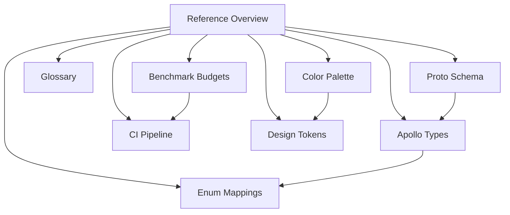

# Reference Overview

The Reference chapter is Apollo Map Studio's authoritative lookup table. The
content here does not tell stories, teach concepts, or explain "why" — it only
answers "what is the precise definition of this field". When you are debugging
round-trip drift, cross-checking Apollo proto fields, or chasing a CI perf
budget violation, this chapter is the single source of truth.

::: tip Chapter charter

- **Every value must be verifiable**: each enum and each field is annotated with
  the source path and line numbers.
- **Lookup, not tutorial**: tutorials live under [Guide](/en/guide/getting-started).
- **Source-first**: Reference pages track current code and schema behavior, not
  planned changes.
  :::

## Quick chooser

| What you are doing                                | Open first                                                                              |
| ------------------------------------------------- | --------------------------------------------------------------------------------------- |
| Reading architecture and hitting unfamiliar terms | [Glossary](/en/reference/glossary)                                                      |
| Verifying that import/export does not drop fields | [Proto Schema](/en/reference/proto-schema) + [Apollo Types](/en/reference/apollo-types) |
| Working on inspector form enum dropdowns          | [Enum Mappings](/en/reference/enum-mappings)                                            |
| Answering "why did bench fail in CI"              | [Benchmark Budgets](/en/reference/benchmark-budgets)                                    |
| Answering "the desktop-package job failed"        | [CI Pipeline](/en/reference/ci-pipeline)                                                |
| Designing a new component and picking a color     | [Color Palette](/en/reference/color-palette)                                            |
| Choosing font size / spacing / radius / shadow    | [Design Tokens](/en/reference/design-tokens)                                            |

## Chapter map



## Page index

| Page                                                 | Coverage                                                                                                                                                        | When you need it                                                        |
| ---------------------------------------------------- | --------------------------------------------------------------------------------------------------------------------------------------------------------------- | ----------------------------------------------------------------------- |
| [Glossary](/en/reference/glossary)                   | base_map, Cold/Hot Layer, FSM, Junction Graph, MapEntity, Anti-corruption Layer, RBush, MGRS, UTM, and 80+ more terms.                                          | Onboarding, decoding architecture docs.                                 |
| [Proto Schema](/en/reference/proto-schema)           | Every `.proto` file under `src/proto/`: `basic_msgs/geometry.proto`, `map_msgs/*.proto`, `editor/editor_meta.proto`. Top message types and key fields per file. | Auditing Apollo binary round-trips, picking the next free field number. |
| [Apollo Types](/en/reference/apollo-types)           | Every exported TypeScript type and interface in `src/types/apollo.ts`.                                                                                          | Looking up a field name, double-checking optional semantics.            |
| [Enum Mappings](/en/reference/enum-mappings)         | All enums in `src/lib/enumLabels.ts`: proto numeric ↔ string literal ↔ human label.                                                                             | Building dropdowns, validating round-trip enum values.                  |
| [Benchmark Budgets](/en/reference/benchmark-budgets) | Each bench name, its p99 ceiling, source `.bench.ts`, and what it measures.                                                                                     | Investigating CI perf failures, planning optimisation targets.          |
| [CI Pipeline](/en/reference/ci-pipeline)             | Every job, step, env, and trigger in `.github/workflows/ci.yml` and `docs-preview.yml`.                                                                         | Diagnosing CI failures, adding a new job, understanding release flow.   |
| [Color Palette](/en/reference/color-palette)         | Every `ams-*` color token in `src/index.css`, semantic role, and dark-mode variant.                                                                             | Picking a semantic color when writing new components.                   |
| [Design Tokens](/en/reference/design-tokens)         | Typography (Syne / JetBrains Mono), spacing, radius, shadow, motion tokens. Cross-links color palette.                                                          | Aligning new visual specs with shadcn/ui and project conventions.       |

## Page density at a glance

To help you estimate how long each page takes to scan, here are subjective
"field density" estimates:

| Page              | Density                                         | Suggested scan time |
| ----------------- | ----------------------------------------------- | ------------------- |
| Glossary          | 80+ terms, 1–3 lines each                       | 10–20 min           |
| Apollo Types      | 30+ interfaces, 5–25 fields each                | 20–40 min           |
| Proto Schema      | 21 `.proto` files                               | 20–40 min           |
| Enum Mappings     | 13 enum families, ~70 values                    | 10–20 min           |
| Benchmark Budgets | 109 benches                                     | 10–20 min           |
| CI Pipeline       | 2 workflows, 3 jobs                             | 10–15 min           |
| Color Palette     | 12 color tokens + 17 Dockview vars              | 5–10 min            |
| Design Tokens     | typography / spacing / radius / shadow / motion | 10–15 min           |

## Suggested reading paths

### New engineers

1. [Glossary](/en/reference/glossary) — sweep through project- and Apollo-specific jargon.
2. [Apollo Types](/en/reference/apollo-types) — gain the TypeScript-flavoured view.
3. [Proto Schema](/en/reference/proto-schema) — cross-check against the wire truth.
4. [Architecture overview](/en/architecture/overview) — re-enter the architecture chapter.

### Round-trip / protocol engineers

1. [Proto Schema](/en/reference/proto-schema) — `.proto` is the source of truth.
2. [Apollo Types](/en/reference/apollo-types) — verify TypeScript still respects `optional`.
3. [Enum Mappings](/en/reference/enum-mappings) — confirm enum round-trip.
4. [Export engine](/en/architecture/export-engine) / [Worker protocol](/en/architecture/worker-protocol) — implementation detail.

### Performance / infra engineers

1. [Benchmark Budgets](/en/reference/benchmark-budgets) — current guardrails.
2. [CI Pipeline](/en/reference/ci-pipeline) — failure-localisation manual.
3. [Cold/hot layers](/en/architecture/cold-hot-layers) — perf model itself.

### UI / design-system engineers

1. [Color Palette](/en/reference/color-palette) — semantic colors.
2. [Design Tokens](/en/reference/design-tokens) — typography, spacing, radius, shadow.
3. [Design tokens (architecture lens)](/en/architecture/design-tokens) — Tailwind 4 `@theme` injection mechanism.

## The line between Reference, Architecture, and API

To avoid redundant or missing content, the boundaries are explicit:

| Content                          | Reference            | Architecture          | API                   |
| -------------------------------- | -------------------- | --------------------- | --------------------- |
| Precise field definitions        | ✅                   | ❌ (only refs)        | ❌                    |
| Design rationale / why           | ❌                   | ✅                    | ❌                    |
| Function signatures / call sites | ❌                   | ❌                    | ✅                    |
| Flow diagrams                    | ✅ when needed       | Primary venue         | ❌                    |
| Source line refs                 | ✅                   | Selective             | ✅                    |
| Performance data                 | ✅                   | ❌                    | ❌                    |
| Code samples                     | Type / utility usage | System-level examples | Function / hook calls |

## Relationship to other chapters

| Chapter                                   | Role                | Relationship to Reference                                                          |
| ----------------------------------------- | ------------------- | ---------------------------------------------------------------------------------- |
| [Guide](/en/guide/getting-started)        | Tutorial            | Concept explanations live in Guide; Reference does not duplicate them.             |
| [Architecture](/en/architecture/overview) | Design              | Architecture explains "why"; Reference exposes precise values. The two cross-link. |
| [API](/en/api/)                           | Function-level docs | API pages document functions; Reference documents types, enums, and constants.     |
| [Recipes](/en/recipes/)                   | Task-oriented       | Recipes may reference tables here for parameter lookup.                            |
| [Contributing](/en/contributing/)         | Project conventions | Reference is the answer when a reviewer asks "where is this field defined?".       |

## Maintenance conventions

::: warning Before editing a Reference page

1. **Read the source first**: open the matching source file to confirm line numbers and
   field names. Do not edit from memory.
2. **Keep source links live**: line refs like `src/lib/enumLabels.ts:47-55`
   must remain accurate.
3. **No future-tense content**: Reference reflects the current `main` / `v1`
   commit and does not speculate.
   :::

## Feedback

If a field disagrees with reality, line numbers have shifted, or a new element
needs coverage:

- Open an issue on [GitHub](https://github.com/SakuraPuare/apollo-map-studio/issues)
  with the `docs:reference` label.
- Or send a PR — CI will run `pnpm docs:build` automatically.

## FAQ

::: tip Q: How does Reference differ from API?
A: Reference is a lookup table of types, enums, and constants. API
documents functions and their call sites. For example, `LaneEntity` fields
live in Reference; `addEntity()` parameters live in API.
:::

::: tip Q: Line numbers drift — what should I do?
A: Send a PR that updates the line refs. Reviewers double-check with
`git log`. Filing an issue is fine but PRs are preferred.
:::

::: tip Q: Why did a Reference link fail the docs build?
A: VitePress validates internal links during `pnpm docs:build`. Check that the
target page exists, then update the sidebar if the page should be discoverable.
:::

## Contributing flow

1. Pick the page you want to add / edit (use the [page index](#page-index)).
2. Open the matching source file and capture the fields, line numbers,
   and values you plan to reference.
3. Edit the relevant Reference page and keep nearby cross-links consistent.
4. Keep line references like `src/foo.ts:42-58` accurate against the
   current commit.
5. Run `pnpm docs:build` locally to verify no dead links or compile errors.
6. Open the PR and wait for the docs maintainer review.

## Reverse map: source file → reference pages

| File you changed             | Reference pages to review                                                                                                            |
| ---------------------------- | ------------------------------------------------------------------------------------------------------------------------------------ |
| `src/proto/**/*.proto`       | [Proto Schema](/en/reference/proto-schema), [Apollo Types](/en/reference/apollo-types), [Enum Mappings](/en/reference/enum-mappings) |
| `src/types/apollo.ts`        | [Apollo Types](/en/reference/apollo-types), [Enum Mappings](/en/reference/enum-mappings)                                             |
| `src/lib/enumLabels.ts`      | [Enum Mappings](/en/reference/enum-mappings)                                                                                         |
| `scripts/bench-budgets.json` | [Benchmark Budgets](/en/reference/benchmark-budgets)                                                                                 |
| `.github/workflows/*.yml`    | [CI Pipeline](/en/reference/ci-pipeline)                                                                                             |
| `src/index.css` (`@theme`)   | [Color Palette](/en/reference/color-palette), [Design Tokens](/en/reference/design-tokens)                                           |
| New / renamed term           | [Glossary](/en/reference/glossary)                                                                                                   |

## Snippet template

The minimum template for adding a new reference entry. Copy and modify:

```markdown
## New enum: FooType

Source: `src/proto/map_msgs/map_foo.proto:42-50`,
`src/types/foo.ts:18-22`, `src/lib/enumLabels.ts:160-165`.

| Proto # | TS literal | UI label |
| ------- | ---------- | -------- |
| 0       | `UNKNOWN`  | Unknown  |
| 1       | `BAR`      | Bar      |
| 2       | `BAZ`      | Baz      |
```

## Cross-table lookup (by question)

::: tip Copy-paste shortcut
The right column points to the best starting page so readers do not bounce.
:::

| What you want to find                   | Start here                                           |
| --------------------------------------- | ---------------------------------------------------- |
| "Which line type is BoundaryType = 3?"  | [Enum Mappings](/en/reference/enum-mappings)         |
| "What fields does `LaneEntity` have?"   | [Apollo Types](/en/reference/apollo-types)           |
| "What is this field's wire number?"     | [Proto Schema](/en/reference/proto-schema)           |
| "Why is CI failing on bench?"           | [Benchmark Budgets](/en/reference/benchmark-budgets) |
| "On which OS does desktop-package run?" | [CI Pipeline](/en/reference/ci-pipeline)             |
| "What hex is `bg-ams-bg-base`?"         | [Color Palette](/en/reference/color-palette)         |
| "What shadow should a dialog use?"      | [Design Tokens](/en/reference/design-tokens)         |
| "What does FSM mean here?"              | [Glossary](/en/reference/glossary)                   |

## Reverse map: Reference → source files

| Reference page    | Primary source files                                                                |
| ----------------- | ----------------------------------------------------------------------------------- |
| Apollo Types      | `src/types/apollo.ts`                                                               |
| Enum Mappings     | `src/lib/enumLabels.ts`                                                             |
| Proto Schema      | `src/proto/**/*.proto`                                                              |
| Benchmark Budgets | `scripts/bench-budgets.json`, `scripts/check-bench-budget.mjs`, `src/**/*.bench.ts` |
| CI Pipeline       | `.github/workflows/ci.yml`, `.github/workflows/docs-preview.yml`                    |
| Color Palette     | `src/index.css` (`@theme`)                                                          |
| Design Tokens     | `src/index.css`, `tailwind.config`, shadcn/ui components                            |

## Governance

- **CODEOWNERS**: the Reference chapter requires both the documentation
  maintainer and the original author to review.
- **Review checklist**: reviewers must open at least one line-anchored
  reference and confirm it is correct.
- **CI**: `pnpm docs:build` runs on every PR; VitePress dead-link and
  compile errors fail the build.
- **Deploy**: merging into `main` / `v1` triggers `docs-preview.yml` to
  publish on GitHub Pages.

## Quick links

- Repository: <https://github.com/SakuraPuare/apollo-map-studio>
- English reference entry: [/en/reference/](/en/reference/)
- Apollo HD Map protocol: <https://github.com/ApolloAuto/apollo>
- Documentation site: deployed by `docs-preview.yml` to GitHub Pages.
- Feedback: open a GitHub issue with the `docs:reference` label.
