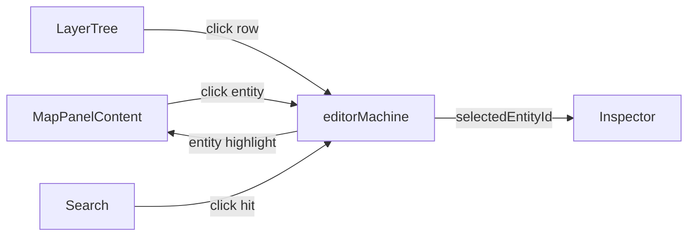

# 活动栏与面板 / Activity Bar & Panels

> AMS 的左侧由两层组成：**Activity Bar**（最左侧 48 px 图标栏，仿 VS Code）+ **Sidebar Panel**（活动栏选中后展开的面板）。中央是 **Dockview** 容器，承载 Map / Inspector / Timeline 三类业务面板；它们都支持拖拽、停靠、最大化，并在 Drawing / Scene 双模式下分别持久化布局。

## 概览 / Overview

| 区域            | 文件                                | 宽度                | 数据                |
| --------------- | ----------------------------------- | ------------------- | ------------------- |
| Activity Bar    | `ActivityBar.tsx`                   | 48 px               | 5 个 tab            |
| Sidebar Panel   | `SidebarPanel.tsx`                  | 默认 240 px，可拖拽 | 当前 tab 决定子内容 |
| Dockview        | `WorkspaceLayout/dockviewLayout.ts` | 自适应              | 4–5 个面板          |
| Inspector Panel | `InspectorPanelContent`             | 默认 280 px         | 右侧固定停靠        |
| Timeline Panel  | `TimelinePanel.tsx`                 | 高 180 px           | 仅 scene 模式       |

## Activity Bar 五个 Tab

`ActivityBar.tsx:11-17` 注册：

| Tab id     | 图标                 | label    | 对应面板                      |
| ---------- | -------------------- | -------- | ----------------------------- |
| `explorer` | 📁 FaFolderTree      | Explorer | `MapOutline`                  |
| `layers`   | 🗂 FaLayerGroup       | Layers   | `LayerTree`                   |
| `search`   | 🔍 FaMagnifyingGlass | Search   | `SearchPanel`                 |
| `timeline` | ⏱ FaClock            | Timeline | （切换中央 Dockview 焦点）    |
| `settings` | ⚙ FaGear             | Settings | 直接打开 `SettingsPanel` 模态 |

Tab 区分上下两组（`tabs.slice(0, 4)` 与 `tabs.slice(4)`）：上四组在顶部、`settings` 单独在底部，模仿 VS Code 布局。

::: tip 活动 tab 高亮
被选中的 tab 左侧出现一根 2 px 高 20 px 的青色竖线（`bg-ams-accent`），并把图标从 `text-ams-text-muted` 切换成 `text-ams-text-primary`。
:::

### Tab → Sidebar 内容路由

`SidebarPanel.tsx` 根据 `activeTab` 切换：

```ts
switch (activeTab) {
  case 'explorer': return <MapOutline />;
  case 'layers':   return <LayerTree />;
  case 'search':   return <SearchPanel />;
  case 'timeline': return <TimelinePanel inline />;
  case 'settings': onOpenSettings(); return null;
}
```

### MapOutline — Explorer

显示导入地图的元数据：

| 字段                            | 来源                             |
| ------------------------------- | -------------------------------- |
| 文件名                          | `apolloMapStore.info.filename`   |
| PROJ.4 字符串                   | `apolloMapStore.info.projString` |
| 地图边界                        | `apolloMapStore.bounds` (UTM xy) |
| 各类 entity 计数                | `apolloMapStore.info.counts`     |
| Header.vendor / district / date | `apolloMapStore.header.*`        |

Apollo info 的 `MapMetadataForm` 还提供编辑 header 的字段：vendor / district / date / left / right / top / bottom。

### LayerTree — Layers {#layers}

详见 [Layer Tree](./layer-tree.md)。这里记录与 ActivityBar 的接口：单击树中的 entity → `selectEntity(id)` → Inspector 同步切换。

### SearchPanel — Search {#search}

```
┌──────────────────────────────────┐
│ 🔍  search id or type...          │
├──────────────────────────────────┤
│ lane    ▸  lane_AbCd123XyZ       │
│ lane    ▸  lane_PqRs456UvW       │
│ junction▸  junc_xyz              │
└──────────────────────────────────┘
```

实时 fuzzy 匹配 `id` 与 `entityType`。命中后单击 → `editorMachine.send('SELECT_ENTITY', { id })` → 视口飞到中心 + Inspector 切换。

### TimelinePanel — Timeline {#timeline}

显示 zundo 撤销栈快照。每行一个 history entry，可点击跳转。Scene 模式下作为底部 dock；Drawing 模式下嵌入 sidebar。

### Settings — 模态弹出

ActivityBar 的 `settings` tab 不进 sidebar，而是直接调 `onOpenSettings()` → 弹出 `SettingsPanel` 模态。详见 [Settings](./settings.md)。

## Dockview 面板系统

`WorkspaceLayout.tsx:139-145` 渲染 `<DockviewReact key={appMode} ... />`。`key={appMode}` 是关键：切换 Drawing/Scene 时强制重建实例，避免脏布局复用。

### 默认布局表

`createDefaultLayout` (`dockviewLayout.ts:34-60`)：

| 面板 id     | component             | 初始位置 | 初始尺寸  | 仅 scene 模式? |
| ----------- | --------------------- | -------- | --------- | -------------- |
| `map`       | MapPanelContent       | 中心     | 自适应    | 否             |
| `sidebar`   | SidebarSlot           | map 左侧 | 240 px 宽 | 否             |
| `inspector` | InspectorPanelContent | map 右侧 | 280 px 宽 | 否             |
| `timeline`  | TimelinePanelContent  | map 下方 | 180 px 高 | **是**         |

Dockview 支持的操作：

- 拖拽面板标题切换停靠位置
- 双击标题最大化 / 还原
- 任意位置创建分屏
- 关闭按钮（×）隐藏面板（不会丢数据）

### 布局持久化

`saveLayout` 在每次 `onDidLayoutChange` 触发时把 `api.toJSON()` 写入 localStorage：

| 模式    | localStorage key                   | 写入函数                  |
| ------- | ---------------------------------- | ------------------------- |
| drawing | `apollo-map-studio:layout:drawing` | `dockviewLayout.ts:13-19` |
| scene   | `apollo-map-studio:layout:scene`   | 同上                      |

### Reset Layout {#reset-layout}

两条入口：

1. `View → Reset Layout` 菜单（`registry/definitions.ts:124-132`）→ `handleResetLayout()` → `clearSavedLayout(mode)` + `apiRef.current.clear()` + `createDefaultLayout(api, appMode)`。
2. `Settings → Layout → Reset Layout to Default` 按钮（`SettingsPanel.tsx:226-234`）→ `clearAllSavedLayouts()` + `window.location.reload()`。

::: tip 选哪个？
99% 的情况选 `View → Reset Layout`：它是热重置，无需重启。**只有**在 dockview 实例本身崩溃（按钮无效）时才用 SettingsPanel 的硬重置。
:::

## 惰性加载 / Lazy panels

`lazyPanels.tsx:6-39` 用 `React.lazy` 把每个面板的 chunk 拆成独立 bundle：

```ts
const LazyMapCanvas = lazy(() => import('@/components/map/MapCanvas'));
const LazySidebarPanel = lazy(() => import('../panels/SidebarPanel'));
const LazyTimelinePanel = lazy(() => import('../panels/TimelinePanel'));
const LazyCommandPalette = lazy(() => import('../panels/CommandPalette'));
const LazySettingsPanel = lazy(() => import('../panels/SettingsPanel'));
const LazyProjPickerDialog = lazy(() => import('@/components/dialogs/ProjPickerDialog'));
const LazyEntityForm = lazy(() => import('../panels/InspectorForms'));
```

每个 lazy 组件外都套了 `Suspense fallback`：MapCanvas → "Loading map..."，SettingsPanel → "Loading settings..."，等等。

这让首屏 JS 体积只携带 MenuBar + ToolStrip + ActivityBar + dockview shell，约 200 KB。Map / Inspector / Settings 等按需加载。

## 操作步骤 / Steps

1. 单击左侧 ActivityBar 图标切换 Sidebar 内容。
2. 用 SidebarPanel 中的工具（LayerTree / Search / Outline）定位实体。
3. 实体被选中后，右侧 Inspector 自动切换。
4. 鼠标拖拽面板分隔线调整宽度。
5. 鼠标拖拽面板标题改变停靠位置。
6. 想还原默认布局：`View → Reset Layout`。
7. 切换 Scene 模式以调出 Timeline 面板（绘图模式无此面板）。

## 常见问题 / Troubleshooting

| 症状                          | 原因                     | 处理                                          |
| ----------------------------- | ------------------------ | --------------------------------------------- |
| 面板拖丢了不见                | 拖到屏幕外               | `View → Reset Layout`                         |
| 切换 drawing/scene 后布局乱跳 | 两个布局 key 互相覆盖    | 已通过 `key={appMode}` 隔离；如再现请提 issue |
| Sidebar 折叠后点不出来        | activityBar 选中态丢失   | 单击同一 tab 两次 / 任意其他 tab              |
| 双击标题没反应                | 当前是单面板，不可最大化 | 增加分屏或新面板后再试                        |
| Inspector 一直空白            | 没选中 entity            | 在 LayerTree 单击一个                         |

## 配置存储位置 / Persistence

| 键                                 | 写入              | 用途             |
| ---------------------------------- | ----------------- | ---------------- |
| `apollo-map-studio:layout:drawing` | dockviewLayout.ts | 绘图模式布局快照 |
| `apollo-map-studio:layout:scene`   | 同                | 场景模式布局快照 |

## 相关源码 / Source

- `src/components/layout/ActivityBar.tsx` — 5-tab 图标栏
- `src/components/layout/panels/SidebarPanel.tsx` — sidebar 内容路由
- `src/components/layout/panels/MapOutline.tsx` — Explorer 面板
- `src/components/layout/panels/LayerTree.tsx` — Layers 面板
- `src/components/layout/panels/SearchPanel.tsx` — Search 面板
- `src/components/layout/panels/TimelinePanel.tsx` — Timeline 面板
- `src/components/layout/WorkspaceLayout.tsx:106-115` — Dockview onReady
- `src/components/layout/WorkspaceLayout/dockviewLayout.ts` — 布局保存/恢复
- `src/components/layout/WorkspaceLayout/lazyPanels.tsx` — lazy 注册
- `src/context/SidebarContext.tsx` — `useSidebar()` hook

## SidebarContext 与 Tab 切换 / Sidebar Context

`src/context/SidebarContext.tsx` 提供 `useSidebar()` hook，返回 `{ activeTab, setActiveTab }`。所有需要切 Sidebar 的代码都通过它，避免 props drilling。

```ts
const { setActiveTab } = useSidebar();
setActiveTab('search');
```

::: tip 何时用

- 命令面板未来可能加“Focus Search”动作 → 调 `setActiveTab('search')`。
- 提 issue 时如果发现 sidebar 错位，先确认 `SidebarProvider` 是否在 React tree 上层（`WorkspaceLayout.tsx:189`）。
  :::

## 面板事件 / Panel Events

Dockview 暴露三类事件，AMS 用到两个：

| 事件                                 | 处理                                   |
| ------------------------------------ | -------------------------------------- |
| `onDidLayoutChange`                  | `saveLayout(api, mode)` — 自动持久化   |
| `onDidActivePanelChange`             | （AMS 暂未监听，可扩展用于 telemetry） |
| `onDidAddPanel` / `onDidRemovePanel` | 同上                                   |

## 性能 / Performance

下表列各面板的首屏渲染耗时（开发机基准）：

| 面板                  | 第一次渲染 | 切换后续渲染 | 备注                               |
| --------------------- | ---------- | ------------ | ---------------------------------- |
| MapPanelContent       | 200–400 ms | 即时         | MapLibre + WebGL 初始化是 dominant |
| InspectorPanelContent | 50–100 ms  | 即时         | 取决于 entity 字段量               |
| TimelinePanelContent  | 30 ms      | 即时         | 无 WebGL                           |
| SidebarPanel          | 20 ms      | 即时         | 仅 React                           |

::: warning 多次切 mode 的内存泄漏
理论上每次 `key={appMode}` 改变都会**销毁旧 DockviewReact 实例 + 创建新实例**。MapLibre map 实例随 MapPanelContent 一起释放。如频繁切换发现 GPU 内存增长，可能是 dispose 路径有 bug——已在 P9 验证目前没问题，但是要警惕未来重构。
:::

## 与 VS Code 行为差异 / Differences from VS Code

| 行为                        | VS Code      | AMS                      |
| --------------------------- | ------------ | ------------------------ |
| ActivityBar 双击同一 tab    | 折叠 sidebar | 仅切回该 tab（不会折叠） |
| 拖 Activity Bar tab 改顺序  | 支持         | 不支持（顺序写死）       |
| Sidebar 上方搜索框          | 默认存在     | 各 panel 自带            |
| 命令面板从 ActivityBar 唤起 | 没有         | 没有；`⌘K` 全局唤起      |

## 相关文档 / See also

- [Layer Tree](./layer-tree.md) — Layers tab 的功能详解
- [Inspector](./inspector.md) — 右侧 Inspector 面板
- [Settings](./settings.md) — `⌘,` 设置面板
- [MenuBar & ToolStrip](./menubar-and-toolstrip.md) — 顶部栏
- [Troubleshooting](./troubleshooting.md) — 通用排错

## Dockview 主题 / Theme

AMS 使用 dockview 内置 dark 主题，class `dockview-theme-dark`。具体颜色覆盖来自 `src/styles/dockview.css`（如有定制）。

| 元素       | Token                                               |
| ---------- | --------------------------------------------------- |
| 面板背景   | `--dv-paneview-active-outline-color` ↔ `ams-accent` |
| 标题文字   | `--dv-tab-active-foreground-color`                  |
| 拖拽指示线 | `--dv-paneview-stripes`                             |

## 多面板交互流程图 / Cross-Panel Interaction



四个面板通过同一 `editorMachine.context.selectedEntityId` 协调。**没有跨面板直接通信**——任何更新走 FSM，避免 React tree 上的 prop drilling 与状态分裂。

## 添加自定义面板 / Adding a Custom Panel

如要给 Dockview 加新面板（如“Audit Log”）：

1. 在 `lazyPanels.tsx` 注册：
   ```ts
   const LazyAuditLog = lazy(() => import('../panels/AuditLog'));
   export function AuditLogPanelContent() {
     return <Suspense fallback={<PanelFallback label="Loading..." />}><LazyAuditLog /></Suspense>;
   }
   ```
2. 在 `WorkspaceLayout.tsx` 把 `AuditLogPanelContent` 加到 `components`。
3. 在 `dockviewLayout.ts` 的 `createDefaultLayout` 决定默认位置。
4. 可选：在 `ActionRegistry` 加 `view → Show Audit Log` 切换可见性。
