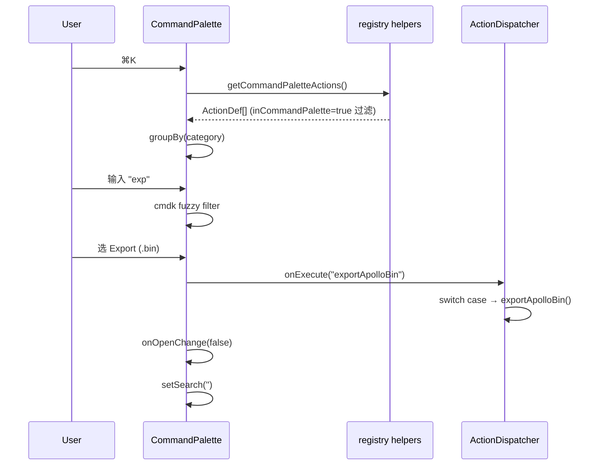

# 命令面板 / Command Palette

> 命令面板（Command Palette）是 AMS 的“**全局动作搜索框**”。无论当前焦点在哪、面板布局如何，按 `⌘K` / `Ctrl+K` 即可弹出，输入若干字符即可执行任意 ActionDef。它本质上是 MenuBar / ToolStrip 的另一个 surface，**完全数据驱动**。

::: tip 一句话理解

> 任何能在 MenuBar 或 ToolStrip 上点的按钮，都可以在命令面板搜出来一键触发。
> :::

## 概览 / Overview

| 维度   | 说明                                                   |
| ------ | ------------------------------------------------------ |
| 唤起   | `⌘K` / `Ctrl+K`（任意焦点）                            |
| 实现库 | [cmdk](https://github.com/pacocoursey/cmdk)            |
| 数据源 | `getCommandPaletteActions()` (`registry/helpers.ts`)   |
| 渲染   | `src/components/layout/panels/CommandPalette.tsx`      |
| 加载   | lazy via `LazyCommandPalette` (`lazyPanels.tsx:21-24`) |
| 关闭   | `ESC`、点击背景、点选条目                              |

## 界面导览 / UI Tour

```
                ┌────────────────────────────────────────────┐
                │ 🔍  Type a command or search...     [ESC]  │
                ├────────────────────────────────────────────┤
                │ FILE                                       │
                │   ⬆  Import Apollo Map...                  │
                │   ⬇  Export Apollo Map (.bin)        ⌘ S   │
                │   ⬇  Export Apollo Map (.txt)       ⇧⌘ S   │
                │   ⚙  Settings                        ⌘ ,   │
                │ EDIT                                       │
                │   ↶  Undo                            ⌘ Z   │
                │   ↷  Redo                           ⇧⌘ Z   │
                │   🗑  Delete Selection                ⌫     │
                │   🔗  Connect Lanes                   C    │
                │ VIEW                                       │
                │   ⊞  Toggle Grid                     ⌘ G   │
                │   🧲  Toggle Snap                          │
                │   🪟  Reset Layout                          │
                │ TOOL                                       │
                │   ✏  Draw Polyline                    P    │
                │   ⌒  Draw Bezier                      B    │
                │   ◯  Draw Arc                         A    │
                │   ▭  Draw Rectangle                   R    │
                │   ▰  Draw Polygon                     G    │
                ├────────────────────────────────────────────┤
                │ ↑↓ Navigate    ↵ Select    ESC Close       │
                └────────────────────────────────────────────┘
```

## 触发与关闭 / Open & Close

`CommandPalette.tsx:54-66` 注册全局键监听：

```ts
const down = (e: KeyboardEvent) => {
  if (e.key === 'k' && (e.metaKey || e.ctrlKey)) {
    e.preventDefault();
    onOpenChange(!open); // ← 切换打开状态
  }
  if (e.key === 'Escape' && open) {
    onOpenChange(false);
  }
};
document.addEventListener('keydown', down);
```

::: warning 双重监听
`WorkspaceLayout.tsx:63-77` 也有一份相同 `⌘K` 监听，互相不会冲突——两者都做 toggle，先执行的那一份让另一份也看到状态切到对方期望的值。这是显式的双保险，避免 lazy 加载尚未完成时按 `⌘K` 没反应。
:::

## 数据流 / Data Flow



## 分组与排序 / Grouping

`CommandPalette.tsx:34-42` 按 `action.category` 分组：

```ts
const grouped: Record<string, ActionDef[]> = {};
for (const a of actions) {
  const cat = a.category[0].toUpperCase() + a.category.slice(1);
  if (!groups[cat]) groups[cat] = [];
  groups[cat].push(a);
}
```

| Category    | 中文      | 含义                               |
| ----------- | --------- | ---------------------------------- |
| `file`      | File      | 导入导出 / 设置                    |
| `edit`      | Edit      | 撤销 / 重做 / 删除 / Connect Lanes |
| `view`      | View      | 网格 / 吸附 / 重置布局             |
| `tool`      | Tool      | 5 类绘制工具                       |
| `selection` | Selection | Default mode                       |

排序在每个 group 内**保持注册顺序**（`ACTION_DEFS` 数组顺序）。该顺序由 `registry/definitions.ts` 控制。

## 过滤规则 / Filter Rule

`getCommandPaletteActions()` 仅返回 `inCommandPalette === true` 的 ActionDef。需要排除某条命令时，在 `definitions.ts` 把该字段置 `false`，例如 `commandPalette` 自身（`registry/definitions.ts:140`）就被排除以避免递归出现。

| 已排除条目       | 原因                                      |
| ---------------- | ----------------------------------------- |
| `commandPalette` | 在面板内出现一条 “Command Palette” 没意义 |

cmdk 的 fuzzy 匹配键由 `Command.Item value` 决定（`CommandPalette.tsx:113`）：

```ts
value={`${action.label} ${group}`}
```

所以输入 `exp file` 会同时匹配 “Export ...” 与 group 名 “File”，提高检索成功率。

## 显示 toggle 状态 / Toggle Indicator

切换型 ActionDef（`isToggle: true`）会在条目右侧显示 ✓ 标记，前提 `getToggleState(id)` 返回 true。例如：

| 当前状态                | UI                          |
| ----------------------- | --------------------------- |
| `gridEnabled === true`  | `Toggle Grid     ✓     ⌘ G` |
| `gridEnabled === false` | `Toggle Grid           ⌘ G` |

代码：`CommandPalette.tsx:107-118`。

## 快捷键展示 / Shortcut Formatting

`formatShortcut('⌘S')` 在 mac 直接返回 `⌘S`，在 Win/Linux 返回 `Ctrl+S`。判定函数：

```ts
isMacPlatform(); // navigator.platform.includes('Mac')
```

详细规则在 [Shortcuts](./shortcuts.md#格式化规则)。

## 操作步骤 / Steps

1. 任意时刻按 `⌘K` / `Ctrl+K`。
2. 输入命令名片段（无视大小写、空格也容错）。
3. `↑ ↓` 选中目标条目。
4. `Enter` 执行；面板自动关闭。
5. 想取消 → `ESC` 或点背景。

## 配置存储位置 / Persistence

命令面板**不持久化**任何状态。每次重新打开 search 都从空开始（`runCommand` 内置 `setSearch('')`，见 `CommandPalette.tsx:49`）。

## 常见问题 / Troubleshooting

| 症状                | 原因                                       | 处理                                                             |
| ------------------- | ------------------------------------------ | ---------------------------------------------------------------- |
| 按 ⌘K 没反应        | 焦点在 contentEditable 抢走事件            | 先点 map / 任意非 input 区域                                     |
| 命令搜不到          | 该 ActionDef 没有 `inCommandPalette: true` | 改 `definitions.ts` 加上                                         |
| `⌘S` 还是触发了导出 | 未定义为 ActionDef 的快捷键不被覆盖        | 已知问题：**输入框中** `⌘K` 仍可触发；考虑加 `event.target` 判断 |
| 命令选中后不执行    | dispatcher 没有该 case                     | 在 `useActionDispatcher.ts` switch 添加                          |
| 面板渲染慢          | 首次打开需 lazy chunk                      | 是预期；二次打开瞬开                                             |

## 扩展 / Extending

添加新条目，**只需** `registry/definitions.ts` + `useActionDispatcher.ts` 各一处：

```ts
// 1. 注册
{
  id: 'reformatGeometry',
  label: 'Reformat Geometry',
  category: 'edit',
  inCommandPalette: true,
}

// 2. 派发
case 'reformatGeometry':
  reformatAll();
  return;
```

## 相关源码 / Source

- `src/components/layout/panels/CommandPalette.tsx:22-139` — 主组件
- `src/components/layout/WorkspaceLayout/lazyPanels.tsx:21-24` — 惰性加载
- `src/components/layout/WorkspaceLayout.tsx:50-77,151-161` — 状态 + 唤起
- `src/core/actions/registry/helpers.ts` — `getCommandPaletteActions` / `formatShortcut` / `isMacPlatform`
- `src/core/actions/registry/definitions.ts` — 全部条目
- `src/hooks/useActionDispatcher.ts` — `onExecute` / `getToggleState`

## A11y / 可访问性

| 维度               | 实现                                                          |
| ------------------ | ------------------------------------------------------------- |
| Screen reader 焦点 | `Command.Input` 自动聚焦                                      |
| 键盘导航           | `↑↓` 由 cmdk 内置，遵循 ARIA `aria-activedescendant`          |
| 退出               | `ESC` + 点背景                                                |
| 高对比             | `aria-selected` 时背景 `bg-cyan-500/20`，文字 `text-cyan-400` |

::: warning 不支持鼠标右键菜单
当前不展示二级动作（“打开来源文件”等）。如果未来需要，cmdk 的 `Command.Group` 内可嵌套 `<Command.Subitem>`，但需要在数据模型加 `subActions: ActionDef[]`。
:::

## 与同类产品对比 / Comparison

| 工具                | 唤起键 | 数据来源          | 模糊匹配库 |
| ------------------- | ------ | ----------------- | ---------- |
| AMS Command Palette | `⌘K`   | Action Registry   | cmdk       |
| VS Code             | `⌘⇧P`  | Command Registry  | 内建       |
| Linear              | `⌘K`   | API + 客户端动作  | Fuse.js    |
| Slack               | `⌘K`   | 频道 + 命令       | 内建       |
| Notion              | `⌘K`   | 页面 + slash 命令 | 内建       |

AMS 选 `⌘K`（与 cmdk 默认/Linear 一致）的原因：与 ToolStrip 上的 `⌘K` 按钮文案对齐，最低认知负担。

## 相关文档 / See also

- [MenuBar & ToolStrip](./menubar-and-toolstrip.md) — 同源数据
- [Shortcuts](./shortcuts.md) — 全部快捷键
- [Activity Bar & Panels](./activity-bar-and-panels.md) — workspace 介绍
- [Settings](./settings.md) — `⌘,` 唤起的设置面板
- [Inspector](./inspector.md) — 右侧属性面板
