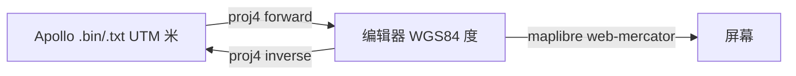
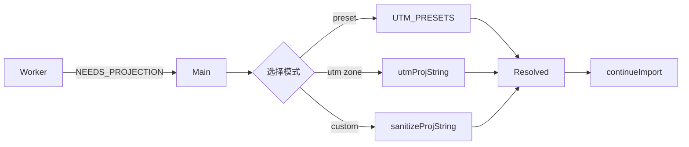
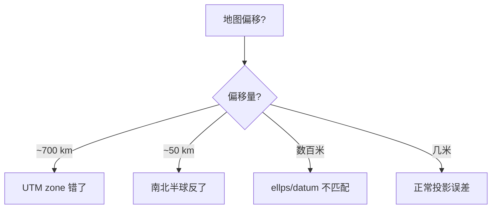

# 坐标系与投影 / Coordinate System & Projection

::: tip 一句话
Apollo HD Map 在磁盘上是 **UTM 米**（local ENU），编辑器内部用 **WGS84 经纬度**（度），二者通过 `Header.projection.proj` 这个 PROJ.4 字符串互转。如果它缺失，必须通过 `ProjPickerDialog` 选一个。
:::

## 概览 / Overview



| 系统                           | 谁在用                                                 | 单位    |
| ------------------------------ | ------------------------------------------------------ | ------- |
| WGS84 lng/lat                  | MapLibre 渲染、`GeoPoint`、`LngLat`、所有 store 内表达 | 度      |
| Local UTM（Apollo `PointENU`） | Apollo proto `central_curve.points`、所有磁盘几何      | 米      |
| Web-Mercator (EPSG:3857)       | MapLibre 自动应用，仅渲染层使用，不出现在 store        | 米      |
| MGRS (Military Grid)           | 部分场景标注、外部交付物                               | 字母+米 |

::: info 为什么内部用 WGS84
MapLibre 的 basemap 是 web-mercator。用 lng/lat 直接和屏幕对齐，避免每帧投影。UTM↔WGS84 的转换只在 import/export 时各做一次。
:::

## PROJ.4 字符串 / PROJ.4 strings

Apollo `Header.projection.proj` 是一段 PROJ.4 文本。常见样例：

| 区域                                                    | PROJ.4 字符串                                                                                                        |
| ------------------------------------------------------- | -------------------------------------------------------------------------------------------------------------------- |
| Sunnyvale, CA (UTM 10N)                                 | `+proj=utm +zone=10 +ellps=WGS84 +datum=WGS84 +units=m +no_defs`                                                     |
| Beijing (UTM 50N)                                       | `+proj=utm +zone=50 +ellps=WGS84 +datum=WGS84 +units=m +no_defs`                                                     |
| Shanghai (UTM 51N)                                      | `+proj=utm +zone=51 +ellps=WGS84 +datum=WGS84 +units=m +no_defs`                                                     |
| Apollo Borregas (TMERC, with templated `lat_0`/`lon_0`) | `+proj=tmerc +lat_0={37.413082} +lon_0={-122.013929} +k=1 +x_0=0 +y_0=0 +ellps=WGS84 +datum=WGS84 +units=m +no_defs` |

::: warning 模板大括号
Apollo 内部某些 demo（borregas, garage）的 PROJ 字符串带 `{}`，例如 `+lat_0={37.413082}`。proj4 不接受这种语法。`sanitizeProjString`（`projection.ts:10-12`）会自动剥掉大括号。
:::

## ProjPickerDialog 解析

只有 `header.projection.proj` 缺失或留空时才会弹出。三种 fallback 模式：



`ProjPickerDialog.tsx:1-231` 的核心：

| 模式          | 对应函数                 | 说明                                                                           |
| ------------- | ------------------------ | ------------------------------------------------------------------------------ |
| Region preset | `UTM_PRESETS[id]`        | sunnyvale (UTM 10N)、beijing (UTM 50N)、shanghai (UTM 51N)、shenzhen (UTM 50N) |
| UTM zone      | `utmProjString(zone, h)` | 1–60 + N/S；不接受越界                                                         |
| Custom PROJ   | `sanitizeProjString(s)`  | 任意 PROJ.4，自动剥模板大括号                                                  |

```ts
export function utmProjString(zone: number, hemisphere: 'N' | 'S' = 'N'): string {
  if (zone < 1 || zone > 60) throw new Error(`UTM zone out of range: ${zone}`);
  const south = hemisphere === 'S' ? ' +south' : '';
  return `+proj=utm +zone=${zone}${south} +ellps=WGS84 +datum=WGS84 +units=m +no_defs`;
}
```

（`projection.ts:51-55`）

## UTM zone 推断 / Inferring UTM zone

```ts
export function utmZoneFromLon(lonDeg: number): number {
  let lon = lonDeg;
  while (lon < -180) lon += 360;
  while (lon > 180) lon -= 360;
  return Math.min(60, Math.max(1, Math.floor((lon + 180) / 6) + 1));
}
```

（`projection.ts:60-66`）

::: warning 不能从 (x, y) 反推 zone
UTM 是分 zone 的本地坐标，每个 zone 都有 (500_000, 4_500_000) 这样的点。**必须**通过 region preset、用户输入、或外部已知的经度来确定 zone。
:::

## 操作步骤 / Steps

### 1. 选投影

- 导入触发 `NEEDS_PROJECTION` → ProjPickerDialog；
- 选 region preset / UTM zone / custom；
- 点 `Use this projection` 提交，回到 worker `continueImport(projString)`；
- 选定后写入 `apolloMapStore.header.projection.proj`，导出时回写。

### 2. 排查偏移

如果导入后地图明显偏移：



### 3. 修正

- 重导入时换一个 zone；
- 在 inspector 的 Map 元数据面板可看到当前 PROJ；
- 通过 `MapMetadataForm` 改 PROJ.4（如已实现）。

## 选项与参数表 / Options Table

| 项目          | 值                       | 说明                                |
| ------------- | ------------------------ | ----------------------------------- |
| 内部坐标系    | WGS84 lng/lat (度)       | `GeoPoint = { x: lng, y: lat, z? }` |
| 磁盘坐标系    | Apollo PointENU (UTM 米) | 与 `Header.projection.proj` 关联    |
| Mercator 渲染 | EPSG:3857                | maplibre 内部                       |
| sanitize 规则 | 移除 `{...}` 模板花括号  | `sanitizeProjString`                |
| 默认 preset   | beijing (UTM 50N)        | `ProjPickerDialog.tsx:14-19`        |
| 半球          | N / S                    | `utmProjString(zone, hemisphere)`   |
| 椭球          | WGS84                    | 大部分 Apollo 图都用 WGS84          |

## 键盘鼠标速查表 / Shortcut Cheatsheet

| 操作                       | 快捷键                    | 说明                  |
| -------------------------- | ------------------------- | --------------------- |
| 切换 ProjPickerDialog 模式 | 鼠标点击 tab              | preset / UTM / custom |
| 提交 PROJ                  | `Enter` / `Use this proj` | 等价 OK               |
| 取消                       | `Esc`                     | 终止导入              |
| 复制 PROJ 到剪贴板         | （在 Resolved 区域选择）  | 浏览器原生复制        |

## 常见问题 / Troubleshooting

### Q1. 导入后地图位置在太平洋中央

zone 错。检查源图的实际经度（百度/谷歌地图取一个城市坐标），用 `utmZoneFromLon` 算 zone。

### Q2. 同一文件，两次导入投影对话框结果不一致

确认你没有在两次中间手改 header。`apolloMapStore.header.projection.proj` 是单例；导出时会写回它。

### Q3. PROJ.4 中有 `+lat_0={37.4}` 报 `proj4 invalid`

旧版 sanitizer 漏剥某些模板时会出现。确认 `projection.ts:10-12` 的正则是 `/\{([^}]+)\}/g`。

### Q4. 导出后第三方工具（QGIS）打开偏移

QGIS 的 EPSG:32650（UTM 50N）与 `+proj=utm +zone=50` 在椭球上一致。如果偏移，多半是 `+ellps` 或 `+datum` 字段被写丢——检查 `entityOps.compileApolloMap` 是否原样回写 PROJ。

### Q5. 我想切换到 MGRS 显示

MGRS 是 UTM 的 25-character grid 版本。当前编辑器只显示 lng/lat 与 PROJ.4；MGRS 需要外部转换器（roadmap）。

### Q6. proj4 正反向不一致

可能是 PROJ 缺 `+no_defs` 或带了 unsupported 项。在 DevTools 跑：

```js
const p = proj4(
  '+proj=utm +zone=50 +ellps=WGS84 +datum=WGS84 +units=m +no_defs',
  '+proj=longlat +datum=WGS84 +no_defs',
);
p.forward([500000, 4500000]);
```

## 相关源码 / Source links

- `src/io/proto/projection.ts:1-81`
- `src/components/dialogs/ProjPickerDialog.tsx:1-231`
- `src/store/projDialogStore.ts`
- `src/store/apolloMapStore.ts`
- `src/core/geometry/coords.ts`
- `src/lib/geo.ts:22-58` — haversine 与米/度换算

## 相关文档 / See also

- [导入概览](./import.md)
- [导入深入](./importing.md)
- [地图元素](./map-elements.md)
- [车道绘制](./drawing-lanes.md)
