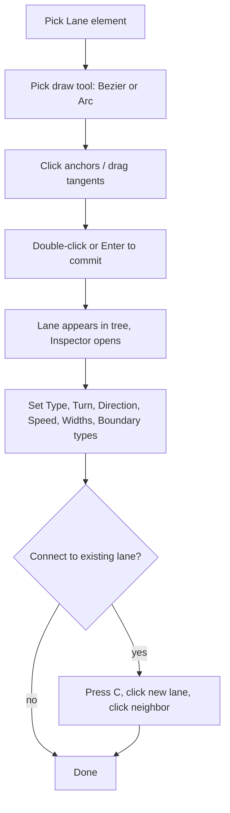
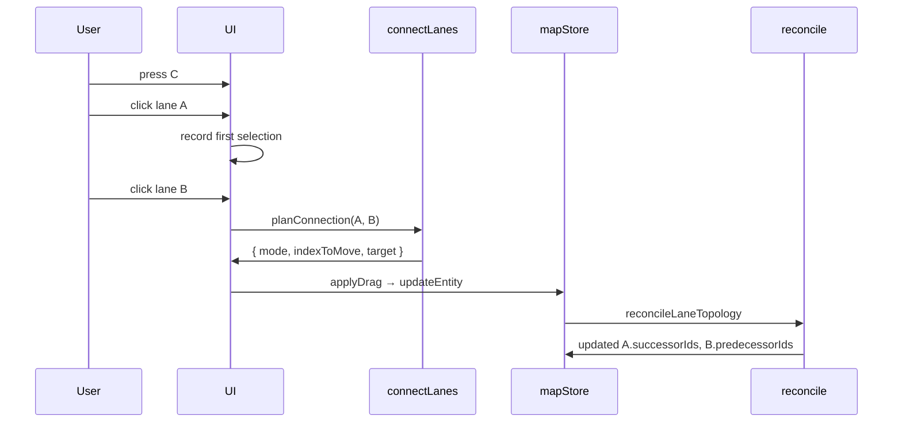

# Drawing lanes

Lanes are the core authoring unit of an Apollo HD map. This page covers the
full workflow: pick the tool, place anchors, set attributes, commit
boundaries, and stitch the lane into existing topology.

## Workflow overview



## Step 1 — Arm the Lane element

In the [ToolStrip](/guide/menubar-and-toolstrip), click the `车道` (Lane)
icon. The button highlights cyan and the available drawing tools appear:

- **Bezier** (`B`) — default. Anchor + tangent at each click.
- **Arc** (`A`) — three-point arc.

The FSM transitions from `idle` to `drawBezier` (or `drawArc`), with
`activeElement: 'lane'` in the context.

::: tip Default-tool flow
When you click the Lane element, the editor immediately enters the
default tool's draw state (`drawBezier`). You don't need a second click
on the Bezier button. To switch to Arc mid-stride, press `A`.
:::

## Step 2 — Place anchors

### Bezier flow

```
mouse-down at A → drag to set tangent → mouse-up
mouse-down at B → drag to set tangent → mouse-up
…
double-click to commit
```

The first click sets the start anchor. As you drag, the tangent handle
extends from the anchor; the curve preview is just a single anchor with
a handle. The second click sets the next anchor — once the second click
completes, the curve between A and B renders live.

::: warning Don't release before dragging
A tap-only click (mouse-down then immediate mouse-up at the same pixel)
produces a sharp corner — `bezierConfirmHandle` nulls out the handles
when the drag distance is < 1e-6. That's actually useful for kinks (e.g.
sharp lane turns), but it's a footgun if you didn't mean it.
:::

### Arc flow

Three clicks: start, mid, end. The third click commits automatically.
Watch the cursor — between clicks 2 and 3 the editor draws the arc that
passes through (start, mid, current cursor) so you can see what you're
about to commit.

## Step 3 — Commit

| Tool   | Commit gesture                          |
| ------ | --------------------------------------- |
| Bezier | Double-click or `↵` (after ≥ 2 anchors) |
| Arc    | Third click commits automatically       |

`useDrawCommit.ts` reads the post-transition snapshot and calls
`createApolloEntity('lane', state, points, anchors, { laneHalfWidth, entities })`
which routes through `lib/entityOps.ts` to build a `LaneEntity`.

The resulting lane has:

- A unique id (`lane_NNN` where NNN is the next available index)
- `centralCurve` populated from the bezier anchors (or arc points)
- `leftSamples` and `rightSamples` seeded with two `LaneSampleAssociation`
  entries: `{s: 0, width: laneHalfWidth}` and `{s: length, width: laneHalfWidth}`
- `leftBoundary` and `rightBoundary` with default `boundaryType` of `UNKNOWN`
- `type: 'CITY_DRIVING'`, `turn: 'NO_TURN'`, `direction: 'FORWARD'`,
  `speedLimit: 0`
- Empty topology arrays (`predecessorIds`, `successorIds`, neighbor
  arrays, etc.)

::: tip You always get geometry first, attributes second
This is deliberate. The expensive operation is geometry; attributes are
cheap. Authoring 100 lanes is bottlenecked by drawing them, not by
filling forms. The editor doesn't pop a modal asking "what type of lane?"
on commit; you set Type, Turn, Direction in the Inspector after the
fact.
:::

## Step 4 — Set attributes via Inspector

With the lane selected, the Inspector shows three sections (see
[Inspector / Lane form](/guide/inspector#editable-fields) for the full
field list).

### Attributes section

| Field             | Why it matters                                                                                                          |
| ----------------- | ----------------------------------------------------------------------------------------------------------------------- |
| Type              | `CITY_DRIVING` is the default; pick `BIKING`, `SIDEWALK`, `PARKING`, `SHOULDER`, `SHARED`, `NONE` for non-vehicle lanes |
| Turn              | `NO_TURN` for straight, `LEFT_TURN` / `RIGHT_TURN` / `U_TURN` for turn lanes (drives Apollo's planner intent)           |
| Direction         | `FORWARD` for normal, `BACKWARD` for reverse, `BIDIRECTION` for two-way                                                 |
| Speed Limit (m/s) | 0 means "unrestricted" in Apollo conventions; set the actual speed in m/s (50 km/h = 13.89, 30 mph = 13.41)             |

::: warning Speed limit is m/s, not km/h
Apollo's proto encodes speed in meters/second. Setting `30` means 30 m/s
= 108 km/h, which is probably not what you want. Multiply km/h by 0.2778
to get m/s.
:::

### Boundaries section

| Field           | What it controls                                                                                                     |
| --------------- | -------------------------------------------------------------------------------------------------------------------- |
| Left Width (m)  | Half-width of the lane on the left side; total lane width = leftWidth + rightWidth                                   |
| Right Width (m) | Half-width on the right side                                                                                         |
| L Boundary      | Boundary line type on the left: UNKNOWN, DOTTED_YELLOW, DOTTED_WHITE, SOLID_YELLOW, SOLID_WHITE, DOUBLE_YELLOW, CURB |
| R Boundary      | Same options for the right boundary                                                                                  |

The width fields are uniform — setting Left Width = 1.75 sets every
existing `LaneSampleAssociation.width` to 1.75. If you need a tapering
lane (different widths along the centerline), edit `leftSamples` /
`rightSamples` arrays directly via the round-tripped `.txt` proto for
now.

::: tip Boundary types as semantics, not visuals
Apollo's planner uses boundary types to decide whether a lane change is
legal. `SOLID_WHITE` / `SOLID_YELLOW` block lane changes; `DOTTED_*` allow
them. Pick the type that matches the real-world striping, not what looks
nice on the map.
:::

### Topology section (read-only)

| Field                     | Computed by                                                                                                   |
| ------------------------- | ------------------------------------------------------------------------------------------------------------- |
| Junction                  | `lane.junctionId` (set via layer-tree drag or [Connect Lanes](#step-5-connect-the-lane-to-existing-topology)) |
| Predecessors / Successors | `reconcileLaneTopology` after every entity write                                                              |
| L/R Neighbors (fwd/rev)   | Derive engine, based on adjacency                                                                             |
| Self-Reverse              | Set when a U-turn lane shares geometry with its forward lane                                                  |
| Overlaps                  | Recomputed during export by `apolloIO.worker.ts`                                                              |

## Step 5 — Connect the lane to existing topology

The fresh lane has no predecessor/successor. Two ways to add them:

### A. Connect Lanes mode (`C`)

1. Press `C` (or click the chain-link icon). The button highlights.
2. Click your new lane on the canvas. Outline highlights.
3. Click an existing lane.
4. The editor:
   - Calls `planConnection(a, b)` in `connectLanes.ts:79`.
   - Picks the minimum-distance endpoint pair from the four
     combinations (`AendToBstart`, `AstartToBend`, `AstartToBstart`,
     `AendToBend`).
   - Calls `applyDrag(a, indexToMove, 'vertex', target)` to snap the
     chosen endpoint of A to B's matching endpoint.
   - The store reconciles topology: if `mode === 'AendToBstart'`,
     `A.successor += B`; if `'AstartToBend'`, `A.predecessor += B`;
     fork/merge modes don't write pred/succ.



### B. Snap during draw

If you draw a new lane such that one endpoint snaps to an existing lane's
endpoint (the snap target is `kind: 'vertex'` with `endpointRole: 'start'`
or `'end'`), `reconcileLaneTopology` writes pred/succ on commit. This is
a one-shot version of Connect Lanes that you get for free.

::: tip Snap-while-drawing is faster
For greenfield authoring, draw new lanes ending at the existing lane's
endpoint and let snap do the topology work. Use Connect Lanes for the
case where the geometry is already there but the topology link is
missing.
:::

::: warning Endpoint role determines pred vs succ
Snapping the new lane's **start** to an existing lane's **end** means
"existing → new" — the existing lane's `successorIds` gains the new lane.
Snapping start-to-start means "fork from a common origin", which
`reconcile` does **not** treat as pred/succ. Read [Topology and
junctions](/guide/topology-and-junctions) for the full rules.
:::

## Lane preview vs commit

While you're drawing (`drawBezier` state), the lane is a **preview** —
rendered by the hot layer (`useHotLayer.ts`). The preview is recomputed
every animation frame from the FSM context, with no worker round-trip.
Nothing is in `mapStore.entities` yet.

On commit, the lane enters `mapStore.entities`. The cold layer
(`useColdLayer.ts`) picks it up on the next RAF coalesce and round-trips
through the spatial worker, which compiles the centerline into samples,
re-derives boundary geometry, and adds the lane to the RBush spatial
index.

::: tip Why two layers
The hot layer is the "what you're drawing right now" surface — fast,
client-only, throwaway. The cold layer is the "committed map" surface —
heavier, worker-backed, indexed. Separating them keeps the active draw
60 fps even on 10k-entity maps. Read [Architecture / Cold and hot
layers](/architecture/cold-hot-layers) for the full pipeline.
:::

## Common patterns

### Single straight lane

1. Lane element → Bezier (default) → click 1, click-without-drag at end
   → double-click. Two anchors, sharp corners (no tangents). Result is
   a straight segment.

### Curved lane through a junction

1. Lane element → Bezier → click at start with outward tangent →
   second anchor at junction entry → third at junction exit → fourth
   at lane end → double-click.

### Series of connected lanes

1. Draw lane A.
2. Draw lane B starting at A's endpoint (snap will engage).
3. Commit B. Reconcile auto-adds `A.successor = B`, `B.predecessor = A`.
4. Repeat for C, D, …

### U-turn lane

1. Draw the forward lane.
2. Draw a second lane along the same path with `Direction: BACKWARD`.
3. The two lanes share geometry; set the relevant `selfReverseLaneIds`
   manually if Apollo's behavior depends on it (your fleet may not need
   it).

## Where to next

- [Editing and snapping](/guide/editing-and-snapping) — drag the
  centerline after commit.
- [Topology and junctions](/guide/topology-and-junctions) — the deep
  story on pred/succ derivation.
- [Map elements](/guide/map-elements) — every element type and its
  drawing flow.
- [Inspector](/guide/inspector) — the full Lane form reference.
