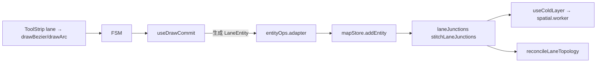
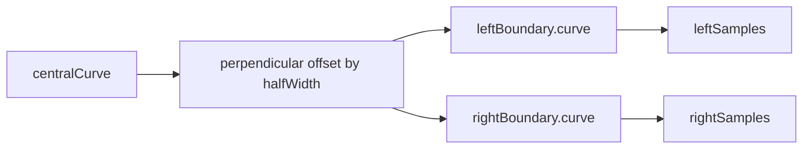
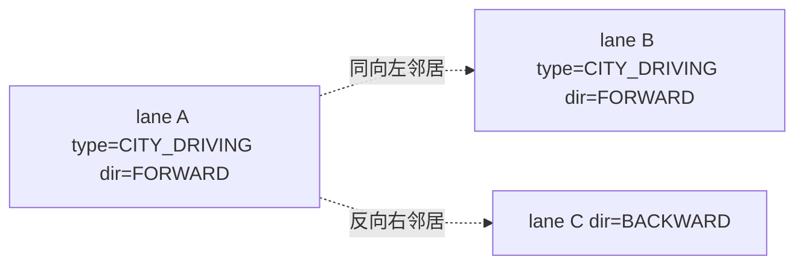
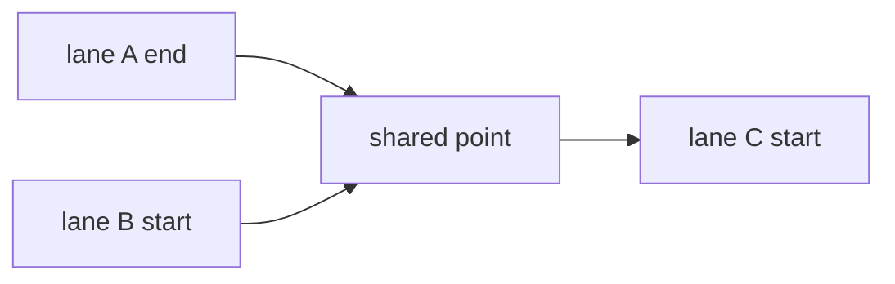

# 车道绘制 / Drawing Lanes

> 车道（Lane）是 Apollo 高精地图的核心元素。本页讲完整流程：选工具 → 落锚 → 提交 → 半宽偏移生成边界 → 拓扑缝合（前驱/后继/邻居/路口）。

## 概览 / Overview

提交后由 `useDrawCommit` 调 `entityOps.createLaneFromCurve(curve, halfWidth)`：

- 中心线：`centralCurve.segments[].lineSegment.points`（lon/lat）
- 左/右边界：以 `laneHalfWidth` 米沿 perpendicular 偏移生成（默认 1.5 m，见 `settingsStore.laneHalfWidth`）
- `length` 由 `polylineLengthMeters`（haversine）算得（`src/lib/geo.ts:35-42`）
- 默认属性：`type=CITY_DRIVING`、`turn=NO_TURN`、`direction=FORWARD`

## 操作步骤 / Steps

### 1. 选 lane → 选工具

ToolStrip 选 `车道` 后，工具列出 `drawBezier` / `drawArc` 两个（`elements.ts:50-58`）。默认 `drawBezier`。

### 2. 落锚

drawBezier 适合大多数车道：起点单击落锚，按住拖动设置切线方向（handleOut），松手；继续单击落下一锚。drawArc 适合简单弯道：三点确定一段弧。

### 3. commit

drawBezier 双击；drawArc 第三次点击。`useDrawCommit` 读取 post-snapshot 的 `bezierAnchors` 或 `drawPoints`，生成 lane。

### 4. 半宽与边界

`LaneSampleAssociation { s, width }` 在 `leftSamples` / `rightSamples` 中按等距 s 采样；典型起手 `s=0, width=halfWidth`。

### 5. 边界类型 / boundary types

`BoundaryLineType` 七类（`apollo.ts:74-81`）：

| 类型            | 视觉   | 语义                   |
| --------------- | ------ | ---------------------- |
| `UNKNOWN`       | 灰     | 不指定                 |
| `DOTTED_YELLOW` | 黄虚线 | 同向可换道             |
| `DOTTED_WHITE`  | 白虚线 | 同向可换道（同方向）   |
| `SOLID_YELLOW`  | 黄实线 | 双向中心线，不可越     |
| `SOLID_WHITE`   | 白实线 | 不可越（出入匝道边界） |
| `DOUBLE_YELLOW` | 双黄   | 严格不可越             |
| `CURB`          | 路缘   | 物理隔离               |

`LaneBoundary.boundaryType: LaneBoundaryTypeEntry[]` 按 s 升序记录类型变化（一段车道可能前半为 DOTTED_WHITE、后半为 SOLID_WHITE）。

### 6. 邻居孪生 / Neighbor twin

四类 neighbor：

- `leftNeighborForwardIds`：同向左侧
- `rightNeighborForwardIds`：同向右侧
- `leftNeighborReverseIds`：反向左侧（对向）
- `rightNeighborReverseIds`：反向右侧（对向）

`reconcileLaneTopology` 根据中心线方向 + 几何邻接自动计算（详见 [拓扑](./topology.md)）。

### 7. 路口插入 / Junction insertion

进入 junction 的 lane 自动 `junctionId` 被设置。`stitchLaneJunctions`（`src/core/geometry/laneJunctions.ts`）会把进出 junction 的多对 lane 端点拉到共享的 miter 点：

::: warning Start-start fork / End-end merge
`isContinuousJunction` 排除 start-start / end-end 的端点对（`laneJunctions.ts:88-90`）。这两类是分叉/汇流，不能强行 miter 到一点，否则边界会被破坏。它们的连接由 topology + overlap 处理。
:::

## 选项与参数表 / Options Table

| 选项 / Option  | 默认 / Default           | 说明                                                                        |
| -------------- | ------------------------ | --------------------------------------------------------------------------- |
| 工具           | drawBezier               | `MAP_ELEMENTS[lane].defaultTool`                                            |
| 半宽 halfWidth | 1.5 m                    | `settingsStore.laneHalfWidth`，commit 时用于偏移生成边界                    |
| LaneType       | `CITY_DRIVING`           | 7 类：NONE / CITY_DRIVING / BIKING / SIDEWALK / PARKING / SHOULDER / SHARED |
| LaneTurn       | `NO_TURN`                | NO_TURN / LEFT_TURN / RIGHT_TURN / U_TURN                                   |
| LaneDirection  | `FORWARD`                | FORWARD / BACKWARD / BIDIRECTION                                            |
| Boundary 默认  | `SOLID_WHITE`            | 用户可在 Inspector 中按 s 切换                                              |
| samples 起步   | `[{ s: 0, width: 1.5 }]` | 编辑后会扩展                                                                |

## 键盘鼠标速查表 / Shortcut Cheatsheet

| 操作            | 快捷键               | 说明                                          |
| --------------- | -------------------- | --------------------------------------------- |
| 选 lane 元素    | ToolStrip 点车道图标 | `MAP_ELEMENTS[lane]`                          |
| 切到 drawBezier | `B`                  | 切回贝塞尔                                    |
| 切到 drawArc    | `A`                  | 弧线                                          |
| 落锚            | 单击                 | `MOUSE_DOWN`                                  |
| 拖切线          | 按住拖               | `MOUSE_MOVE [isDraggingHandle]`               |
| commit          | 双击 / 第三次点击    | `DOUBLE_CLICK` / `MOUSE_DOWN [twoPointsLaid]` |
| 取消            | `Esc`                | `CANCEL`                                      |
| 选中后调整      | 单击 lane → 拖控制点 | `selected → editingPoint`                     |
| Connect Lanes   | `C`                  | 切到连接模式（前驱/后继）                     |

## 常见问题 / Troubleshooting

### Q1. 车道边界看起来不平滑

可能是 `decorateBoundary` 没跑 incremental decoration（Phase E）。检查 `useColdLayer` 是否在 INCREMENTAL 上调用。

### Q2. 进入 junction 的两条车道端点没对齐

`stitchLaneJunctions` 只缝合 start-end 与 end-start 这种「连续」端点对。如果是 start-start fork，不会缝合，需要手动调或用 connectLanes 工具显式声明。

### Q3. 半宽改了但旧 lane 没更新

`settingsStore.laneHalfWidth` 只影响**未来**绘制的 lane。已存在 lane 需要在 Inspector 中改 `leftSamples/rightSamples`，或重画。

### Q4. 同向 / 反向 neighbor 标错

`reconcileLaneTopology` 用「中心线 heading 差」来判同向/反向。如果 lane 方向 (`direction`) 设错，会被识别成反向。先校正 `direction` 字段再 reconcile。

### Q5. lane.length 与 GIS 工具计算的米数不一样

本工程用 haversine（球面近似），车道尺度误差 < 0.5%（`src/lib/geo.ts:14-15`）。GIS 工具可能用 ellipsoidal geodesic（精确），会有几十厘米差。

## 相关源码 / Source links

- 元素 → 工具：`src/core/elements.ts:50-58`
- LaneEntity 类型：`src/types/apollo.ts:118-164`
- 半宽 / 偏移：`src/lib/entityOps.ts`、`src/core/geometry/laneOffset.ts`
- 缝合：`src/core/geometry/laneJunctions.ts`
- 拓扑重算：`src/core/elements/derive/`
- haversine：`src/lib/geo.ts:22-42`

## 相关文档 / See also

- [绘制工具](./drawing-tools.md)
- [拓扑](./topology.md)
- [拓扑与路口](./topology-and-junctions.md)
- [地图元素](./map-elements.md)
- [编辑与吸附](./editing-and-snapping.md)
