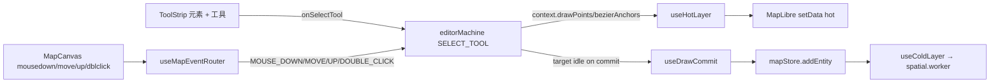
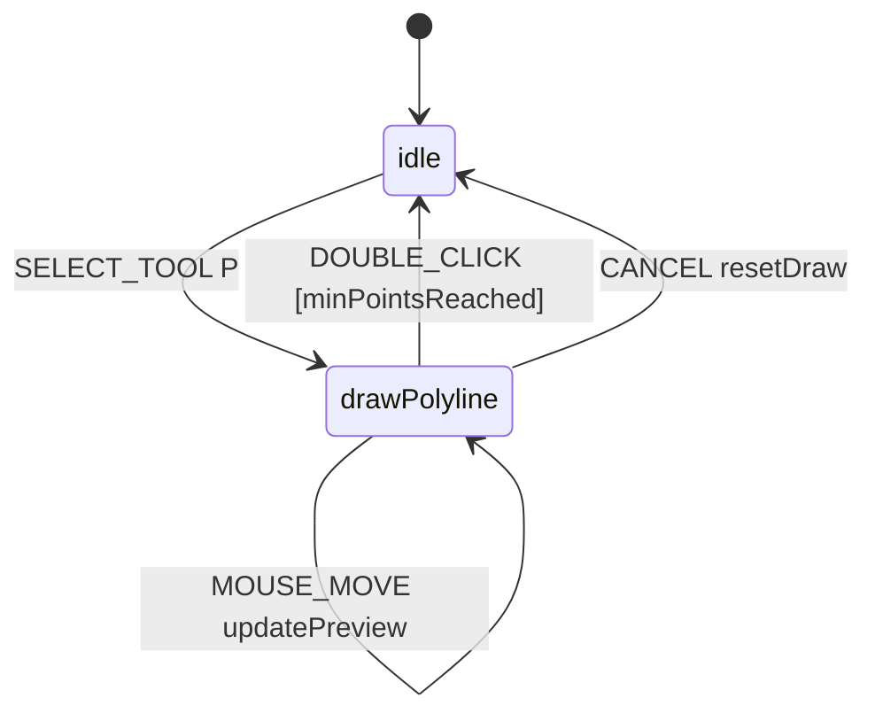
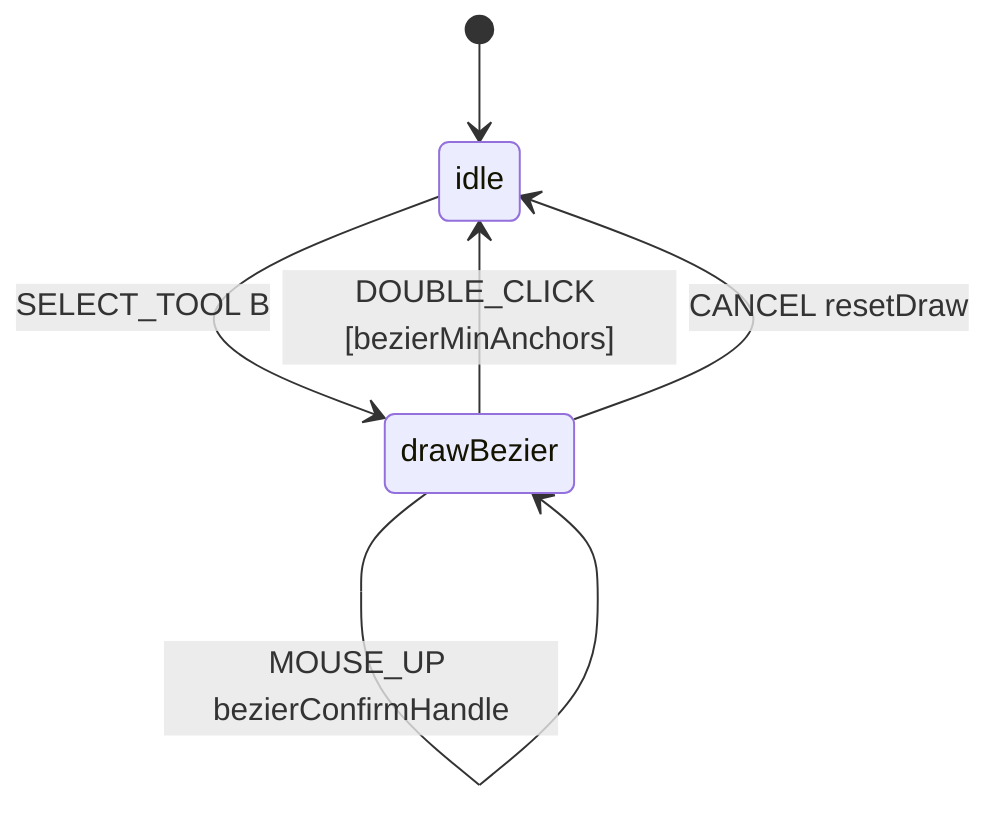
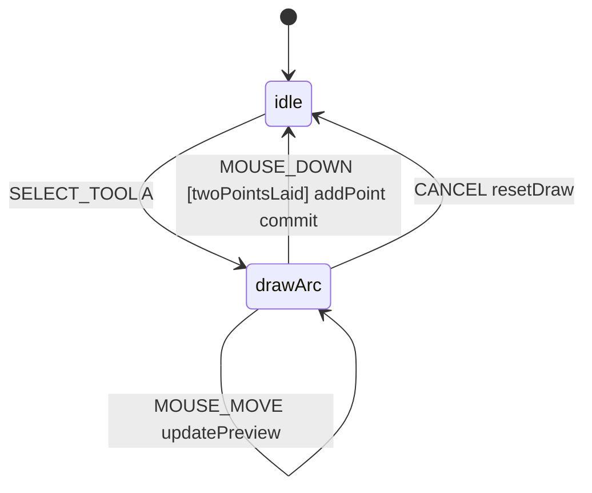
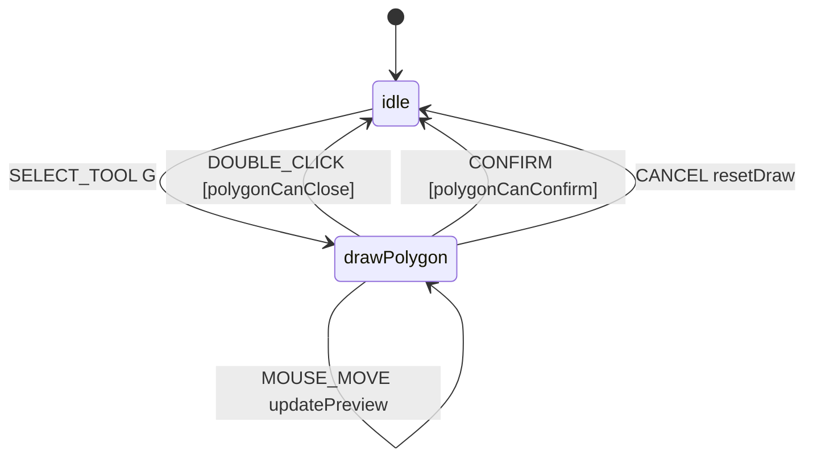

# 绘制工具 / Drawing Tools

> 本页讲 ToolStrip 上每一个工具的具体交互。每个工具对应一个 FSM `drawXxx` 状态（`src/core/fsm/editorMachine.ts:10-16`），由 `useMapEventRouter` 把 maplibre 的鼠标/键盘事件分发给状态机。

## 概览 / Overview



绘制工具共 6 种，由 `DrawTool` 类型穷举：

```ts
export type DrawTool =
  'drawPolyline' | 'drawCatmullRom' | 'drawBezier' | 'drawArc' | 'drawRotatedRect' | 'drawPolygon';
```

（`editorMachine.ts:10-16`）

## 工具一览 / Tool index

| 工具            | 快捷键 | commit 事件       | 最少点数     | 适用元素                                                             |
| --------------- | ------ | ----------------- | ------------ | -------------------------------------------------------------------- |
| drawPolyline    | `P`    | DOUBLE_CLICK      | ≥ 2          | （基础几何，Apollo 元素未直接使用）                                  |
| drawCatmullRom  | （无） | DOUBLE_CLICK      | ≥ 2          | （基础几何）                                                         |
| drawBezier      | `B`    | DOUBLE_CLICK      | ≥ 2 anchors  | lane / signal / stopSign / yieldSign / speedBump / barrierGate       |
| drawArc         | `A`    | 第三次 MOUSE_DOWN | exactly 3    | lane                                                                 |
| drawRotatedRect | `R`    | 第三次 MOUSE_DOWN | exactly 3    | parkingSpace / crosswalk / clearArea                                 |
| drawPolygon     | `G`    | DOUBLE_CLICK      | ≥ 3 + 不自交 | junction / pncJunction / parkingSpace / crosswalk / clearArea / area |

（行动定义：`src/core/actions/registry/definitions.ts:164-221`；元素表：`src/core/elements.ts:49-158`）

## 操作步骤 / Steps

### 1. 选元素 → 选工具

ToolStrip 是「先选元素，再选工具」的二级联动。选元素时 `ElementBar.onSelect(type)` 调用 `onSelectTool(def.defaultTool, type)`，`SELECT_TOOL` 事件携带 `element` 字段，`resetDraw` action 同步把 `activeElement` 写进 context（`editorMachine.ts:158-164`）。

### 2. drawPolyline / drawCatmullRom



- 落点：单击；
- 预览：`previewPoint` 跟随光标；
- commit：双击（guard `minPointsReached: drawPoints.length >= 2`，`editorMachine.ts:135-137`）；
- 取消：`Esc`。

### 3. drawBezier

每次 mousedown 在落锚点的同时进入「拖把手」状态：



- `bezierAddAnchor` 把 `{ point, handleIn: null, handleOut: null }` 推进 `bezierAnchors`，并把 `isDraggingHandle = true`；
- 鼠标拖动时 `handleOut` 跟手，`handleIn = mirrorPoint(point, handleOut)`，得到对称切线；
- 松手时若拖动距离 < 1e-6 度（约 11 cm），把 `handleIn/Out` 还原为 `null`，得到尖角；
- 双击 commit。

### 4. drawArc / drawRotatedRect

三点 commit 模式：



- drawArc：第 1 点起点，第 2 点圆弧中段，第 3 点终点；编译时由 `arcCompile.ts` 把三点拟合为圆弧；
- drawRotatedRect：第 1 点轴起点，第 2 点轴终点（决定方向 + 长度），第 3 点宽度（决定 perpendicular 偏移）。

### 5. drawPolygon



- 每次 `MOUSE_DOWN` guard：`wouldSelfIntersect(drawPoints, event.point)` —— 不允许出现自交边；
- 双击 commit guard：`polygonCanClose` —— 至少 3 点 + 不自交；
- `Enter` 也可触发 `CONFIRM`。

## 选项与参数表 / Options Table

| 工具            | guard / 关键 action                                                              | 备注                                  |
| --------------- | -------------------------------------------------------------------------------- | ------------------------------------- |
| drawPolyline    | `minPointsReached`、`addPoint`、`updatePreview`                                  | DOUBLE_CLICK / CONFIRM commit         |
| drawCatmullRom  | 同上                                                                             | 仅在 useDrawCommit 中按曲线 hint 处理 |
| drawBezier      | `bezierMinAnchors`、`bezierAddAnchor`、`bezierDragHandle`、`bezierConfirmHandle` | 拖动距离阈值 1e-6 度 ≈ 11 cm          |
| drawArc         | `twoPointsLaid`                                                                  | exactly 3 点                          |
| drawRotatedRect | `twoPointsLaid`                                                                  | exactly 3 点                          |
| drawPolygon     | `polygonNoSelfIntersect`、`polygonCanClose`、`polygonCanConfirm`                 | 自交检测在 `validation.ts`            |

## 键盘鼠标速查表 / Shortcut Cheatsheet

| 操作                   | 快捷键 / 鼠标       | FSM 事件                        |
| ---------------------- | ------------------- | ------------------------------- |
| 切换为 drawBezier      | `B`                 | `SELECT_TOOL drawBezier`        |
| 切换为 drawArc         | `A`                 | `SELECT_TOOL drawArc`           |
| 切换为 drawRotatedRect | `R`                 | `SELECT_TOOL drawRotatedRect`   |
| 切换为 drawPolygon     | `G`                 | `SELECT_TOOL drawPolygon`       |
| 切换为 drawPolyline    | `P`                 | `SELECT_TOOL drawPolyline`      |
| 落点 / 落锚            | 鼠标左键单击        | `MOUSE_DOWN`                    |
| 拖把手（Bezier）       | 按住左键拖动        | `MOUSE_MOVE [isDraggingHandle]` |
| commit 折线 / 多边形   | 双击                | `DOUBLE_CLICK`                  |
| commit 弧 / 矩形       | 第三次单击          | `MOUSE_DOWN [twoPointsLaid]`    |
| 取消                   | `Esc`               | `CANCEL`                        |
| 切回 Pan               | `H`                 | `defaultMode`                   |
| 网格 / 吸附            | `⌘G` / `toggleSnap` | `uiStore`                       |

::: tip 双击与 isDuplicateInput
maplibre 的 `dblclick` 之前会先发两次 `click`/`mousedown`。`useMapEventRouter` 通过 `isDuplicateInput`（位置 + 时间窗口）吞掉第二次，FSM 只会收到一次 MOUSE_DOWN，所以 commit guard 不需要再 `slice(-1)` 补偿（`editorMachine.ts:82-87` 注释解释了这次反复重写）。
:::

## 常见问题 / Troubleshooting

### Q1. drawPolygon 双击没合上

`polygonCanClose` 同时检查「点数 ≥ 3」和「无自交」。如果你画了一个 8 字形，guard 不通过。把光标移开自交点再双击。

### Q2. drawBezier 双击丢了最后一个锚点

不应该会。如果你看到这个症状，检查是不是有外部代码自己 `slice(-1)` 了 anchors —— `editorMachine.ts:82-87` 的注释明确说「输入层已 dedup，FSM 不再切尾」。

### Q3. drawArc 的第二点画偏了

第 2 点是圆弧中段（不是圆心）。三点拟合算法要求三点共圆，因此第 2 点决定弯曲方向。

### Q4. drawRotatedRect 第三点决定长边还是短边？

第 1-2 点是「轴」（长边方向），第 3 点投影到 perpendicular 决定宽度。所以矩形的 axis 就是前两点连线方向。

### Q5. 切换工具后旧的预览还在画

`SELECT_TOOL` 触发 `resetDraw`，旧 `drawPoints` / `bezierAnchors` 应被清空。如果残留，可能是 hot layer 在 `useHotLayer` 中没监听到状态变化——刷新一次。

## 相关源码 / Source links

- FSM：`src/core/fsm/editorMachine.ts:130-384`
- 路由：`src/hooks/useMapEventRouter.ts` + `src/hooks/mapEventRouter/`
- 行动注册：`src/core/actions/registry/definitions.ts:164-221`
- 元素 → 工具：`src/core/elements.ts:49-158`
- 自交校验：`src/core/geometry/validation.ts`
- ToolStrip UI：`src/components/layout/ToolStrip.tsx:128-219`

## 相关文档 / See also

- [车道绘制](./drawing-lanes.md)
- [编辑与吸附](./editing-and-snapping.md)
- [地图元素](./map-elements.md)
- [拓扑](./topology.md)
