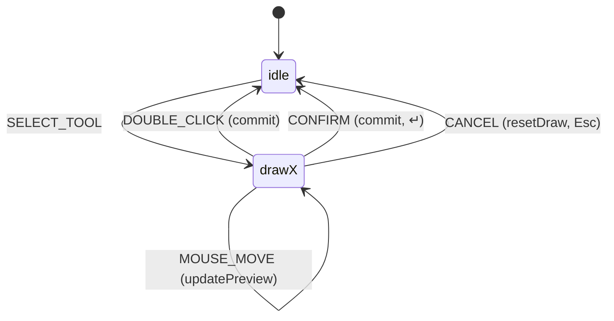
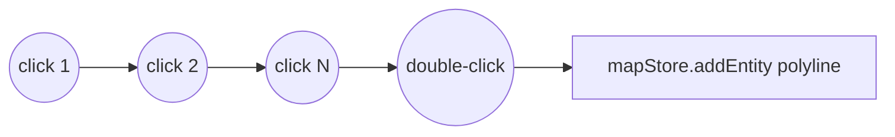
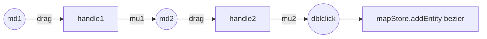

# Drawing tools

Six geometric tools, each implemented as a state in the editor FSM. This
page walks through what each does, when to reach for it, and the per-tool
keyboard semantics.

## Source map

| Concern                          | File                                       |
| -------------------------------- | ------------------------------------------ |
| FSM state machine                | `src/core/fsm/editorMachine.ts`            |
| Commit pipeline                  | `src/hooks/useDrawCommit.ts`               |
| Action registry (drawTool field) | `src/core/actions/registry/definitions.ts` |
| Geometry interpolation           | `src/core/geometry/interpolate.ts`         |
| Anchor conversion                | `src/core/geometry/anchorConvert.ts`       |
| Validation (self-intersect)      | `src/core/geometry/validation.ts`          |
| Element-tool mapping             | `MAP_ELEMENTS` in `src/core/elements.ts`   |

## Common shape

Every drawing tool is an XState state with the same lifecycle:



Once the FSM enters `idle`, `useDrawCommit.ts:96-117` reads the
post-transition snapshot and calls `mapStore.addEntity(...)` if the
geometry passes its tool-specific minimum.

::: warning Read the post-transition snapshot
The commit transition does **not** carry `resetDraw` as an action — it just
targets `idle`. This is deliberate: the post-snapshot must still contain
`drawPoints` / `bezierAnchors` so `useDrawCommit` can read them. After
commit, `useDrawCommit` itself sends `RESET` to clear `activeElement` and
the buffers. Editing the FSM and forgetting this rule will produce empty
entities.
:::

## Tool 1 — Polyline

|                  |                                              |
| ---------------- | -------------------------------------------- |
| FSM state        | `drawPolyline`                               |
| Action id        | `tool:drawPolyline`                          |
| Shortcut         | `P`                                          |
| Min points       | 2                                            |
| Commit           | `↵` or double-click                          |
| Cancel           | `Esc`                                        |
| Element override | None — produces a `PolylineEntity` primitive |

Click points in sequence. The cursor draws a rubber-band segment from the
last placed point to the current cursor (the "preview" point). Double-click
to commit; the final commit click is consumed by `isDuplicateInput` so the
FSM only counts it once.



::: tip Polyline is the lingua franca
Most other tools eventually reduce to a polyline (sampled centerline, edge
list). Use Polyline when you want raw control over every vertex with no
curve interpolation.
:::

## Tool 2 — CatmullRom

|                  |                                                |
| ---------------- | ---------------------------------------------- |
| FSM state        | `drawCatmullRom`                               |
| Action id        | `tool:drawCatmullRom`                          |
| Shortcut         | none (palette only)                            |
| Min points       | 2                                              |
| Commit           | `↵` or double-click                            |
| Cancel           | `Esc`                                          |
| Element override | None — produces a `CatmullRomEntity` primitive |

Same input as Polyline. The control points become anchor points for a
Catmull-Rom spline; the rendered curve passes through every anchor with
C1 continuity. Useful when you want a smooth curve without managing
explicit tangent handles.

::: tip Bezier vs CatmullRom

- Use **Bezier** when you need explicit per-anchor tangent control (e.g.
  matching a real-world ramp curvature precisely).
- Use **CatmullRom** when you want the curve to pass through your clicks
  with sensible smoothing and don't need tangent handles.
  :::

## Tool 3 — Bezier

|                  |                                                                                                   |
| ---------------- | ------------------------------------------------------------------------------------------------- |
| FSM state        | `drawBezier`                                                                                      |
| Action id        | `tool:drawBezier`                                                                                 |
| Shortcut         | `B`                                                                                               |
| Min anchors      | 2                                                                                                 |
| Commit           | `↵` or double-click                                                                               |
| Cancel           | `Esc`                                                                                             |
| Element override | Lane (default), Signal, StopSign, SpeedBump, YieldSign, BarrierGate, PNCJunction (lane-style use) |

The most-used tool. Anchor + tangent at each click:

1. **Mouse down** at anchor position.
2. **Drag** outward — the cursor pulls a tangent handle. The curve
   between the previous anchor and this one updates live.
3. **Release** — handle locked. Move to next position.
4. Repeat.
5. **Double-click** or `↵` to commit.



`isDraggingHandle` in the context tracks the drag state; while true,
`MOUSE_MOVE` calls `bezierDragHandle` which updates the anchor's
`handleOut` and mirrors it as `handleIn` of the next anchor (so the
joint is smooth by default).

::: tip Sharp corner via release-without-drag
If you mouse-down and immediately release without moving, the distance
check in `bezierConfirmHandle` (`editorMachine.ts:213-221`) is below
1e-6, and both `handleIn` and `handleOut` are nulled out. The result is
a sharp corner — useful for sharp lane turns or polygon-style anchors.
:::

::: warning Don't release outside the canvas
If you mouse-up while the cursor is over the menu bar or a panel, the
FSM never sees `MOUSE_UP` and stays in `isDraggingHandle: true`. The
next click confuses the state. Press `Esc` to recover.
:::

## Tool 4 — Arc (three-point)

|                  |                     |
| ---------------- | ------------------- |
| FSM state        | `drawArc`           |
| Action id        | `tool:drawArc`      |
| Shortcut         | `A`                 |
| Points needed    | 3 (start, mid, end) |
| Commit           | third click         |
| Cancel           | `Esc`               |
| Element override | Lane                |

Three clicks define a circular arc. The third click is the commit:

1. Click 1 — arc start.
2. Click 2 — a point the arc must pass through.
3. Click 3 — arc end. Commit fires automatically.

`twoPointsLaid` guard in `editorMachine.ts:139-143` triggers the commit:

```ts
MOUSE_DOWN: [
  { guard: 'twoPointsLaid', target: 'idle', actions: 'addPoint' },
  { actions: 'addPoint' },
];
```

The third `MOUSE_DOWN` matches `twoPointsLaid` (drawPoints.length === 2),
adds the third point as part of the transition, and lands in `idle`.
`useDrawCommit` sees `points.length === 3` and produces an `ArcEntity`
with `start`, `mid`, `end`.

::: tip Arc geometry rules
The mid-point must be **inside** the arc (between start and end along the
curve). Picking a mid-point on the wrong side produces the major arc
instead of the minor arc. There's no UI affordance to flip — re-draw
with the mid-point on the correct side.
:::

## Tool 5 — Rotated rectangle

|                  |                                                |
| ---------------- | ---------------------------------------------- |
| FSM state        | `drawRotatedRect`                              |
| Action id        | `tool:drawRotatedRect`                         |
| Shortcut         | `R`                                            |
| Points needed    | 3 (axis start, axis end, width point)          |
| Commit           | third click                                    |
| Cancel           | `Esc`                                          |
| Element override | Parking space (default), Crosswalk, Clear area |

Three clicks define an oriented rectangle:

1. Click 1 — one end of the long axis.
2. Click 2 — other end of the long axis.
3. Click 3 — a point determining the width perpendicular to the axis.

Same FSM shape as `drawArc` (shared `threeClickCommitEvents` map). On
commit, `rotatedRectFromPoints()` (`interpolate.ts`) extracts the
rectangle:

```ts
const r = rotatedRectFromPoints(points[0], points[1], points[2]);
addEntity({ id, entityType: 'rect', p1: r.p1, p2: r.p2, rotation: r.rotation });
```

::: tip Use for parking and crosswalks
A 6 m × 2.5 m parking space is two clicks for the long axis (front to back
of the car) plus a third click for the width. A crosswalk is the same
flow, just with the long axis along the crossing direction.
:::

## Tool 6 — Polygon

|                  |                                                                              |
| ---------------- | ---------------------------------------------------------------------------- |
| FSM state        | `drawPolygon`                                                                |
| Action id        | `tool:drawPolygon`                                                           |
| Shortcut         | `G`                                                                          |
| Min points       | 3                                                                            |
| Commit           | double-click or `↵`                                                          |
| Cancel           | `Esc`                                                                        |
| Element override | Junction (default), PNC junction, Area, Parking space, Crosswalk, Clear area |

Click points in sequence to define a polygon. Same UX as Polyline, but
with two extra guards:

### `polygonNoSelfIntersect` (per click)

`editorMachine.ts:141-144` checks `wouldSelfIntersect(drawPoints, event.point)`
before adding a new point. If the proposed segment from the last point to
the new point crosses any existing segment, the click is **silently
rejected** — the FSM doesn't add the point and the cursor doesn't move on.

```ts
MOUSE_DOWN: { guard: 'polygonNoSelfIntersect', actions: 'addPoint' },
```

### `polygonCanClose` (on double-click) / `polygonCanConfirm` (on ↵)

Both check that the polygon has ≥ 3 points and that closing it doesn't
introduce a self-intersection (`polygonSelfIntersects`).

::: warning Silent rejection is intentional
Showing a UI affordance for "this click would self-intersect" was tried
and discarded — it produced too much visual noise during fast drawing.
The cursor not advancing is the affordance: if a click does nothing,
move the cursor and try again.
:::

## Element-tool compatibility matrix

The ToolStrip filters `ALL_DRAW_TOOLS` by the element's `tools` allowlist
(`MAP_ELEMENTS` in `src/core/elements.ts:49`):

| Element       | Allowed tools                | Default         |
| ------------- | ---------------------------- | --------------- |
| Lane          | drawBezier, drawArc          | drawBezier      |
| Junction      | drawPolygon                  | drawPolygon     |
| PNC Junction  | drawPolygon                  | drawPolygon     |
| Parking Space | drawRotatedRect, drawPolygon | drawRotatedRect |
| Crosswalk     | drawRotatedRect, drawPolygon | drawRotatedRect |
| Signal        | drawBezier                   | drawBezier      |
| Stop Sign     | drawBezier                   | drawBezier      |
| Speed Bump    | drawBezier                   | drawBezier      |
| Yield Sign    | drawBezier                   | drawBezier      |
| Clear Area    | drawRotatedRect, drawPolygon | drawRotatedRect |
| Barrier Gate  | drawBezier                   | drawBezier      |
| Area          | drawPolygon                  | drawPolygon     |

::: tip Why no Polyline / CatmullRom for any Apollo element?
Polyline and CatmullRom produce raw geometry primitives. Apollo lanes
demand smooth, parameterizable centerlines — Bezier and Arc give you
that. If you need a Polyline-shape Lane (rough trace), draw the Polyline,
read its points, then redraw with Bezier.
:::

## Tool selection precedence

If you press `B` while in `selected` state, the FSM transitions through
`selectToolFromSelected` (`editorMachine.ts:75-79`):

```ts
const selectToolFromSelected = selectToolTransitions.map((t) => ({
  ...t,
  actions: ['deselectEntity', ...t.actions] as const,
}));
```

That is: deselect first, then enter the draw state. So the same shortcut
works regardless of current state.

::: warning Drawing entirely in keyboard
You can author a lane fully via keyboard:

1. `H` — Hand mode (clean state).
2. (click on map to start the lane interactively — keyboard alone can't
   place a point yet; this is on the roadmap.)
3. `B` — switch tool.
4. `↵` — commit when done.
5. `Esc` — discard mid-draw.
   :::

## Where to next

- [Drawing lanes](/guide/drawing-lanes) — full lane workflow with
  attributes and stitching.
- [Editing and snapping](/guide/editing-and-snapping) — selection, drag,
  marquee, snap behaviour.
- [Topology and junctions](/guide/topology-and-junctions) — what happens
  to lane connectivity after you commit.
- [Architecture / FSM design](/architecture/fsm-design) — the editor
  machine internals.
