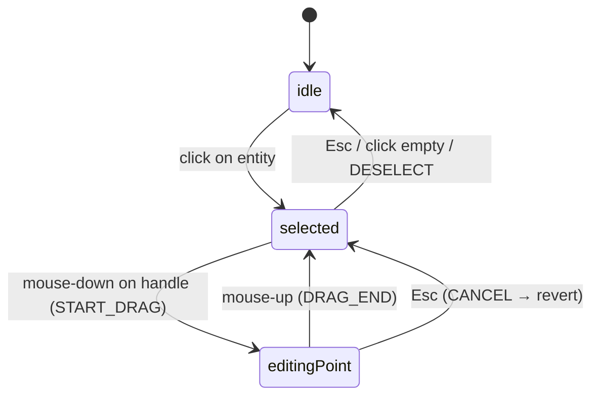
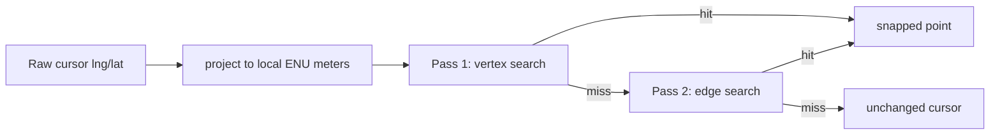

# Editing and snapping

Once an entity is committed, you edit it on the canvas: click to select,
drag the handles to reshape, drag the body to translate. Snap engages
automatically while drawing or dragging. This page covers the input
pipeline that makes that work.

## Source map

| Concern                             | File                                                    |
| ----------------------------------- | ------------------------------------------------------- |
| Top-level event router              | `src/hooks/useMapEventRouter.ts`                        |
| Input deduplication                 | `src/hooks/mapEventRouter/inputDedup.ts`                |
| Hit-test against committed entities | `src/hooks/mapEventRouter/hitTest.ts`                   |
| Selection + drag handlers           | `src/hooks/mapEventRouter/selectionDrag.ts`             |
| Connect mode dispatcher             | `src/hooks/mapEventRouter/connectMode.ts`               |
| Cursor scheduler                    | `src/hooks/mapEventRouter/cursorScheduler.ts`           |
| Snap entry point                    | `src/hooks/mapEventRouter/snap.ts`                      |
| Snap geometry (pure)                | `src/core/geometry/snap.ts`                             |
| Snap radius constant                | `SNAP_RADIUS_PX` in `src/config/mapConstants.ts` (8 px) |

## Selection model



### Selecting an entity

Click anywhere on a committed entity (lane centerline, polygon fill,
rectangle, …). The hit-test uses MapLibre's
`queryRenderedFeatures(hitBbox(e.point), { layers: [...] })` against the
hot/cold layers. Selection precedence (top to bottom):

1. **Hot points** (`hot-points` layer) — drag handles of the currently
   selected entity. Highest priority while one is selected.
2. **Hot fill** (`hot-fill` layer) — body of the currently selected
   entity, used for translate-drag.
3. **Cold layer features** (`cold-*` layers) — every committed entity.
4. **Empty space** — `DESELECT`.

`selectionDrag.ts:43-60` handles point 1 (handle drag); subsequent
branches handle point 2 (body drag) and the fall-through deselect.

### Deselecting

| Action               | Effect                                                               |
| -------------------- | -------------------------------------------------------------------- |
| Click empty space    | `DESELECT`, FSM → `idle`                                             |
| Press `Esc`          | `CANCEL`, FSM → `idle` (in `selected`) or revert (in `editingPoint`) |
| Click another entity | Re-selects, FSM stays in `selected`                                  |
| `Delete` / `⌫`       | `DELETE_ENTITY`, FSM → `idle`                                        |

## Editing geometry

Selected entities expose **drag handles** rendered by the hot layer:

| Entity type                     | Handle types                                                                                       |
| ------------------------------- | -------------------------------------------------------------------------------------------------- |
| Polyline / CatmullRom / Polygon | One vertex handle per point                                                                        |
| Bezier                          | Anchor point + tangent handles (in/out per anchor)                                                 |
| Arc                             | Start, mid, end                                                                                    |
| Rect                            | Two diagonal corner handles + rotation pivot                                                       |
| Lane (Apollo)                   | Source-aware: bezier anchors / arc points / polyline vertices, depending on how the lane was drawn |

Handles render as small filled circles for vertices, smaller open circles
for tangent handles. Mouse-down on a handle starts a drag.

### Vertex drag

```
mouse-down on vertex → START_DRAG (index, 'vertex')
mouse-move           → DRAG_MOVE  (point, snapped)
mouse-up             → DRAG_END   (point, snapped)
                       ─▶ MapCanvas writes back via applyDrag
                       ─▶ updateEntity → reconcileLaneTopology
```

The drag store live-updates `dragCurrentPoint` so the hot layer can show
the live preview at 60 fps. The actual entity write happens on `DRAG_END`
— the cold layer doesn't see the dragged geometry until then. This is
why dragging a long lane through a 5k-entity map stays smooth.

### Tangent handle drag (bezier)

The handle role is read from MapLibre's feature properties:
`props.role === 'handle'`, `props.handleType === 'in' | 'out'`. The drag
adjusts the anchor's `handleIn` / `handleOut` and mirrors them across
the anchor for smooth joints.

### Alt-click toggles smooth/sharp

`selectionDrag.ts:50-55`: pressing `Alt` while clicking a vertex calls
`toggleSmooth(entity, idx)` (or `toggleSmoothApollo` for source-backed
lanes). For a bezier anchor:

- Smooth → handles in/out are mirrored
- Sharp → handles are nulled, producing a kink

The action sends `TOGGLE_SMOOTH` to the FSM (which re-targets `selected`
without changing state) so the hot layer re-renders.

## Body drag (translate)

If you click on the **fill** of a selected entity (not a handle), the
drag becomes a translation. The whole entity moves with the cursor,
preserving relative geometry:

```ts
START_DRAG with pointType='center'
DRAG_MOVE → updates cursor delta
DRAG_END  → applies translation to all points/anchors
```

For lanes, the body is the centerline polyline. For polygons / rects,
it's the fill area. For drawing primitives, the same.

::: tip Body drag honors snap
Translating a lane near another lane's endpoint will engage endpoint
snap on the dragged endpoint. Useful for re-aligning lanes after a
geometry edit.
:::

## Marquee selection

**Not implemented.** Single-click selection is the only way to select.
Multi-select is on the roadmap. For bulk operations today, scripted
edits via the round-tripped `.txt` proto are the workaround.

## Snap

Snap is the magnetic pull that aligns your cursor to existing geometry
during drawing or editing. Enabled via the magnet icon in the ToolStrip
(`snapEnabled` in `useUIStore`).

### When snap engages

`mapEventRouter/snap.ts:11-13`:

```ts
function isSnapApplicable(state: string): boolean {
  return state === 'editingPoint' || isDrawingState(state);
}
```

Snap runs on every `MOUSE_MOVE` while drawing or dragging. It does **not**
run in `selected` or `idle` — pure pan/select cursor moves don't pay the
snap cost.

### How snap finds a target

Source: `src/core/geometry/snap.ts:309` (`findSnapTarget`):

1. Compute `radiusMeters = pixelsToMeters(SNAP_RADIUS_PX, lat, zoom)`.
   `SNAP_RADIUS_PX` is 8; the meter equivalent depends on zoom and
   latitude.
2. Collect snap candidates (`collectCandidates`):
   - **Vertex candidates**: every entity's vertices, with lane endpoints
     tagged as `endpointRole: 'start' | 'end'`. Lane interior vertices
     are **not** candidates (see warning below).
   - **Edge candidates**: segments of every polyline / polygon / lane
     centerline.
3. Two passes:
   - Pass 1: vertices. Closest within radius wins.
   - Pass 2: edges. Closest projection within radius wins, only used
     if no vertex hit.
4. Returns `SnapTarget | null`.

The result is fed back into the cursor position so the FSM sees the
snapped point, not the raw cursor.



### Snap kinds

| Kind                   | Where it fires                                                | What it produces                                                     |
| ---------------------- | ------------------------------------------------------------- | -------------------------------------------------------------------- |
| Vertex (lane endpoint) | Within 8 px of a lane's start or end                          | Topology-relevant snap; sets `endpointRole` for pred/succ derivation |
| Vertex (other)         | Within 8 px of any other entity vertex                        | Pure geometric snap; no topology side effect                         |
| Edge                   | Within 8 px of any polyline/polygon segment, no vertex closer | Snap to closest point on the segment                                 |

::: warning Lane interior vertices are excluded by design
The snap module skips lane interior vertices (see
`src/core/geometry/snap.ts:148-177`). Reason: snapping a new lane's
endpoint to an existing lane's interior vertex creates coincident
geometry without producing a topology link — `reconcileLaneTopology`
only writes pred/succ for endpoint-to-endpoint snaps. The user would
think they connected the lanes, but the planner would see no link.
Excluding interior vertices makes this footgun impossible.
:::

::: tip Snap target preview
The snap target is broadcast to `useUIStore.currentSnapTarget`. The
overlay layer renders a small marker over the snap point, so you see
where the cursor will land before you click. If snap is off or no
target is in range, the marker hides.
:::

### Disabling snap

- Click the magnet icon (`Toggle Snap`).
- The `Toggle Snap` action has no keybinding by default; add one in
  `src/core/actions/registry/definitions.ts` if you need it.

Disabling snap clears `currentSnapTarget` and the cursor moves freely.

## Grid

The grid layer (`useGridLayer.ts`) draws a meter-spaced overlay when
`gridEnabled`. The grid is **visual only** — it doesn't snap the cursor.
For a click to land on a grid intersection, you'd need a separate
"snap to grid" feature, which isn't implemented (the existing snap
targets entity geometry, not grid lines).

::: tip Grid is for orientation, not authoring
Use the grid to gauge distances and check angle alignment. For absolute
position constraints, set the cursor numerically by editing the entity's
points in the inspector after creation.
:::

## Input deduplication

Source: `src/hooks/mapEventRouter/inputDedup.ts`

Browser dblclick events fire as **two separate clicks** plus the
dblclick event. Without dedup, the FSM would receive three `MOUSE_DOWN`
on a double-click, which would corrupt the polyline/polygon vertex
count by one.

The dedup rule:

```ts
DBLCLICK_PX_TOLERANCE = 4;
DBLCLICK_MS_WINDOW = 350;

function isDuplicateInput(prev, next) {
  return Math.hypot(dx, dy) < 4 && next.ts - prev.ts < 350;
}
```

If the second click is within 4 px and 350 ms of the first, the second
is dropped. The FSM sees one `MOUSE_DOWN` and one `DOUBLE_CLICK`, which
is the correct event sequence.

::: warning Don't compensate in the FSM
A previous bug (since fixed) had the FSM `slice(-1)` the points on
`DOUBLE_CLICK` to remove the assumed extra click. After dedup landed,
this caused polylines to lose their last user-clicked point. The FSM
now trusts `drawPoints` directly. See `editorMachine.ts:82-87` for the
warning comment.
:::

## Pan and zoom

Pan: click-drag on empty space (when no entity is selected, or when in
Hand mode). MapLibre's native `dragPan` handles this directly; the
event router's selection check fails and dragPan stays enabled.

Zoom: mouse wheel, pinch on touchpads, or `Ctrl+scroll`. MapLibre
native, no editor logic involved. The current zoom is mirrored to
`useUIStore.currentZoom` for the StatusBar.

::: tip Disable dragPan during entity drag
When you start dragging a handle, `selectionDrag.ts:57` calls
`map.dragPan.disable()`. Without this, your handle drag would also pan
the map. On `DRAG_END`, dragPan re-enables.
:::

## Cursor management

Source: `src/hooks/mapEventRouter/cursorScheduler.ts`

The cursor changes shape based on the current FSM state:

| State                     | Cursor          |
| ------------------------- | --------------- |
| `idle` (Hand mode)        | grab / grabbing |
| `idle` with element armed | crosshair       |
| draw states               | crosshair       |
| `selected` over fill      | move            |
| `selected` over handle    | pointer         |
| `editingPoint`            | grabbing        |

Cursor changes are scheduled (debounced) to avoid flicker on rapid
moves. The scheduler reads the FSM and applies the appropriate CSS
class to the canvas element.

## Where to next

- [Topology and junctions](/guide/topology-and-junctions) — what
  endpoint snaps do to lane connectivity.
- [Drawing tools](/guide/drawing-tools) — input cycle for each draw
  state.
- [Architecture / Map event router](/architecture/map-event-router) —
  internal event dispatch design.
