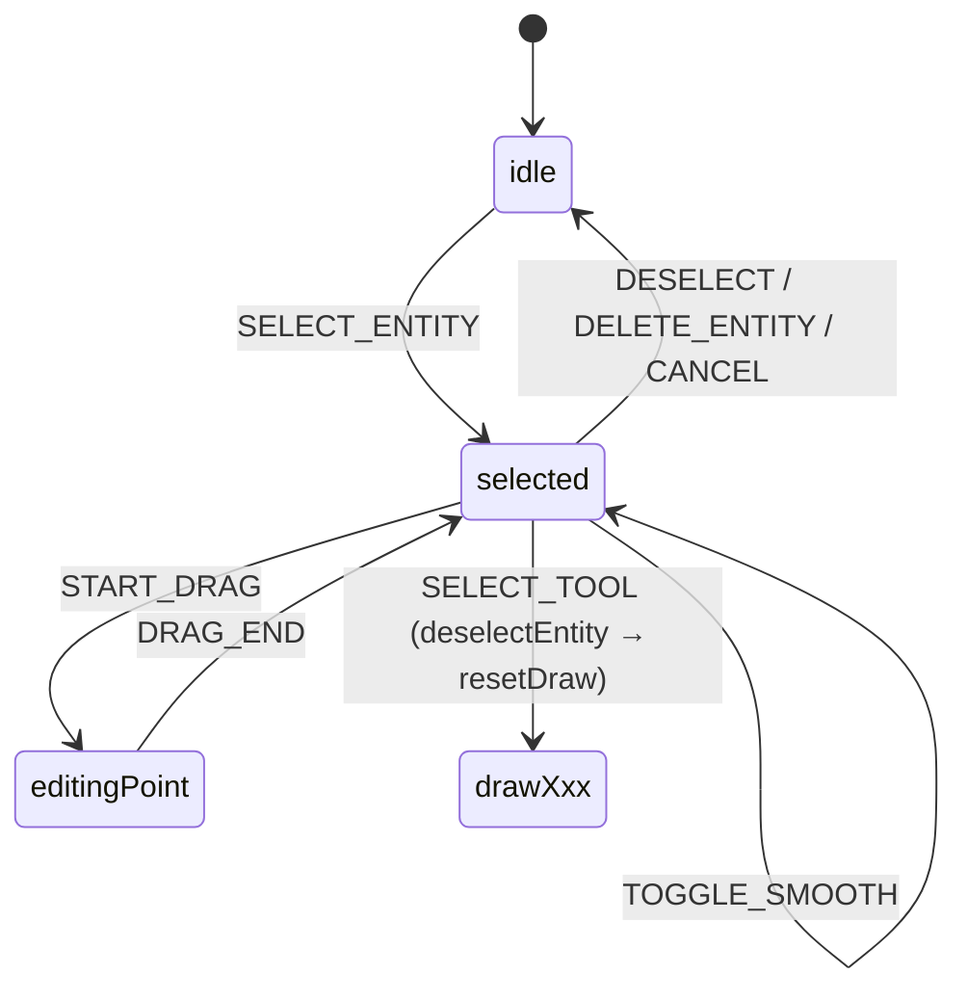
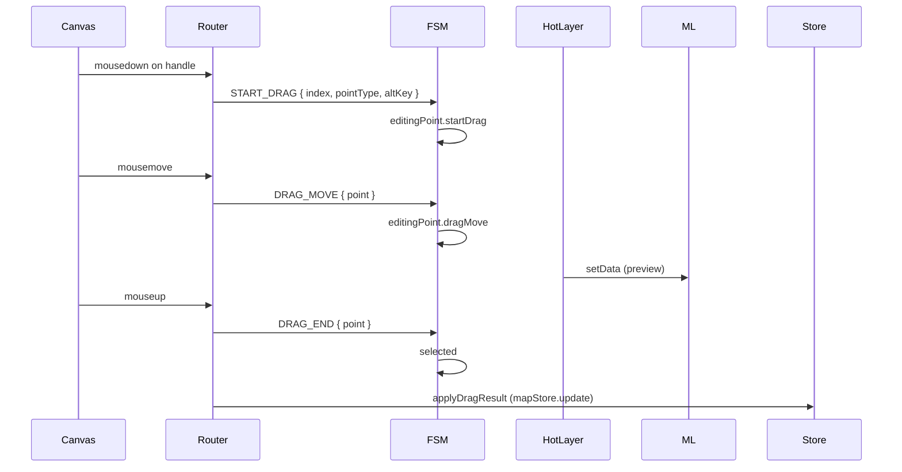
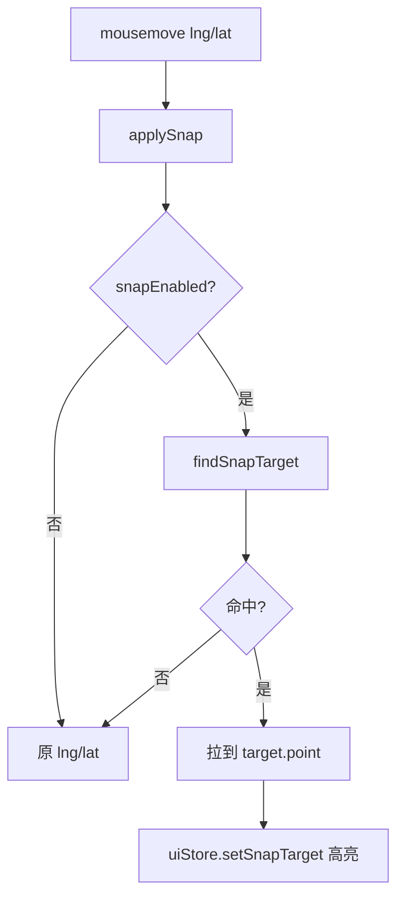

# 编辑与吸附 / Editing & Snapping

## 概览 / Overview

实体绘制完成后进入「编辑」流程：单击选中 → 拖控制点 / 把手 → 松手提交。FSM 转换：

（`editorMachine.ts:281-326`）

吸附（snap）由 `applySnap`（`src/hooks/mapEventRouter/snap.ts:15-39`）在每次 `MOUSE_MOVE` / `MOUSE_DOWN` 之前介入，把鼠标 lng/lat 拉到 `findSnapTarget` 返回的最近吸附点。

## 操作步骤 / Steps

### 1. 选中

- 单击实体几何 → FSM 收到 `SELECT_ENTITY {id}` → `selected.selectEntity` 把 id 写入 context；
- LayerTree 单击同样发 `SELECT_ENTITY`；
- 多选当前未实现（roadmap）。

### 2. 拖控制点

`pointType` 取值：`vertex` / `bezierIn` / `bezierOut` / `body` 等（`src/types/editor.ts`）。

### 3. 平移整体

- 拖整个实体 body：`pointType=body`，FSM 同样进入 `editingPoint`；
- 拖动量直接加在每个顶点上（`src/hooks/mapEventRouter/selectionDrag.ts`）。

### 4. 切换尖角 / 平滑（Bezier）

`selected → selected: TOGGLE_SMOOTH { index }`：

- `Alt` + 单击锚点 → 把 `handleIn/Out` 在 `null`（尖角）和 mirror（平滑）之间切换；
- 实际修改由 `MapCanvas` 在 `TOGGLE_SMOOTH` 监听里执行（`editorMachine.ts:304-307`）。

### 5. 吸附 / Snap

只在「绘制中或编辑控制点中」生效（`isSnapApplicable`：`isDrawingState(state) || state==='editingPoint'`）。

吸附半径以像素为单位（`SNAP_RADIUS_PX`，`src/config/mapConstants.ts`），按当前 zoom 转米：`pixelsToMeters(SNAP_RADIUS_PX, lat, zoom)`。

### 6. 吸附目标类型 / Snap target kinds

`SnapTarget` 提供：

| 类型 / kind  | 来源              | 说明                      |
| ------------ | ----------------- | ------------------------- |
| `endpoint`   | lane 起点 / 终点  | 用于 lane-to-lane 接续    |
| `vertex`     | polygon 顶点      | junction / parking / area |
| `mid`        | 边中点            | 在长边吸附                |
| `centerline` | lane 中心线最近点 | drawing 时贴中心          |

`excludeId` 排除自己，避免拖自己时吸到自己。

## 选项与参数表 / Options Table

| 选项                 | 默认                   | 说明                                              |
| -------------------- | ---------------------- | ------------------------------------------------- |
| `snapEnabled`        | `true`                 | `uiStore.snapEnabled`，`toggleSnap` action 可切换 |
| `SNAP_RADIUS_PX`     | 12 px                  | 吸附半径（像素），按 zoom 转米                    |
| 吸附范围             | 绘制 + editingPoint    | `isSnapApplicable`                                |
| `gridEnabled`        | `false`                | `uiStore.gridEnabled`，`toggleGrid` (`⌘G`)        |
| 历史步数             | 100                    | `settingsStore.historyLimit`                      |
| Pan/Drag handle 滞后 | 等于 maplibre defaults | `dragPan: true`, `dragRotate: true` 等            |
| 拖动 jitter 阈值     | < 1e-6 度              | bezier handle 的 corner snap 阈值                 |

## 键盘鼠标速查表 / Shortcut Cheatsheet

| 操作                    | 快捷键 / 鼠标            | 说明                                |
| ----------------------- | ------------------------ | ----------------------------------- |
| 选中                    | 单击实体                 | `SELECT_ENTITY`                     |
| 取消选中                | 单击空白 / `Esc`         | `DESELECT` / `CANCEL`               |
| 拖控制点                | 按住拖                   | `editingPoint`                      |
| 平移整体                | 按住实体 body 拖         | `editingPoint pointType=body`       |
| 切换尖角/平滑（Bezier） | `Alt + 单击锚点`         | `TOGGLE_SMOOTH`                     |
| 删除选中                | `Delete`                 | `DELETE_ENTITY` action              |
| 撤销 / 重做             | `⌘Z` / `⇧⌘Z`             | dispatcher CANCEL → temporal.undo() |
| 切换吸附                | View 菜单 / `toggleSnap` | `uiStore.snapEnabled`               |
| 切换网格                | `⌘G`                     | `uiStore.gridEnabled`               |

## 常见问题 / Troubleshooting

### Q1. 吸附点高亮但鼠标没被拉过去

`applySnap` 返回的 lng/lat 是「拉到 target」后的值，应用方需要把这个值用到 FSM event 中。检查事件路由器是否丢了返回值。

### Q2. 拖动时选中态消失

可能是 `selected` 收到了 `CANCEL`（例如 `Esc` 误触）。确认按键流向。

### Q3. 撤销后一个 lane 同时还有半截没被撤销

R1 关键点：dispatcher 必须在 `temporal.undo()` 前发 `CANCEL` 给 FSM（`src/hooks/useActionDispatcher.ts:76-82`）。如果你看到这个 bug，检查 dispatcher 的 `CANCEL` 是否真的被发出。

### Q4. 吸附半径太小 / 太大

调 `src/config/mapConstants.ts` 的 `SNAP_RADIUS_PX`。

### Q5. 多边形顶点拖动时违反了凸性 / 自交

当前编辑时不强制自交校验；只在绘制阶段 `polygonNoSelfIntersect` 阻拦。编辑阶段允许暂时进入非法状态，commit 时再校验（roadmap）。

### Q6. 我想看吸附调试信息

`uiStore.currentSnapTarget` 永远反映最近的吸附目标；可以在 React DevTools 里订阅或在 StatusBar 暴露。

## 相关源码 / Source links

- FSM：`src/core/fsm/editorMachine.ts:281-326`
- 吸附：`src/hooks/mapEventRouter/snap.ts:1-40`
- 吸附几何：`src/core/geometry/snap.ts` (`findSnapTarget`, `pixelsToMeters`)
- 拖拽：`src/hooks/mapEventRouter/selectionDrag.ts`
- 撤销 R1：`src/hooks/useActionDispatcher.ts:76-82`
- 配置常量：`src/config/mapConstants.ts`
- StatusBar 显示：`src/components/layout/StatusBar.tsx`

## 相关文档 / See also

- [绘制工具](./drawing-tools.md)
- [车道绘制](./drawing-lanes.md)
- [图层树](./layer-tree.md)
- [拓扑](./topology.md)
