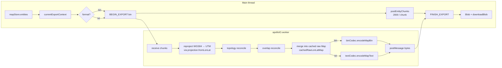
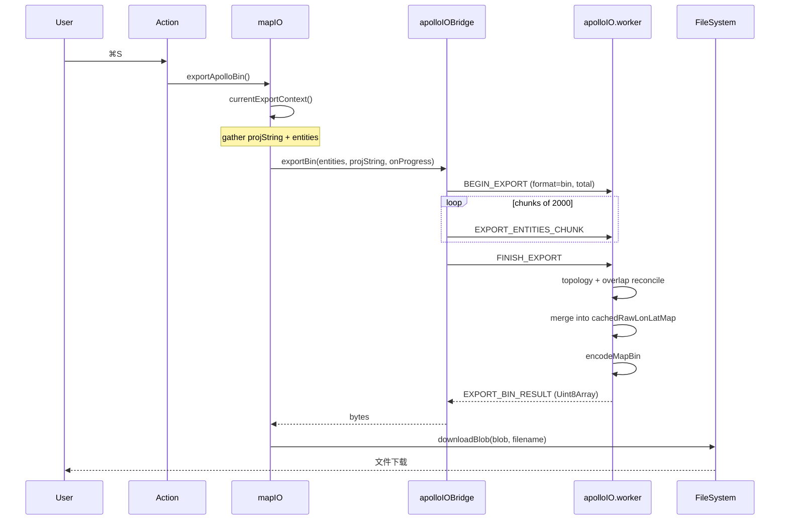

# 导出深入 / Exporting (Deep Dive)

> 这是 [Export](./export.md) 的姊妹页。如果说 export.md 在解释“能做什么”，本页解释 “**它具体做了什么**”——从 entity 切片到字节流写盘的全链路。

::: tip 阅读对象

- 想给 AMS 加一种新元素，需要确认导出能正确序列化。
- 怀疑导出的 `base_map.bin` 与 Apollo runtime 不兼容，需要排查管线某一环。
- 在做性能调优、benchmark 或回归测试 fixture。
  :::

## 概览 / Overview



## 管线七步 / Seven Pipeline Steps

### 1. 主线程上下文准备 (`mapIO.ts`)

`exportApolloBin` 在 `currentExportContext()` 中读取：

```ts
const { info } = useApolloMapStore.getState(); // 来自 Import 或新建地图导出上下文
const entities = Array.from(useMapStore.getState().entities.values());
```

`info.projString` 是 PROJ.4 字符串；`entities` 是 `MapEntity[]` 扁平表，长度可达 10⁵+。

导入地图导出时还依赖 worker 内的 `cachedRawLonLatMap`。这份 raw Apollo map 由最近一次 Import 写入，导出时 `entitiesToApolloMap(cachedRawLonLatMap, processed.entities)` 会把编辑后的实体合并回 raw map，再做反投影和编码。新建地图导出时，主线程会先请求投影，worker 使用空白 base_map 作为 merge 目标。

### 2. Worker 桥接 + 切片 (`apolloIOBridge.ts:204-225`)

主线程把 `BEGIN_EXPORT` 消息先发出去，再按 `EXPORT_ENTITY_CHUNK_SIZE = 2_000` 切片发送 entities，每片之间 `await yieldToMain()` 确保 UI 不卡顿。

```ts
for (let offset = 0; offset < entities.length; offset += 2000) {
  const nextOffset = Math.min(offset + 2000, entities.length);
  this.post({
    type: 'EXPORT_ENTITIES_CHUNK',
    requestId,
    entities: entities.slice(offset, nextOffset),
    offset,
    total: entities.length,
  });
  onProgress?.({ ... });
  await this.yieldToMain();
}
this.post({ type: 'FINISH_EXPORT', requestId });
```

::: tip 为什么不一次性发
postMessage 默认走 **structured clone**，10 万级 entities 的 deep clone 会把主线程钉住 1–2s。切片让长 GC 不会成为帧率毒药。
:::

### 3. Worker 内反投影 (`apolloIO.worker.ts` + `proto/projection.ts`)

worker 收到 chunk 后逐 entity 调用 `projection.fromLonLat`：

```ts
const proj = makeProjection(projString); // proj4 forward/inverse
for (const e of entities) {
  // lane.centralCurve / boundary / polygon / position …
  recurseENU(e, (point) => proj.fromLonLat(point));
}
```

PROJ 字符串先经 `sanitizeProjString` 去掉 `{37.413082}` 之类 Apollo 模板占位符（`projection.ts:10-12`）。

### 4. Topology reconcile

`apolloIO.worker.ts` 复用 `applyImportTopology()`：先把 `MapEntity[]` 装进 Map，运行 `reconcileLaneTopology(entityMap)`，再进入 overlap reconcile。当前导出路径没有单独调用 `core/elements/derive` 引擎；需要导出的派生字段必须已经体现在 `MapEntity` 或 `entitiesToApolloMap()` 的桥接逻辑里。

### 5. Overlap reconcile (`core/elements/overlap/reconcile.ts`)

所有 `OverlapEntity` 走 reconcile：

1. 重新枚举每对 (lane, lane) / (lane, junction) / (lane, signal) / … 的几何相交。
2. 对每对相交，重算 `startS` / `endS` / `regionOverlaps`。
3. 对带 `_userOverrides` 标记的 slot 跳过重算（保留用户钉住值）。

详细机制见 Overlap 表单的 [Inspector#overlap](./inspector.md#overlap-表单-overlaptsx)。

### 6. Header 保留 / Header Retention

::: tip 设计目标
**导出后的 base_map 必须保留导入时的 `Header`**——`projection.proj`、`vendor`、`district`、`date`、`left/right/top/bottom` 等字段不能被覆盖，否则下游工具链会把地图当“新地图”。
:::

导出保留 Header 的方式不是从 `apolloMapStore.header` 直接组装新 message，而是把编辑后的实体 merge 回导入时缓存的 raw Apollo map：

```ts
const merged = entitiesToApolloMap(cachedRawLonLatMap, processed.entities);
```

因此 `header` 以及未桥接字段会随 raw map 保留下来。无导入缓存的新建地图会生成只含 projection 和导出 bounds 的基础 Header；它能导出用户绘制的 Apollo 图元，但没有原始 raw map 可供保留未桥接字段。

### 7. protobuf 编码 (`proto/binCodec.ts` / `proto/textCodec.ts`)

最后一公里：

| 路径   | 文件                 | 行为                                                           |
| ------ | -------------------- | -------------------------------------------------------------- |
| `.bin` | `binCodec.ts:17-23`  | `Map.verify(obj)` → `Map.fromObject` → `Map.encode().finish()` |
| `.txt` | `textCodec.ts:13-16` | `decodeMessage` 的反向 — 自实现 textproto encoder              |

`Map.verify` 是 `protobufjs` 的字段校验，会捕捉枚举越界、必填项缺失等错误。verify 失败直接抛 `"Map.verify failed: …"`，被 `mapIO.ts:108` catch 后展示给用户。

## 输出验证 / Output Validation

::: tip 自动回归
仓库中存在导入 → 导出 round-trip 测试 (`src/io/__tests__/`)，确保内存表现的 entity 与 Apollo proto 是 bit-for-bit 等价（除自动派生的 length 外）。CI 每个 PR 都跑。
:::

| 校验类型       | 工具                                     | 失败时表现                         |
| -------------- | ---------------------------------------- | ---------------------------------- |
| protobuf 类型  | `Map.verify`                             | 立即抛错                           |
| 字段范围       | Lane speedLimit / width 等               | Inspector 校验过；导出再做兜底     |
| 必填字段       | `lane.id` / `lane.centralCurve.segments` | 缺失抛错                           |
| 拓扑闭合       | `predecessorIds` 引用是否存在            | reconcile 阶段警告 console，不阻塞 |
| Overlap 一致性 | `objects[].objectId` 必须能在主表找到    | 缺失则 reconcile 自动剔除          |

如果导出后想再做 sanity-check：用 `protoc --decode_raw < base_map.bin > tmp.txt`，与 AMS `.txt` 输出对比，应一致。

## 性能基准 / Benchmarks

参考 `bench/` 目录（`scripts/check-bench-budget.mjs` 与 CI 守门）：

| 数据规模       | bin export | txt export | 主要瓶颈          |
| -------------- | ---------- | ---------- | ----------------- |
| 1 k entities   | < 200 ms   | < 400 ms   | derive            |
| 10 k entities  | ~ 1.5 s    | ~ 3 s      | reproject         |
| 100 k entities | ~ 18 s     | ~ 35 s     | overlap reconcile |

::: warning 大图建议

> 50k 实体时建议用 `.bin`；`.txt` 编解码过慢且文件极大。
> :::

## 配置存储位置 / Persistence

导出**不写**任何 localStorage 键。`apolloMapStore.{info, header, bounds}` 都是内存态，由最近一次 Import 重置；进程退出即丢失。

## 操作步骤 / Steps（深度版）



## 常见问题 / Troubleshooting

| 症状                                                     | 真因                                                     | 处理                                         |
| -------------------------------------------------------- | -------------------------------------------------------- | -------------------------------------------- |
| `Map.verify failed: lane.0.id is required`               | 实体 ID 丢失（一般是手工编辑 `_userOverrides` 后丢字段） | DevTools 找该 entity，重新分配 ID            |
| Apollo 加载报 "no such file or directory: ./sim_map.bin" | 你只导出了 base_map                                      | 用 Apollo `sim_map_generator` 离线生成       |
| 导出文件偏小（<10 KB）                                   | 没 entities 被 commit；可能是 import 失败                | 看 `mapStore.entities.size`，应 > 0          |
| 文本格式中 `points` 内坐标显示为科学计数                 | proto encoder 默认 long 输出，已被 `longs:Number` 修正   | `binCodec.ts:8` 已固定，若再现请提 issue     |
| Overlap 数量在 export 后增加                             | reconcile 重新枚举了所有相交，包括以前漏的               | 这是预期行为；用 `_userOverrides` 钉住手工值 |
| `No imported Apollo map is cached in the IO worker.`     | 没有导入阶段的 raw map cache                             | 重新 Import 源 base_map，再导出              |

## 相关源码 / Source

- `src/io/mapIO.ts:95-141` — 主线程入口
- `src/io/apolloIOBridge.ts:88-225` — bridge + 切片
- `src/io/apolloIO.worker.ts` — worker 内 reconcile + encode
- `src/io/apolloIOProtocol.ts` — main↔worker 消息协议
- `src/io/proto/projection.ts:30-45` — `makeProjection`
- `src/io/proto/binCodec.ts:17-23` — `.bin` encode
- `src/io/proto/textCodec.ts:13-16` — `.txt` encode
- `src/core/elements/overlap/reconcile.ts` — overlap 重算
- `src/io/__tests__/` — round-trip 回归

## 协议常量 / Protocol Constants

`src/io/apolloIOBridge.ts:13-16`：

| 常量                       | 值                    | 说明                    |
| -------------------------- | --------------------- | ----------------------- |
| `FALLBACK_PROJ`            | `UTM_PRESETS.beijing` | 找不到 PROJ 时的兜底    |
| `DEFAULT_TIMEOUT_MS`       | 600_000 (10 min)      | 单次 import/export 超时 |
| `EXPORT_ENTITY_CHUNK_SIZE` | 2_000                 | 每片 entities           |

## Worker 消息协议 / Message Protocol

`src/io/apolloIOProtocol.ts` 定义主线程↔worker 消息：

| 消息                                       | 方向          | 用途                           |
| ------------------------------------------ | ------------- | ------------------------------ |
| `IMPORT_BIN` / `IMPORT_TEXT`               | main → worker | 导入入口                       |
| `BEGIN_EXPORT`                             | main → worker | 导出开始                       |
| `EXPORT_ENTITIES_CHUNK`                    | main → worker | 切片传输                       |
| `FINISH_EXPORT`                            | main → worker | 通知 worker 开始编码           |
| `RESOLVE_PROJECTION`                       | main → worker | 用户在 ProjPickerDialog 选完后 |
| `CLEAR`                                    | main → worker | 关闭 worker 内缓存             |
| `PROGRESS`                                 | worker → main | 推进度                         |
| `NEEDS_PROJECTION`                         | worker → main | 文件无 header.projection       |
| `IMPORT_ENTITIES_CHUNK`                    | worker → main | 切片回流                       |
| `IMPORT_RESULT`                            | worker → main | 完成                           |
| `EXPORT_BIN_RESULT` / `EXPORT_TEXT_RESULT` | worker → main | 完成                           |
| `CLEARED`                                  | worker → main | clear 应答                     |
| `ERROR`                                    | worker → main | 任何异常                       |

## Header 字段保留矩阵 / Header Retention

| Header 字段             | Import                                                 | 编辑                                            | Export 写入                        |
| ----------------------- | ------------------------------------------------------ | ----------------------------------------------- | ---------------------------------- |
| `projection.proj`       | 读取后 sanitize 入 `info.projString`，raw map 同时缓存 | 不可改（除非改 `info.projString`）              | 由 cached raw map merge 后保留     |
| `vendor`                | raw map 缓存                                           | MapMetadataForm 可改的字段需写回 raw merge 支持 | 由 cached raw map / merge 结果决定 |
| `district`              | raw map 缓存                                           | 同上                                            | 同上                               |
| `date`                  | raw map 缓存                                           | 同上                                            | 同上                               |
| `left/right/top/bottom` | raw map 缓存                                           | 当前 bounds 不单独从空白 Header 合成            | 由 cached raw map / merge 结果决定 |
| `version`               | raw map 缓存                                           | 不可改                                          | 保留                               |
| `rev_major/rev_minor`   | raw map 缓存                                           | 不可改                                          | 保留                               |

## 调试技巧 / Debug Tips

### 1. 看 worker 日志

Chrome DevTools → 三横线菜单 → **More tools → Network conditions / Workers**，可看到 `apolloIO.worker.ts` 进程的 console 输出。

### 2. 拦截单条消息

```js
// 临时给 apolloIOBridge 加 hook
import { apolloIOBridge } from '@/io/apolloIOBridge';
const originalPost = (apolloIOBridge as any).post;
(apolloIOBridge as any).post = (msg, transfer) => {
  console.log('[bridge]', msg);
  return originalPost.call(apolloIOBridge, msg, transfer);
};
```

### 3. 强制重投影

```js
// devtools console
useApolloMapStore.getState().setError(null);
useApolloMapStore.setState({ info: { ...info, projString: '+proj=utm +zone=51 +datum=WGS84' } });
```

## 相关文档 / See also

- [Export](./export.md) — 概览
- [Import](./import.md) / [Importing](./importing.md) — 入口侧
- [Inspector](./inspector.md) — `_userOverrides` 字段锁
- [Coordinate System](./coordinate-system.md) — PROJ.4 / UTM
- [Troubleshooting](./troubleshooting.md) — 多模块通用排错

## 相关文档 / See also

- [Export](./export.md) — 概览
- [Import](./import.md) / [Importing](./importing.md) — 入口侧
- [Inspector](./inspector.md) — `_userOverrides` 字段锁
- [Coordinate System](./coordinate-system.md) — PROJ.4 / UTM
- [Troubleshooting](./troubleshooting.md) — 多模块通用排错
