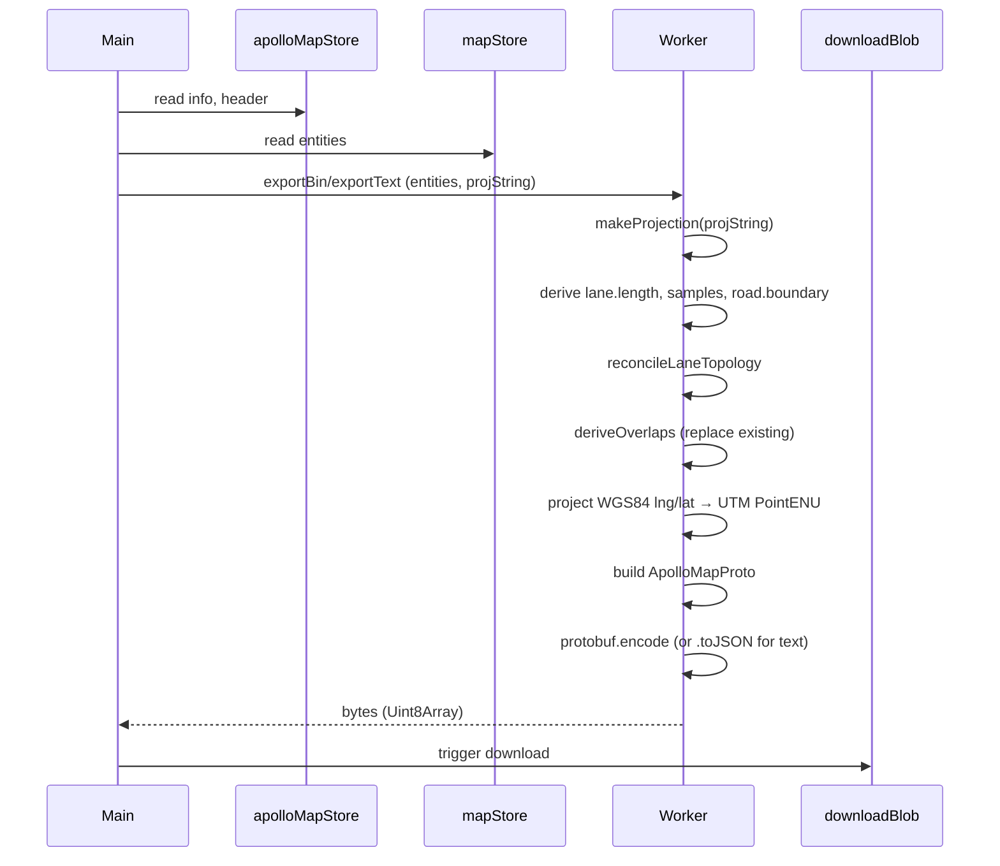

# Exporting

Exporting walks the in-memory `mapStore.entities`, projects coordinates
back to UTM meters, recomputes overlap and topology, and serializes to
Apollo binary or text protobuf. This page covers what's exported, what's
derived, and the difference between `base_map`, `sim_map`, and
`routing_map`.

## Source map

| Concern            | File                                                          |
| ------------------ | ------------------------------------------------------------- |
| Top-level entries  | `exportApolloBin`, `exportApolloText` in `src/io/mapIO.ts:95` |
| Worker bridge      | `src/io/apolloIOBridge.ts`                                    |
| Worker             | `src/io/apolloIO.worker.ts`                                   |
| Derive engine      | `src/core/elements/derive/`                                   |
| Overlap derivation | `src/core/elements/overlap/`                                  |
| Apollo proto types | `src/types/apollo.ts`                                         |
| Filename generator | `suggestedFilename` in `mapIO.ts:75`                          |

## Triggering an export

| Path                              | Action id          | Shortcut               | Format          |
| --------------------------------- | ------------------ | ---------------------- | --------------- |
| `File → Export Apollo Map (.bin)` | `exportApolloBin`  | `⌘S` / `Ctrl+S`        | Binary protobuf |
| `File → Export Apollo Map (.txt)` | `exportApolloText` | `⇧⌘S` / `Ctrl+Shift+S` | Text protobuf   |
| `⌘K` → "Export"                   | same as above      |                        |                 |

Both shortcuts are `global: true`, so they fire even when focus is in
an input field.

::: warning Export requires a prior import
`currentExportContext()` (`mapIO.ts:81`) checks `apolloMapStore.info`.
If null (no import yet), the export aborts with "Nothing to export -
import a map first." The constraint is that the export needs a
projection string, and the projection comes from the imported map's
header. Greenfield maps with no import path have no PROJ to use.

To work around: import an empty Apollo map (or any map with the right
projection in the header) first, then start authoring.
:::

## What gets exported

The worker walks `mapStore.entities` and emits Apollo proto messages for
every editable entity type. Per-entity transformations:

| In-memory entity     | Apollo proto message                                  |
| -------------------- | ----------------------------------------------------- |
| `LaneEntity`         | `apollo.hdmap.Lane`                                   |
| `RoadEntity`         | `apollo.hdmap.Road`                                   |
| `JunctionEntity`     | `apollo.hdmap.Junction`                               |
| `CrosswalkEntity`    | `apollo.hdmap.Crosswalk`                              |
| `SignalEntity`       | `apollo.hdmap.Signal`                                 |
| `StopSignEntity`     | `apollo.hdmap.StopSign`                               |
| `YieldSignEntity`    | `apollo.hdmap.YieldSign`                              |
| `SpeedBumpEntity`    | `apollo.hdmap.SpeedBump`                              |
| `ClearAreaEntity`    | `apollo.hdmap.ClearArea`                              |
| `RSUEntity`          | `apollo.hdmap.RSU`                                    |
| `ParkingSpaceEntity` | `apollo.hdmap.ParkingSpace`                           |
| `BarrierGateEntity`  | `apollo.hdmap.BarrierGate`                            |
| `PNCJunctionEntity`  | `apollo.hdmap.PNCJunction`                            |
| `AreaEntity`         | `apollo.hdmap.Area`                                   |
| `OverlapEntity`      | `apollo.hdmap.Overlap` (recomputed; existing dropped) |

Drawing primitives (`polyline`, `catmullRom`, `bezier`, `arc`, `rect`,
`polygon`) are **dropped**. They have no Apollo proto equivalent.

## What gets derived

The export pipeline runs derivations before serializing:

| Derived field                                                   | Source                                                             |
| --------------------------------------------------------------- | ------------------------------------------------------------------ |
| `lane.length`                                                   | Polyline distance over `central_curve.points`                      |
| `lane.left_sample` / `right_sample`                             | Resampled from `leftSamples` / `rightSamples` along the centerline |
| `lane.left_road_sample` / `right_road_sample`                   | Lane samples projected outward to the road boundary                |
| `lane.predecessor_id[]` / `successor_id[]`                      | `reconcileLaneTopology` based on endpoint coincidence              |
| `lane.left_neighbor_*_lane_id[]` / `right_neighbor_*_lane_id[]` | Adjacency derive based on lane proximity                           |
| `road.boundary`                                                 | Outer envelope of the road's lanes' boundaries                     |
| `Overlap` records                                               | `apolloIO.worker.ts` overlap derivation pass                       |
| `*.overlap_id[]` (back-refs)                                    | Populated as overlaps are emitted                                  |

::: tip User-overrides survive derivation
Fields tagged in `_userOverrides` (set when you edit them via the
Inspector) are preserved through derivation. The derive engine checks
the override flag and skips fields it shouldn't clobber. Read
[Inspector / User overrides](/guide/inspector#user-overrides).
:::

::: warning Existing overlaps are replaced
The exporter discards `OverlapEntity` records in `mapStore.entities`
and re-derives them from geometry. This is correct: overlaps are
geometric truth, not authored data. If you imported a map with
hand-edited overlaps, those edits are lost on re-export.
:::

## Serialization

Two output formats:

### Binary (`.bin`)

`exportApolloBin` uses `protobuf.encode()` to produce wire-format bytes.
This is what Apollo's runtime consumes. Output is opaque — no human
inspection without a decoder.

### Text (`.txt`)

`exportApolloText` uses Apollo's text-proto syntax (`Lane { id: …
central_curve: … }`). Useful for:

- Diff-based code review of map changes
- Hand-editing fields the Inspector doesn't expose yet
- Importing into other tools that read text proto

The text proto is round-trip safe: import the `.txt` and re-export to
`.txt` and you should get byte-equivalent output (modulo timestamp
differences in the filename).

## Filename pattern

```ts
suggestedFilename(originalName, ext) {
  const base = originalName.replace(/\.(bin|txt|pb\.txt)$/i, '') || 'apollo-map';
  const stamp = new Date().toISOString().replace(/[-:T]/g, '').slice(0, 14);
  return `${base}-${stamp}.${ext}`;
}
```

For an imported `borregas_ave.bin`, exporting at 2026-05-02 10:32:44 UTC:

| Format | Output                            |
| ------ | --------------------------------- |
| `.bin` | `borregas_ave-20260502103244.bin` |
| `.txt` | `borregas_ave-20260502103244.txt` |

Timestamps make repeat exports unambiguous and keep your downloads
folder organized.

## base_map vs sim_map vs routing_map

Apollo's runtime uses three map files derived from the same source:

| Map           | What it contains                                          | Used by               |
| ------------- | --------------------------------------------------------- | --------------------- |
| `base_map`    | Full HD map with lane geometry, signals, stop signs, etc. | Apollo `hdmap` module |
| `sim_map`     | Decimated `base_map` for simulation rendering             | Apollo simulator      |
| `routing_map` | Topology graph (lanes + connections), no geometry         | Apollo routing module |

**Currently the editor exports only `base_map`.** Sim map and routing
map derivation are conceptually well-defined (subsample geometry,
extract topology graph) but not yet wired in the IO pipeline.
Workarounds:

- Use Apollo's own `dreamview` tools to derive `sim_map` and
  `routing_map` from the exported `base_map.bin`.
- File an issue if you need editor-side derivation.

## Worker pipeline



Worker-side execution keeps the main thread responsive even on large
maps. Progress events identical to import.

## Round-trip semantics

The editor preserves:

- **Apollo proto2 optional semantics.** Fields not authored remain
  unset on disk; a default-valued `int32` is emitted only when the
  field was explicitly set.
- **Map metadata.** `Header` round-trips byte-equivalent (when
  re-importing).
- **Lane / road / junction IDs.** Imported IDs are kept; new IDs are
  appended.
- **`leftSamples` / `rightSamples` shape.** Samples authored at
  specific `s` values are preserved (the uniform-width adapter only
  fires when you change the width via the Inspector).

The editor does **not** preserve:

- **Drawing primitives.** Dropped at export.
- **`_userOverrides` metadata.** This is editor-internal; not in the
  Apollo proto.
- **Overlap entries.** Recomputed at export.

::: tip Diff-friendly workflow
For tracked, reviewable changes: import → edit → export `.txt` →
commit the `.txt`. The `.txt` proto is line-stable and produces
readable diffs. Convert to `.bin` only at deployment time using
Apollo's tools.
:::

## Common export issues

::: warning "Export failed: missing projection"
You started with a fresh editor (no import), drew some lanes, then
tried to export. Without a projection, the worker can't convert lng/lat
back to UTM. Solution: import a sample Apollo map (any one with the
right projection) first, then redraw on top of it. Or hand-author a
`Header.projection.proj` field if you have a way to seed the metadata
store.
:::

::: warning Export silently truncates topology
If your lanes have circular `predecessorIds` ↔ `successorIds` chains
(rare but possible), the topology serializer will emit them as-is.
Apollo's planner may reject the file at load time. Run the MapOutline
panel's health check before exporting.
:::

::: warning Read-only license blocks export
On a desktop build with `expired_trial`, `expired_license`, `tampered`,
or `machine_mismatch` status, `assertEditable()` fails the export. The
LicenseBanner shows the reason. Activate a license to unlock.
:::

## Where to next

- [Importing](/guide/importing) — round-trip is import-then-export.
- [Coordinate system](/guide/coordinate-system) — projection round-trip.
- [License activation](/guide/license-activation) — desktop license
  states.
- [Architecture / Overlap derivation](/architecture/overlap-derivation)
  — how `Overlap` records are computed.
- [Architecture / Derive engine](/architecture/derive-engine) — when
  derived fields are recomputed and how `_userOverrides` interact.
