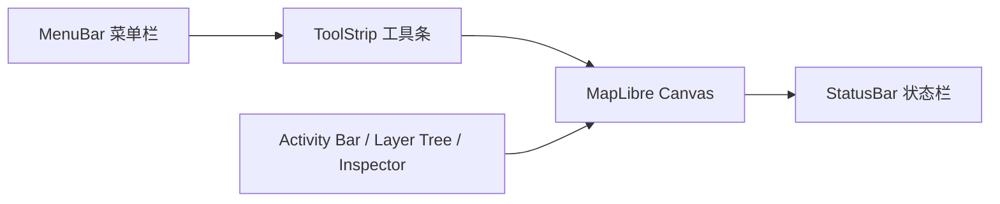
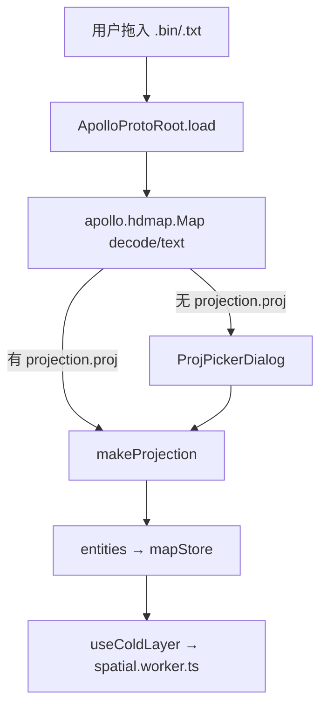

# 快速开始 / Getting Started

> Apollo Map Studio 是一个面向 Apollo 高精地图（HD Map）的桌面级 Web 编辑器，可在浏览器或 Electron 桌面壳中运行。它把 MapLibre GL 渲染、XState 状态机、Zustand 数据中心、proj4 投影换算、protobufjs 编解码组合成一个能解析、编辑、导出 `apollo.hdmap.Map` proto 的工程化工作站。

## 概览 / Overview

本页面回答四个问题：

1. **能做什么？** —— 编辑车道（Lane）、路口（Junction）、PNC 路口、车位（ParkingSpace）、人行横道（Crosswalk）、信号灯（Signal）、停车标志（StopSign）、让行标志（YieldSign）、减速带（SpeedBump）、禁停区（ClearArea）、道闸（BarrierGate）、区域（Area）等 Apollo 元素，并通过 `protobufjs` 直接以 `.bin` / `.txt` 形式无损往返。
2. **从哪里开始？** —— `pnpm dev` 启动 Web 模式，或 `pnpm electron:dev` 启动桌面模式。
3. **第一份地图怎么导入？** —— Drag-drop、菜单 `File → Import Apollo Map…`、命令面板（`⌘K → Import Apollo Map…`），三条路径触达同一管道。
4. **改完怎么导出？** —— `⌘S` 输出二进制 `.bin`，`⇧⌘S` 输出可读 `.txt`（`google.protobuf.TextFormat`）。

::: tip 推荐顺序

1. 阅读本页 → [安装与运行](./installation.md)；
2. 跟随 [导入概览](./import.md) 把 Apollo 自带的 Sunnyvale 示例导入；
3. 进入 [坐标系与投影](./coordinate-system.md) 理解地图为什么会跑偏几百米；
4. 然后进入 [绘制工具](./drawing-tools.md) 与 [车道绘制](./drawing-lanes.md)。
   :::

## 系统能力速览 / Capability Snapshot

| 模块 / Module      | 能力 / Capability                                                                              | 关键文件 / Key file                                           |
| ------------------ | ---------------------------------------------------------------------------------------------- | ------------------------------------------------------------- |
| 渲染 / Render      | MapLibre GL 5.x，cold/hot 双图层                                                               | `src/components/map/MapCanvas.tsx`                            |
| 状态机 / FSM       | XState 5，drawPolyline / drawBezier / drawArc / drawRotatedRect / drawPolygon / drawCatmullRom | `src/core/fsm/editorMachine.ts`                               |
| 数据中心 / Store   | Zustand + zundo 撤销/重做（`partialize: { entities }`）                                        | `src/store/mapStore.ts`                                       |
| 投影 / Projection  | proj4，Apollo `+lat_0={37.4}` 模板自动 sanitize，UTM 1–60 + 自定义 PROJ.4                      | `src/io/proto/projection.ts`                                  |
| Proto / Codec      | protobufjs，`apollo.hdmap.Map`，`.bin` + 文本格式                                              | `src/io/proto/loader.ts`                                      |
| 工具栏 / ToolStrip | 注册表驱动（Action Registry），元素 → 工具二级联动                                             | `src/components/layout/ToolStrip.tsx`、`src/core/elements.ts` |
| 图层树 / LayerTree | react-arborist 拖拽，校验 `canReparent`                                                        | `src/components/layout/panels/LayerTree.tsx`                  |

## 操作步骤 / Steps

### 1. 启动开发服务器 / Boot the dev server

```bash
pnpm install               # 安装依赖
pnpm dev                   # 浏览器模式，默认 http://127.0.0.1:5173
# 或者
pnpm electron:dev          # 桌面 Electron + Vite HMR
```

`package.json:9-22` 列出全部脚本，包含 `electron:start`、`package:linux/mac/win`、`docs:dev` 等。

### 2. 打开工作区 / Open the workspace

启动后看到的 Photoshop 风格布局由 `WorkspaceLayout` 装配：



- **顶部 MenuBar / 工具条**：File / Edit / View / Help 菜单 + 元素选择条 + 网格/吸附切换；
- **左侧 Activity Bar**：图层树（LayerTree）、地图大纲（MapOutline）、搜索；
- **中央画布**：MapLibre WebGL 视口；
- **右侧 Inspector**：基于 `react-hook-form` + `zod` 的属性表单；
- **底部 StatusBar**：当前工具、cursorLngLat、缩放级别、snap 状态。

### 3. 导入第一份地图 / Import a sample map



三种入口都走同一管道（详见 [导入](./importing.md)）：

1. **拖拽**：直接把 `.bin` / `.txt` 拖进画布；
2. **菜单**：`File → Import Apollo Map…`（`ACTION_DEFS.importApollo`，`registry/definitions.ts:23-31`）；
3. **命令面板**：`⌘K → Import Apollo Map…`。

### 4. 选元素与画 / Pick element and draw

::: info ToolStrip 二级联动
ToolStrip 的核心是「先选元素，再选工具」。`ElementBar` 列出 12 种 Apollo 元素图标（`src/core/elements.ts:49-158`），点选后才会出现该元素允许的绘制工具集合（`MapElementDef.tools`）。例如选「车道」，只显示「贝塞尔 / 圆弧」；选「车位」，显示「矩形 / 多边形」。
:::

| 元素 / Element     | 默认工具        | 允许工具                     |
| ------------------ | --------------- | ---------------------------- |
| 车道 lane          | drawBezier      | drawBezier, drawArc          |
| 路口 junction      | drawPolygon     | drawPolygon                  |
| PNC 路口           | drawPolygon     | drawPolygon                  |
| 车位 parkingSpace  | drawRotatedRect | drawRotatedRect, drawPolygon |
| 人行横道 crosswalk | drawRotatedRect | drawRotatedRect, drawPolygon |
| 信号灯 signal      | drawBezier      | drawBezier                   |
| 停车标志 stopSign  | drawBezier      | drawBezier                   |
| 减速带 speedBump   | drawBezier      | drawBezier                   |
| 让行标志 yieldSign | drawBezier      | drawBezier                   |
| 禁停区 clearArea   | drawRotatedRect | drawRotatedRect, drawPolygon |
| 道闸 barrierGate   | drawBezier      | drawBezier                   |
| 区域 area          | drawPolygon     | drawPolygon                  |

### 5. 编辑与撤销 / Edit and undo

- 单击实体 → 进入 `selected` 态；拖拽顶点/控制点 → `editingPoint` 态；
- `⌘Z` / `⇧⌘Z` 调用 zundo 的 `temporal.undo()` / `temporal.redo()`；
- **R1 关键点**：撤销前调度器先发 `CANCEL` 给 FSM，避免 mid-draw 时 `drawPoints` 与 `mapStore.entities` 不一致（见 `src/hooks/useActionDispatcher.ts:76-82`）。

### 6. 导出 / Export

- `⌘S` → `exportApolloBin`，二进制 `.bin`；
- `⇧⌘S` → `exportApolloText`，`google.protobuf.TextFormat`；
- 两者都通过 `entityOps.compileApolloMap` 把 `mapStore.entities` 重新装回 `apollo.hdmap.Map`，再交给 protobufjs 编码。

## 选项与参数表 / Options Table

| 选项 / Option    | 默认 / Default | 位置 / Where  | 说明 / Notes                                                    |
| ---------------- | -------------- | ------------- | --------------------------------------------------------------- |
| 网格 Grid        | off            | View / 工具条 | `toggleGrid` action，快捷键 `⌘G`                                |
| 吸附 Snap        | on             | View / 工具条 | `toggleSnap` action，半径常量 `SNAP_RADIUS_PX`                  |
| 默认模式 Pan     | on             | 工具条最左    | `defaultMode` action，快捷键 `H`，等价 ESC 撤销绘制并切换到平移 |
| 连接车道 Connect | off            | 工具条        | `connectLanes` action，快捷键 `C`                               |
| 历史步数         | 100            | Settings      | `settingsStore.historyLimit`（zundo limit）                     |
| 车道半宽         | 1.5 m          | Settings      | `settingsStore.laneHalfWidth`，决定 lane 边界生成时的偏移       |
| 命令面板         | `⌘K`           | 全局          | `commandPalette` action（不出现在面板自身列表内）               |

## 键盘鼠标速查表 / Shortcut Cheatsheet

| 操作 / Action            | 快捷键 / Key       | FSM 转换                            |
| ------------------------ | ------------------ | ----------------------------------- |
| 平移地图                 | 鼠标拖拽 / `H`     | `idle → idle`                       |
| 旋转/俯仰                | 右键拖拽 / Ctrl+拖 | maplibre 原生                       |
| 双击落点（折线/多边形）  | 双击               | `drawPolyline / drawPolygon → idle` |
| 三次点击 commit（弧/矩） | 单击 ×3            | `drawArc / drawRotatedRect → idle`  |
| 取消绘制                 | `Esc`              | `* → idle`，触发 `CANCEL`           |
| 撤销 / 重做              | `⌘Z` / `⇧⌘Z`       | dispatcher CANCEL → temporal.undo() |
| 命令面板                 | `⌘K`               | 模态                                |
| 删除选中                 | `Delete`           | `selected → idle` + remove          |
| 切换网格                 | `⌘G`               | `uiStore.gridEnabled`               |
| 切换吸附                 | （无默认快捷键）   | `uiStore.snapEnabled`               |

## 常见问题 / Troubleshooting

### Q1. 启动后地图是灰色的，没看到任何元素

- 90% 概率是没导入数据。先 `File → Import Apollo Map…` 选一个 `.bin`；
- 如果导入了仍然空白，打开 DevTools 看 `[ApolloProto] decode failed: ...` 之类报错；
- 如果 cold layer 一直空，检查 `spatial.worker.ts` 是否被浏览器的 HMR 热替换搞挂——刷新一次。

### Q2. 投影对话框反复弹出

只有 `header.projection.proj` 缺失时才弹（见 `src/io/proto/projection.ts` + `src/components/dialogs/ProjPickerDialog.tsx`）。点 OK 之后系统会把选定的 PROJ 字符串写回 header；如果再次导入同一文件却又弹出，说明导出时没把 header 写回——见 [导入深入](./importing.md#header-保留)。

### Q3. `⌘Z` 把整张图都吞掉了

zundo 的 `partialize` 只跟踪 `entities`。如果你刚导入完一份 5 万要素的地图，第一次 `⌘Z` 会把它全部回滚到空。这是符合 `mapStore` 设计的；想保留就不要在导入完立刻按撤销。

### Q4. 桌面壳启动报 `electron .` 找不到 `dist-electron/main.cjs`

`pnpm electron:dev` 会先 `wait-on tcp:127.0.0.1:5173` 再 `pnpm build:electron`（详见 `package.json:16`）。直接 `electron .` 必须先跑 `pnpm build:desktop`。

## 相关源码 / Source links

- 启动脚本：`package.json:9-22`
- 元素定义：`src/core/elements.ts:49-158`
- ToolStrip：`src/components/layout/ToolStrip.tsx`
- 动作注册：`src/core/actions/registry/definitions.ts`
- FSM：`src/core/fsm/editorMachine.ts`
- 投影 picker：`src/components/dialogs/ProjPickerDialog.tsx`
- proto loader：`src/io/proto/loader.ts`

## 相关文档 / See also

- [安装与运行](./installation.md)
- [导入概览](./import.md)
- [坐标系与投影](./coordinate-system.md)
- [绘制工具](./drawing-tools.md)
- [图层树](./layer-tree.md)
