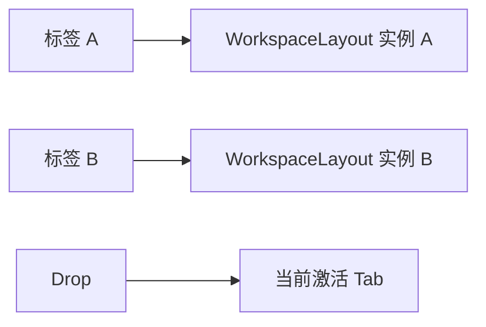
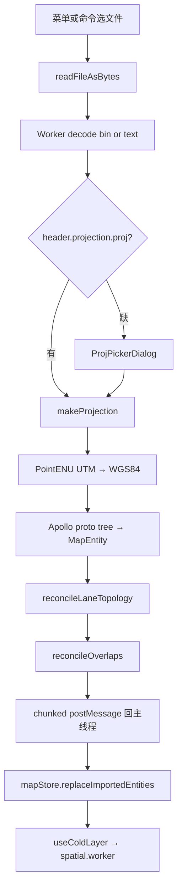

# 导入概览 / Import Overview

::: tip 本页和 [导入深入](./importing.md) 的差别
本页讲「**怎么把文件送进编辑器**」（入口、UI、状态栏、进度浮层），关注用户视角；[导入深入](./importing.md) 讲「**送进去之后管线里发生了什么**」（解码、投影、桥接、拓扑/overlap 重算、Header 保留）。两页可以分别阅读。
:::

## 概览 / Overview

Apollo Map Studio 当前导入入口收敛到菜单/命令触发的 `pickAndImportApollo()`：`src/hooks/useActionDispatcher.ts` 执行 action，`src/io/mapIO.ts` 打开文件选择器并把字节交给 `src/io/apolloIOBridge.ts`，最后由 `src/io/apolloIO.worker.ts` 做 protobuf 解码、坐标投影、实体桥接、拓扑重算、overlap 重算，再把结果分块送回主线程并替换 `mapStore.entities`。

支持格式：

- `.bin` —— Apollo `apollo.hdmap.Map` 二进制 protobuf
- `.txt` —— Apollo TextFormat
- `.pb.txt` —— Apollo TextFormat 的另一种命名

::: warning 不要导入 `routing_map.bin` / `sim_map.bin`
本工程目标是 Apollo HD Map 本身。`routing_map` 和 `sim_map` 的 proto schema 不同，protobufjs 解码会失败或得到无意义的字段。
:::

## 操作步骤 / Steps

### 入口 1：菜单

```
File → Import Apollo Map…
```

对应 action：`importApollo`，定义在 `src/core/actions/registry/definitions.ts:23-31`。menu 字段 `'File'`、menuOrder `1`，无键绑定（避免与 Save 等冲突）。

### 入口 2：命令面板

```
⌘K → 输入 "Import"
```

`importApollo.inCommandPalette = true`（registry 同上），所以会出现在 cmdk 列表中。

### 拖拽导入状态

当前源码没有 `MapCanvas` 的 HTML5 `drop` handler，也没有公开的 `mapIO.importFile(file)` API。把 `.bin` / `.txt` 拖到画布导入仍是 roadmap；现在请使用菜单或命令面板。

### 标签页 / Tab 导入（多文档）



每个 Dockview tab 会绑定一个工作区。当前实现是「单 mapStore，多 tab 共享」；导入会替换当前 store——这是后续路线图中的多文档场景，目前以单文档为主。

## 流水线 / Pipeline



每一步对应一个进度阶段，会在大于 1 秒时浮出 `taskProgressStore` 进度浮层（典型 detail：`Decoding protobuf` / `Waiting for projection` / `Projecting coordinates` / `Building editable entities` / `Recomputing topology and overlaps` / `Sending entities` / `Applying result`）。

## 选项与参数表 / Options Table

| 项目             | 值 / 取值范围                                 | 说明                                                       |
| ---------------- | --------------------------------------------- | ---------------------------------------------------------- |
| 接受扩展名       | `.bin`, `.txt`, `.pb.txt`                     | 由文件选择器 accept 限定                                   |
| 替换语义         | 替换全部 entities，并清空撤销历史             | `mapStore.replaceImportedEntities()`                       |
| 投影 fallback    | UTM Region preset / UTM zone / Custom PROJ.4  | 见 `ProjPickerDialog.tsx:1-231`                            |
| 进度浮层最低延迟 | 1000 ms                                       | 任务超过该阈值才显示，避免「刷一闪」                       |
| 大图分块发送     | 默认每块 ~5000 entities                       | 在 worker 里分批 postMessage，避免一次 clone boundary 卡顿 |
| Header 保留      | `header.projection.proj` 写回 mapStore.header | 详见 [导入深入](./importing.md#header-保留)                |
| 错误日志         | `apolloMapStore.lastError` + 控制台 `[mapIO]` | UI 会在 StatusBar 显示 `Import failed: <reason>`           |

## 键盘鼠标速查表 / Shortcut Cheatsheet

| 操作                | 快捷键                 | 说明             |
| ------------------- | ---------------------- | ---------------- |
| 触发导入            | `⌘K → Import`          | 命令面板         |
| 拖拽导入            | 暂不支持               | roadmap          |
| 打开 / 关闭 Outline | 左侧 Activity Bar 点击 | 用来核对导入结果 |
| 取消进度            | 进度浮层右上 ✕         | 撤销整次导入     |

## Apollo 类型恢复表 / Restoration Table

| Apollo 类型     | 编辑器实体     | 导入后的编辑能力                              |
| --------------- | -------------- | --------------------------------------------- |
| `lane`          | `lane`         | 选中、拖拽中心线、属性编辑、拓扑/overlap 重算 |
| `road`          | `road`         | LayerTree 中显示 sections，可拖拽 lane 归属   |
| `junction`      | `junction`     | 拖拽多边形顶点；lane.junctionId 派生          |
| `pnc_junction`  | `pncJunction`  | 多边形 + Inspector passage group/passage      |
| `parking_space` | `parkingSpace` | `_sourceRect` 矩形源；Inspector heading       |
| `crosswalk`     | `crosswalk`    | 多边形/矩形源；与 lane 重叠重算               |
| `signal`        | `signal`       | stopLines；Inspector 类型/子信号/signInfo     |
| `stop_sign`     | `stopSign`     | stopLines；Inspector 类型                     |
| `speed_bump`    | `speedBump`    | position lines；与 lane overlap               |
| `yield_sign`    | `yieldSign`    | stopLines                                     |
| `clear_area`    | `clearArea`    | 多边形/矩形源                                 |
| `area`          | `area`         | 多边形 + type/name                            |
| `barrier_gate`  | `barrierGate`  | stopLines + type                              |
| `rsu`           | `rsu`          | LayerTree 中拖入/移出 junction                |
| `overlap`       | `overlap`      | 由几何 reconcile 重新生成派生 ID              |
| `speed_control` | `speedControl` | 类型保留在 union 中，若源图存在则保留         |

## 常见问题 / Troubleshooting

### Q1. 进度浮层卡在 `Decoding protobuf`

90% 的情况是文件不是 Apollo HD Map（例如混入了 routing_map）。打开 DevTools 看 `[apolloIO.worker] decode failed: <type> ...`。

### Q2. 弹了投影对话框，我点 Cancel 了，结果地图空白

取消会让 worker 直接走「无投影」分支并放弃导入。重新走一次菜单或拖拽即可重弹。

### Q3. 导入完成但 `Unparented Lanes` 计数很高

source 文件可能没有完整的 RoadSection/Junction 归属。Outline `Health` 会高亮黄色（`MapOutline.tsx:135-145`）。

### Q4. 一份很大的图导入很慢

Worker 已经做了分块 postMessage，但 protobufjs 在主流程也会阻塞 worker 线程。可以观察进度浮层 detail：如果长时间停在 `Building editable entities`，说明 entities 数量级太大；考虑切片导入或预先精简源图。

### Q5. 导入后立即 `⌘Z`，整张图没了

zundo 把导入也算一次快照（实际是「entities 清空 + 替换」）。先做一次小编辑再尝试撤销。

## 相关源码 / Source links

- 入口：`src/io/mapIO.ts`
- Worker：`src/io/apolloIO.worker.ts`
- proto loader：`src/io/proto/loader.ts`
- 投影：`src/io/proto/projection.ts`
- 投影 picker：`src/components/dialogs/ProjPickerDialog.tsx`
- 进度浮层：`src/store/taskProgressStore.ts`
- 大纲健康检查：`src/components/layout/panels/MapOutline.tsx`

## 相关文档 / See also

- [导入深入](./importing.md)
- [坐标系与投影](./coordinate-system.md)
- [图层树](./layer-tree.md)
- [拓扑](./topology.md)
- [拓扑与路口](./topology-and-junctions.md)
