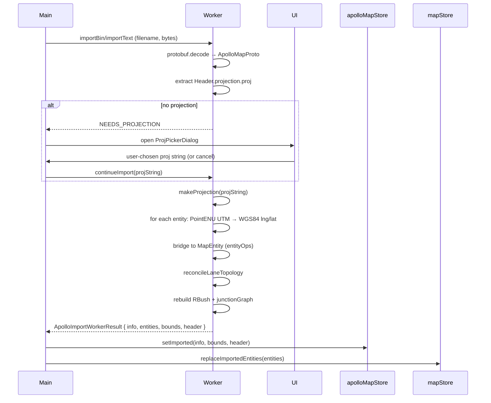

# Importing

Importing reads an Apollo `.bin` (binary protobuf) or `.txt` (text
protobuf) file, projects coordinates from UTM meters to WGS84 lng/lat,
populates `mapStore.entities`, and reports progress for long-running
imports. This page covers the full pipeline.

## Source map

| Concern              | File                                                                               |
| -------------------- | ---------------------------------------------------------------------------------- |
| Top-level entry      | `pickAndImportApollo` in `src/io/mapIO.ts:54`                                      |
| File picker          | `pickFile` in `src/io/fileIO.ts:8`                                                 |
| Worker bridge        | `src/io/apolloIOBridge.ts`                                                         |
| Worker               | `src/io/apolloIO.worker.ts`                                                        |
| Worker protocol      | `src/io/apolloIOProtocol.ts`                                                       |
| Apollo proto runtime | `src/io/proto/`                                                                    |
| Projection resolver  | `src/io/proto/projection.ts`                                                       |
| Map metadata store   | `src/store/apolloMapStore.ts`                                                      |
| Progress overlay     | `src/components/layout/TaskProgressOverlay.tsx` + `src/store/taskProgressStore.ts` |

## Triggering an import

| Path                        | Effect                                                  |
| --------------------------- | ------------------------------------------------------- |
| `File → Import Apollo Map…` | Opens the file picker.                                  |
| `⌘K` → "Import"             | Same.                                                   |
| Drag a file onto the canvas | _Not implemented yet._ Drop targets are on the roadmap. |

## File picker

`pickFile()` in `fileIO.ts` creates a hidden `<input type="file">`,
triggers a click, and resolves with the chosen `File` or `null`.

Accepts:

- `.bin` (binary protobuf)
- `.txt`, `.pb.txt` (text protobuf)
- `application/octet-stream`, `text/plain` (catch-all MIME types)

::: warning macOS focus race
On macOS the window can re-gain focus before the `change` event commits
the file. The picker uses **only** the native `change` and `cancel`
events — no focus-based cancel inference — to avoid this race
(`fileIO.ts:32-34`).
:::

## Routing by extension

```ts
const isText = /\.(pb\.txt|txt)$/i.test(file.name);
const result = isText ? await importApolloTextFile(file) : await importApolloBinFile(file);
```

The router in `mapIO.ts:60-62` decides binary vs text by filename
suffix, not by MIME type or content sniffing. A `.bin` file with a
`.txt` extension will be parsed as text and fail loudly.

## Worker pipeline

Both branches converge on the worker bridge:



Heavy work happens off the main thread. The browser stays responsive
even on a 10k-lane Apollo map.

## Progress overlay

Imports that take longer than 1 s show a progress overlay
(`TaskProgressOverlay.tsx`). The overlay is **opt-in** — `beginTask` in
`mapIO.ts:21-28` sets `visibleAfterMs: 1000`, so quick imports don't
flash a momentary modal.

The worker reports progress via `ApolloIOProgress`:

```ts
interface ApolloIOProgress {
  label: string; // "Decoding protobuf"
  detail?: string; // "lane 234/1500"
  progress: number; // 0 to 1
}
```

Phases the worker reports:

| Phase                  | What it does                                      |
| ---------------------- | ------------------------------------------------- |
| Decoding protobuf      | `protobuf.Reader → ApolloMapProto`                |
| Resolving projection   | Header parse + (optional) picker round-trip       |
| Projecting coordinates | UTM → WGS84 for every PointENU                    |
| Bridging entities      | Apollo proto entities → `MapEntity` via entityOps |
| Reconciling topology   | `reconcileLaneTopology` over all lanes            |
| Building spatial index | RBush insert + junction graph                     |

## Projection inference

If the imported map's `Header.projection.proj` is set, it's used
directly. If not, the worker pauses and sends `NEEDS_PROJECTION`; the
main thread opens the [Projection picker dialog](/guide/coordinate-system#projection-picker-dialog).

After the user picks (or pastes), the chosen string is sent back to
the worker via `continueImport` and the worker resumes.

::: tip Sanitization is automatic
Apollo template-style braces (`+lat_0={37.4}`) are stripped by
`sanitizeProjString()` (`projection.ts:10`) before proj4 sees the
string. You don't need to clean them yourself.
:::

::: warning Cancel = fallback projection
Pressing Cancel on the picker resolves with `null`. The current
`apolloIOBridge` falls back to `UTM_PRESETS.beijing` so the import
still finishes — but if your map isn't actually in UTM 50N, the
geometry will appear miles away from where it should be. Re-import and
pick the correct projection.
:::

## What ends up in the store

After a successful import:

| Store                                    | What was set                                                                                                 |
| ---------------------------------------- | ------------------------------------------------------------------------------------------------------------ |
| `mapStore.entities`                      | Replaced with the imported entities (drawing primitives are dropped — Apollo proto knows nothing about them) |
| `apolloMapStore.info`                    | `{ filename, projString, counts: { lane, road, …}, ... }`                                                    |
| `apolloMapStore.bounds`                  | Geographic bounding box of the imported map                                                                  |
| `apolloMapStore.header`                  | The full `Header` proto (read-only)                                                                          |
| `useUIStore.cursorLngLat`, `currentZoom` | Untouched — viewport stays where you left it                                                                 |

The status bar lights up with the apollo info indicator (filename, lane
count, road count, full PROJ string on hover).

::: tip Camera doesn't auto-fit
The viewport doesn't auto-fit the imported bounds. If you imported a
map far from your current viewport, you'll see empty space until you
pan or zoom. To jump to the map: hover the apollo info indicator in
the status bar to see the bounds, then manually pan.
:::

## Drop targets

Currently no drop-target wiring on the canvas or any panel. The roadmap
has a "drop a `.bin` anywhere" feature for the desktop build. For now,
use the file picker.

## Common import issues

::: warning "Import failed: invalid wire type"
You picked a `.txt` file but the extension is `.bin`, or vice versa.
Rename the file to match its content and re-pick.
:::

::: warning "Failed to parse PROJ.4 string"
The Apollo header's projection string contains characters proj4 can't
handle. Try the picker (re-import and cancel projection inference) and
paste a clean string. If the original file's header is corrupt, a
sanitizer fix may be needed in `projection.ts:10`.
:::

::: warning Import succeeds but lanes appear at wrong location
Wrong projection chosen during import. The geometry is in lng/lat but
you projected from the wrong UTM zone, so the result is offset. Re-import
with the correct projection.
:::

::: warning Imports of the same file produce different ids
Apollo lane IDs are preserved on import. If you re-import the same
file, ids should match (modulo any IDs added in the previous editing
session, which are dropped on re-import). If you see drift, file an
issue with the source file.
:::

## Large-map performance

| Map size    | Import time (typical) | Progress overlay shows?  |
| ----------- | --------------------- | ------------------------ |
| < 100 lanes | < 100 ms              | No (under 1 s threshold) |
| 1k lanes    | 0.5–1 s               | Sometimes                |
| 5k lanes    | 3–5 s                 | Yes                      |
| 10k+ lanes  | 8–15 s                | Yes                      |

The dominant cost is the per-coordinate proj4 transform; protobuf
decoding is fast. Topology reconcile and spatial index building are
O(N) over lanes, ~5 ms per 1k lanes each.

## After import

Common next steps:

1. **Confirm projection** — hover the status bar's apollo info indicator
   to see the resolved PROJ string. Compare to your fleet's expected
   projection.
2. **Check health** — Activity bar → Explorer panel. Look for
   `Unparented Lanes` or `Dangling junction_id` warnings.
3. **Save the projection** — settings has no "remember last
   projection" toggle, but the imported map's PROJ travels with the
   round-trip via the header. As long as you re-import after exporting,
   the projection follows.

## Where to next

- [Exporting](/guide/export) — round-trip back to Apollo proto.
- [Coordinate system](/guide/coordinate-system) — projection picker
  details.
- [Architecture / IO pipeline](/architecture/worker-protocol) — worker
  protocol and the full bridging pipeline.
- Projection mismatches and large-map issues are covered above; re-import
  with the correct projection when geometry appears in the wrong region.
