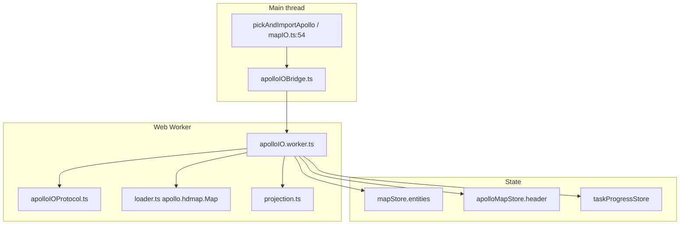
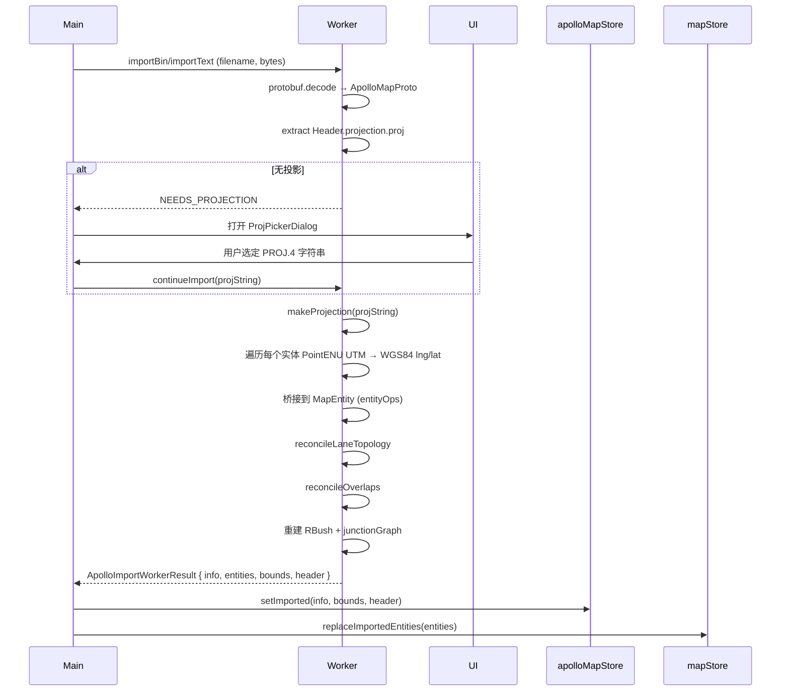

# 导入深入 / Importing Deep Dive

::: tip 与 [导入概览](./import.md) 的差别
[导入概览](./import.md) 关注「**怎么把文件送进编辑器**」（入口、UI、状态栏）；本页关注「**送进去之后管线里发生了什么**」——解码、投影、桥接、拓扑重算、Header 保留。
:::

## 概览 / Overview



关键文件一览：

| 关注点           | 文件                                                                               |
| ---------------- | ---------------------------------------------------------------------------------- |
| 顶层入口         | `pickAndImportApollo` 于 `src/io/mapIO.ts:54`                                      |
| 文件选择器       | `pickFile` 于 `src/io/fileIO.ts:8`                                                 |
| Worker bridge    | `src/io/apolloIOBridge.ts`                                                         |
| Worker           | `src/io/apolloIO.worker.ts`                                                        |
| Worker 协议      | `src/io/apolloIOProtocol.ts`                                                       |
| proto 运行时     | `src/io/proto/loader.ts`                                                           |
| 投影             | `src/io/proto/projection.ts`                                                       |
| Map 元数据 store | `src/store/apolloMapStore.ts`                                                      |
| 进度浮层         | `src/components/layout/TaskProgressOverlay.tsx` + `src/store/taskProgressStore.ts` |

## 操作步骤 / Steps

### 1. 触发导入 / Trigger

| 路径                        | 行为                                          |
| --------------------------- | --------------------------------------------- |
| `File → Import Apollo Map…` | 系统文件选择器                                |
| `⌘K → "Import"`             | 命令面板                                      |
| 拖文件到画布                | 暂未实现；当前没有 `MapCanvas` `drop` handler |

### 2. 文件选择器 / File picker

`pickFile()` 在 `fileIO.ts` 中创建一个隐藏 `<input type="file">`，触发 click，再用 `change` / `cancel` 事件 resolve。

接受类型：

- `.bin`（二进制 protobuf）
- `.txt`, `.pb.txt`（文本 protobuf）
- `application/octet-stream`, `text/plain`（兜底 MIME）

::: warning macOS focus 竞态
macOS 上窗口可能在 `change` 事件提交前重新获得焦点。picker **只**使用原生 `change` / `cancel`，**不**通过 focus 推断取消，否则会出现「选了文件却被识别为取消」（详见 `fileIO.ts:32-34`）。
:::

### 3. 按扩展名分流 / Routing by extension

```ts
const isText = /\.(pb\.txt|txt)$/i.test(file.name);
const result = isText ? await importApolloTextFile(file) : await importApolloBinFile(file);
```

路由器（`mapIO.ts:60-62`）只看文件名后缀，不嗅探内容；`.bin` 用 `.txt` 扩展名会被当文本解析并大声失败。

### 4. Worker 管线 / Worker pipeline



### 5. 投影解析 / Projection

调用 `makeProjection(projString)`（`src/io/proto/projection.ts:30-45`）：

- `sanitizeProjString` 把 Apollo 模板形态 `+lat_0={37.413082}` 还原成 `+lat_0=37.413082`；
- 内部建立两个 proj4 转换器：`source → WGS84` 与 `WGS84 → source`；
- 编辑器内部统一存 lon/lat（度），导出再用 `fromLonLat` 转回 source CRS（米）。

如果 header 没有 `projection.proj`：


`ProjPickerDialog` 提供三种 fallback：

| 模式          | 输入                           | 适用                            |
| ------------- | ------------------------------ | ------------------------------- |
| Region preset | Sunnyvale / 北京 / 上海 / 深圳 | Apollo 官方 demo 与中国主流车队 |
| UTM zone      | 1–60 + N/S 半球                | 知道地图区域但没有完整 PROJ     |
| Custom PROJ   | 自定义 PROJ.4 字符串           | 非 UTM、TMERC、自定义参考椭球等 |

### 6. Header 保留 / Header retention

`apolloMapStore.setImported(info, bounds, header)` 保存原始 header 字段：

```ts
interface MapHeader {
  version?: string;
  date?: string;
  projection?: MapProjection; // 即 PROJ.4 字符串容器
  district?: string;
  generation?: string;
  revMajor?: string;
  revMinor?: string;
  left?: number;
  top?: number;
  right?: number;
  bottom?: number;
  vendor?: string;
}
```

导出时（`pickAndExportApollo`），新生成的 `apollo.hdmap.Map` 会把 header 与 reconcile 后的 entities 合并：

- `projection.proj` 来自当时选定的 PROJ；
- `left/top/right/bottom` 由当前 entities bounds 重算，覆盖 import 值；
- `version/date/district/...` 透传，不主动修改；
- 未识别字段透传（protobufjs 在 keepCase 模式下保留未知字段）。

::: info 多次导入同一文件
导入时如果 header.projection 已经写过，再次导入会直接走 `makeProjection` 而不弹对话框。
:::

### 7. 拓扑与 overlap 重算 / Topology + overlap re-derivation

- `reconcileLaneTopology(entities)`：从 lane 与 junction 几何重算 predecessorIds、successorIds、selfReverseLaneIds、四类 neighbor 与 junctionId；
- `reconcileOverlaps(entities)`：基于几何 RBush 计算成对重叠，按 `overlap_<sortedIds>` 形态生成 derived overlap，并同步参与实体的 `overlapIds`。

详见 [拓扑](./topology.md) 与 [拓扑与路口](./topology-and-junctions.md)。

## 选项与参数表 / Options Table

| 选项               | 默认                      | 备注                               |
| ------------------ | ------------------------- | ---------------------------------- |
| 文件扩展接受       | `.bin`, `.txt`, `.pb.txt` | `pickFile.accept`                  |
| 投影 sanitization  | 自动                      | 去除 Apollo 模板大括号             |
| 进度浮层最小阈值   | 1000 ms                   | `taskProgressStore.MIN_VISIBLE_MS` |
| Worker 实体分块    | ~5000 / chunk             | 减小一次结构化克隆体积             |
| 替换语义           | 全量替换 + 清空 zundo     | `mapStore.replaceImportedEntities` |
| Header.bounds 重写 | 是                        | 导出时按当前 entities 重算         |

## 键盘鼠标速查表 / Shortcut Cheatsheet

| 操作           | 快捷键 / Where | 备注                       |
| -------------- | -------------- | -------------------------- |
| 触发导入       | `⌘K → Import`  | 命令面板                   |
| 拖拽导入       | 暂不支持       | roadmap                    |
| 取消选择       | 文件选择器 ESC | macOS 不依赖 focus 推断    |
| 投影对话框确认 | `Enter`        | 等价 "Use this projection" |
| 投影对话框关闭 | `Esc`          | 等价 Cancel                |
| 取消进度       | 浮层右上 ✕     | 调 worker.terminate()      |

## 常见问题 / Troubleshooting

### Q1. 进度浮层在 `Decoding protobuf` 永远不结束

文件不是 `apollo.hdmap.Map`。protobufjs 报 `invalid wire type X at offset Y` 之类。控制台同时会有 `[apolloIO.worker] decode failed`。

### Q2. 弹了 ProjPickerDialog，我点了 ESC

worker 收到 NEEDS_PROJECTION 后挂起，main 在 ESC 时回 `cancel`，worker 直接退出导入。下次导入需重新选投影。

### Q3. 导入后地图位置偏移几百米

UTM 区号选错了。`utmZoneFromLon` 假定每 6° 经度一个 zone（`projection.ts:60-66`）。例如把上海地图当成北京，会偏移整整一个 zone（约 700 km）。

### Q4. 导出后再导入，又弹投影对话框

导出器没有把 `header.projection.proj` 写回。检查 `apolloMapStore.header` 是否被覆盖（应当只有 `bounds` 被重写）。

### Q5. 导入完成但 lane 中心线全部消失

通常是 lane 的 `centralCurve.segments[].lineSegment.points` 在 source 中为空，proto 解码出来为 `[]`。protobuf 的 `repeated` 字段缺省即空数组——这是合规的。检查源图的 lane 几何是否完整。

### Q6. 第二次导入比第一次慢

第一次 `loadApolloProtoRoot` 会把 `import.meta.glob('/src/proto/**/*.proto', { query: '?raw', eager: true })` 的所有 .proto 一次性 raw-load 到内存（`loader.ts:18-22`），后续命中 cache。如果你看到第二次更慢，可能是 mapStore 被多次清空导致 cold layer 反复重建。

## 相关源码 / Source links

- `src/io/mapIO.ts:54-...` — `pickAndImportApollo`
- `src/io/fileIO.ts:8-..` — `pickFile`
- `src/io/apolloIOBridge.ts` — main↔worker
- `src/io/apolloIO.worker.ts` — pipeline
- `src/io/proto/loader.ts:18-50` — proto root + glob
- `src/io/proto/projection.ts:1-81` — sanitize / makeProjection / utmProjString
- `src/components/dialogs/ProjPickerDialog.tsx:1-231`
- `src/store/apolloMapStore.ts` — header & bounds
- `src/store/taskProgressStore.ts`

## 相关文档 / See also

- [导入概览](./import.md)
- [坐标系与投影](./coordinate-system.md)
- [拓扑](./topology.md)
- [拓扑与路口](./topology-and-junctions.md)
