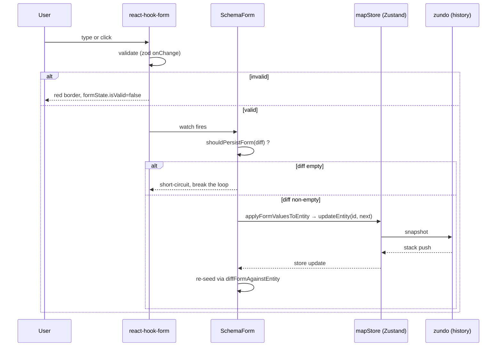

# Inspector 属性面板 / Inspector

> Inspector 是 AMS 右侧停靠的**属性编辑面板**。它是高精地图标注流程的“最后一公里”——所有几何上看不见、但对仿真至关重要的字段（`type` / `turn` / `direction` / `speedLimit` / `boundaryType` / `predecessorIds` / …）都在这里写入。

本页覆盖 14 类实体共用的 Inspector 框架、`SchemaForm` 自动生成机制、四种特例表单 (Lane / Overlap / PNCJunction / Drawing)、`_userOverrides` 防覆盖语义、以及与 `mapStore` 的数据回写循环。

## 概览 / Overview

::: tip TL;DR
**选中一个实体 → 右侧出现属性面板 → 改字段 → 立即生效。**
没有“保存”按钮：表单 `onChange` 即落盘。`Ctrl+Z` 可撤销。
:::

| 维度     | 说明                                                                                                          |
| -------- | ------------------------------------------------------------------------------------------------------------- |
| 触发方式 | 在地图或 Layer Tree 中点选实体                                                                                |
| 数据流   | `mapStore.entities` → `formValuesFromEntity` → `react-hook-form` → `applyFormValuesToEntity` → `updateEntity` |
| 校验     | `zod` schema (`@/lib/schemas`) + `mode: 'onChange'`                                                           |
| 撤销栈   | 通过 `mapStore.entities` 的 `zundo.partialize`，每次成功提交都进栈                                            |
| 字段“锁” | 用户改过的字段会写入 `_userOverrides`，几何变化触发的自动派生（derive）不再覆盖                               |

## 界面导览 / UI Tour

```
┌──────────────────────────────────────────┐
│  Inspector                               │  ← 标题栏（来自 lazyPanels.tsx:87）
├──────────────────────────────────────────┤
│  Lane              ...AbCd123XyZ         │  ← entityType + 短 ID
├──────────────────────────────────────────┤
│  ▾ Attributes                            │  ← Section 标题
│    Type            [CITY_DRIVING ▼]      │
│    Turn            [LEFT_TURN ▼]         │
│    Direction       [FORWARD ▼]           │
│    Speed Limit     [16.6   ] m/s         │
│    Speed Limit     [60     ] km/h        │
│    ID              lane_AbCd123XyZ       │  ← read-only Value
│  ▾ Boundaries                            │
│    Left Width      [1.75 ] m             │
│    Right Width     [1.75 ] m             │
│    L Boundary      [SOLID_WHITE ▼]       │
│    R Boundary      [DOTTED_WHITE ▼]      │
│    Length          12.43 m               │  ← read-only
│    L Virtual       No                    │
│    R Virtual       No                    │
│  ▾ Topology                              │
│    Junction        junc_…                │  ← LaneRef，可点跳转
│    Predecessors    [lane_…] [lane_…]     │  ← LaneRefList
│    Successors      —                     │
│    L Neighbors fwd —                     │
│    Overlaps        [overlap_…]           │
└──────────────────────────────────────────┘
```

## 调度与挂载 / Mounting

Inspector 由 `WorkspaceLayout/lazyPanels.tsx:79-112` 中的 `InspectorPanelContent` 渲染：

```ts
const selectedId = useSelector(actorRef, (s) => s.context.selectedEntityId);
const entity = useMapStore((s) => (selectedId ? s.entities.get(selectedId) : undefined));
```

- **未选中**：显示 “Select an entity to view properties”。
- **选中**：根据 `entity.entityType` 路由到 `EntityForm`（`InspectorForms.tsx:46-79`），调度规则如下表。

### 实体 → 表单调度表

| `entityType`                                                  | 渲染组件           | 文件位置                          | 表单类别            |
| ------------------------------------------------------------- | ------------------ | --------------------------------- | ------------------- |
| `lane`                                                        | `LaneForm`         | `InspectorForms/lane.tsx`         | Schema-driven       |
| `junction`                                                    | `JunctionForm`     | `InspectorForms/junction.tsx`     | Simple              |
| `parkingSpace`                                                | `ParkingSpaceForm` | `InspectorForms/parkingSpace.tsx` | Simple              |
| `signal`                                                      | `SignalForm`       | `InspectorForms/signal.tsx`       | Simple              |
| `stopSign`                                                    | `StopSignForm`     | `InspectorForms/stopSign.tsx`     | Simple              |
| `road`                                                        | `RoadForm`         | `InspectorForms/road.tsx`         | Simple              |
| `pncJunction`                                                 | `PNCJunctionForm`  | `InspectorForms/pncJunction.tsx`  | Custom（嵌套数组）  |
| `overlap`                                                     | `OverlapForm`      | `InspectorForms/overlap.tsx`      | Custom（pin/unpin） |
| `area` / `barrierGate`                                        | 各自的 `*Form`     | `InspectorForms/<entity>.tsx`     | Simple              |
| `crosswalk` / `speedBump` / `yieldSign` / `clearArea` / `rsu` | 各自的 `*Form`     | `InspectorForms/readOnly.tsx`     | Read-only           |
| 其它（绘制中临时 entity）                                     | `DrawingForm`      | `InspectorForms/DrawingForm.tsx`  | 绘制态 fallback     |

## Schema-driven 表单 (Lane 为例)

::: tip 设计意图
旧版每种 entity 一份 JSX 表单，14 类共有 14 份重复代码。R5 重构后，**所有字段（除嵌套数组）改为数据驱动**：定义一份 `EntitySchema`，`SchemaForm.tsx` 自动渲染。Lane 是首个迁移的样本，参见 `src/types/inspectorSchema.ts:263`。
:::

### Schema 数据结构

`EntitySchema<TEntity, TFormValues>` 由四块组成（`inspectorSchema.ts:154-171`）：

```ts
interface EntitySchema<TEntity, TFormValues> {
  id: string;
  fields: ReadonlyArray<AnyFieldDef>; // 可编辑
  readonly: ReadonlyArray<ReadOnlyDef>; // 只读
  validation: ZodType<TFormValues>; // Zod 校验
  sectionOrder: ReadonlyArray<string>; // section 渲染顺序
}
```

### Lane 字段全表

下表全部字段来自 `LaneInspectorSchema` (`inspectorSchema.ts:263-435`)。

| Field name                    | 类型     | Section    | 校验范围             | 适配器 (read / write)                     | 说明                                    |
| ----------------------------- | -------- | ---------- | -------------------- | ----------------------------------------- | --------------------------------------- |
| `type`                        | enum     | Attributes | `LaneType` 枚举      | `e.type` ↔ `{ ...e, type: v }`            | 车道类别                                |
| `turn`                        | enum     | Attributes | `LaneTurn` 枚举      | 同上                                      | 转弯类型                                |
| `direction`                   | enum     | Attributes | `LaneDirection` 枚举 | 同上                                      | 方向                                    |
| `speedLimit`                  | number   | Attributes | 0..50, step 0.5      | `e.speedLimit ?? 0`                       | 限速 m/s                                |
| `speedLimitKmh`               | number   | Attributes | 0..180, step 1       | `speedLimit * 3.6` ↔ `km/h / 3.6`         | 限速 km/h，可视化输入，存储仍为 m/s     |
| `leftWidth`                   | number   | Boundaries | 0.5..10, step 0.1    | `readLeftWidth` / `writeLeftWidth`        | 左侧半宽，写时**统一**应用到所有 sample |
| `rightWidth`                  | number   | Boundaries | 0.5..10, step 0.1    | `readRightWidth` / `writeRightWidth`      | 右侧半宽                                |
| `leftBoundaryType`            | enum     | Boundaries | `BoundaryLineType`   | `e.leftBoundary.boundaryType[0].types[0]` | 写时折叠为单段 boundaryType             |
| `rightBoundaryType`           | enum     | Boundaries | 同上                 | 同上                                      |                                         |
| `ID` (RO)                     | readonly | Attributes | —                    | `e.id`                                    | 真实 ID                                 |
| `Length` (RO)                 | readonly | Boundaries | —                    | `e.length.toFixed(2)` m                   | 自动派生                                |
| `L/R Virtual` (RO)            | readonly | Boundaries | —                    | `e.leftBoundary.virtual`                  | 虚拟边界标记                            |
| `Junction` (RO)               | readonly | Topology   | —                    | 渲染 `<LaneRef>`                          | 可点跳转                                |
| `Predecessors` / `Successors` | readonly | Topology   | —                    | 渲染 `<LaneRefList>`                      | 拓扑前后继                              |
| `L/R Neighbors (fwd/rev)`     | readonly | Topology   | —                    | `LaneRefList`                             | 邻接车道                                |
| `Self-Reverse`                | readonly | Topology   | —                    | `LaneRefList`                             | 自反车道                                |
| `Overlaps`                    | readonly | Topology   | —                    | `LaneRefList`                             | 关联 overlap                            |

### 提交流程 / Commit Flow



::: warning R1 闭环修复 (regression-guarded)
旧实现在 `watch` 回调里**无差异判断**地写回 store，导致 `store→reset→watch→updateEntity` 死循环并撑爆 zundo 栈。`shouldPersistForm` (`inspectorSchema.ts:484-493`) 是断环器；任何对 `SchemaForm.tsx` 的改动都必须保留 `mode: 'onChange'` + `shouldPersistForm` 调用，对应回归测试位于 `src/components/layout/panels/__tests__/SchemaForm.test.ts` 与 `src/hooks/__tests__/undoCancel.test.ts`。
:::

### `_userOverrides` 字段锁

当用户在 Inspector 修改一个字段时，`applyFormValuesToEntity` (`inspectorSchema.ts:507-540`) 会把该字段的 `overridesPaths`（默认就是字段名）写入 `entity._userOverrides`。在后续几何编辑触发的派生（如 `core/elements/derive`）会**跳过** `owns` 与 override 集相交的规则——这就是“用户手工值不被自动覆盖”的实现。

| 操作                                      | `_userOverrides` 变化                  |
| ----------------------------------------- | -------------------------------------- |
| 改 `leftWidth` 1.75 → 1.95                | 加入 `'leftWidth'`                     |
| 拖动控制点（自动 derive 重算 length）     | 不影响 `leftWidth`，因为 derive 跳过   |
| 用户重置：把 1.95 改回 1.75（reads 恒等） | 由于 prevValue===newValue，不会再 mark |

## Overlap 表单 (`overlap.tsx`)

`OverlapForm` 不走 schema 流程，因为它的核心字段 `is_merge` 和 `regionOverlaps` 都是**几何派生**，不是简单字段。它提供两类“pin”按钮：

| Pin 类型               | 作用                                    | 写入路径                              |
| ---------------------- | --------------------------------------- | ------------------------------------- |
| Lane × Lane `is_merge` | 钉死某一条 lane 在 overlap 中的合流语义 | `objects.<i>.laneOverlapInfo.isMerge` |
| Region polygon         | 钉死整个 region 多边形与 ID 引用        | `regionOverlaps`                      |

钉住后，`core/elements/overlap/reconcile.ts` 在下次几何编辑时不会重算这些值。点击 “pinned ×” 即解锁。

## PNCJunction 表单 (`pncJunction.tsx`)

PNCJunction 是 Apollo 自动驾驶规划用的 **passage groups** —— 一棵 `Group → Passage → (Lane/Signal/StopSign/YieldSign)` 三层数组。`PNCJunctionForm` 提供：

- “+ Passage Group” 创建新组（`makeBlankPassage` + `nextSubId`）
- 每个 Passage 的 `type` 三选 (`UNKNOWN_PASSAGE` / `ENTRANCE` / `EXIT`)
- `IdMultiSelect` 控件用于添加/移除关联 ID。

::: tip 关联 ID 的合法性
`IdMultiSelect` 通过 `collectIdsByType(entities, 'lane' | 'signal' | 'stopSign' | 'yieldSign')` 实时枚举可选 ID，避免脏引用——任何**不存在**的 ID 都不会出现在下拉中。
:::

## DrawingForm（绘制中 fallback）

绘制状态下尚未 commit 的临时实体没有自定义 schema，统一走 `DrawingForm.tsx`：仅显示控制点数量、几何长度、当前 FSM 状态。**不可写**，因为 entity 还没进 `mapStore`。

## 拓扑引用控件 / Lane References

`<LaneRef id={id} />` 与 `<LaneRefList ids={ids} />` 来自 `src/components/layout/panels/LaneRefList.tsx`：

- 渲染短 ID（前 8 末 6）。
- 鼠标悬停显示完整 ID。
- 点击触发 `selectEntity(id)`，跳到该实体并把视口飞到中心。

| 字段                          | 控件          | 行为         |
| ----------------------------- | ------------- | ------------ |
| `junctionId` (string \| null) | `LaneRef`     | 单点跳转     |
| `predecessorIds` 等列表       | `LaneRefList` | 多 chip 跳转 |
| `overlapIds`                  | `LaneRefList` | 同上         |

## 校验规则 / Validation

校验全部走 zod (`@/lib/schemas`)。`SchemaForm.tsx:69` 显式选用 `mode: 'onChange'`：每次按键都会重新校验，并通过 `formState.isValid` 暴露状态。失败时：

- 输入框边框变红 (Tailwind `border-rose-500`)。
- `shouldPersistForm` 仍可返回 true，但 `applyFormValuesToEntity` 不会被调用——因为 `react-hook-form` 在 invalid 时会丢弃此次 `value`。

| 字段                       | Zod 规则                      | 失败提示               |
| -------------------------- | ----------------------------- | ---------------------- |
| `speedLimit`               | `z.number().min(0).max(50)`   | "Speed must be 0–50"   |
| `leftWidth` / `rightWidth` | `z.number().min(0.5).max(10)` | "Width must be 0.5–10" |
| `type`                     | `z.enum(LANE_TYPES)`          | "Invalid type"         |

## 配置存储位置 / Persistence

Inspector **本身不写 localStorage**。所有变更通过 `mapStore.updateEntity` 写入内存 `Map<id, MapEntity>`，由 zundo 中间件管理；**离线持久化**则由 [Export](./exporting.md) 流程负责。

## 操作步骤 / Steps

1. 在地图或 Layer Tree 中**单击**一个实体。`editorMachine.context.selectedEntityId` 会被更新。
2. 右侧 Inspector 出现对应表单。
3. 修改任意字段：
   - **Number** 输入框：可拖光标修改步进，或键入。
   - **Enum** 下拉：键盘 `↓ ↑` 浏览，`Enter` 选定。
4. 离开当前字段（`blur`）或下一次按键即触发 `watch`。
5. 数据立即同步到 `mapStore` 与 zundo。`Ctrl+Z` 可回退。
6. 对于 PNCJunction / Overlap，使用面板内的 `+ Passage Group` / `pin` 按钮等专用控件。

## 常见问题 / Troubleshooting

| 问题                                  | 可能原因                                  | 处理                                                                                                                                      |
| ------------------------------------- | ----------------------------------------- | ----------------------------------------------------------------------------------------------------------------------------------------- |
| 字段改了又跳回旧值                    | 该字段被 derive 规则覆盖了                | 检查 `_userOverrides` 是否丢失；改完后立即用 Ctrl+Shift+I devtools 看 entity；若仍被覆盖，向 `inspectorSchema.ts` 字段补 `overridesPaths` |
| 红色边框 + 不落盘                     | zod 校验失败                              | 看输入是否越界（速度 > 50, 宽度 > 10 等）                                                                                                 |
| Topology 中 LaneRef 显示 “unknown id” | 引用的实体被删除或导入丢失                | 用 [Search Panel](./activity-bar-and-panels.md#search) 搜 ID；删除空引用见 [Topology](./topology.md)                                      |
| Overlap “pinned ×” 无法解锁           | `_userOverrides` 数组损坏                 | 重新选中并再次点击；如仍不行重启会话                                                                                                      |
| 切换 entity 后旧表单数据闪烁          | id 切换时 `methods.reset` 与 `watch` 竞态 | 该问题已通过 `useEffect([entity.id])` 修复（`SchemaForm.tsx:76-79`），如再现请提 issue                                                    |

## 相关源码 / Source

- `src/components/layout/panels/SchemaForm.tsx:53-136` — 通用 schema-driven 表单
- `src/components/layout/panels/InspectorForms.tsx:46-79` — `EntityForm` 路由
- `src/components/layout/panels/InspectorForms/lane.tsx:32` — Lane 表单（薄壳）
- `src/components/layout/panels/InspectorForms/overlap.tsx:65-157` — Overlap pin 控件
- `src/components/layout/panels/InspectorForms/pncJunction.tsx:151-262` — passage groups
- `src/components/layout/panels/InspectorForms/<entity>.tsx` — 简单实体的手写表单
- `src/components/layout/panels/InspectorForms/readOnly.tsx` — 只读摘要表单
- `src/components/layout/panels/InspectorForms/formSync.ts` — 手写表单同步 hook
- `src/types/inspectorSchema.ts:263-435` — `LaneInspectorSchema`
- `src/types/inspectorSchema.ts:444-540` — `formValuesFromEntity` / `diffFormAgainstEntity` / `shouldPersistForm` / `applyFormValuesToEntity`
- `src/lib/schemas.ts` — zod 校验集合
- `src/components/layout/panels/LaneRefList.tsx` — `LaneRef` / `LaneRefList`

## Section 列表 / Section Glossary

| Section 名            | 出现于                     | 含义                                                  |
| --------------------- | -------------------------- | ----------------------------------------------------- |
| Attributes            | 所有                       | 标量字段（type / turn / direction / speedLimit / id） |
| Boundaries            | lane                       | 半宽 + 边界类型 + 长度                                |
| Topology              | lane                       | 拓扑引用 (pred/succ/邻接/junction/overlap)            |
| Geometry              | junction / parkingSpace 等 | 控制点 / 多边形顶点                                   |
| Passage Groups        | pncJunction                | passage 嵌套树                                        |
| Overlap               | overlap                    | 自身 ID + 个数统计                                    |
| Participants          | overlap                    | objects[] 列表                                        |
| Lane × Lane Semantics | overlap                    | is_merge 切换                                         |
| Region Overlaps       | overlap                    | region polygon pin                                    |

## Schema vs Custom 对比 / Schema vs Custom

| 表单类型                       | 适用         | 优点             | 缺点                          |
| ------------------------------ | ------------ | ---------------- | ----------------------------- |
| SchemaForm (Lane / 待迁移其它) | 标量字段为主 | 数据驱动、零 JSX | 难以处理嵌套数组 / 自定义控件 |
| Custom (Overlap / PNCJunction) | 非平凡控件   | 灵活             | 重复样板代码                  |
| Simple (Junction / Signal 等)  | 极少字段     | 快上手           | 字段一多就要迁 SchemaForm     |
| Drawing fallback               | 绘制中       | 显示而已         | 不可写                        |

## 与 react-hook-form 的契约 / RHF Contract

| 设置            | 值                                     | 必须保留？           |
| --------------- | -------------------------------------- | -------------------- |
| `mode`          | `'onChange'`                           | ✅ 必须；R1 回归依赖 |
| `defaultValues` | `formValuesFromEntity(schema, entity)` | ✅                   |
| `resolver`      | `zodResolverZ4(schema.validation)`     | ✅                   |
| `keepDirty` etc | 默认                                   | 可改                 |

## 相关文档 / See also

- [Map Elements](./map-elements.md) — 14 类实体的字段语义
- [Layer Tree](./layer-tree.md) — 通过 Layer Tree 选中实体
- [Topology](./topology.md) — `predecessorIds` / `successorIds` 的拓扑含义
- [Editing & Snapping](./editing-and-snapping.md) — 几何拖拽时 derive 与 override 的交互
- [Settings](./settings.md) — `historyLimit` 影响撤销栈深度
- [Drawing Lanes](./drawing-lanes.md) — 绘制中字段 default 来自哪里
