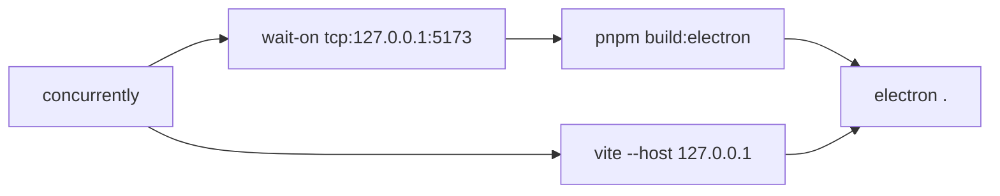

# 安装与运行 / Installation

::: tip 适用读者
本页给开发者与首次试用者：拿到源码、把开发服务器跑起来、把桌面壳打包成 `.AppImage` / `.dmg` / `.exe`。如果你只想下载已打包二进制，跳到 [发行版下载](#发行版下载--release-downloads)。
:::

## 概览 / Overview

Apollo Map Studio 是一个 React 19 + TypeScript + Vite 8 的工程，桌面端套 Electron 41 壳。所有依赖通过 **pnpm** 管理（`package.json:95-100` 把 `electron` / `electron-winstaller` 列进 `onlyBuiltDependencies`）。CI 在 `.github/workflows/ci.yml` 跑 typecheck / lint / format / test / bench 五连击；本地通过 `husky` + `lint-staged` 在提交时跑 `eslint --fix` 与 `prettier --write`。

### 软件栈版本

| 依赖 / Package   | 版本（package.json） | 说明                                           |
| ---------------- | -------------------- | ---------------------------------------------- |
| Node.js          | ≥ 20.x（LTS 推荐）   | Vite 8 / Electron 41 的底线                    |
| pnpm             | ≥ 9.x                | `package.json` 用 `pnpm.onlyBuiltDependencies` |
| TypeScript       | `^6.0.2`             | tsconfig.json + tsconfig.electron.json         |
| Vite             | `^8.0.7`             | dev / build / preview                          |
| Electron         | `^41.5.0`            | 桌面壳                                         |
| electron-builder | `^26.8.1`            | 打包 dmg/AppImage/exe                          |
| MapLibre GL      | `^5.22.0`            | WebGL 渲染                                     |
| Zustand / zundo  | `^5.0.12` / `^2.3.0` | 数据中心 + 撤销                                |
| XState           | `^5.30.0`            | 编辑 FSM                                       |
| protobufjs       | `^8.0.3`             | Apollo proto codec                             |
| proj4            | `^2.20.8`            | UTM ↔ WGS84                                    |

## 操作步骤 / Steps

### 1. 克隆与安装

```bash
git clone <repo-url>
cd apollo-map-studio
pnpm install
```

::: warning Apple Silicon 注意
macOS arm64 拉 `electron` 可能要走代理。可以临时设置 `ELECTRON_MIRROR=https://npmmirror.com/mirrors/electron/`。
:::

### 2. Web 模式

```bash
pnpm dev
```

`vite` 默认监听 `127.0.0.1:5173`（与 `electron:dev` 用同一端口）。HMR 由 `@vitejs/plugin-react` 提供。

### 3. 桌面 / Electron 模式

```bash
pnpm electron:dev
```

`package.json:16` 的脚本逻辑：



- `vite` 提供前端资源；
- `wait-on` 等到 5173 就绪；
- `tsc -p tsconfig.electron.json` 编译主进程到 `dist-electron/`；
- `cross-env ELECTRON_RENDERER_URL=http://127.0.0.1:5173 electron .` 启动桌面壳，主进程加载远端 dev URL。

### 4. 离线启动 / 不带 HMR

```bash
pnpm electron:start    # = pnpm build:desktop && electron .
```

适合在 CI 或离线机器上跑生产构建。

### 5. 打包

```bash
pnpm package           # 只打 --dir，便于本地排错
pnpm package:linux     # AppImage / deb
pnpm package:mac       # dmg（x64 + arm64 双架构）
pnpm package:win       # nsis exe
```

`electron-builder` 配置在仓库根 `electron-builder.yml`（如有）或 `package.json` 的 `build` 字段中（按版本而定）。CI 流水线 `.github/workflows/desktop.yml` 在打 tag 时自动跑三平台。

### 6. 文档站

```bash
pnpm docs:dev          # http://localhost:5173/apollo-map-studio/
pnpm docs:build
pnpm docs:preview
```

VitePress 配置在 `docs/.vitepress/config.ts`。

## 选项与参数表 / Options Table

| 命令 / Script         | 调用                                                     | 用途                                    |
| --------------------- | -------------------------------------------------------- | --------------------------------------- |
| `pnpm dev`            | `vite`                                                   | 浏览器开发，端口 5173                   |
| `pnpm build`          | `vite build`                                             | 输出 `dist/`                            |
| `pnpm preview`        | `vite preview`                                           | 本地预览生产构建                        |
| `pnpm build:electron` | `tsc -p tsconfig.electron.json`                          | 编译 main / preload 到 `dist-electron/` |
| `pnpm build:desktop`  | `pnpm build:web && pnpm build:electron`                  | Web + Electron 全量构建                 |
| `pnpm electron:dev`   | concurrently vite + electron                             | 桌面 HMR                                |
| `pnpm electron:start` | build:desktop + electron .                               | 离线/生产                               |
| `pnpm package`        | `electron-builder --dir --publish never`                 | 不签名、不打包发行                      |
| `pnpm package:linux`  | `electron-builder --linux --x64`                         | AppImage / deb / rpm                    |
| `pnpm package:mac`    | `electron-builder --mac --x64 --arm64`                   | dmg                                     |
| `pnpm package:win`    | `electron-builder --win --x64`                           | nsis exe                                |
| `pnpm typecheck`      | `tsc --noEmit && tsc -p tsconfig.electron.json --noEmit` | 双 tsconfig 校验                        |
| `pnpm lint`           | `eslint .`                                               | flat config，react-hooks 严格           |
| `pnpm test`           | `vitest run`                                             | 单元 / 集成                             |
| `pnpm bench`          | `vitest bench --run`                                     | 性能基线                                |

## 键盘鼠标速查表 / Shortcut Cheatsheet

安装阶段不涉及画布快捷键，但首次启动后建议熟悉：

| 操作          | 快捷键                 | 说明                 |
| ------------- | ---------------------- | -------------------- |
| 命令面板      | `⌘K`                   | 索引全部 action 入口 |
| 设置          | `⌘,`                   | 打开 Settings 弹窗   |
| 重启 Electron | DevTools 中 `Ctrl+R`   | 主进程仍存活         |
| 打开 DevTools | `⌘⌥I` / `Ctrl+Shift+I` | 调试渲染进程         |

## 常见问题 / Troubleshooting

### Q1. `pnpm install` 卡在 `electron` 下载

切镜像：

```bash
ELECTRON_MIRROR=https://npmmirror.com/mirrors/electron/ pnpm install
```

### Q2. `electron:dev` 报 `Failed to load URL http://127.0.0.1:5173/`

`wait-on` 默认 30s 超时。如果机器很慢，把脚本改成 `wait-on -t 120000 tcp:127.0.0.1:5173`。

### Q3. macOS 启动报 “未签名开发者”

打开 `系统设置 → 隐私与安全性`，点击「仍然打开」。要彻底解决需要 `electron-builder.yml` 配置 codeSign。

### Q4. Windows 上 `electron-builder` 找不到 `wine`

仅在跨平台从 macOS/Linux 打 win 包时需要 `wine` 或 `wine64`。原生在 Windows 打则无需。

### Q5. `pnpm test` 报 `import.meta.glob is not a function`

确认 `vitest` 版本 `^4.1.4`，`@vitejs/plugin-react` `^6.0.1`。proto loader 用了 `import.meta.glob('/src/proto/**/*.proto', { query: '?raw', eager: true })`（`src/io/proto/loader.ts:18-22`），低版本 vitest 的 vite 集成不支持 `query`。

## 发行版下载 / Release downloads

打过 tag 之后，CI 会上传到 GitHub Releases：

- `Apollo-Map-Studio-<version>-linux.AppImage`
- `Apollo-Map-Studio-<version>.dmg`
- `Apollo-Map-Studio-<version>-Setup.exe`

签名策略见 `.github/workflows/desktop.yml`。

## 相关源码 / Source links

- `package.json:9-33` — scripts
- `package.json:95-100` — `pnpm.onlyBuiltDependencies`
- `tsconfig.electron.json` — Electron 主进程编译目标
- `.github/workflows/ci.yml` — typecheck / lint / format / test / bench
- `.github/workflows/desktop.yml` — 跨平台打包

## 相关文档 / See also

- [快速开始](./getting-started.md)
- [设置](./settings.md)
- [License 激活](./license-activation.md)
