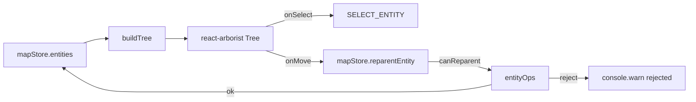

# 图层树 / Layer Tree

> 图层树（Activity Bar → Layers）把整张地图的实体表达成一棵可拖拽的树。它是导航大图、把 lane 重新归属到 road 或 junction、以及种下「空 road / 空 RSU」的主要入口。

## 概览 / Overview



数据来源是 `useMapStore.entities`；`buildTree(entities)`（`src/components/layout/panels/LayerTree/treeBuilder.ts:7-126`）一次性把扁平的 `Map<id, MapEntity>` 拼装成一棵：

```
Roads
├── road_xxx
│   ├── Section sec_1
│   │   ├── lane_aaa
│   │   └── lane_bbb
│   └── Section sec_2
├── ...
Junctions
├── junction_yyy
│   ├── lane_ccc        (lane.junctionId === junction_yyy)
│   ├── road_zzz        (road.junctionId === junction_yyy)
│   └── rsu_kkk         (rsu.junctionId === junction_yyy)
Lanes (unparented)
PNC Junctions
Parking Spaces
Crosswalks
Signals
Stop Signs
Yield Signs
Speed Bumps
Clear Areas
Barrier Gates
Areas
RSUs (unparented)
Overlaps
```

`TOP_LEVEL_ORDER`（`LayerTree/constants.ts`）固定分组顺序。

## 节点种类 / Node kinds

```ts
// LayerTree/types.ts
type TreeNode = {
  id: string;
  name: string;
  kind: 'group' | 'section' | 'entity';
  entityType?: string;
  entityId?: string;
  children?: TreeNode[];
  dropKind: 'none' | 'road' | 'junction' | 'roadSection' | 'unparented';
  parentTarget?: ParentTarget;
};
```

- `group`：顶层分组节点（Lanes / Junctions / ...）
- `section`：road 的 section 子节点（`Section sec_1`）
- `entity`：单个实体节点

## 操作步骤 / Steps

### 1. 选中跳转

单击树节点 → `handleSelect` → `onSelect(entityId)` → `SELECT_ENTITY`。地图随之高亮 + Inspector 切到该 entity 的表单。

### 2. 拖拽改归属 / Reparent

`react-arborist` 的 `onMove` 触发 `handleMove`。允许性由 `canReparent(child, target, entities)` 校验（`src/lib/entityOps.ts`）：

| child  | 合法 parentTarget                                                                              |
| ------ | ---------------------------------------------------------------------------------------------- |
| `lane` | `{ kind: 'roadSection', roadId, sectionId }` / `{ kind: 'junction', id }` / `{ kind: 'none' }` |
| `road` | `{ kind: 'junction', id }` / `{ kind: 'none' }`                                                |
| `rsu`  | `{ kind: 'junction', id }` / `{ kind: 'none' }`                                                |
| 其他   | 不允许拖动                                                                                     |

被拒时 console 打印 `[LayerTree] reparent rejected: <reason>`。

### 3. 种空实体 / Seed entity

LayerTree 的「+」按钮（`createRoad`、`createRSU`，见 `LayerTree.tsx:25-48`）：

- 新 road：`{ id: nextEntityId('road'), entityType: 'road', sections: [{ id: nextSubId('section'), laneIds: [] }], junctionId: null, type: 'CITY_ROAD' }`
- 新 RSU：`{ id: nextEntityId('rsu'), entityType: 'rsu', junctionId: null, overlapIds: [] }`

ID 生成器 `nextEntityId / nextSubId / SUB_PREFIX` 在 `src/lib/idGenerator.ts`，确保唯一。

### 4. 删除 / 重命名

- 删除：选中树节点 → `Delete` → `DELETE_ENTITY` → `mapStore.removeEntity(id)`
- 重命名：当前不支持改 ID（ID 一旦定下就被其他实体引用，重命名会破坏拓扑）。需要换 ID 应当先克隆再删除。

## 选项与参数表 / Options Table

| 元素                  | 字段                                     |
| --------------------- | ---------------------------------------- |
| `road`                | `id`, `sections[]`, `junctionId`, `type` |
| `road.section`        | `id`, `laneIds[]`, `boundary?`           |
| `lane.junctionId`     | 指向 `junction`                          |
| `rsu.junctionId`      | 指向 `junction`                          |
| `road.junctionId`     | 指向 `junction`                          |
| `lane._userOverrides` | reconcile 跳过路径                       |
| `entity.id`           | `nextEntityId(type, entities)` 防冲突    |

## 键盘鼠标速查表 / Shortcut Cheatsheet

| 操作            | 鼠标 / 快捷键        | 说明                   |
| --------------- | -------------------- | ---------------------- |
| 选中实体        | 左键单击             | 同步 Map + Inspector   |
| 多选（roadmap） | Shift / Ctrl + click | 暂未启用               |
| 拖拽改归属      | 左键拖到目标节点     | `canReparent` 校验     |
| 创建 road       | 工具栏 `+` `Road`    | `createRoad`           |
| 创建 RSU        | 工具栏 `+` `RSU`     | `createRSU`            |
| 折叠/展开       | 节点左侧三角         | react-arborist 内置    |
| 删除            | 选中 + `Delete`      | `DELETE_ENTITY` action |

## 常见问题 / Troubleshooting

### Q1. 拖一条 lane 到 junction 节点，没生效

`canReparent` 返回 false 时拖放被取消。打开 console 看 `[LayerTree] reparent rejected: ...`，原因可能是 lane 几何端点不在该 junction polygon 内。

### Q2. 找不到「Overlaps」分组

只有 `reconcileOverlaps` 产出过 overlap 实体时才显示。空地图或没相交实体时无此组。

### Q3. road.junctionId 改了，但树没刷新

`buildTree` 由 `useMemo` 跟随 `entities` 变化。如果不刷新，可能是 mapStore 没触发 store update（应通过 `mapStore.updateEntity` 而非直接修改 entity 对象）。

### Q4. road.section 中的 lane 顺序怎么定？

按 `RoadSection.laneIds` 数组顺序。拖拽暂只支持改归属，不支持组内重排（roadmap）。

### Q5. 拖一条 road 到 junction 后，原来的 lanes 跟着进 junction 吗？

不会。lane.junctionId 是几何派生的（PIP），不会因为 road 归属变化而改变。手动让 lane 进 junction 需要把 lane 端点拖进 polygon。

## 相关源码 / Source links

- 入口：`src/components/layout/panels/LayerTree.tsx:1-100`
- 树构建：`src/components/layout/panels/LayerTree/treeBuilder.ts`
- 节点渲染：`src/components/layout/panels/LayerTree/Node.tsx`
- 类型：`src/components/layout/panels/LayerTree/types.ts`
- 常量：`src/components/layout/panels/LayerTree/constants.ts`
- canReparent：`src/lib/entityOps.ts`（搜 `canReparent`）
- ID 生成：`src/lib/idGenerator.ts`
- Outline 健康：`src/components/layout/panels/MapOutline.tsx`

## 相关文档 / See also

- [地图元素](./map-elements.md)
- [拓扑](./topology.md)
- [拓扑与路口](./topology-and-junctions.md)
- [车道绘制](./drawing-lanes.md)
