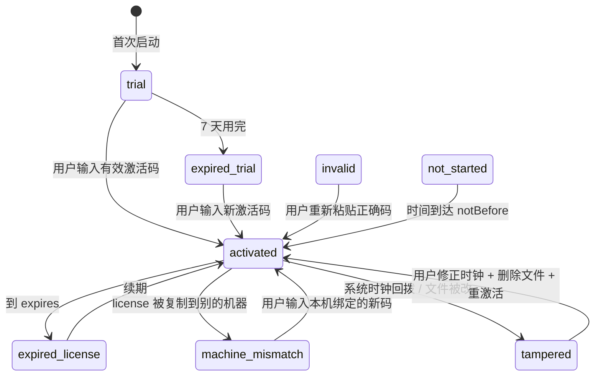
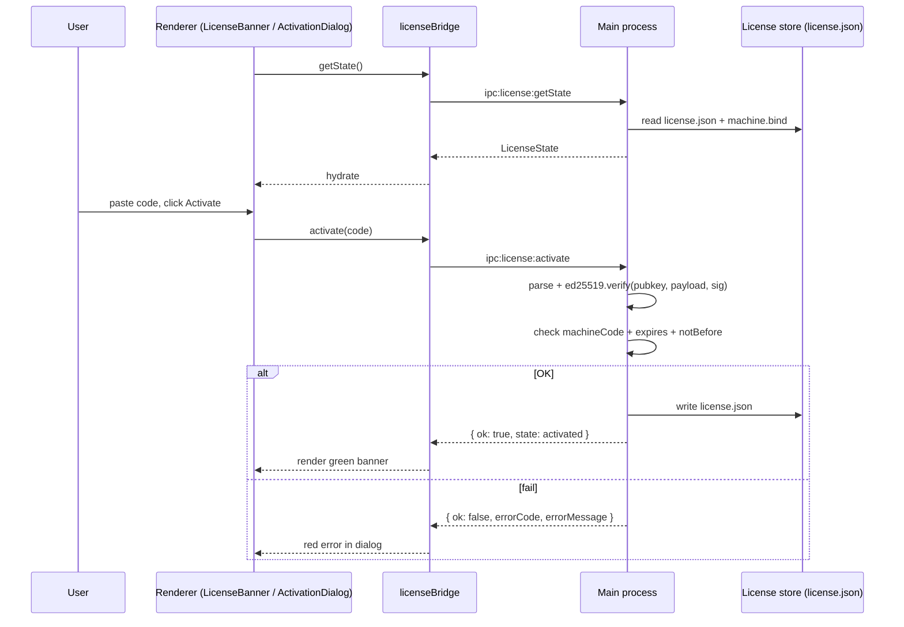

# 许可证激活 / License Activation

> AMS 桌面端 (Electron) 内置一套**离线激活**机制：本机生成机器码 → 你把机器码发给厂商 → 厂商返回一段绑定本机的激活码 → 桌面端做 Ed25519 验签并落盘。整个过程**无需联网**。

::: info 仅限 Desktop / Desktop only
浏览器预览版（`pnpm dev`）会跳过激活，永远显示 `trial`，且 `canEdit=true`。生产桌面包才会真正强制激活——这是为了让前端贡献者依然可以本地开发。详见 `src/lib/license-bridge.ts:62-75`。
:::

## 概览 / Overview

| 维度     | 说明                                                                                     |
| -------- | ---------------------------------------------------------------------------------------- |
| 安全模型 | Ed25519 公钥校验 + 机器绑定 + 重放检测 + 系统时钟反作弊                                  |
| 数据走向 | Renderer 通过 `licenseBridge` 与主进程 IPC；主进程持久化 `license.json` + `machine.bind` |
| UI 入口  | `LicenseBanner` 顶部条；点 “Activate” / “Manage license” 弹出 `ActivationDialog`         |
| 试用期   | 7 天                                                                                     |
| 状态种类 | 8 种 (`LicenseStatus`)                                                                   |
| 离线性   | 全离线                                                                                   |
| 加密格式 | `APMS1.<base64url(payload)>.<base64url(signature)>`                                      |

## 状态机 / Status Machine

`LicenseStatus` 共 8 种 (`license-bridge.ts:11-19`)：

| Status             | 中文含义   | `canEdit` | Banner 颜色                | 触发条件                          |
| ------------------ | ---------- | --------- | -------------------------- | --------------------------------- |
| `trial`            | 试用中     | ✅        | 青色（短于 3 天才显示）    | 首次启动、无任何激活信息          |
| `activated`        | 已激活     | ✅        | 绿色（剩余 ≤ 14 天才显示） | 验签通过 + 在有效期内             |
| `expired_trial`    | 试用过期   | ❌        | 琥珀色                     | trial 7 天用完且未激活            |
| `expired_license`  | 许可证过期 | ❌        | 琥珀色                     | 激活码合法但已过期                |
| `tampered`         | 检测到篡改 | ❌        | 红色                       | 系统时钟回拨、license.json 被改   |
| `machine_mismatch` | 机器不匹配 | ❌        | 红色                       | 把别人机器上的 license 拷贝过来   |
| `invalid`          | 验签失败   | ❌        | 红色                       | 激活码格式正确但 Ed25519 签名错误 |
| `not_started`      | 待启动     | ❌        | 灰色                       | 激活码 `notBefore` 还未到         |

### 状态转换



## 界面导览 / UI Tour

### LicenseBanner（顶部条）

`src/components/license/LicenseBanner.tsx:106-129` 渲染。展示规则：

```
┌─────────────────────────────────────────────────────────────┐
│ 🛡 Licensed · 13d remaining            [🔑 Manage license] │   activated（≤14天）
│ ⏱ Trial: 5d remaining                  [🔑 Activate]       │   trial（≤3天）
│ ⚠ License expired — read-only mode...   [🔑 Activate]       │   expired_*
│ ⚠ Tampering detected — read-only mode...[🔑 Activate]       │   tampered
└─────────────────────────────────────────────────────────────┘
```

试用剩余 > 3 天、激活后剩余 > 14 天 → **不显示 banner**（避免干扰）。

### ActivationDialog（激活对话框）

`src/components/license/ActivationDialog.tsx:103-213`：

```
┌──────────────────────────────────────────────────────────────────┐
│ Apollo Map Studio License        status: trial · 5d trial left   │
├──────────────────────────────────────────────────────────────────┤
│ THIS MACHINE'S CODE                                              │
│  M-AB12-CD34-EF56-GH78-IJ90      [📋 Copy]                       │
│  Send this code to your license vendor. They will reply with     │
│  an activation code that is valid only on this machine.          │
│                                                                  │
│ PASTE ACTIVATION CODE                                            │
│  ┌────────────────────────────────────────────────────────────┐  │
│  │ APMS1.eyJ2IjoxLCJsaWMiOiIuLi4ifQ.…                         │  │
│  │                                                            │  │
│  └────────────────────────────────────────────────────────────┘  │
├──────────────────────────────────────────────────────────────────┤
│                                       [Close]   [Activate]       │
└──────────────────────────────────────────────────────────────────┘
```

## 操作步骤 / Steps

### 首次激活

1. 启动桌面端，顶部出现青色 banner：`Trial: 7d remaining`。
2. 点 `Activate`（或在试用期内的任意时刻自行打开）。
3. 弹出 ActivationDialog；点 `Copy` 复制机器码。
4. 把机器码（形如 `M-XXXX-XXXX-...`）发给厂商。
5. 厂商把激活码 (`APMS1.<...>.<...>`) 邮件回复给你。
6. 在 ActivationDialog 中粘贴激活码 → 点 `Activate`。
7. Renderer 把激活码 IPC 发给主进程；主进程做 4 步校验：
   - **格式检查**：必须 `APMS1.<base64>.<base64>`
   - **Ed25519 验签**：用内置公钥
   - **机器绑定**：payload.machineCode === 当前机器码
   - **重放检测**：如果同一 license id 已被吊销则拒绝
8. 校验通过 → `license.json` 落盘 → `LicenseState.status === 'activated'` → banner 变绿。
9. 一切失败都会在 dialog 内红条显示原因 (`errorMessage`)。

### 续期 / 升级

激活已存在时再开 dialog，标题会显示 `status: activated · ...`，并出现一段绿色面板列出当前 license 的 id / name / expires。粘贴新的 token，覆盖旧的。

### 撤销 / 切机

`licenseBridge.deactivate()` 会清掉 `license.json`，下次启动回到 trial。**注意：deactivate 不会续重置剩余 trial 天数**——deactivate 只针对 license 部分。

## 协议 / Activation Code Format

激活码字符串格式（出 `ActivationDialog.tsx:173` 的 placeholder）：

```
APMS1.<base64url(JSON payload)>.<base64url(Ed25519 signature)>
```

JSON payload 字段：

| 字段        | 类型      | 含义                           |
| ----------- | --------- | ------------------------------ |
| `v`         | int       | schema 版本（当前为 1）        |
| `lic`       | string    | license id（厂商发放唯一 ID）  |
| `name`      | string    | 显示名（如 “Lumina Internal”） |
| `machine`   | string    | 绑定的机器码                   |
| `issued`    | int (ms)  | 签发时间                       |
| `expires`   | int (ms)  | 失效时间，0 表示永不过期       |
| `notBefore` | int (ms)? | 提前下发但延迟生效（可选）     |

签名采用 Ed25519，密钥对由厂商持有。renderer 仅持有公钥常量。

## 激活时序 / Sequence



## 配置存储位置 / Persistence

| 文件           | 路径（Linux 举例）                         | 写入方                                 |
| -------------- | ------------------------------------------ | -------------------------------------- |
| `license.json` | `~/.config/apollo-map-studio/license.json` | 主进程 `electron/main/license/storage` |
| `machine.bind` | 同目录                                     | 同                                     |

::: warning 不要手动改 license 文件
任何手动修改都会触发 `tampered` 状态。如需重置，**直接删除文件**而非编辑。
:::

## 防作弊设计 / Anti-tamper

| 机制            | 实现位置                              | 说明                                    |
| --------------- | ------------------------------------- | --------------------------------------- |
| Ed25519 签名    | `electron/main/license/verify.ts`     | 任何字段被改都会让签名失败              |
| Machine binding | 同上 + `machine.bind` 文件            | payload.machine 必须等于本机生成的 hash |
| Replay 检测     | `electron/main/license/replay.ts`     | 同 license id 重复使用 → 拒绝           |
| 系统时钟反作弊  | `electron/main/license/clockGuard.ts` | 上次启动时间 > 当前时间 → 标记 tampered |

::: tip 受控失败模式
即便检测到篡改，应用**不会闪退**——只把 `canEdit` 设为 false，进入只读模式。这样标注员不会丢数据，可以联系厂商解锁。
:::

## 常见问题 / Troubleshooting

| 问题                                         | 原因                                      | 解决                                                                        |
| -------------------------------------------- | ----------------------------------------- | --------------------------------------------------------------------------- |
| Banner 一直是 `trial` 即便我贴了码           | 你在 `pnpm dev` 浏览器版（fallback 状态） | 用 `pnpm dist` 打出的桌面包                                                 |
| `invalid_signature`                          | 你拷错了字符（多空格/换行）               | 重新粘贴；ActivationDialog 的 `setCode(...replace(/\s+/g,''))` 会自动清空白 |
| `machine_mismatch`                           | license 是别的机器的码                    | 联系厂商签发新码                                                            |
| `tampered` 但我没改文件                      | 系统时钟跳过；或挂载的目录不一致          | 同步 NTP；删除 `license.json` 重激活                                        |
| `expired_license`                            | 到 `expires`                              | 联系厂商续期                                                                |
| Manage license 按钮不出现                    | 当前在永久许可（expires=0）剩余 > 14 天   | 这是设计，banner 主动隐藏                                                   |
| 删除 license.json 后 banner 还显示 activated | renderer 缓存旧 state                     | 重启应用                                                                    |

## 相关源码 / Source

- `src/components/license/ActivationDialog.tsx` — UI 对话框
- `src/components/license/LicenseBanner.tsx` — 顶部状态条
- `src/lib/license-bridge.ts` — renderer ↔ main IPC bridge
- `src/store/licenseStore.ts` — Zustand store（mirror main 状态）
- `src/hooks/useLicense.ts` — `useLicenseSync` 注入 `WorkspaceLayout`
- `electron/main/license/` — 主进程验签 + 落盘逻辑
- `electron/preload.cts` — `contextBridge.exposeInMainWorld('apolloMapStudioLicense', ...)`

## LicenseState 字段全表 / LicenseState Glossary

`src/lib/license-bridge.ts:21-32`：

| 字段             | 类型                                    | 含义                                  |
| ---------------- | --------------------------------------- | ------------------------------------- |
| `status`         | `LicenseStatus`                         | 8 种之一                              |
| `canEdit`        | boolean                                 | 是否允许写入（影响 Inspector / 绘制） |
| `machineCode`    | string                                  | `M-XXXX-XXXX-...`                     |
| `trialStart`     | int (ms)                                | 首次启动时间                          |
| `trialEnd`       | int (ms)                                | 试用结束时间                          |
| `daysRemaining`  | int \| null                             | 剩余天数；null 表示永久               |
| `hoursRemaining` | int \| null                             | 剩余小时数（短期更精确）              |
| `license`        | `{ id, name, issued, expires } \| null` | 已激活时的描述                        |
| `checkedAt`      | int (ms)                                | 主进程最后一次校验时间                |
| `reason`         | string                                  | 状态文字，banner 与 dialog title 都用 |

## ActivationResult 字段 / ActivationResult Glossary

`license-bridge.ts:34-46`：

| 字段           | 类型           | 含义                                                                                                               |
| -------------- | -------------- | ------------------------------------------------------------------------------------------------------------------ |
| `ok`           | boolean        | 总成功标记                                                                                                         |
| `state`        | `LicenseState` | 激活后的最新 state                                                                                                 |
| `errorCode`    | union          | `'invalid_format' / 'invalid_signature' / 'machine_mismatch' / 'expired' / 'replay' / 'storage_error' / 'unknown'` |
| `errorMessage` | string         | 用户可见错误，dialog 红条展示                                                                                      |

## 与同类工具对比 / Comparison

| 工具          | 模型                | 是否离线 | 客户端验签 |
| ------------- | ------------------- | -------- | ---------- |
| AMS           | 离线 + Ed25519      | ✅       | ✅         |
| JetBrains IDE | 服务器换 token      | ❌       | 部分       |
| Sublime Text  | 离线 license code   | ✅       | RSA        |
| Adobe CC      | 联网 license server | ❌       | —          |
| 1Password     | 联网 + biometric    | ❌       | —          |

AMS 选离线模型是因为目标场景（车厂内部数据/机密路网）**不允许联网激活**。

## 多机部署 / Fleet Deployment

如果你需要在 50 台标注员机器上批量部署：

1. 各机器分别生成机器码（不能复用别人的）。
2. 厂商使用同一证书签发 50 个独立的 token，每个绑定不同 machineCode。
3. 通过统一渠道（共享盘 / IT 工具）下发激活码。
4. 用户首次启动 → ActivationDialog → 粘贴 → 激活。

::: tip 自动化激活
如需脚本化，主进程暴露了 `apolloMapStudioLicense.activate(code)`。可写一个 init 脚本读 `~/.apollo-map-studio/init-token.txt` 自动激活。该接口未在文档中正式承诺向后兼容；请固定 AMS 版本。
:::

## 相关文档 / See also

- [Getting Started](./getting-started.md) — 启动后第一件事
- [Installation](./installation.md) — 哪些版本支持激活
- [Troubleshooting](./troubleshooting.md) — 通用排错
- [Settings](./settings.md) — 与许可证无关的本地配置
- [Activity Bar & Panels](./activity-bar-and-panels.md) — banner 在 banner 和 menubar 之间的位置
