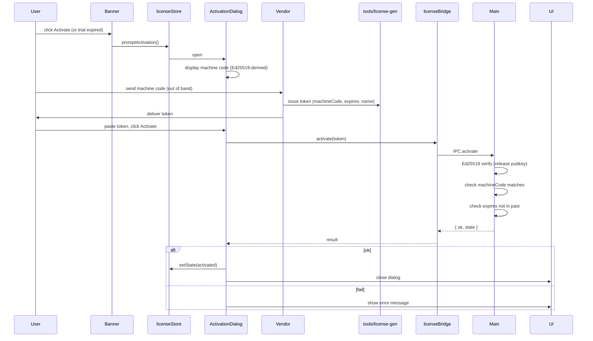

# License activation

::: info Desktop only
The license layer is part of the Electron desktop build. The web build
runs in a permissive "trial" state that never expires and accepts no
activation code. If you're using `pnpm dev` in a browser, this page is
informational only — none of the gating fires.
:::

The desktop build ships with a 7-day trial. After the trial expires,
the editor enters read-only mode until you activate with a license
token bound to your machine. Tokens are issued offline by your vendor;
no internet round-trip is required.

## Source map

| Concern                       | File                                          |
| ----------------------------- | --------------------------------------------- |
| Renderer state store          | `src/store/licenseStore.ts`                   |
| Renderer-side bridge          | `src/lib/license-bridge.ts`                   |
| Banner                        | `src/components/license/LicenseBanner.tsx`    |
| Activation dialog             | `src/components/license/ActivationDialog.tsx` |
| Sync hook                     | `useLicenseSync` in `src/hooks/useLicense.ts` |
| Editable guard                | `src/lib/editable-guard.ts`                   |
| Main-process license verifier | `electron/license/`                           |
| Issuer (vendor side)          | `tools/license-gen/`                          |

## License states

| Status             | `canEdit` | Banner                               | What it means                                        |
| ------------------ | :-------: | ------------------------------------ | ---------------------------------------------------- |
| `trial`            |    yes    | quiet (only when ≤ 3d remaining)     | First 7 days after install                           |
| `activated`        |    yes    | quiet (only when ≤ 14d remaining)    | Valid license token loaded                           |
| `expired_trial`    |    no     | amber, "Trial expired"               | 7 days elapsed without activation                    |
| `expired_license`  |    no     | amber, "License expired"             | License token's `expires` timestamp passed           |
| `tampered`         |    no     | rose, "Tampering detected"           | System clock manipulation or license file corruption |
| `machine_mismatch` |    no     | rose, "Bound to a different machine" | Token's machine code doesn't match this machine      |
| `invalid`          |    no     | rose, "Signature failed"             | Ed25519 verification failed                          |
| `not_started`      |    no     | gray, "Pending"                      | Trial hasn't started yet (rare; clock skew)          |

## Trial mode

On first launch, the main process records `trialStart` and computes
`trialEnd = trialStart + 7 days`. The renderer reads
`useLicenseStore.state.daysRemaining` / `hoursRemaining` and surfaces:

- **More than 3 days remaining**: no banner. Status bar unaffected.
- **3 days or fewer**: cyan banner — "Trial: Nd remaining". Banner
  "Activate" button opens the dialog.
- **24 hours or fewer**: cyan banner with hours — "Trial ends in Nh".
- **0**: trial expired. Banner turns amber, status flips to
  `expired_trial`, `canEdit = false`.

::: tip Trial state survives reinstalls (sort of)
The trial start timestamp is written to `userData/license/`. Removing
that directory restarts the trial. This is intentional — the editor
trusts the local file as the trial record, not a remote server. If
you're a long-term user, just activate.
:::

## Activation flow



### Machine code

A short, fingerprintable identifier derived from stable hardware
properties (typically a hash of MAC address + CPU id + OS user). The
machine code is shown at the top of the activation dialog with a
copy button:

```
This machine's code:  AMS-AB12-CD34-EF56-7890   [Copy]
```

Send this code to your vendor when requesting an activation token.

::: warning Machine code is stable but not universal
The fingerprint is derived from your local hardware. If you swap your
network card or reinstall the OS, the machine code will change and
your existing license will report `machine_mismatch`. Contact your
vendor for a re-issued token.
:::

### Activation token format

Activation tokens look like:

```
APMS1.eyJ2IjoxLCJsaWMiOiIuLi4ifQ.MEUCIQDxxxxxxxx...
       └─ payload ─┘ └─ signature ─┘
```

`APMS1.` prefix is the format version. The payload is a base64-url
JSON object `{ v, lic, ... }` containing:

- `id` — license id (uuid)
- `name` — friendly name (e.g. "Acme Robotaxi Fleet")
- `machineCode` — bound machine code
- `expires` — expiry timestamp (0 = perpetual)
- `issuedAt` — issuance timestamp

The signature is Ed25519 over the payload, signed by the vendor's
release key.

### Activation success

After successful activation:

| State change                         | Effect                                 |
| ------------------------------------ | -------------------------------------- |
| `status` → `activated`               | Editor unlocks                         |
| `canEdit` → `true`                   | All actions allowed                    |
| `license` → token payload            | Banner shows "Licensed · Nd remaining" |
| Token written to `userData/license/` | Persists across reboots                |

## Read-only enforcement

When `canEdit === false`, every editable action checks
`assertEditable()` (`src/lib/editable-guard.ts`):

```ts
function actionRequiresEdit(id: ActionId): boolean {
  if (id === 'connectLanes') return true;
  const def = ACTION_MAP.get(id);
  if (!def) return false;
  return def.category === 'edit' || def.category === 'tool' || def.category === 'selection';
}
```

Categories blocked when read-only:

- `edit` — Undo, Redo, Delete, Connect Lanes
- `tool` — Every drawing tool
- `selection` — Default mode

Categories **allowed** when read-only:

- `file` — Import, Export, Settings (you can still inspect data)
- `view` — Toggle Grid, Toggle Snap, Reset Layout, Command Palette

::: warning Export is allowed in read-only mode
You can still export the current map even when the license is
expired. This is deliberate — losing access to your existing work
when a trial expires would be hostile. Editing is gated; reading is
not.
:::

## Banner behavior

`LicenseBanner.tsx:63-104` decides when and how to show the banner:

| Condition                                   | Banner                                                       |
| ------------------------------------------- | ------------------------------------------------------------ |
| `activated` + perpetual (`expires === 0`)   | hidden                                                       |
| `activated` + > 14 days remaining           | hidden                                                       |
| `activated` + ≤ 14 days                     | quiet "Licensed · Nd remaining" with "Manage license" button |
| `trial` + > 3 days                          | hidden                                                       |
| `trial` + ≤ 3 days                          | cyan "Trial: Nd remaining" + Activate button                 |
| `trial` + ≤ 24 hours                        | cyan "Trial ends in Nh" + Activate button                    |
| `expired_trial` / `expired_license`         | amber + Activate button                                      |
| `tampered` / `machine_mismatch` / `invalid` | rose + Activate button                                       |
| `not_started`                               | gray                                                         |

## Tampered state

The main process flags `tampered` when:

- The system clock moved backward by more than the configured
  threshold (typically days).
- License files in `userData/license/` were modified outside the
  editor (file hashes don't match expected values).
- The token's `issuedAt` is in the future relative to the trial start.

Recovery from tampered:

1. Correct your system clock.
2. Remove any modified license files (the activation dialog warns
   about this).
3. Re-activate with the original token (or request a re-issued one
   from your vendor if the token itself is suspect).

::: warning Tampering doesn't lock you out forever
The tampered state is recoverable. Restoring the clock and
re-activating returns you to `activated`. We don't write any
"poisoned" markers that would prevent future activation.
:::

## Sync model

`useLicenseSync()` in `src/hooks/useLicense.ts`:

```ts
useEffect(() => {
  void hydrate(); // pull initial state from main
  const unsub = licenseBridge.onChange(setState); // subscribe to changes
  const onFocus = () => void hydrate(); // re-poll on window focus
  window.addEventListener('focus', onFocus);
  return () => {
    unsub();
    window.removeEventListener('focus', onFocus);
  };
}, [hydrate, setState]);
```

Three sync paths:

- **On mount**: `hydrate()` reads current state.
- **On main-process events**: `licenseBridge.onChange` subscribes to
  IPC pushes.
- **On window focus**: re-`hydrate()`. Catches the case where the
  user wakes a sleeping laptop — main-process timer ticks may have
  missed.

## Activating offline

The vendor-side issuer (`tools/license-gen/`) is a CLI that runs on the
vendor's offline machine. It signs a token using the vendor's private
key. The renderer never talks to the vendor's server; the entire flow
is:

1. User → vendor (out of band, e.g. email): machine code.
2. Vendor → user (out of band): signed activation token.
3. User → editor (paste): token verified locally with the embedded
   public key.

::: tip Why offline activation
Apollo deployments often run in air-gapped environments — fleet
operations centers, automotive validation labs. Forcing an online
activation server would block those use cases. The Ed25519 public-key
verification is local-only; only the vendor's private key is needed
to issue tokens.
:::

## Where to next

- License troubleshooting: verify machine code, clock, token expiry and
  storage state with the activation dialog and vendor CLI.
- [Architecture / License System](/architecture/license-system) — main
  process verification + IPC details.
- [Getting Started](/guide/getting-started) — build and packaging commands.
