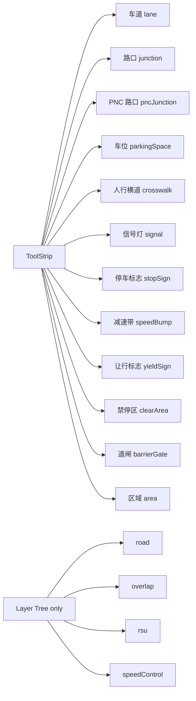

# 地图元素 / Map Elements

> 本页是「元素目录」，覆盖 ToolStrip 中 12 个 Apollo 元素 + 派生 `road` / `overlap`。每节给出几何形态、Apollo proto 字段、默认工具、Inspector 主要字段、相关 Source link。

## 概览 / Overview



| 元素            | 几何                               | 默认工具        | 颜色 (`elements.ts`) |
| --------------- | ---------------------------------- | --------------- | -------------------- |
| lane            | line (centralCurve + 2 boundaries) | drawBezier      | `#4a9eff`            |
| junction        | polygon                            | drawPolygon     | `#ffcc00`            |
| pncJunction     | polygon                            | drawPolygon     | `#ff9933`            |
| parkingSpace    | polygon (rect)                     | drawRotatedRect | `#7c5cbf`            |
| crosswalk       | polygon (rect)                     | drawRotatedRect | `#ffffff`            |
| signal          | line + polygon                     | drawBezier      | `#22cc44`            |
| stopSign        | line                               | drawBezier      | `#ff0000`            |
| speedBump       | line                               | drawBezier      | `#ffaa00`            |
| yieldSign       | line                               | drawBezier      | `#ff6600`            |
| clearArea       | polygon                            | drawRotatedRect | `#ff4466`            |
| barrierGate     | line + polygon                     | drawBezier      | `#aa66ff`            |
| area            | polygon                            | drawPolygon     | `#66aaff`            |
| road \*         | container                          | (LayerTree)     | —                    |
| overlap \*      | derived                            | (auto)          | —                    |
| rsu \*          | metadata                           | (LayerTree)     | —                    |
| speedControl \* | polygon                            | (Inspector)     | —                    |

`*` 仅 LayerTree / Inspector 编辑，不在 ToolStrip。

## 元素详细 / Element details

### 1. Lane（车道）

```ts
interface LaneEntity {
  id;
  entityType: 'lane';
  centralCurve: Curve;
  leftBoundary: LaneBoundary;
  rightBoundary: LaneBoundary;
  length?: number;
  type: 'NONE' | 'CITY_DRIVING' | 'BIKING' | 'SIDEWALK' | 'PARKING' | 'SHOULDER' | 'SHARED';
  turn: 'NO_TURN' | 'LEFT_TURN' | 'RIGHT_TURN' | 'U_TURN';
  direction: 'FORWARD' | 'BACKWARD' | 'BIDIRECTION';
  speedLimit?: number; // m/s
  predecessorIds;
  successorIds;
  selfReverseLaneIds;
  leftNeighborForwardIds;
  rightNeighborForwardIds;
  leftNeighborReverseIds;
  rightNeighborReverseIds;
  junctionId;
  overlapIds;
  leftSamples;
  rightSamples;
  leftRoadSamples;
  rightRoadSamples;
}
```

详见 [车道绘制](./drawing-lanes.md)。

### 2. Junction（路口）

```ts
interface JunctionEntity {
  polygon: ApolloPolygon;
  type?: 'UNKNOWN' | 'IN_ROAD' | 'CROSS_ROAD' | 'FORK_ROAD' | 'MAIN_SIDE' | 'DEAD_END';
}
```

### 3. PNC Junction

```ts
interface PNCJunctionEntity {
  polygon: ApolloPolygon;
  passageGroups: PassageGroup[]; // 每组多 passage（ENTRANCE/EXIT）
}
```

### 4. ParkingSpace（车位）

```ts
interface ParkingSpaceEntity {
  polygon: ApolloPolygon;
  heading: number; // 车头朝向
  _sourceRect?: { p1; p2; rotation }; // 矩形源用于反编辑
}
```

默认 `drawRotatedRect`，绘制时三点确定方位 + 长宽。

### 5. Crosswalk（人行横道）

```ts
interface CrosswalkEntity {
  polygon: ApolloPolygon;
  _sourceRect?: { p1; p2; rotation };
}
```

### 6. Signal（信号灯）

```ts
interface SignalEntity {
  boundary: ApolloPolygon; // 灯箱外形
  subsignals: Subsignal[]; // CIRCLE / ARROW_LEFT / ...
  type:
    | 'UNKNOWN_SIGNAL'
    | 'MIX_2_HORIZONTAL'
    | 'MIX_2_VERTICAL'
    | 'MIX_3_HORIZONTAL'
    | 'MIX_3_VERTICAL'
    | 'SINGLE';
  stopLines: Curve[]; // 配套停止线
  signInfo: SignInfo[]; // 例如 NO_RIGHT_TURN_ON_RED
}
```

绘制方式：drawBezier 画停止线，编辑器用 SignalTemplate 自动放置一个标准灯箱。

### 7. StopSign（停车标志）

```ts
interface StopSignEntity {
  stopLines: Curve[];
  type?: 'UNKNOWN_STOP_SIGN' | 'ONE_WAY' | 'TWO_WAY' | 'THREE_WAY' | 'FOUR_WAY' | 'ALL_WAY';
}
```

### 8. SpeedBump（减速带）

```ts
interface SpeedBumpEntity {
  position: Curve[];
}
```

### 9. YieldSign（让行）

```ts
interface YieldSignEntity {
  stopLines: Curve[];
}
```

### 10. ClearArea（禁停区）

```ts
interface ClearAreaEntity {
  polygon: ApolloPolygon;
  _sourceRect?;
}
```

### 11. BarrierGate（道闸）

```ts
interface BarrierGateEntity {
  type: 'ROD' | 'FENCE' | 'ADVERTISING' | 'TELESCOPIC' | 'OTHER';
  polygon: ApolloPolygon;
  stopLines: Curve[];
}
```

### 12. Area（区域）

```ts
interface AreaEntity {
  type: 'Driveable' | 'UnDriveable' | 'Custom1' | 'Custom2' | 'Custom3';
  polygon: ApolloPolygon;
  name?: string;
}
```

### 隐藏元素 / Layer-tree-only

| 元素           | 用途                            |
| -------------- | ------------------------------- |
| `road`         | 容器：sections + laneIds        |
| `overlap`      | 几何派生：`overlap_<sortedIds>` |
| `rsu`          | metadata：junctionId 关联       |
| `speedControl` | polygon + speedLimit            |

## 选项与参数表 / Options Table

| 字段             | 出现位置                                                                                             | 说明                                   |
| ---------------- | ---------------------------------------------------------------------------------------------------- | -------------------------------------- |
| `entityType`     | 所有 entity                                                                                          | 判别器，与 ToolStrip ELEMENT_MAP 对齐  |
| `polygon`        | junction / pncJunction / parkingSpace / crosswalk / clearArea / area / signal.boundary / barrierGate | `ApolloPolygon { points: PointENU[] }` |
| `Curve`          | lane.centralCurve / boundaries / stopLines / position                                                | `segments[].lineSegment.points`        |
| `_source`        | lane / signal / stopSign / yieldSign / speedBump / barrierGate                                       | 保存 drawTool + anchors / arcPoints    |
| `_sourceRect`    | parkingSpace / crosswalk / clearArea                                                                 | `{ p1, p2, rotation }` 矩形源          |
| `_userOverrides` | lane / parkingSpace / overlap                                                                        | 锁定字段路径                           |
| `overlapIds`     | 大多数实体                                                                                           | 由 reconcileOverlaps 同步              |

## 键盘鼠标速查表 / Shortcut Cheatsheet

| 操作           | 快捷键 / 动作               |
| -------------- | --------------------------- |
| 切换元素       | ToolStrip 点元素图标        |
| 切换工具       | ToolStrip 二级图标 / 字母键 |
| 选中实体       | 单击实体                    |
| Inspector      | 自动随选中切换              |
| LayerTree 跳转 | 单击树节点                  |
| 删除           | `Delete`                    |

## 常见问题 / Troubleshooting

### Q1. parkingSpace 旋转之后保存不对

`_sourceRect` 是矩形参数源；旋转编辑必须改它。如果你直接改 polygon points，下次打开旋转手柄会从 polygon 重算 rotation 但可能与原 angle 不同。

### Q2. signal 的 boundary 为什么是 polygon

Apollo 的 signal `boundary` 表示灯箱外接矩形。boundary 与 stopLines 都需要存在，缺其一对 dreamview 不友好。

### Q3. area 的 type=Custom1 在导出时丢了

确认 `area.type` 是字符串 union 之一。导出器把不识别的值写为 `Driveable`（默认）。

### Q4. overlap 在 LayerTree 找不到

overlap 通常在 LayerTree 中作为 `Overlaps` 分组的子节点显示（`MapOutline.tsx:25` 列表）。如果分组没出现，可能是 reconcileOverlaps 没跑出任何重叠。

### Q5. road 节点拖入子 lane 不生效

`canReparent` 校验了规则，如果父子类型不匹配（例如把 junction 拖到 road 下）会被拒。看 console `[LayerTree] reparent rejected:` 字符串。

## 相关源码 / Source links

- 元素表：`src/core/elements.ts:49-158`
- 类型：`src/types/apollo.ts:118-538`
- Inspector：`src/components/layout/panels/InspectorForms.tsx`
- LayerTree：`src/components/layout/panels/LayerTree.tsx`
- LayerTree builder：`src/components/layout/panels/LayerTree/treeBuilder.ts`
- Outline：`src/components/layout/panels/MapOutline.tsx`

## 相关文档 / See also

- [车道绘制](./drawing-lanes.md)
- [拓扑](./topology.md)
- [拓扑与路口](./topology-and-junctions.md)
- [图层树](./layer-tree.md)
