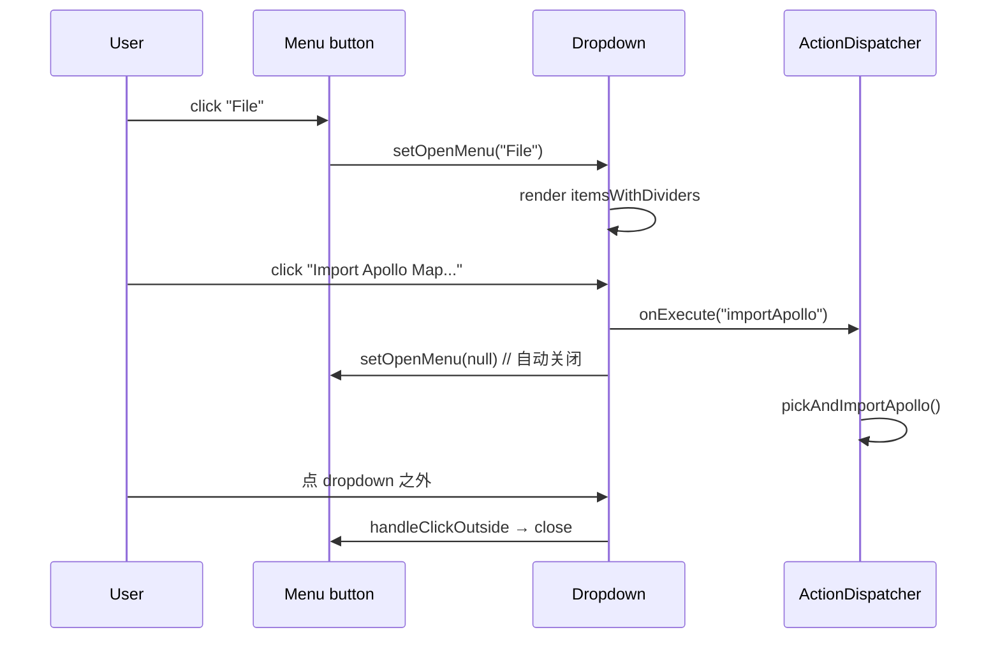

# 菜单栏与工具条 / MenuBar & ToolStrip

> AMS 顶部由两条水平条带构成：**MenuBar**（菜单栏，文字下拉）+ **ToolStrip**（工具条，图标按钮）。两者**完全数据驱动**——所有可执行项都来自单一 `ActionDef` 注册表 (`src/core/actions/registry/definitions.ts`)。

::: tip 这章为啥重要
任何在 UI 上能看见的“可执行操作”（绘图、撤销、导入导出、切换栅格、…）背后**都有一个 ActionDef**。理解 Action Registry 你就一次性掌握了 MenuBar、ToolStrip、CommandPalette 与全局快捷键四个 surface。
:::

## 概览 / Overview

| 区域          | 文件                | 高度          | 数据源                                                                 |
| ------------- | ------------------- | ------------- | ---------------------------------------------------------------------- |
| MenuBar       | `MenuBar.tsx`       | `h-8` (32 px) | `getMenuActions(menu)`                                                 |
| LicenseBanner | `LicenseBanner.tsx` | 0 / 28 px     | 仅在试用 ≤ 3 天 / 过期 / 篡改时浮现                                    |
| ToolStrip     | `ToolStrip.tsx`     | `h-9` (36 px) | `getToolStripSlotActions('view')` + `getToolAction(drawTool)` + 元素表 |
| StatusBar     | `StatusBar.tsx`     | `h-6` (24 px) | `mapStore.entities.size` + `uiStore` + `apolloMapStore.info`           |

## MenuBar 全表 / Menu Catalog

`MenuBar.tsx:142-176` 通过 `getMenuNames()` 自动生成所有菜单。下表覆盖默认注册表中的全部菜单与条目（`registry/definitions.ts`）。

### 菜单 → 条目映射

| 菜单     | 条目 (label)             | id                 | 快捷键 | menuOrder | 行为                                |
| -------- | ------------------------ | ------------------ | ------ | --------- | ----------------------------------- |
| **File** | Import Apollo Map...     | `importApollo`     | —      | 1         | `pickAndImportApollo()`             |
|          | Export Apollo Map (.bin) | `exportApolloBin`  | `⌘S`   | 11        | `exportApolloBin()`                 |
|          | Export Apollo Map (.txt) | `exportApolloText` | `⇧⌘S`  | 12        | `exportApolloText()`                |
|          | Settings                 | `settings`         | `⌘,`   | 90        | 打开 SettingsPanel                  |
| **Edit** | Undo                     | `undo`             | `⌘Z`   | 10        | `temporal.undo()` (含 R1 CANCEL)    |
|          | Redo                     | `redo`             | `⇧⌘Z`  | 20        | `temporal.redo()`                   |
|          | Delete Selection         | `delete`           | `⌫`    | 40        | `mapStore.deleteEntity(selectedId)` |
|          | Connect Lanes            | `connectLanes`     | `C`    | 50        | toggle `connectLanesMode`           |
| **View** | Reset Layout             | `resetLayout`      | —      | 10        | 清空 dockview 布局重建              |
|          | Toggle Grid              | `toggleGrid`       | `⌘G`   | 20        | `uiStore.gridEnabled`               |
|          | Toggle Snap              | `toggleSnap`       | —      | 30        | `uiStore.snapEnabled`               |

::: tip 分隔线规则
`MenuBar.tsx:46-53` 自动按 `menuOrder / 10` 取整分组，组间插入分隔线。所以 `1 vs 11` 会出现在不同分组，方便你在不动代码顺序的前提下添加分隔。
:::

### 菜单展开行为



## ToolStrip 全表 / Tool Strip Catalog

`ToolStrip.tsx:99-219` 由四个槽位拼接：

```
[Default | Connect] | [11 个元素] | [当前元素的绘制工具] | <flex spacer> | [Cmd Palette] | [View 槽 — Grid/Snap]
```

### 槽位 1: 模式开关

| 按钮             | id             | 快捷键 | 含义                                                 |
| ---------------- | -------------- | ------ | ---------------------------------------------------- |
| ✋ Default (Pan) | `defaultMode`  | `H`    | 退出绘制 / 选择 / 编辑，回到平移视图                 |
| 🔗 Connect Lanes | `connectLanes` | `C`    | 启用车道连线模式（依次点两条 lane → 形成 succ/pred） |

### 槽位 2: 11 类元素

来自 `MAP_ELEMENTS` (`src/core/elements/elements.ts`)，按顺序：

| 顺序 | 元素         | type 字段      | 默认绘制工具      |
| ---- | ------------ | -------------- | ----------------- |
| 1    | Lane         | `lane`         | `drawCatmullRom`  |
| 2    | Road         | `road`         | `drawCatmullRom`  |
| 3    | Junction     | `junction`     | `drawPolygon`     |
| 4    | PNCJunction  | `pncJunction`  | `drawPolygon`     |
| 5    | Crosswalk    | `crosswalk`    | `drawRotatedRect` |
| 6    | StopSign     | `stopSign`     | `drawPolyline`    |
| 7    | YieldSign    | `yieldSign`    | `drawPolyline`    |
| 8    | Signal       | `signal`       | `drawRotatedRect` |
| 9    | ParkingSpace | `parkingSpace` | `drawRotatedRect` |
| 10   | SpeedBump    | `speedBump`    | `drawPolyline`    |
| 11   | ClearArea    | `clearArea`    | `drawPolygon`     |

::: warning 元素图标着色
当某元素被选中，图标颜色变成 `el.color`（例如 lane 是青色 `#22d3ee`，crosswalk 是黄色）。这是 Tailwind class `style={active ? { color: el.color } : undefined}` 决定的。
:::

### 槽位 3: 当前元素的绘制工具

只有当 `currentElement !== null` 时显示。每种元素声明 `tools: DrawTool[]`，UI 用 `availableTools` 过滤显示：

| 元素                               | 支持的 DrawTool（按 `el.tools` 顺序）                  |
| ---------------------------------- | ------------------------------------------------------ |
| Lane / Road                        | `drawCatmullRom` `drawBezier` `drawArc` `drawPolyline` |
| Crosswalk / Signal / ParkingSpace  | `drawRotatedRect`                                      |
| Junction / PNCJunction / ClearArea | `drawPolygon`                                          |
| StopSign / YieldSign / SpeedBump   | `drawPolyline`                                         |

### 槽位 4: 命令面板

`⌘K` / `Ctrl+K` 浮窗触发，详见 [Command Palette](./command-palette.md)。

### 槽位 5: View 槽

由 `getToolStripSlotActions('view')` 列出所有 `uiSlot: 'view'` 的 ActionDef：

| 按钮           | id           | 快捷键 | 状态来源              |
| -------------- | ------------ | ------ | --------------------- |
| ▦ Toggle Grid  | `toggleGrid` | `⌘G`   | `uiStore.gridEnabled` |
| 🧲 Toggle Snap | `toggleSnap` | —      | `uiStore.snapEnabled` |

`active` 状态通过 `getToggleState(action.id)` 读取，由 `useActionDispatcher` 集中管理。

## ModeToggle 模式切换 / Drawing vs Scene

`MenuBar.tsx:108-140` 在右上角的分段开关：

| 模式      | 中文 | 行为差异                                   |
| --------- | ---- | ------------------------------------------ |
| `drawing` | 绘图 | 默认布局；只显示 Map / Sidebar / Inspector |
| `scene`   | 场景 | 多挂一条 Timeline 面板（高度 180px）       |

切换写入 `uiStore.appMode`；`WorkspaceLayout` 通过 `key={appMode}` 强制重建 DockviewReact 实例（`WorkspaceLayout.tsx:140`）；布局键也按模式分两份：`apollo-map-studio:layout:drawing` 与 `apollo-map-studio:layout:scene`。

## StatusBar 状态栏

`StatusBar.tsx:33-122` 显示六类信息：

| 区域 | 字段               | 来源                                                     |
| ---- | ------------------ | -------------------------------------------------------- |
| 左 1 | Mode（绘图/场景）  | `uiStore.appMode`                                        |
| 左 2 | 当前 FSM 状态      | `editorMachine` `s.value`，映射 `MODE_LABELS`            |
| 左 3 | Entity 总数        | `mapStore.entities.size`                                 |
| 左 4 | 已导入 Apollo 信息 | `apolloMapStore.info` (filename, lane count, road count) |
| 右 1 | Grid / Snap 灯     | `uiStore.gridEnabled` / `snapEnabled`                    |
| 右 2 | 鼠标经纬度         | `uiStore.cursorLngLat`                                   |
| 右 3 | 当前 zoom          | `uiStore.currentZoom`                                    |

::: tip Drawing 时左 2 高亮
处于 `draw*` 状态时，左 2 圆点会用 `bg-ams-accent animate-pulse` 闪烁，明确告诉用户“正在绘制中”。
:::

## 添加新菜单条目 / Adding a new action

修改 **唯一一处**：`src/core/actions/registry/definitions.ts`：

```ts
{
  id: 'myNewAction',                    // 唯一字面量
  label: 'My New Action',
  category: 'edit',                     // 影响 CommandPalette 分组
  shortcut: '⌥M',                       // 显示给用户
  keybinding: { key: 'm', alt: true },  // 全局键位匹配
  icon: FaWandMagicSparkles,            // react-icons/fa6
  inCommandPalette: true,
  menu: 'Edit',                         // 自动出现在哪个菜单
  menuOrder: 30,
}
```

然后在 `useActionDispatcher.ts` 的 switch 里添加分支：

```ts
case 'myNewAction': {
  doMyThing();
  return;
}
```

完成。MenuBar / CommandPalette / 快捷键 / ToolStrip 全部自动反映。

## 操作步骤 / Steps

1. 鼠标点击菜单名（File / Edit / View）→ 弹出下拉。
2. 鼠标点击条目 / 键盘按下快捷键 → 立即执行。
3. ToolStrip 上的元素图标，单击就是“选中元素并切到该元素的默认绘制工具”。
4. 已选中元素后右侧出现绘制工具子集，再单击切换具体工具。
5. View 槽的 toggle 按钮单击切换；状态写入 `uiStore`。
6. ModeToggle 单击切换 drawing / scene 模式。

## 常见问题 / Troubleshooting

| 症状                   | 原因                       | 处理                                                                    |
| ---------------------- | -------------------------- | ----------------------------------------------------------------------- |
| 菜单不展开             | 焦点被 dialog 拦走         | 关闭 dialog 后再点                                                      |
| 快捷键无响应           | 焦点在 input/textarea      | 点击地图获得焦点；Ctrl+K 仍可工作（global=true）                        |
| ToolStrip 元素颜色不变 | 未选中                     | 单击对应元素图标                                                        |
| 找不到 Connect Lanes   | menubar 移到 Edit 菜单底部 | 见上表 menuOrder=50                                                     |
| Reset Layout 没效果    | dockview 异常              | 详见 [Activity Bar & Panels](./activity-bar-and-panels.md#reset-layout) |

## 配置存储位置 / Persistence

MenuBar / ToolStrip 本身不持久化；toggle 状态来自 `uiStore`（运行时状态，不入 `localStorage`）。布局重置写到的两个键见 [Activity Bar & Panels](./activity-bar-and-panels.md)。

## 相关源码 / Source

- `src/components/layout/MenuBar.tsx:142-176` — 菜单生成
- `src/components/layout/MenuBar.tsx:108-140` — ModeToggle
- `src/components/layout/ToolStrip.tsx:99-219` — ToolStrip 渲染
- `src/components/layout/StatusBar.tsx:33-122` — StatusBar
- `src/core/actions/registry/definitions.ts` — 全部 ActionDef
- `src/core/actions/registry/helpers.ts` — `getMenuActions` / `getToolStripSlotActions` / `formatShortcut` / `matchesKeybinding` / `isMacPlatform`
- `src/hooks/useActionDispatcher.ts` — 执行 + toggle 状态读取
- `src/core/elements/elements.ts` — 11 类元素表

## ActionDef 类型字段全表 / ActionDef Field Glossary

引用 `src/core/actions/registry/types.ts`：

| 字段               | 类型                       | 必填 | 含义                                                                         |
| ------------------ | -------------------------- | ---- | ---------------------------------------------------------------------------- |
| `id`               | `ActionId` (literal union) | ✅   | 唯一标识，全项目静态校验                                                     |
| `label`            | string                     | ✅   | 显示给用户                                                                   |
| `category`         | `ActionCategory`           | ✅   | `'file' / 'edit' / 'view' / 'tool' / 'selection'` — 决定 CommandPalette 分组 |
| `icon`             | `IconType`                 | 推荐 | react-icons/fa6 组件                                                         |
| `shortcut`         | string                     | 可选 | 显示用，如 `'⌘S'`，由 `formatShortcut` 渲染                                  |
| `keybinding`       | `KeyBinding`               | 可选 | 实际匹配规则                                                                 |
| `inCommandPalette` | boolean                    | ✅   | 是否在 `⌘K` 面板出现                                                         |
| `menu`             | string                     | 可选 | 出现在哪个菜单（'File'、'Edit'、'View'…）                                    |
| `menuOrder`        | number                     | 可选 | 菜单内排序，整数除 10 决定分隔线                                             |
| `isToggle`         | boolean                    | 可选 | 是否切换型；为 true 时面板显示 ✓                                             |
| `uiSlot`           | `'view'` 等                | 可选 | ToolStrip 槽                                                                 |
| `uiOrder`          | number                     | 可选 | 同槽内排序                                                                   |
| `drawTool`         | `DrawTool`                 | 可选 | tool 类 ActionDef 专用，与 FSM `SELECT_TOOL` 对齐                            |

## 添加新菜单的完整 checklist

```
□ 在 definitions.ts 加 ActionDef
   □ id（literal）
   □ label / category / icon
   □ menu + menuOrder
   □ shortcut + keybinding（如需要）
   □ inCommandPalette
□ 在 useActionDispatcher.ts switch 加分支
□ 跑 pnpm typecheck（`ActionId` 自动校验）
□ 跑 pnpm test（registry 单测会校验全表）
□ MenuBar / CommandPalette 自动反映（无需改 UI）
```

## 已知细节 / Known nits

| 项                     | 说明                                                           |
| ---------------------- | -------------------------------------------------------------- |
| MenuBar Logo           | 渐变 cyan 方块 + “Apollo Map Studio” 文字（写死，不可换 logo） |
| StatusBar 鼠标坐标精度 | `toFixed(6)`，约 0.1 m（赤道）                                 |
| Dropdown z-index       | 50；与 Suspense overlay 同层，注意叠加顺序                     |
| 中文菜单名             | 不支持；`getMenuNames` 取 `menu` 字段，目前都是英文            |

## 相关文档 / See also

- [Command Palette](./command-palette.md) — 同样数据源的搜索面板
- [Shortcuts](./shortcuts.md) — 全部快捷键速查
- [Activity Bar and Panels](./activity-bar-and-panels.md) — 左侧活动栏 + 中央 dockview
- [Inspector](./inspector.md) — 右侧属性面板
- [Settings](./settings.md) — `⌘,` 唤起的设置面板

## Tooltip / Title 来源

每个 ToolButton 的 `title` 属性由：

```ts
display ? `${label} (${display})` : label;
```

`display` 是 `formatShortcut(shortcut)` 的结果。所以鼠标悬停 1 秒后浏览器原生 tooltip 显示如：

```
Draw Polyline (P)
Toggle Grid (⌘G)
```

`title` 而非 React Portal tooltip 的好处：零依赖、零渲染开销，与原生菜单一致。代价是延迟 1s（浏览器固定）。

## ToolStrip Element 颜色映射

来自 `src/core/elements/elements.ts` 中每条 `MapElementDef.color`：

| Element      | 16 进制色 | Tailwind 等价 |
| ------------ | --------- | ------------- |
| Lane         | `#22d3ee` | cyan-400      |
| Road         | `#a855f7` | purple-500    |
| Junction     | `#f59e0b` | amber-500     |
| PNCJunction  | `#fbbf24` | amber-400     |
| Crosswalk    | `#fde047` | yellow-300    |
| Signal       | `#ef4444` | red-500       |
| StopSign     | `#dc2626` | red-600       |
| YieldSign    | `#fb923c` | orange-400    |
| ParkingSpace | `#34d399` | emerald-400   |
| SpeedBump    | `#9ca3af` | gray-400      |
| ClearArea    | `#6b7280` | gray-500      |
