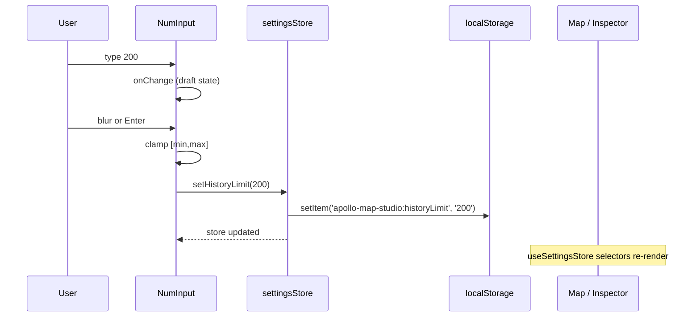

# 设置 / Settings

> Settings 是一个**模态对话框**：包含所有运行时全局偏好（撤销栈深度、地图初始视点、车道默认半宽、箭头间距、布局重置）。所有数值都通过 `settingsStore` 立即写入 `localStorage`，下次启动自动恢复。

## 概览 / Overview

| 维度         | 说明                                                      |
| ------------ | --------------------------------------------------------- |
| 入口         | `File → Settings` 菜单、ActivityBar 齿轮、`⌘,` / `Ctrl+,` |
| 实现         | `src/components/layout/panels/SettingsPanel.tsx`          |
| 存储         | `src/store/settingsStore.ts` 的 `localStorage` 写入       |
| 是否模态     | 是；`ESC` 或点击背景关闭                                  |
| 是否撤销     | 否；不进入 zundo 栈                                       |
| 立即生效字段 | History limit, Lane half-width, Arrow spacing             |
| 重启生效字段 | Map Viewport（lng/lat/zoom）                              |

## 字段全表 / Field Catalog

下表是 `SettingsPanel.tsx:103-235` 渲染的全部 section/字段。

### Undo History

| 字段          | 范围      | 默认 | 立即生效? | localStorage 键                  |
| ------------- | --------- | ---- | --------- | -------------------------------- |
| History limit | 10 – 1000 | 100  | ⚠ 重启    | `apollo-map-studio:historyLimit` |

::: warning 重启生效
`historyLimit` 在 `settingsStore` 创建 zundo middleware 时使用一次。修改后**不会**重建当前会话的栈；下次启动后才生效。如要立即生效，需在改完后 `Reset Layout to Default`（会触发 `window.location.reload()`）。
:::

### Map Viewport（重启生效）

| 字段      | 范围       | 默认                      | localStorage    |
| --------- | ---------- | ------------------------- | --------------- |
| Longitude | -180 – 180 | 来自 `MAP_DEFAULT_CENTER` | `:mapCenterLng` |
| Latitude  | -90 – 90   | 同上                      | `:mapCenterLat` |
| Zoom      | 1 – 22     | `MAP_DEFAULT_ZOOM`        | `:mapZoom`      |

::: tip 默认中心地点
默认中心来自 `src/config/mapConstants.ts` 中的 `MAP_DEFAULT_CENTER`（北京/上海某点，具体见源码常量）。
:::

### Lane（立即生效）

| 字段               | 范围        | 默认                             | 立即生效?                           | localStorage        |
| ------------------ | ----------- | -------------------------------- | ----------------------------------- | ------------------- |
| Default half-width | 0.5 – 10 m  | `DEFAULT_LANE_HALF_WIDTH` (1.75) | ✅ 新建 lane 起立即用新默认         | `:laneHalfWidth`    |
| Arrow spacing      | 40 – 500 px | `LANE_ARROW_SYMBOL_SPACING` (80) | ✅ MapLibre symbol layer 立即重渲染 | `:laneArrowSpacing` |

### Layout

| 按钮                      | 行为                                                  |
| ------------------------- | ----------------------------------------------------- |
| `Reset Layout to Default` | `clearAllSavedLayouts()` + `window.location.reload()` |

## 输入控件 / NumInput

`SettingsPanel.tsx:17-54` 的 `NumInput` 组件提供：

- **键盘** Enter 即时落盘；
- **失焦 (blur)** 自动落盘；
- **超界**自动 clamp 到 [min, max]；
- **非数字** 重置为旧值（`onReset` 调用）；
- **step** 默认为 1，可被父组件覆盖（lane half-width step=0.25, arrow spacing step=10）。

## 数据流 / Data Flow



## 操作步骤 / Steps

1. 按 `⌘,` / `Ctrl+,`（或 `File → Settings`、ActivityBar 齿轮）。
2. 在数字输入框中**双击高亮**当前值。
3. 输入新值。
4. **Enter** 或 Tab 失焦即落盘。
5. 关闭对话框（`ESC` 或 ×）。
6. Lane / Arrow 字段立即生效；History / Map Viewport 字段需重启或 reload。

## 配置存储位置 / Persistence

| 键                                   | 来源                  | 默认                    |
| ------------------------------------ | --------------------- | ----------------------- |
| `apollo-map-studio:historyLimit`     | `setHistoryLimit`     | 100                     |
| `apollo-map-studio:mapCenterLng`     | `setMapCenter`        | `MAP_DEFAULT_CENTER[0]` |
| `apollo-map-studio:mapCenterLat`     | `setMapCenter`        | `MAP_DEFAULT_CENTER[1]` |
| `apollo-map-studio:mapZoom`          | `setMapZoom`          | `MAP_DEFAULT_ZOOM`      |
| `apollo-map-studio:laneHalfWidth`    | `setLaneHalfWidth`    | 1.75                    |
| `apollo-map-studio:laneArrowSpacing` | `setLaneArrowSpacing` | 80                      |

::: tip 隐私模式 / SSR
`settingsStore` 在 try/catch 中读写 `localStorage`，命中不可用环境（隐私窗口、SSR）时静默忽略，回退到默认值。详见 `settingsStore.ts:35-46`。
:::

## 范围常量 / Range Constants

代码路径：`src/store/settingsStore.ts:20-31`

| 常量                     | 值   |
| ------------------------ | ---- |
| `MIN_HISTORY_LIMIT`      | 10   |
| `MAX_HISTORY_LIMIT`      | 1000 |
| `MIN_MAP_ZOOM`           | 1    |
| `MAX_MAP_ZOOM`           | 22   |
| `MIN_LANE_HALF_WIDTH`    | 0.5  |
| `MAX_LANE_HALF_WIDTH`    | 10   |
| `MIN_LANE_ARROW_SPACING` | 40   |
| `MAX_LANE_ARROW_SPACING` | 500  |

## 常见问题 / Troubleshooting

| 症状                            | 原因                        | 处理                                      |
| ------------------------------- | --------------------------- | ----------------------------------------- |
| 改了 history limit 撤销栈没变长 | 该字段重启生效              | 用 Reset Layout to Default 或重启         |
| 数值始终被 clamp 回边界         | 输入超界                    | 看上表合法范围                            |
| 输入 abc 后变回原值             | NumInput 的 `onReset` 触发  | 是预期行为                                |
| Reset Layout 后 dockview 仍乱   | 你触发的是全量清理 + reload | 改用 `View → Reset Layout` 软重置当前模式 |
| 隐私窗口下设置不持久            | localStorage 被禁           | 切换到普通窗口                            |
| 切换中心后 map 没飞过去         | 这是初始视点，不是动态飞行  | 重启或手动平移                            |

## 相关源码 / Source

- `src/components/layout/panels/SettingsPanel.tsx:63-240` — 主组件
- `src/store/settingsStore.ts:20-148` — store + 持久化
- `src/config/mapConstants.ts` — 默认值常量
- `src/components/layout/WorkspaceLayout.tsx:54,89-93` — Settings 触发链
- `src/core/actions/registry/definitions.ts:54-64` — `settings` ActionDef

## 设置项详解 / Per-Field Deep Dive

### `historyLimit`

zundo 撤销栈深度。每次 `mapStore.updateEntity` / `addEntity` / `deleteEntity` 都会向栈推一帧。一旦栈长 > limit，最旧的一帧被丢弃，对应的 `Ctrl+Z` 退到该帧之前**不可达**。

| historyLimit | 内存（千 entity 量级地图） | 推荐场景                 |
| ------------ | -------------------------- | ------------------------ |
| 10           | ~ 1 MB                     | 演示模式                 |
| 100 (默认)   | ~ 10 MB                    | 一般日常                 |
| 500          | ~ 50 MB                    | 长会话不打算保存中间产物 |
| 1000         | ~ 100 MB                   | 大幅返工，不在意内存     |

### `mapCenterLng` / `mapCenterLat` / `mapZoom`

仅在**首次启动**或 hard reload 后生效。一旦 MapLibre 实例化完成，运行时改动不会主动 fly。这是有意设计——避免把用户当前视图意外拽走。

::: tip 想立刻飞过去？
临时方法：DevTools console

```js
window.__map?.flyTo({ center: [121.5, 31.2], zoom: 16 });
```

（仅 dev 暴露 `window.__map`）
:::

### `laneHalfWidth`

`MAP_DEFAULT_HALF_WIDTH` 在 `mapConstants.ts` 中是 1.75 m（标准车道半宽）。每次 `addEntity` 创建新 lane 时，`leftSamples` / `rightSamples` 各被预填两个 sample（s=0 与 s=length）的 `width` 字段为这个值。修改 settings 后**仅影响新建**的 lane，已存在 lane 不变。

### `laneArrowSpacing`

MapLibre `symbol` 图层的 `symbol-spacing`，单位 px（屏幕像素）。值越大，相邻箭头间距越宽。

| 值        | 视觉效果                          |
| --------- | --------------------------------- |
| 40        | 箭头密集，适合密集车道场景        |
| 80 (默认) | 平衡可读性与不喧宾夺主            |
| 200       | 稀疏，仅做方向指示                |
| 500       | 极稀疏，每段 lane 只有 1–2 个箭头 |

## 与其它面板对比 / Comparison

| 面板             | 是否模态 | ESC 关闭? | 写入 localStorage?    | 进入 zundo? |
| ---------------- | -------- | --------- | --------------------- | ----------- |
| Settings         | ✅       | ✅        | ✅                    | ❌          |
| Inspector        | ❌       | —         | ❌（间接进 mapStore） | ✅          |
| ProjPickerDialog | ✅       | ✅        | ❌                    | ❌          |
| ActivationDialog | ✅       | ✅        | ❌（写桌面文件）      | ❌          |

## 相关文档 / See also

- [Activity Bar & Panels](./activity-bar-and-panels.md) — Reset Layout 软/硬两种
- [License Activation](./license-activation.md) — 桌面版独立的许可证存储
- [Shortcuts](./shortcuts.md) — `⌘,` 等快捷键
- [Drawing Lanes](./drawing-lanes.md) — `laneHalfWidth` 决定新车道默认半宽
- [Inspector](./inspector.md) — entity 字段编辑（不进 settings 模态）

## SettingsState 类型 / SettingsState Type

`src/store/settingsStore.ts:82-97`：

```ts
export interface SettingsState {
  historyLimit: number;
  mapCenterLng: number;
  mapCenterLat: number;
  mapZoom: number;
  laneHalfWidth: number;
  laneArrowSpacing: number;
}

export interface SettingsActions {
  setHistoryLimit(value: number): void;
  setMapCenter(lng: number, lat: number): void;
  setMapZoom(value: number): void;
  setLaneHalfWidth(value: number): void;
  setLaneArrowSpacing(value: number): void;
}
```

每个 setter 都做以下三件事：

1. **clamp** 到 `[MIN_x, MAX_x]`。
2. `set(...)` 更新 store。
3. `persist(KEY, v)` 写 `localStorage`，try/catch 包裹。

## 读取函数 / Read helpers

为支持 map 初始化等 React hook 之外的读取，settingsStore 暴露纯函数：

| 函数                     | 来源                  | 调用方                       |
| ------------------------ | --------------------- | ---------------------------- |
| `readHistoryLimit()`     | `settingsStore.ts:48` | mapStore zundo init          |
| `readMapCenter()`        | 同                    | MapCanvas 初始 center        |
| `readMapZoom()`          | 同                    | MapCanvas 初始 zoom          |
| `readLaneHalfWidth()`    | 同                    | useDrawCommit 在新建 lane 前 |
| `readLaneArrowSpacing()` | 同                    | maplibre symbol layer 注册时 |

## 增量添加新设置项 / Adding a New Setting

完整流程：

1. 在 `mapConstants.ts` 加默认常量 `MY_DEFAULT`。
2. 在 `settingsStore.ts` 加：
   - `MY_LIMIT_KEY = 'apollo-map-studio:myLimit'`
   - `MIN_MY_LIMIT / MAX_MY_LIMIT`
   - `readMyLimit()` 工具函数
   - `SettingsState.myLimit: number`
   - `SettingsActions.setMyLimit(value: number): void`
3. 在 `SettingsPanel.tsx` 加：
   - `useSettingsStore((s) => s.myLimit)` 读
   - 一个 `<NumInput>` 控件
4. 跑 `pnpm typecheck` & `pnpm test`。

::: tip 测试覆盖
`src/store/__tests__/settingsStore.test.ts` 已经覆盖 clamp、persist、读回三步逻辑。新增字段照样写一份单测，保持回归绿。
:::

## 与其它工具的相似性 / Similarity

| 工具      | Settings 风格           |
| --------- | ----------------------- |
| AMS       | 模态、即写 localStorage |
| VS Code   | 文件 settings.json + UI |
| Sublime   | 文件 .sublime-settings  |
| Photoshop | 模态 + plist/registry   |
| Figma     | 云同步账户级            |

## 默认值常量来源 / Defaults Source of Truth

| 字段             | 默认         | 来源文件                                    |
| ---------------- | ------------ | ------------------------------------------- |
| historyLimit     | 100          | `settingsStore.ts:20`                       |
| mapCenter        | `[lng, lat]` | `mapConstants.ts#MAP_DEFAULT_CENTER`        |
| mapZoom          | 15 (估值)    | `mapConstants.ts#MAP_DEFAULT_ZOOM`          |
| laneHalfWidth    | 1.75         | `mapConstants.ts#DEFAULT_LANE_HALF_WIDTH`   |
| laneArrowSpacing | 80           | `mapConstants.ts#LANE_ARROW_SYMBOL_SPACING` |

::: tip 常量与 SettingsState
SettingsState 在 store 创建时通过 `read*()` 函数读取 localStorage，**fallback** 到上述默认。这意味着删除 localStorage 等价于复位到默认。
:::
