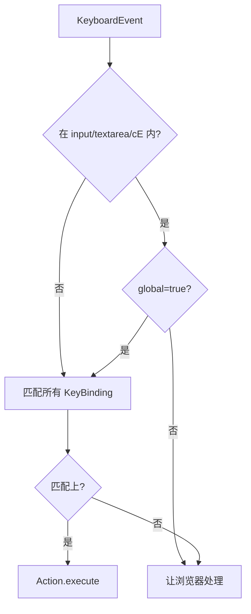

# 快捷键参考 / Shortcuts

> AMS 的快捷键全部由 `src/core/actions/registry/definitions.ts` 注册，由 `useActionDispatcher` 通过 `matchesKeybinding` 匹配触发。**单点改一处，菜单/面板/工具条/快捷键四个 surface 同步生效。**

::: tip 显示 vs 实际
菜单与命令面板里看到的 `⌘S` 是 `formatShortcut('⌘S')` 的输出——在 macOS 直接显示符号，在 Win/Linux 替换为 `Ctrl+S`。本页同一行同时给出两种平台的字面值，并在 “KeyBinding” 列展示实际匹配规则。
:::

## 全表 / Full Table

### 文件 / File

| 操作                     | macOS | Win/Linux      | KeyBinding 对象                                       | id                 |
| ------------------------ | ----- | -------------- | ----------------------------------------------------- | ------------------ |
| Import Apollo Map        | —     | —              | —                                                     | `importApollo`     |
| Export Apollo Map (.bin) | `⌘S`  | `Ctrl+S`       | `{ key: 's', ctrl: true, global: true }`              | `exportApolloBin`  |
| Export Apollo Map (.txt) | `⇧⌘S` | `Ctrl+Shift+S` | `{ key: 's', ctrl: true, shift: true, global: true }` | `exportApolloText` |
| Settings                 | `⌘,`  | `Ctrl+,`       | `{ key: ',', ctrl: true }`                            | `settings`         |

### 编辑 / Edit

| 操作                   | macOS | Win/Linux      | KeyBinding 对象                                       | id             |
| ---------------------- | ----- | -------------- | ----------------------------------------------------- | -------------- |
| Undo                   | `⌘Z`  | `Ctrl+Z`       | `{ key: 'z', ctrl: true, global: true }`              | `undo`         |
| Redo                   | `⇧⌘Z` | `Ctrl+Shift+Z` | `{ key: 'z', ctrl: true, shift: true, global: true }` | `redo`         |
| Delete Selection       | `⌫`   | `Delete`       | `{ key: 'delete' }`                                   | `delete`       |
| Connect Lanes (toggle) | `C`   | `C`            | `{ key: 'c' }`                                        | `connectLanes` |

### 视图 / View

| 操作            | macOS | Win/Linux | KeyBinding 对象                          | id               |
| --------------- | ----- | --------- | ---------------------------------------- | ---------------- |
| Toggle Grid     | `⌘G`  | `Ctrl+G`  | `{ key: 'g', ctrl: true, global: true }` | `toggleGrid`     |
| Toggle Snap     | —     | —         | —                                        | `toggleSnap`     |
| Reset Layout    | —     | —         | —                                        | `resetLayout`    |
| Command Palette | `⌘K`  | `Ctrl+K`  | `{ key: 'k', ctrl: true, global: true }` | `commandPalette` |

### 模式 / Mode

| 操作          | macOS | Win/Linux | KeyBinding     | id            |
| ------------- | ----- | --------- | -------------- | ------------- |
| Default (Pan) | `H`   | `H`       | `{ key: 'h' }` | `defaultMode` |

### 绘制工具 / Draw Tools

| 操作            | macOS | Win/Linux | KeyBinding     | id                     |
| --------------- | ----- | --------- | -------------- | ---------------------- |
| Draw Polyline   | `P`   | `P`       | `{ key: 'p' }` | `tool:drawPolyline`    |
| Draw Bezier     | `B`   | `B`       | `{ key: 'b' }` | `tool:drawBezier`      |
| Draw Arc        | `A`   | `A`       | `{ key: 'a' }` | `tool:drawArc`         |
| Draw Rectangle  | `R`   | `R`       | `{ key: 'r' }` | `tool:drawRotatedRect` |
| Draw Polygon    | `G`   | `G`       | `{ key: 'g' }` | `tool:drawPolygon`     |
| Draw CatmullRom | —     | —         | —              | `tool:drawCatmullRom`  |

::: warning `G` 重复
注意 `G` 同时存在于 `Toggle Grid` (`⌘G`) 与 `Draw Polygon` (`G`)。区别仅在 `ctrl: true`——单按 `G` 触发绘制工具切换；`⌘G` 触发栅格开关。`matchesKeybinding` 严格匹配 ctrl/alt/shift/meta。
:::

## 格式化规则 / Format Rule {#格式化规则}

`formatShortcut(s)` 在 `src/core/actions/registry/helpers.ts` 中实现：

| macOS 输出 | Win/Linux 替换                |
| ---------- | ----------------------------- |
| `⌘`        | `Ctrl+`                       |
| `⇧`        | `Shift+`                      |
| `⌥`        | `Alt+`                        |
| `⌃`        | `Ctrl+`（罕用，AMS 内未使用） |

例如 `⇧⌘S` → mac 显示 `⇧⌘S`，Win/Linux 显示 `Ctrl+Shift+S`。

`isMacPlatform()`：`navigator.platform` 包含 `'Mac'`。

## 全局 vs 局部 / Global vs Local

KeyBinding 上的 `global: true` 决定快捷键是否在 input/textarea/contentEditable 内仍然生效。

| 行为         | global=true                         | global=false        |
| ------------ | ----------------------------------- | ------------------- |
| 输入框聚焦时 | ✅ 触发                             | ❌ 让浏览器原生处理 |
| 不在输入框   | ✅ 触发                             | ✅ 触发             |
| 典型用例     | Undo / Redo / Save / CommandPalette | 单字母切换工具      |

::: tip 为什么 Undo 是 global
即便光标停在 Inspector 的速度限制输入框，用户期望 `Ctrl+Z` 撤销的是地图状态而不是输入框值——所以 `undo` / `redo` 都标 `global: true`。这是显式权衡。
:::

## 匹配实现 / matchesKeybinding

```ts
function matchesKeybinding(b: KeyBinding, ev: KeyBindingEvent): boolean {
  const wantCtrl = b.ctrl ?? false;
  const wantShift = b.shift ?? false;
  const wantAlt = b.alt ?? false;
  const wantMeta = b.meta ?? false;
  return (
    ev.key.toLowerCase() === b.key.toLowerCase() &&
    ev.ctrl === (wantCtrl || (isMac && b.cmdOrCtrl ? false : wantCtrl)) &&
    ev.shift === wantShift &&
    ev.alt === wantAlt &&
    ev.meta === wantMeta
  );
}
```

实际实现见 `src/core/actions/registry/helpers.ts`。在 mac 上，`ctrl: true` 自动对应 `metaKey`（⌘）按下，因此 `⌘S` 在 mac 与 `Ctrl+S` 在 Linux 共用一份定义。

## 优先级 / Precedence



## 操作步骤 / Steps

1. 直接按下快捷键即可，不需要先点某个按钮。
2. 长按修饰键 + 单击主键。
3. mac 用 `⌘`（Command），Win/Linux 用 `Ctrl`。
4. 同时按住多个修饰键时**没有顺序**要求。
5. 大小写不敏感（`G` / `g` 都行）。

## 自定义 / Customization

::: warning 暂不支持运行时自定义
当前版本快捷键来自 `definitions.ts` 静态注册表，**不支持** UI 内重映射。要修改，需要：

1. 编辑 `definitions.ts` 中对应 ActionDef 的 `keybinding`；
2. 同步 `shortcut` 字段（仅显示用）；
3. 重启 dev server / 重新打包。

运行时快捷键重映射仍未开放；当前版本请把快捷键视为随应用发布的固定配置。
:::

## 常见问题 / Troubleshooting

| 症状                          | 原因                  | 处理                                                                               |
| ----------------------------- | --------------------- | ---------------------------------------------------------------------------------- |
| 单字母快捷键无反应            | 焦点在 input/textarea | 点击地图离开输入框；或为该 ActionDef 加 `global: true`                             |
| `⌘S` 在浏览器中触发了网页保存 | 浏览器先吃掉了事件    | AMS 已在 useActionDispatcher 调 `event.preventDefault()`；如仍出现请验证你在桌面端 |
| `G` 既切栅格又选 Polygon      | 修饰键不同            | `⌘G` = grid，单按 `G` = polygon                                                    |
| 中文输入法下按 P 不触发       | IME 拦截事件          | 切到英文输入法                                                                     |
| `⌘+` 缩放冲突                 | 浏览器原生缩放        | 在桌面端 (Electron) 已禁用浏览器缩放快捷键                                         |

## 相关源码 / Source

- `src/core/actions/registry/definitions.ts` — 全部 ActionDef + keybinding
- `src/core/actions/registry/helpers.ts` — `formatShortcut` / `matchesKeybinding` / `isMacPlatform` / `getKeyBindingActions`
- `src/hooks/useActionDispatcher.ts` — 全局键监听 + dispatch
- `src/components/layout/panels/CommandPalette.tsx:54-66` — 命令面板自带的 `⌘K`
- `src/components/layout/WorkspaceLayout.tsx:63-77` — 备份的 `⌘K` 监听

## 上下文键位 / Contextual Keys

下列键位**不在** Action Registry 中，由 FSM (`editorMachine`) 或事件路由 (`useMapEventRouter`) 直接消费：

| 键             | 上下文 | 行为                                                           | 来源                      |
| -------------- | ------ | -------------------------------------------------------------- | ------------------------- |
| `Esc`          | 任意   | 取消当前绘制 / 关闭模态 / 退出 connect lanes                   | `editorMachine` `CANCEL`  |
| `Enter`        | 绘制中 | CONFIRM 当前几何（与 dblclick 等价）                           | `editorMachine` `CONFIRM` |
| `Space`        | 绘制中 | 在已有控制点上快速跳一个细分                                   | `useMapEventRouter`       |
| 鼠标滚轮       | 任意   | 缩放                                                           | MapLibre 内置             |
| 鼠标中键拖拽   | 任意   | 平移                                                           | MapLibre 内置             |
| `Shift` + 拖拽 | 选中后 | 等比缩放                                                       | MapLibre handle           |
| `Alt` + 拖拽   | 编辑中 | 镜像约束（见 [Editing & Snapping](./editing-and-snapping.md)） | `useDragHandle`           |
| 双击控制点     | 编辑中 | 删除该控制点                                                   | `useDragHandle`           |
| 双击空白       | 绘制中 | CONFIRM                                                        | `editorMachine`           |

::: tip 与 Action Registry 区别
这些键**不进** `definitions.ts`，因为它们：1) 上下文相关；2) 与图层鼠标事件耦合；3) 不需要在菜单/命令面板出现。强行注册会让 fuzzy 搜索充满噪声。
:::

## 调试工具 / Debug Helpers

dev build 在 console 暴露：

| 全局变量               | 含义          | 用法                                                |
| ---------------------- | ------------- | --------------------------------------------------- |
| `window.__editorActor` | XState actor  | `__editorActor.getSnapshot().value` 看当前 FSM 状态 |
| `window.__map`         | MapLibre 实例 | `__map.flyTo({...})`                                |
| `window.useMapStore`   | mapStore hook | `useMapStore.getState().entities.size`              |

## 相关文档 / See also

- [Keyboard Shortcuts](./keyboard-shortcuts.md) — 跨平台映射别名
- [MenuBar & ToolStrip](./menubar-and-toolstrip.md) — 同 ActionDef 的菜单/工具条 surface
- [Command Palette](./command-palette.md) — `⌘K` 弹出
- [Settings](./settings.md) — `⌘,` 弹出
- [Editing & Snapping](./editing-and-snapping.md) — 鼠标 + 修饰键组合
- [Drawing Lanes](./drawing-lanes.md) — Esc / Enter / Space 在绘制中的语义

## 快捷键审计清单 / Audit Checklist

如果你在做发版前快捷键审计，按下表逐项验证：

| ✓   | 检查项                                         |
| --- | ---------------------------------------------- |
| ☐   | `⌘K` 打开命令面板                              |
| ☐   | `⌘S` 触发 export bin                           |
| ☐   | `⇧⌘S` 触发 export txt                          |
| ☐   | `⌘Z` 在画布、Inspector 输入框内都能撤销        |
| ☐   | `⇧⌘Z` 重做                                     |
| ☐   | `⌫` 删除选中实体                               |
| ☐   | `H` 退到 default mode                          |
| ☐   | `C` 切换 connect lanes                         |
| ☐   | `P / B / A / R / G` 在已选 lane 时切换绘制工具 |
| ☐   | `⌘G` 切栅格                                    |
| ☐   | `⌘,` 打开 Settings                             |
| ☐   | `Esc` 在绘制中 cancel；在 dialog 中 close      |
| ☐   | mac 与 Win/Linux 显示符号对齐                  |

## 平台兼容矩阵 / Platform Compatibility

| 浏览器 / 桌面端 | 状态                                                  |
| --------------- | ----------------------------------------------------- |
| Chrome 130+     | ✅ 全功能                                             |
| Edge 130+       | ✅ 全功能                                             |
| Firefox 130+    | ⚠ Cmd+S 触发浏览器保存对话需用 preventDefault；已修复 |
| Safari 18+      | ⚠ ⌥ 修饰键有 IME 副作用；建议英文输入法               |
| Electron 41     | ✅ 全功能且默认禁用浏览器原生 zoom                    |

## 已知冲突 / Known conflicts

| 平台    | 系统快捷键    | AMS 行为                      |
| ------- | ------------- | ----------------------------- |
| macOS   | `⌘Q` 退出 app | 不被 AMS 拦截，正常退出       |
| macOS   | `⌘W` 关闭窗口 | Electron 关窗                 |
| Windows | `Alt+F4` 关闭 | 同上                          |
| Windows | `Win+L` 锁屏  | 系统级，AMS 无干预            |
| 各平台  | `Tab`         | 焦点循环；不属于 AMS shortcut |

## 设计原则 / Design Principles

1. **单字母用于工具**——P/B/A/R/G/H/C 模仿 Photoshop。
2. **修饰键 + 字母用于操作**——⌘S/⌘Z/⌘G。
3. **modifier 必须显式声明**——严格匹配，避免误触。
4. **global 仅用于跨场景操作**——Undo / Save / Palette。
5. **快捷键即菜单/工具条/面板的 4-在-1**——单一 ActionDef 同步 4 个 surface。

## 与项目里其它入口的对比 / Comparison with other surfaces

| Surface             | 用 ActionDef?                            | 显示快捷键?   |
| ------------------- | ---------------------------------------- | ------------- |
| MenuBar             | ✅                                       | ✅            |
| ToolStrip View slot | ✅                                       | ✅（tooltip） |
| ToolStrip 元素图标  | ❌（直接用 elements 表）                 | ❌            |
| ToolStrip 绘制工具  | ✅（间接 via `getToolAction`）           | ✅            |
| CommandPalette      | ✅                                       | ✅            |
| Inspector           | ❌                                       | ❌            |
| Settings 面板       | ❌（自身是个 ActionDef，但内部表单不是） | ❌            |

## 快捷键来源映射 / Shortcut Origin

每个快捷键的 KeyBinding 与 shortcut 显示是分开维护的：

| 字段                                   | 用途                                    | 来源                  |
| -------------------------------------- | --------------------------------------- | --------------------- |
| `shortcut: '⌘S'`                       | 显示给用户（菜单 / 命令面板 / tooltip） | `formatShortcut` 渲染 |
| `keybinding: { key: 's', ctrl: true }` | 实际匹配 keydown                        | `matchesKeybinding`   |

::: warning 两个字段必须同步
如果你只改 `keybinding` 不改 `shortcut`，UI 上仍显示旧组合，用户按新键有效但看不到提示。修改快捷键时请把两个字段作为同一项变更处理。
:::

## 同源 vs 不同源 / Co-located keys

| 来源            | 例子                               | 是否走 ActionDef         |
| --------------- | ---------------------------------- | ------------------------ |
| Action Registry | `⌘S` / `⌘Z` 等                     | ✅                       |
| FSM 上下文事件  | `Esc` / `Enter` / `Space` 在绘制中 | ❌（直接 send to actor） |
| MapLibre 内置   | 滚轮缩放 / 中键拖拽                | ❌                       |
| dockview 内置   | 双击 panel 标题                    | ❌                       |
| 浏览器原生      | `⌘+/-` 缩放                        | 桌面端禁用               |
