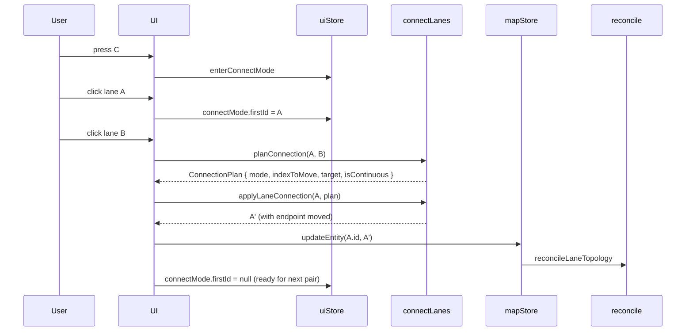
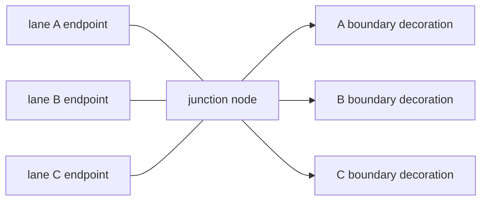
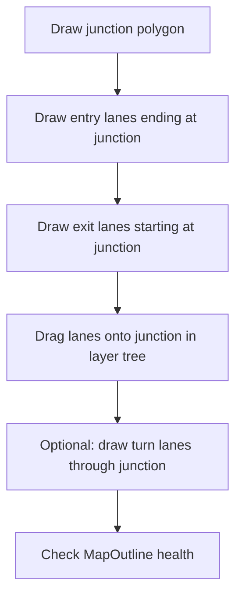

# Topology and junctions

Apollo's planner navigates by lane-level topology: predecessor /
successor / left-neighbor / right-neighbor relationships. Junctions are
the polygon regions where lanes converge and through which lane changes
are not allowed. This page covers how the editor derives topology
automatically, when to connect manually, and how junction stitching
works.

## Source map

| Concern                                   | File                                                      |
| ----------------------------------------- | --------------------------------------------------------- |
| Lane-pair connection plan                 | `src/core/geometry/connectLanes.ts`                       |
| Topology reconcile (pred/succ)            | `src/core/geometry/laneTopology.ts`                       |
| Junction boundary stitching               | `src/core/geometry/laneJunctions.ts` (+ `laneJunctions/`) |
| Junction graph (worker-side dep tracking) | `src/core/workers/laneJunctionGraph.ts`                   |
| Connect-mode UI                           | `src/hooks/mapEventRouter/connectMode.ts`                 |
| Snap with endpoint roles                  | `src/core/geometry/snap.ts`                               |

## Topology terminology

| Term                     | Meaning                                                                                              |
| ------------------------ | ---------------------------------------------------------------------------------------------------- |
| Predecessor              | Lane that ends at this lane's start. Lane A is a predecessor of B if `A.end ≡ B.start`.              |
| Successor                | Lane that starts at this lane's end. Lane B is a successor of A if `A.end ≡ B.start`.                |
| Left neighbor (forward)  | Lane immediately to the left, going the same direction                                               |
| Right neighbor (forward) | Lane immediately to the right, going the same direction                                              |
| Left neighbor (reverse)  | Lane immediately to the left, going the opposite direction                                           |
| Right neighbor (reverse) | Lane immediately to the right, going the opposite direction                                          |
| Self-reverse             | A lane that shares geometry with another lane going the opposite direction (typical of U-turn lanes) |

The Apollo proto stores these as `repeated string` arrays of lane ids on
each `LaneEntity`. The editor maintains them automatically.

## Pred/succ derivation

The editor reconciles predecessor/successor automatically on every
entity write. Two paths trigger reconciliation:

### A. Snap during draw

When you draw a new lane and one endpoint snaps to an existing lane's
endpoint, the snap target carries `endpointRole: 'start' | 'end'` (see
`src/core/geometry/snap.ts:148-177`). On commit:

```ts
// pseudo-code from reconcileLaneTopology
if (newLane.start ≡ existingLane.end) {
  existingLane.successorIds.push(newLane.id);
  newLane.predecessorIds.push(existingLane.id);
}
if (newLane.end ≡ existingLane.start) {
  newLane.successorIds.push(existingLane.id);
  existingLane.predecessorIds.push(newLane.id);
}
```

### B. Connect Lanes (`C`)

The Connect Lanes mode (`src/hooks/mapEventRouter/connectMode.ts`) lets
you stitch two lanes whose endpoints are merely close but not
coincident. The flow:



`planConnection` enumerates the four endpoint-pair combinations and
picks the minimum-distance one:

| Mode             | Geometry                     | Topology effect                          |
| ---------------- | ---------------------------- | ---------------------------------------- |
| `AendToBstart`   | A's end snaps to B's start   | `A.successor += B`, `B.predecessor += A` |
| `AstartToBend`   | A's start snaps to B's end   | `A.predecessor += B`, `B.successor += A` |
| `AstartToBstart` | A's start snaps to B's start | **Fork** — no pred/succ; geometry only   |
| `AendToBend`     | A's end snaps to B's end     | **Merge** — no pred/succ; geometry only  |

::: warning Forks and merges don't write pred/succ
This is correct Apollo semantics: a fork is two lanes from a common
origin, neither of which is the predecessor of the other. The geometric
snap still happens, but `reconcile` only writes pred/succ for
`AendToBstart` / `AstartToBend`. If you need a fork explicitly tagged
in topology, use a Junction.
:::

::: tip planConnection.isContinuous
The plan's `isContinuous: boolean` field is true for `AendToBstart` and
`AstartToBend`. UI surfaces (e.g. a future "this is a fork" warning)
can read it without re-comparing modes.
:::

## Junction stitching

When two lanes meet at a junction, you don't draw the junction as a
separate edge — the junction polygon and the lane-boundary join geometry
are derived. `laneJunctions.ts` does this work.

### What "stitching" produces

For each junction (or lane-endpoint cluster):

- **Boundary join offsets** — where the lane's left/right boundary
  visually merges into the next lane's left/right boundary. Without
  this, two connected lanes show a tiny visual gap at the junction.
- **Polygon stitching** — the junction polygon's edges that overlap
  with lane boundaries get a "side-join" treatment so the polygon and
  the lane look continuous.

The stitching is **idempotent** — calling it on already-stitched lanes
gives the same result. So the worker can run it on every full sync
without breaking incremental updates.

### Junction graph

`src/core/workers/laneJunctionGraph.ts` maintains a dependency graph:
"if lane X moves, which other lanes' decoration features need
re-rendering?" This is a fan-out of typically 2–4 lanes per endpoint
(both lanes meeting at the junction, plus their stitched neighbors).



On an incremental update (one lane moved), the worker reads the graph,
recomputes only the affected lanes' decoration, and patches the cold
layer's GeoJSON. This is the Phase E optimization documented in
`ARCHITECTURE.md:150-164`.

::: tip Why incremental matters
Naive rebuild of all lane boundary decoration takes ~3 ms × N lanes.
For a 5,000-lane map, that's 15 seconds per drag — unusable. The
incremental path keeps it under 50 ms by re-decorating only the 2–4
lanes that actually changed. Junction graph maintenance is O(K) per
lane, where K is the junction's fan-out.
:::

## When to connect lanes

| Situation                                                  | Recommendation                                                                                                                                                         |
| ---------------------------------------------------------- | ---------------------------------------------------------------------------------------------------------------------------------------------------------------------- |
| New lane endpoint snapped to existing endpoint during draw | Already connected. Inspect Inspector → Topology to confirm.                                                                                                            |
| Existing endpoints close but not coincident                | Use Connect Lanes (`C`). Distance threshold for "minimum-pair" is unbounded — it will pick the closest pair regardless.                                                |
| Lanes meet at a polygonal junction (4-way intersection)    | Draw the Junction polygon; drag each Lane into the Junction in the [Layer tree](/guide/layer-tree). The lane's `junctionId` is set; topology reconciles.               |
| Lanes "merge" geometrically but represent forks            | The fork modes (`AstartToBstart`, `AendToBend`) snap geometry but no pred/succ. If you need a different topology, edit the lane's pred/succ via round-trip text proto. |
| Two lanes sharing geometry going opposite directions       | Set `Direction: BACKWARD` on the second lane. Manually set `selfReverseLaneIds` if your fleet uses it.                                                                 |

## Junction authoring flow

To author a four-way intersection from scratch:

1. **Draw the junction polygon.**
   - Junction element → Polygon tool → click 4 corners → double-click.
   - The polygon appears in the layer tree under `Junctions`.
2. **Draw each entry lane.**
   - Lane element → Bezier (default) → draw each lane that approaches
     the junction. End each lane's centerline at the junction polygon
     boundary.
3. **Draw each exit lane.**
   - Same, but starting from the junction boundary, exiting outward.
4. **Assign lanes to the junction.**
   - Activity bar → Layers tab.
   - Drag each lane (entry and exit) onto the junction node. Each
     lane's `junctionId` is set; the inspector's Topology section
     reflects the parent.
5. **Stitch within-junction lanes (optional).**
   - For lanes that pass **through** the junction (e.g. left turn), draw
     them connecting an entry's end to the corresponding exit's start.
     Snap takes care of pred/succ.
6. **Verify.**
   - Open the Explorer panel (`MapOutline`). Health row should show
     `Unparented Lanes: 0` and `Dangling junction_id: 0`.



::: warning Don't forget to assign lanes to the junction
A lane that passes through a junction polygon visually but doesn't have
`junctionId` set will not be picked up by Apollo's planner as part of
the junction. The MapOutline panel's "Unparented Lanes" warning catches
this — fix it before exporting.
:::

## When the editor reconciles automatically

Reconcile runs:

- On every `addEntity()` (including FSM commits).
- On every `updateEntity()` (drag commits, inspector edits, Connect
  Lanes).
- On every `removeEntity()` (cascading: dependents lose pred/succ links).
- On reparent (`reparentEntity()`).

It does **not** run on:

- View toggles, panel resizes, or other UI-only mutations.
- Loads from import — import path supplies pre-reconciled topology from
  the source `.bin`/`.txt`. The first reconcile happens on the first
  edit after import.

::: tip Cost of reconcile
`reconcileLaneTopology` is O(N) over all lanes, with a spatial index
under the hood. On 10k lanes it's about 5–10 ms. Drag-coalescing means
it runs once per commit, not once per frame, so this cost is amortized
across user interaction.
:::

## Manual override of pred/succ

Currently no UI to manually set predecessor / successor. The Topology
section in the Lane inspector is read-only. The two paths to manipulate
topology are:

1. **Geometric** — move endpoints into snap range, or use Connect Lanes.
2. **Out-of-band** — round-trip the map through `.txt` export, edit
   `predecessor_id` / `successor_id` strings, re-import.

Adding a "Pin pred/succ" override field is on the roadmap. The current
`_userOverrides` system can carry the override flag, but no inspector
field surfaces it yet.

## Where to next

- [Drawing lanes](/guide/drawing-lanes) — the authoring flow that
  triggers reconcile.
- [Map elements](/guide/map-elements) — junction, PNC junction, and
  area polygons.
- [Architecture / Junction stitching](/architecture/junction-stitching)
  — the geometric algorithm.
- [Architecture / Cold and hot layers](/architecture/cold-hot-layers)
  — how the spatial worker uses the junction graph for incremental
  decoration.
