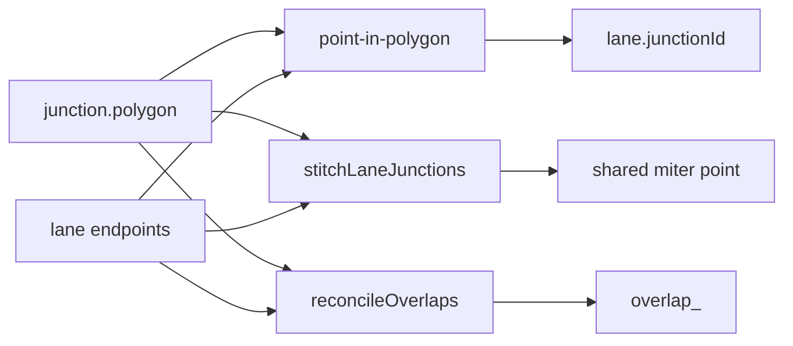
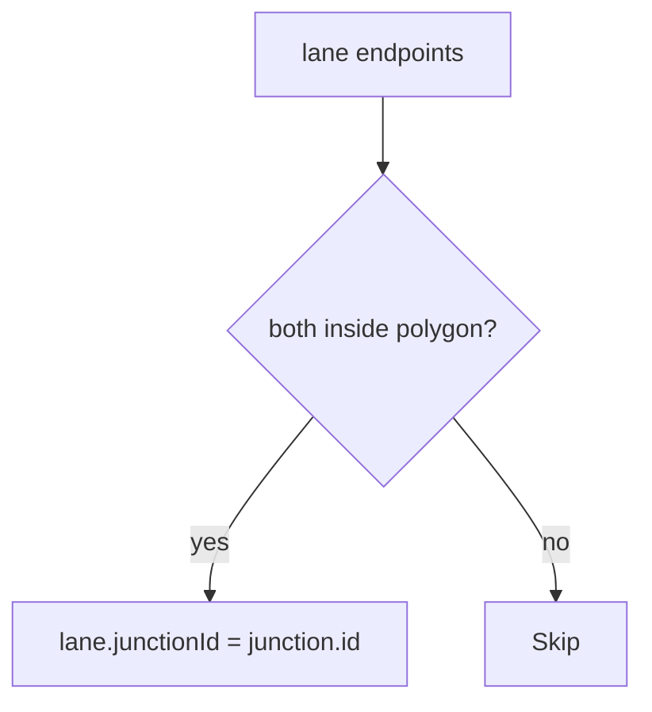
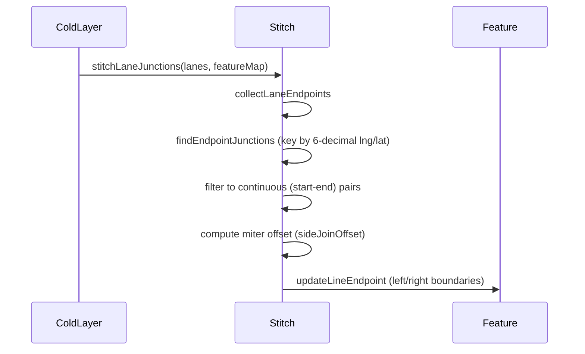
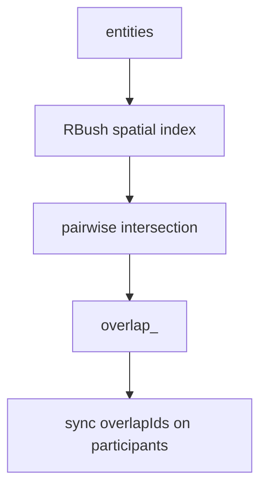

# 拓扑与路口 / Topology & Junctions

> 本页讲 **路口几何**（junction、pncJunction、area）与 **车道-路口缝合**（stitchLaneJunctions）。基础 lane 拓扑字段见 [拓扑](./topology.md)。

## 概览 / Overview



Apollo 区分两种路口结构：

| 类型           | 用途                               | 编辑器实体          |
| -------------- | ---------------------------------- | ------------------- |
| `junction`     | 物理路口多边形（十字、丁字、环岛） | `JunctionEntity`    |
| `pnc_junction` | Planning & Control 视角的路口语义  | `PNCJunctionEntity` |
| `area`         | 通用区域（可选）                   | `AreaEntity`        |

## 操作步骤 / Steps

### 1. 画 junction polygon

ToolStrip 选 `路口` → 默认 `drawPolygon` → 单击落点 → 双击或 `Enter` 闭合（guard `polygonCanClose`）。

```ts
interface JunctionEntity {
  id: string;
  entityType: 'junction';
  polygon: ApolloPolygon;
  type?: JunctionType; // UNKNOWN/IN_ROAD/CROSS_ROAD/FORK_ROAD/MAIN_SIDE/DEAD_END
  overlapIds: string[];
}
```

### 2. lane.junctionId 派生



只有「两端都在 polygon 内」才会设置 `junctionId`。半进半出的 lane 不算。

### 3. stitchLaneJunctions

`src/core/geometry/laneJunctions.ts` 在 cold layer 重建时把进出 junction 的连续端点对拉到共享 miter 点：



::: warning Start-start fork / End-end merge
`isContinuousJunction(a, b)` 仅返回 `true` 当 `a.isStart !== b.isStart`（一个起点 + 一个终点）。Start-start（分叉）与 end-end（合流）不缝合，否则会破坏分叉/合流的可见几何（`laneJunctions.ts:88-90`）。
:::

### 4. PNC junction & passage groups

PNC junction 比 junction 更高层：每个 `passageGroup` 内的 `passage` 把进入/离开车道按时序绑成「同一阶段可走的车道集合」。

```ts
interface PassageGroup {
  id: string;
  passages: Passage[];
}
interface Passage {
  id: string;
  signalIds: string[];
  yieldIds: string[];
  stopSignIds: string[];
  laneIds: string[];
  type: 'UNKNOWN_PASSAGE' | 'ENTRANCE' | 'EXIT';
}
```

（`src/types/apollo.ts:402-424`）

Inspector 提供 `passageGroups` 增删界面（参见 `src/components/layout/panels/InspectorForms.tsx`）。

### 5. overlap reconciliation

`reconcileOverlaps` 在导入和编辑后跑：



派生 ID 形态：`overlap_<sortedParticipantIds>`，例如 `overlap_lane_abc_lane_xyz`。重叠的 participant 同步把 overlap.id 写入自己的 `overlapIds`。

## 选项与参数表 / Options Table

| 字段                           | 类型                  | 说明                                                                                                                                                  |
| ------------------------------ | --------------------- | ----------------------------------------------------------------------------------------------------------------------------------------------------- |
| `JunctionType`                 | enum                  | UNKNOWN / IN_ROAD / CROSS_ROAD / FORK_ROAD / MAIN_SIDE / DEAD_END                                                                                     |
| `junction.polygon`             | `ApolloPolygon`       | `points: PointENU[]`                                                                                                                                  |
| `lane.junctionId`              | `string\|null`        | 由 PIP 派生                                                                                                                                           |
| `overlap.objects[].objectType` | union                 | lane / signal / stopSign / crosswalk / junction / yieldSign / clearArea / speedBump / parkingSpace / pncJunction / rsu / area / barrierGate / unknown |
| `overlap.regionOverlaps[]`     | `RegionOverlapInfo[]` | 区域重叠（lane↔crosswalk 多边形）                                                                                                                     |
| `_userOverrides`               | `string[]`            | 锁定字段路径（reconcile 不再覆盖）                                                                                                                    |
| `pncJunction.passageGroups`    | `PassageGroup[]`      | 多组多 passage                                                                                                                                        |

## 键盘鼠标速查表 / Shortcut Cheatsheet

| 操作                  | 快捷键 / 鼠标                | 说明                 |
| --------------------- | ---------------------------- | -------------------- |
| 画 junction           | ToolStrip 路口 → 单击 + 双击 | drawPolygon          |
| 画 PNC junction       | ToolStrip PNC 路口           | drawPolygon          |
| 给 lane 绑定 junction | 自动 PIP                     | 拖端点进入 polygon   |
| 添加 passage          | Inspector 增删               | `pncJunction` 选中态 |
| 切 polygon 顶点       | 选中 junction → 拖顶点       | `editingPoint`       |

## 常见问题 / Troubleshooting

### Q1. lane 一端进 polygon 一端没进，被识别成 junction lane

不会。规则是「两端都 inside」。检查另一端是否真的在 polygon 内（看 LayerTree 中 lane 是否在该 junction 子节点下）。

### Q2. junction polygon 拖动后旧 lane.junctionId 没更新

`updateEntity(junction)` 应触发 incremental reconcile。如果残留，可能是 batch update 漏了。重启或全量 reconcile。

### Q3. stitchLaneJunctions 把两条同向 lane 的端点拉到一起，破坏了分叉

那是 start-start fork。`isContinuousJunction` 应过滤掉。检查 `laneJunctions.ts:88-90` 的实现。

### Q4. overlap ID 在 import 和 export 之间变了

派生 ID 是确定性的（`overlap_<sortedIds>`）；如果变了说明 participant ID 顺序变了。检查 ID 排序的稳定性。

### Q5. `_userOverrides` 不生效

reconcile 跳过路径需要精确字符串匹配。例如 `"objects.0.laneOverlapInfo.isMerge"`。看 `overridePaths.ts`。

## 相关源码 / Source links

- 缝合：`src/core/geometry/laneJunctions.ts`
- 缝合内部：`src/core/geometry/laneJunctions/internal.ts`
- overlap reconcile：`src/core/elements/overlap/`
- override paths：`src/core/elements/overlap/overridePaths.ts`
- reconcile rules：`src/core/elements/derive/rules/`
- Inspector PNC：`src/components/layout/panels/InspectorForms.tsx`
- 类型：`src/types/apollo.ts:166-194` (junction), `:400-424` (pncJunction), `:347-398` (overlap)

## 相关文档 / See also

- [拓扑](./topology.md)
- [车道绘制](./drawing-lanes.md)
- [图层树](./layer-tree.md)
- [地图元素](./map-elements.md)
