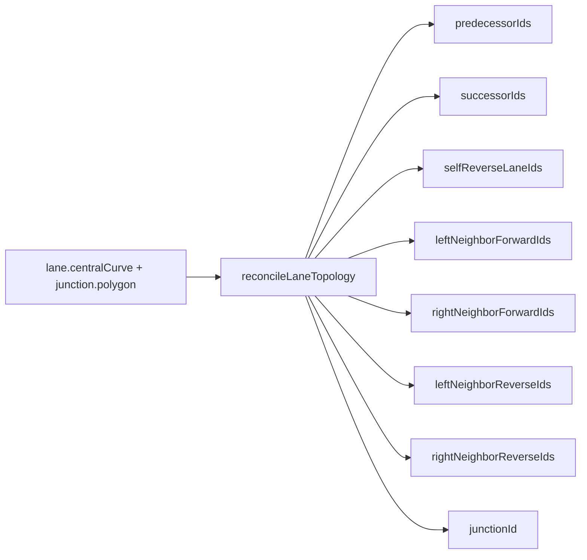
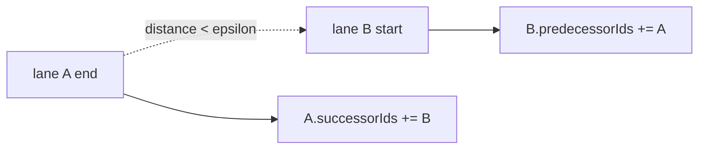
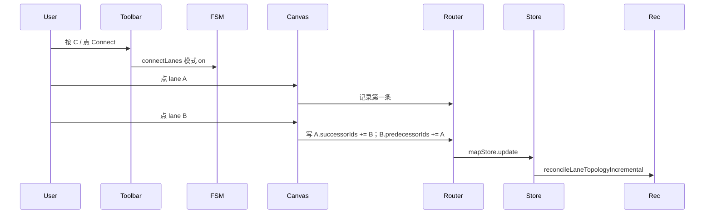

# 拓扑 / Topology

> Apollo Map Studio 的 lane 拓扑字段不是手工填写，而是由几何重算规则**派生**：`mapStore.addEntity / updateEntity / removeEntity` 受影响时调 `reconcileLaneTopologyIncremental()`；导入 / 导出 worker 调全量 `reconcileLaneTopology()`。

## 概览 / Overview



## 字段定义 / Field reference

来自 `src/types/apollo.ts:118-164`：

| 字段                      | 几何依据                                         |
| ------------------------- | ------------------------------------------------ |
| `predecessorIds`          | 起点（s=0）落到另一 lane 的终点                  |
| `successorIds`            | 终点落到另一 lane 的起点                         |
| `selfReverseLaneIds`      | 中心线在空间上重合、方向相反                     |
| `leftNeighborForwardIds`  | 左侧、heading 同向                               |
| `rightNeighborForwardIds` | 右侧、heading 同向                               |
| `leftNeighborReverseIds`  | 左侧、heading 反向                               |
| `rightNeighborReverseIds` | 右侧、heading 反向                               |
| `junctionId`              | 端点在某 junction.polygon 内（point-in-polygon） |

## 派生规则 / Derivation rules

### 1. predecessor / successor



阈值 epsilon 是「同点」距离（约 1e-6 度，~11 cm）。重合判定后双向写。

### 2. selfReverse

`selfReverseLaneIds`：两条 lane 中心线**完全重合**且**方向相反**。最常见的场景是双向单车道路在 Apollo 表达为两条反向 lane 共享同一段几何。

### 3. neighbor 四类

对每条 lane 取中心线方向（首尾差），与候选 lane 比较：

```mermaid
flowchart TD
  L1[lane A heading θa] --> Diff{|θa-θb| 比较}
  Diff -- "< 90°" --> Same[同向]
  Diff -- "> 90°" --> Rev[反向]
  Same --> SideS{lane B 在左/右?}
  Rev --> SideR{lane B 在左/右?}
  SideS -- 左 --> LF[leftNeighborForward]
  SideS -- 右 --> RF[rightNeighborForward]
  SideR -- 左 --> LR[leftNeighborReverse]
  SideR -- 右 --> RR[rightNeighborReverse]
```

### 4. junctionId

对 lane 起点 + 终点做 point-in-polygon。如果两端都在某 junction，写入 `junctionId`；只有一端在通常按业务定义为「不算」（实现按 reconcile 规则）。

## 操作步骤 / Steps

### 1. 自动派生

正常使用：画车道、画路口、移动控制点 → 拓扑字段自动重算。无需手填。

### 2. Connect Lanes 模式

在 ToolStrip 点 `C`（`connectLanes` action），进入连接模式：



适用于：几何上没接续但你确认是逻辑后继的特殊情况（汇流车道、虚线连接等）。

### 3. Inspector 中显示

选中 lane 后右侧 Inspector 列出所有拓扑列表，点击列表项可跳转到对应 lane（参见 `src/components/layout/panels/LaneRefList.tsx`）。

## 选项与参数表 / Options Table

| 字段                      | 类型         | 派生 / 手填             | 备注                                                                       |
| ------------------------- | ------------ | ----------------------- | -------------------------------------------------------------------------- |
| `predecessorIds`          | string[]     | 几何派生 + Connect 手填 | 双向写                                                                     |
| `successorIds`            | string[]     | 同上                    | 双向写                                                                     |
| `selfReverseLaneIds`      | string[]     | 几何派生                | 几何重合 + 方向相反                                                        |
| `leftNeighborForwardIds`  | string[]     | 几何派生                | heading 差 < 90°                                                           |
| `rightNeighborForwardIds` | string[]     | 几何派生                | 同上                                                                       |
| `leftNeighborReverseIds`  | string[]     | 几何派生                | heading 差 > 90°                                                           |
| `rightNeighborReverseIds` | string[]     | 几何派生                | 同上                                                                       |
| `junctionId`              | string\|null | 几何派生                | 两端 point-in-polygon                                                      |
| `overlapIds`              | string[]     | 由 reconcileOverlaps    | 不属于 reconcileLaneTopology，见 [拓扑与路口](./topology-and-junctions.md) |

## 键盘鼠标速查表 / Shortcut Cheatsheet

| 操作              | 快捷键 / 鼠标      | 说明                         |
| ----------------- | ------------------ | ---------------------------- |
| 进入 Connect 模式 | `C`                | `connectLanes` action toggle |
| 退出 Connect 模式 | `C` 再按 / `Esc`   | toggle off                   |
| 跳转到引用        | Inspector 列表点击 | `LaneRefList`                |
| 选中 lane         | 单击 lane 中心线   | `SELECT_ENTITY`              |

## 常见问题 / Troubleshooting

### Q1. 我画了两条 lane 端点对齐，但 successor 没写上

可能是端点距离超过 epsilon。检查 `applySnap` 是否真的把端点拉到同一点。

### Q2. `leftNeighborForward` 写到了反向那条

`reconcileLaneTopology` 用 lane 的中心线 heading 决定同向/反向。如果 `LaneEntity.direction` 字段反了，会被识别成反向。先纠正 direction。

### Q3. 删掉一条 lane 后，旁边 lane 的 predecessor 还指着它

`removeEntity` 应当触发 incremental reconcile，把过期 ID 从 neighbor / predecessor / successor 中移除。如果残留，可能是 incremental 漏掉了某条，重启 worker。

### Q4. 进入 Connect 模式画连接看不见线

实现细节：当前 Connect 模式只写 ID 不画临时线。提交后通过 cold layer 渲染。

### Q5. 导出后第三方校验工具（Apollo `dreamview`）报 lane orphan

通常是 `road.section.laneIds` 缺当前 lane。Topology reconcile 不维护 road 归属（那是 LayerTree 的拖拽职责）。

## 相关源码 / Source links

- 字段：`src/types/apollo.ts:118-164`
- 派生 rules：`src/core/elements/derive/`
- incremental reconcile：`src/core/elements/derive/index.ts`
- worker 全量：`src/io/apolloIO.worker.ts`
- LayerTree references：`src/components/layout/panels/LaneRefList.tsx`
- Connect 模式：`src/hooks/mapEventRouter/connectMode.ts`

## 相关文档 / See also

- [拓扑与路口](./topology-and-junctions.md)
- [车道绘制](./drawing-lanes.md)
- [图层树](./layer-tree.md)
- [地图元素](./map-elements.md)
