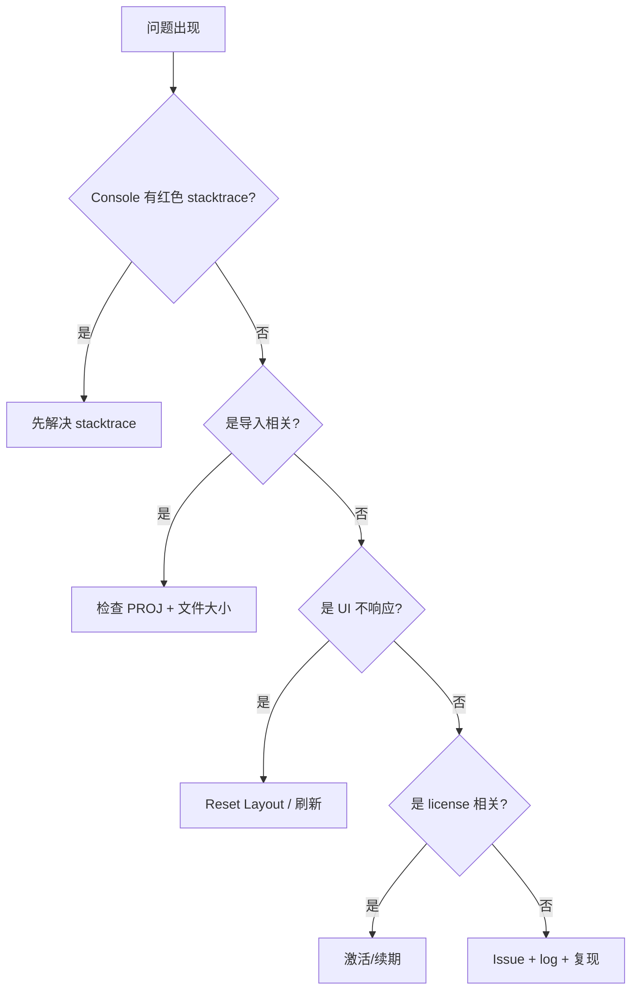

# 故障排查 / Troubleshooting

> 以下问题按 **首次看到的位置** 与 **真实根因** 整理。每条都附最小复现条件、诊断要点、立即缓解、根治方案。如果你的问题不在表中：先看 DevTools console 第一条红色 stacktrace，再 [GitHub Issues](https://github.com/apollo-map-studio/apollo-map-studio/issues) 搜关键词。

::: tip 提 issue 时附带

1. AMS 版本（`Help → About` 或 `package.json#version`）
2. 浏览器/Electron 版本
3. console 完整 stacktrace
4. 操作复现步骤
5. 涉及的 base_map 文件大小（如脱敏后能附最好）
   :::

## 1. Worker 启动失败 / Worker boot failures

### 症状

页面空白，console 报：

```
Failed to construct 'Worker': Module script's response has type 'text/html'
DOMException: Failed to construct 'Worker': Script at … cannot be accessed from origin 'null'
```

### 真因

Vite 在 dev 模式下以模块化 worker 加载，`new Worker(new URL('...', import.meta.url), { type: 'module' })` 路径解析依赖 `import.meta.url`。本地直接打开 HTML（file:// 协议）会失败。

### 立即缓解

- 用 `pnpm dev`，永远走 http://localhost:5173。
- 桌面端用打包后的 Electron exe，不要直接打开 dist/index.html。

### 根治

不要绕开 dev server / Electron loader。如真要静态部署，请用 `pnpm build` 并通过任意 HTTP server 提供（不能 file://）。

## 2. WASM / Proto 加载失败 / WASM & Proto loader

### 症状

`import` 或 `apolloIO.worker.ts` 启动时：

```
Error loading map.proto: net::ERR_FAILED
GET .../map_geometry.proto 404
```

### 真因

`proto/loader.ts` 用 `protobufjs/light` 在运行时加载 `.proto` 文件。Vite 通过 `?url` 或 `?raw` import 拷贝；如果有人手动改动了 `vite.config.ts` 资源处理，可能漏掉 .proto。

### 立即缓解

- 确认 `vite.config.ts` 内 `assetsInclude: ['**/*.proto']` 仍存在。
- 检查 `dist/assets/` 下是否有 hash 化的 .proto 文件。

### 根治

恢复 `assetsInclude`，重新 build。

## 3. PROJ 投影不匹配 / Projection mismatch

### 症状

- 导入后地图位置偏离正常位置（漂到南极洲、海里）
- 状态栏 `lane=… road=…` 数量正确，但地图上看不到任何车道
- 导出后 Apollo runtime 报 “lat/lng out of range”

### 真因

Apollo `Header.projection.proj` 字段是 PROJ.4 字符串。AMS 用 `proj4` 把 UTM 米反投影到 WGS84 经纬度。若 .bin 文件 header 缺失 / 字段被改 / 模板占位符 `{37.413082}` 没被解析，结果会偏。

`projection.ts:10-12` 的 `sanitizeProjString` 已处理花括号；但若文件根本没 PROJ，会回退到 `UTM_PRESETS.beijing`（zone 50N）。

### 立即缓解

1. 看状态栏的 `PROJ:` 提示（鼠标悬停 `apolloInfo.filename` 区域）。
2. 如显示的 PROJ 与你的地图实际位置不一致：
   - 删除 import → 等待 `ProjPickerDialog` 弹出 → 手动指定。
   - 或用 `UTM_PRESETS` 中的 sunnyvale/shanghai/shenzhen/beijing。

### 根治

确保上游 base_map 文件的 `Header.projection.proj` 字段填好。详见 [Coordinate System](./coordinate-system.md)。

## 4. 撤销异常 / Undo Glitch

### 症状

`Ctrl+Z` 之后：

- 地图上 lane 还原了；
- Inspector 显示旧字段；
- **下一次绘制 confirm 后实体形状错乱**（控制点叠在一起、长度为 0）。

### 真因（已修复，本节作为回归说明）

旧版本的 undo 不发 FSM `CANCEL`，导致 `editorMachine.context.drawPoints` 仍保留绘制中数据，但 `mapStore.entities` 已回滚——下一次 CONFIRM 把陈旧的 drawPoints 落到新 entity 上。

修复在 `useActionDispatcher.ts:76-82`：

```ts
case 'undo': {
  actorRef.send({ type: 'CANCEL' });   // ← R1 闭环
  useMapStore.temporal.getState().undo();
  return;
}
```

### 验证

跑 `src/hooks/__tests__/undoCancel.test.ts` 必须绿。如果再次出现，说明该 case 又被错误改动。

## 5. 许可证过期 / License Expired

### 症状

- 顶部出现红色 banner：`License expired — read-only mode`。
- Inspector 输入框灰色不可写。
- 绘制工具仍可点击但 commit 不进 store。

### 真因

`license.json.expires < Date.now()`，`canEdit=false`。

### 立即缓解

- 联系厂商续期。
- 临时抢救：`File → Export Apollo Map (.bin)` **仍可用**（导出不被 license 阻断），先保存当前 entities。

### 根治

详见 [License Activation](./license-activation.md)：粘贴新激活码，banner 转绿。

## 6. Dockview 状态损坏 / Dockview corruption

### 症状

- 加载后界面只剩 MenuBar；中央空白。
- console: `Cannot read properties of null (reading 'addPanel')` 或类似。
- 切 Drawing/Scene 后症状不变。

### 真因

`localStorage` 里的 `ams-layout-v3-drawing` 或 `ams-layout-v3-scene` JSON 损坏（手动改、跨版本不兼容）。

### 立即缓解

`View → Reset Layout`。如菜单已不可点：

```js
// DevTools console
localStorage.removeItem('ams-layout-v3-drawing');
localStorage.removeItem('ams-layout-v3-scene');
localStorage.removeItem('ams-layout-v2');
location.reload();
```

### 根治

不要手动改 layout 键；版本升级时 dockview 会自动 fallback，但极端版本跨度仍可能不兼容，必要时清键。

## 7. 绘制 FSM 卡死 / FSM Stuck

### 症状

- 鼠标点击地图但不出控制点；
- 状态栏左 2 显示 `Draw: Polyline` 但圆点不闪烁；
- 任意 ESC / H / 工具切换都无响应。

### 真因

`editorMachine` 已经 transition 到 `editingPoint` 但 React 没重新渲染（极少见，多由 lazy MapCanvas 在 Suspense fallback 状态下事件队列错位导致）。

### 立即缓解

- 按 `H` 切回 Default Mode（即便看不到反馈，event 会被发出）。
- 不行就刷新页面。

### 诊断

DevTools console：

```js
// 看当前 FSM state
window.__editorActor?.getSnapshot().value;
```

（仅 dev build 暴露 `__editorActor`）

## 8. 地图突然消失 / Map disappears

### 症状

平移 / 缩放后画布全黑。

### 真因

MapLibre WebGL context lost（GPU 驱动异常 / 浏览器 tab 后台过久）。

### 立即缓解

- 拖动滚轮一次（强制 invalidate）。
- 不行就 `View → Reset Layout`（重建 DockviewReact 实例 → 重建 MapLibre）。

### 根治

升级浏览器 / 显卡驱动；Electron 端用最新版本。

## 9. 导入超时 / Import timeout

### 症状

导入大文件 (>100MB) 后 10 分钟报 `Apollo IO request timed out after 600000ms`。

### 真因

`apolloIOBridge.ts:14` 的 `DEFAULT_TIMEOUT_MS = 10 * 60_000`。

### 立即缓解

- 增大 timeout：source build 改 14 行，或在浏览器 console `apolloIOBridge` 实例上动态打补丁（仅 dev）。
- 把大图离线拆分（用 Apollo 工具 `bazel run //modules/map/tools:map_split`）。

## 10. CommandPalette 不打开 / Palette dead

### 症状

按 `⌘K` 没反应。

### 真因

- 焦点在 contentEditable / iframe 内事件被吃掉。
- License 状态 `tampered`，`useLicenseSync` 抛错阻塞 dispatcher。

### 立即缓解

- 鼠标点 map 一下，重按 `⌘K`。
- 看 console 是否有红色 stacktrace；如有，先解决 license。

## 11. Inspector 不更新 / Inspector stale

### 症状

地图上选中 lane A，但 Inspector 还显示 lane B。

### 真因

`mapStore` 与 `editorMachine.context.selectedEntityId` 异步更新，存在竞态。极少见；通常 1 秒内自洽。

### 立即缓解

- 再次单击 A。
- 切到 Default Mode 再选。

## 12. 导出文件下载未触发 / Download silent

### 症状

`exportApolloBin` 走完进度条到 100%，但浏览器没下载。

### 真因

`downloadBlob` 用 `<a download>`；浏览器站点权限被拒。

### 立即缓解

- 浏览器右上角的下载图标，点 “Allow”。
- Chrome 设置 → 隐私 → 站点设置 → 自动下载允许。

## 13. macOS Gatekeeper / Notarization

### 症状

桌面 dmg 安装后双击 .app 报：

```
"Apollo Map Studio" cannot be opened because the developer cannot be verified.
```

### 真因

未签名 / 未公证。

### 立即缓解

`xattr -d com.apple.quarantine /Applications/Apollo\ Map\ Studio.app`（终端命令）。

### 根治

使用官方签名包；详见 [Installation](./installation.md)。

## 14. Linux AppImage 无图标 / AppImage no icon

### 症状

`./AppImage` 启动后任务栏无图标。

### 真因

KDE/GNOME 不一定从 AppImage 内取 desktop entry。

### 立即缓解

```bash
sudo apt install libfuse2
chmod +x AMS-x.y.z.AppImage
./AMS-x.y.z.AppImage --appimage-extract-and-run
```

或安装 [AppImageLauncher](https://github.com/TheAssassin/AppImageLauncher) 自动注册。

## 排查流程 / Diagnose Flow



## 配置存储位置 / Persistence

排错时常需要清的键：

| 键                      | 排错场景      |
| ----------------------- | ------------- |
| `ams-layout-v3-drawing` | dockview 损坏 |
| `ams-layout-v3-scene`   | 同            |
| `ams-layout-v2`         | 旧版本残留    |
| `apollo-map-studio:*`   | 设置错乱      |

## 相关源码 / Source

- `src/io/apolloIO.worker.ts` — worker 异常源头
- `src/io/apolloIOBridge.ts:108-122` — worker.onerror
- `src/io/proto/loader.ts` — proto/wasm 加载
- `src/io/proto/projection.ts` — PROJ.4 解析
- `src/hooks/useActionDispatcher.ts:76-82` — Undo R1 闭环
- `electron/main/license/` — license 主进程
- `src/components/layout/WorkspaceLayout/dockviewLayout.ts` — layout 持久化

## 相关文档 / See also

- [Importing](./importing.md) — 完整导入流水线
- [Exporting](./exporting.md) — 完整导出流水线
- [License Activation](./license-activation.md) — 许可证排错
- [Activity Bar & Panels](./activity-bar-and-panels.md) — Reset Layout
- [Settings](./settings.md) — 配置项
