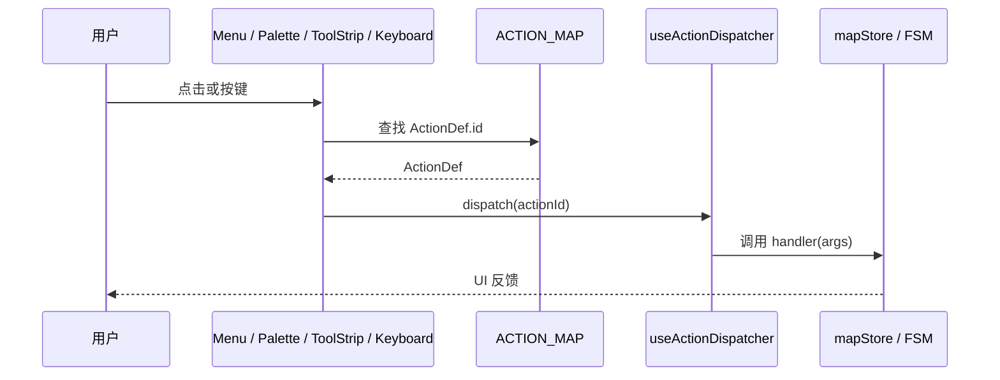

# 新增一个 Action

`src/core/actions/registry.ts` 是项目里 **所有** 用户可触发命令的唯一事实来源。
菜单栏、命令面板、`ToolStrip`、键盘处理器都通过它消费 `ActionDef`。
新增一项命令意味着 **只改一个文件**，不需要在 5 个组件里复制粘贴 JSX。

::: tip 设计原则
Action 必须是 **声明式**：你描述 "这个命令叫什么、放在哪个菜单、绑哪个键"，
分发逻辑由 registry 自动派发。如果你发现自己写了 `if (id === 'foo.bar')`
分支，请重新设计：要么把分支拆成新的 ActionDef，要么把分发逻辑下沉到 handler。
:::

## 目标 (Goal)

走完本节，你将拥有一个挂在 **菜单栏 → 编辑** 下、绑定到 `Ctrl+Shift+D`、
可在命令面板搜索到的 "复制实体" 命令。

## 前置条件 (Prerequisites)

- 熟悉 [架构概览](../architecture/overview)，知道 `core/` 与 `components/` 的边界。
- 已运行 `pnpm install && pnpm dev`，编辑器能正常打开。
- 知道 `mapStore`、`uiStore` 的差异（见 [状态管理](../architecture/state-management)）。

## Action 分发流程



四种入口都走同一个 `ACTION_MAP`，因此你只要把 ActionDef 定义对，所有入口同时生效。

## 步骤 (Step-by-step)

### 1. 给 Action 起一个稳定的 id

ID 必须是 `category.verb` 形式，全局唯一。命名规范：

| Category    | 用途                      | 示例                |
| ----------- | ------------------------- | ------------------- |
| `file`      | 导入 / 导出 / 新建 / 打开 | `file.importApollo` |
| `edit`      | 撤销 / 重做 / 复制 / 删除 | `edit.duplicate`    |
| `view`      | 缩放 / 显隐图层 / 主题    | `view.toggleGrid`   |
| `tool`      | 进入某个绘制状态          | `tool.drawLane`     |
| `selection` | 选择集合操作              | `selection.invert`  |

我们这次新增的是 `edit.duplicateSelection`。

### 2. 在 `definitions.ts` 中追加条目

```ts
// src/core/actions/registry/definitions.ts
import type { ActionDef } from './types';

export const ACTION_DEFS: ActionDef[] = [
  // ... 现有条目
  {
    id: 'edit.duplicateSelection',
    label: '复制选中实体',
    category: 'edit',
    menu: 'Edit',
    menuOrder: 35,
    icon: 'Copy',
    keybinding: { key: 'd', shiftKey: true, ctrlOrMeta: true },
    inCommandPalette: true,
    description: '在原位偏移 1 米克隆当前选中实体',
  },
];
```

::: warning ID 一旦发布就不要改
ID 是用户配置文件、URL、E2E 测试用例里的稳定锚点。改 id 等于破坏向后兼容。
要重命名时请提供 alias，并保留至少两个版本周期。
:::

### 3. 在 dispatcher 中接 handler

```ts
// src/hooks/useActionDispatcher.ts
import { duplicateEntity } from '@/lib/entityOps';

export function useActionDispatcher() {
  const dispatch = useCallback((id: ActionId) => {
    switch (id) {
      // ...
      case 'edit.duplicateSelection': {
        const selectedId = uiStore.getState().selectedEntityId;
        if (!selectedId) return;
        mapStore.getState().addEntity(duplicateEntity(selectedId));
        return;
      }
    }
  }, []);
  return dispatch;
}
```

::: danger 不要直接在 components 调用 mapStore
所有 store mutation 必须经过 dispatcher。这样未来加 telemetry / undo group / 权限校验
都只改一处。
:::

### 4. 写单元测试

```ts
// src/core/actions/__tests__/registry.test.ts
import { ACTION_MAP, getMenuActions, getCommandPaletteActions } from '../registry';

it('exposes duplicate action in Edit menu', () => {
  const editMenu = getMenuActions('Edit').map((a) => a.id);
  expect(editMenu).toContain('edit.duplicateSelection');
});

it('lists duplicate in command palette', () => {
  const palette = getCommandPaletteActions().map((a) => a.id);
  expect(palette).toContain('edit.duplicateSelection');
});

it('parses Ctrl+Shift+D keybinding', () => {
  const def = ACTION_MAP.get('edit.duplicateSelection');
  expect(def?.keybinding).toMatchObject({ key: 'd', shiftKey: true, ctrlOrMeta: true });
});
```

### 5. 跨平台快捷键校验

`ctrlOrMeta` 在 macOS 自动映射为 ⌘，在 Linux/Windows 映射为 Ctrl。
不要写死 `metaKey: true`，否则 Linux 用户按 Win 键会触发，相反 macOS 用 Ctrl 反而失效。
详见 [自定义快捷键](./customizing-shortcuts)。

### 6. 在命令面板手测一遍

1. 启动 `pnpm dev`。
2. 按 `Ctrl+K` 打开命令面板。
3. 输入 "复制" 应能搜到。
4. 选中一个实体后按 `Ctrl+Shift+D`，应在 `mapStore` 中出现一条新实体。

## 修改的文件 (Files modified)

| 文件                                          | 改动                |
| --------------------------------------------- | ------------------- |
| `src/core/actions/registry/definitions.ts`    | 追加 ActionDef      |
| `src/hooks/useActionDispatcher.ts`            | 新增 case 分支      |
| `src/lib/entityOps.ts`                        | 新 helper（如需要） |
| `src/core/actions/__tests__/registry.test.ts` | 新增断言            |

::: tip 不要碰这些文件

- `MenuBar.tsx` —— 由 `getMenuActions(menu)` 自动渲染。
- `CommandPalette.tsx` —— 由 `getCommandPaletteActions()` 自动渲染。
- `ToolStrip.tsx` —— 仅当 ActionDef 带 `drawTool` 才显示。

如果你发现自己在动这些文件，说明你绕过了 registry，停下来回到第 2 步。
:::

## 测试清单 (Testing checklist)

- [ ] `pnpm typecheck` 通过 —— `ActionId` 字面量联合包含新 id。
- [ ] `pnpm test src/core/actions` 通过。
- [ ] 手测：菜单显示、palette 搜索、快捷键触发各一次。
- [ ] macOS 用 `Cmd+Shift+D` 复测。
- [ ] 关闭命令面板再触发快捷键，确认 dispatcher 仍生效。

## 常见坑 (Common pitfalls)

### Action 不出现在菜单

90% 是 `menu` 字段写错（区分大小写）或 `menuOrder` 与已有冲突。
跑 `getMenuNames()` 看一下当前已注册菜单：

```ts
import { getMenuNames } from '@/core/actions/registry';
console.log(getMenuNames()); // ['File', 'Edit', 'View', ...]
```

### 快捷键不触发

- 输入框聚焦时键盘事件被吞，全局快捷键默认不触发；如果你确实想绕过，
  在 ActionDef 里加 `allowInInput: true`。
- 与浏览器原生快捷键冲突（如 `Ctrl+W`、`Ctrl+T`），换组合键。
- 检查 [`matchesKeybinding`](https://github.com/SakuraPuare/apollo-map-studio/blob/main/src/core/actions/registry/helpers.ts) 的 mac/win 映射逻辑。

### 命令面板搜索不到

`inCommandPalette: false`（默认 false！）。一定要显式设置为 `true`。

### 撤销时 Action 没回滚

Action 必须经过 mapStore 的 entity mutation 才会被 zundo 记录。
如果你直接改 ref 或 local state，撤销会跳过你这步。详见
[R1 撤销修复](../architecture/state-management#r1-undo-fix)。

## 相关源码 (Source links)

- [`src/core/actions/registry.ts`](https://github.com/SakuraPuare/apollo-map-studio/blob/main/src/core/actions/registry.ts) — 入口 re-export
- [`src/core/actions/registry/definitions.ts`](https://github.com/SakuraPuare/apollo-map-studio/blob/main/src/core/actions/registry/definitions.ts) — `ACTION_DEFS` 数组
- [`src/core/actions/registry/types.ts`](https://github.com/SakuraPuare/apollo-map-studio/blob/main/src/core/actions/registry/types.ts) — `ActionDef` 接口
- [`src/core/actions/registry/helpers.ts`](https://github.com/SakuraPuare/apollo-map-studio/blob/main/src/core/actions/registry/helpers.ts) — `matchesKeybinding`、平台感知
- [`src/hooks/useActionDispatcher.ts`](https://github.com/SakuraPuare/apollo-map-studio/blob/main/src/hooks/useActionDispatcher.ts) — 分发实现
- [`src/components/layout/panels/CommandPalette.tsx`](https://github.com/SakuraPuare/apollo-map-studio/blob/main/src/components/layout/panels/CommandPalette.tsx) — UI 入口

## 进阶 (Advanced)

### 条件可见 Action

```ts
{
  id: 'edit.duplicateSelection',
  // ...
  isEnabled: (ctx) => ctx.selectedEntityId !== null,
}
```

`MenuBar` 与命令面板会根据 `isEnabled(ctx)` 把它灰掉而不是隐藏，保留发现性。

### 动态 label

```ts
{
  id: 'edit.undo',
  label: (ctx) => ctx.lastActionName ? `撤销 "${ctx.lastActionName}"` : '撤销',
  // ...
}
```

### 工具型 Action（tool.\*）

绑了 `drawTool` 的 Action 会自动出现在 `ToolStrip`。详见
[新增绘制工具](./adding-a-new-drawing-tool)。

## 与权限系统的协作（未来）

::: tip Roadmap
当前所有 Action 对所有用户开放。未来可能引入轻量权限：在 ActionDef 加
`requires?: 'user' | 'editor' | 'admin'`。dispatcher 在分发前查
`useLicenseFeatures()` 当前角色，未授权直接 toast 提示。文档会在该机制
落地后更新。
:::

## i18n 备注

Action `label` 与 `description` 当前为硬编码字符串。i18n 接入后会包成
`t('action.edit.duplicate.label')`，但 ActionDef **签名不变**——只把
字符串字面量换成 i18n 函数调用。本仓库当前没有 i18next 依赖；任何
i18n PR 必须同时更新本文档。

::: tip 推荐节奏
1 个 PR = 1 个 Action。简短、好 review、好回滚。把 dispatcher 分支与
ActionDef 一起提交，避免出现 "ActionDef 已加但 dispatcher 没接" 的中间态。
:::
