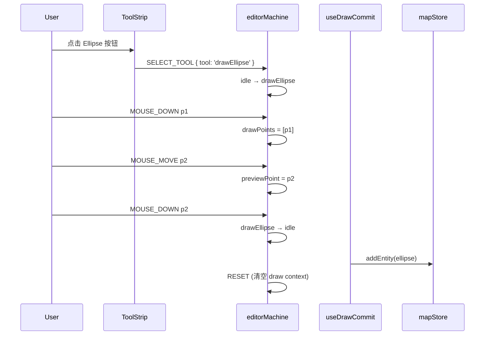

# 新增一个绘制工具

绘制工具 = `editorMachine` 的一个 **draw 状态** + 一个 ToolStrip 按钮 +
落盘 commit。我们把 "新增工具" 拆成三个独立的子任务，分别可单测，
最后串成完整链路。

::: tip 现存的 6 个 draw 状态
`drawPolyline` / `drawCatmullRom` / `drawBezier` / `drawArc` /
`drawRotatedRect` / `drawPolygon`。新增的 draw 工具应当遵循同样的事件
契约（`MOUSE_DOWN`、`MOUSE_MOVE`、`DOUBLE_CLICK`、`CONFIRM`、`CANCEL`）。
:::

## 目标 (Goal)

新增一个 **椭圆 (Ellipse)** 绘制工具：

- 第一次点击 = 椭圆中心。
- 拖拽 / 移动 = 实时预览长短轴。
- 第二次点击或双击 = 落盘。
- ESC = 取消。

## 前置条件 (Prerequisites)

- 已经走完 [新增 Action](./adding-a-new-action)。
- 知道 XState 5 的 `setup({}).createMachine(...)` 写法（虽然
  `editorMachine.ts` 当前还带 `@ts-nocheck`，写法本身仍是 v5）。
- 熟悉 `useDrawCommit` 监听 FSM transitions 的方式。

## 绘制全链路



## 步骤 (Step-by-step)

### 1. 在 `editorMachine.ts` 加状态

```ts
// src/core/fsm/editorMachine.ts
export type DrawTool =
  | 'drawPolyline'
  | 'drawCatmullRom'
  | 'drawBezier'
  | 'drawArc'
  | 'drawRotatedRect'
  | 'drawPolygon'
  | 'drawEllipse'; // 新增

const DRAW_STATES: readonly DrawTool[] = [
  'drawPolyline',
  'drawCatmullRom',
  'drawBezier',
  'drawArc',
  'drawRotatedRect',
  'drawPolygon',
  'drawEllipse',
];

// 在 states 块里：
states: {
  // ...
  drawEllipse: {
    on: {
      MOUSE_DOWN: [
        {
          guard: ({ context }) => context.drawPoints.length === 0,
          actions: assign({
            drawPoints: ({ context, event }) => [...context.drawPoints, event.point],
          }),
        },
        {
          // 第二次点击：触发 commit
          target: 'idle',
        },
      ],
      MOUSE_MOVE: {
        actions: assign({ previewPoint: ({ event }) => event.point }),
      },
      DOUBLE_CLICK: { target: 'idle' },
      CANCEL: { target: 'idle', actions: 'clearDrawCtx' },
    },
  },
}
```

::: warning 状态名 = 工具名
`drawEllipse` 这个字符串既是 FSM state value，也是 `DrawTool` 联合类型成员。
保持一致让 ToolStrip 能直接复用 `getToolAction(state.value)`。
:::

### 2. 在 `registry/definitions.ts` 加 Action

```ts
{
  id: 'tool.drawEllipse',
  label: '椭圆',
  category: 'tool',
  icon: 'Circle',
  drawTool: 'drawEllipse',
  keybinding: { key: 'e' },
  toolStripSlot: 'shape',
  toolStripOrder: 60,
  inCommandPalette: true,
}
```

带 `drawTool` 字段的 Action 自动出现在 `ToolStrip`。

### 3. 在 `useDrawCommit` 里加分支

```ts
// src/hooks/useDrawCommit.ts
useEffect(() => {
  const sub = editorActor.subscribe((snapshot, event) => {
    if (event.type !== 'COMPLETE') return;
    const { value, context } = snapshot;
    switch (value) {
      // ... 现有 case
      case 'drawEllipse': {
        if (context.drawPoints.length < 1 || !context.previewPoint) return;
        const [center] = context.drawPoints;
        const edge = context.previewPoint;
        const ellipse = createEllipse(center, edge);
        mapStore.getState().addEntity(ellipse);
        editorActor.send({ type: 'RESET' });
        return;
      }
    }
  });
  return () => sub.unsubscribe();
}, []);
```

### 4. 写几何工厂

```ts
// src/core/elements/ellipse.ts
import { nanoid } from 'nanoid';
import type { EllipseEntity, LngLat } from '@/types/entities';

export function createEllipse(center: LngLat, edge: LngLat): EllipseEntity {
  const a = Math.abs(edge[0] - center[0]);
  const b = Math.abs(edge[1] - center[1]);
  return {
    id: `ellipse_${nanoid(12)}`,
    entityType: 'ellipse',
    center,
    semiMajorAxis: a,
    semiMinorAxis: b,
    rotation: 0,
  };
}
```

::: tip 几何参数化
存最小参数集 `{ center, a, b, rotation }`，渲染时由 `apolloCompile` 编译成
GeoJSON Polygon。这样旋转 / 缩放 / undo 不会丢精度，也不会污染 cold 层缓存。
详见 [新增地图元素](./adding-a-new-element)。
:::

### 5. 整合 snap / connect

如果椭圆需要参与捕捉（snap）或拓扑连接（connect），在
`src/core/geometry/snap.ts` 注册其端点 / 中心点。

```ts
// src/core/geometry/snap.ts
case 'ellipse':
  return [{ kind: 'centerPoint', position: entity.center, entityId: entity.id }];
```

否则光标靠近椭圆时不会出现 snap 高亮圈。

### 6. 写测试

```ts
// src/core/elements/__tests__/ellipse.test.ts
import { createEllipse } from '../ellipse';

it('builds an ellipse with correct semi-axes', () => {
  const e = createEllipse([0, 0], [3, 2]);
  expect(e.semiMajorAxis).toBe(3);
  expect(e.semiMinorAxis).toBe(2);
});

// src/core/fsm/__tests__/editorMachine.test.ts
it('drawEllipse stays in state until second MOUSE_DOWN', () => {
  const actor = createActor(editorMachine).start();
  actor.send({ type: 'SELECT_TOOL', tool: 'drawEllipse' });
  actor.send({ type: 'MOUSE_DOWN', point: [0, 0] });
  expect(actor.getSnapshot().value).toBe('drawEllipse');
  actor.send({ type: 'MOUSE_DOWN', point: [3, 2] });
  expect(actor.getSnapshot().value).toBe('idle');
});
```

## 修改的文件 (Files modified)

| 文件                                           | 改动                         |
| ---------------------------------------------- | ---------------------------- |
| `src/core/fsm/editorMachine.ts`                | 新增 draw 状态 & DRAW_STATES |
| `src/core/actions/registry/definitions.ts`     | 新 ActionDef                 |
| `src/hooks/useDrawCommit.ts`                   | 新 commit 分支               |
| `src/core/elements/ellipse.ts`                 | 新工厂                       |
| `src/types/entities.ts`                        | `EllipseEntity` 加入联合     |
| `src/core/geometry/snap.ts`                    | snap 注册                    |
| `src/core/elements/__tests__/ellipse.test.ts`  | 新测试                       |
| `src/core/fsm/__tests__/editorMachine.test.ts` | 新 FSM 路径测试              |

## 测试清单 (Testing checklist)

- [ ] FSM 路径测试：`idle → drawEllipse → idle` 完整跑通。
- [ ] 双击落盘：双击直接 commit（即便只画了一个 anchor 也要安全失败）。
- [ ] ESC 取消：FSM 回到 `idle`，drawPoints 清空。
- [ ] mid-draw undo：开始画椭圆 → 按 Ctrl+Z，FSM 必须先收 `CANCEL` 再
      `temporal.undo()`，否则会复现 R1 缺陷。
- [ ] snap 高亮：靠近其它实体时端点 / 中心点能吸附。
- [ ] cold layer 渲染：commit 后 1 帧内出现在地图上。
- [ ] 性能：连续画 50 个椭圆，p99 帧时间 < 16ms。

## 常见坑 (Common pitfalls)

### 双击触发两次 commit

`MOUSE_DOWN` 与 `DOUBLE_CLICK` 都会触发 transition。在 `MOUSE_DOWN` 的 guard
里加 dedupe，或让 `DOUBLE_CLICK` 走专门的 transition 而不是叠加。
参考 [`clickDedup` 回归测试](https://github.com/SakuraPuare/apollo-map-studio/blob/main/src/hooks/__tests__/clickDedup.test.ts)。

### previewPoint 不更新

`MOUSE_MOVE` 事件没接到。检查 `mapEventRouter.ts` 是否在该 FSM 状态下
转发了 `mousemove`。

### Undo 后 FSM 残留 drawPoints

R1 闭合：`useActionDispatcher.ts:76-82` 必须先发 `CANCEL` 再 `temporal.undo()`。
没改这里 ⇒ undo 后 mapStore 回滚了，但 FSM 的 `drawPoints` 还指向不存在的
context，下次 `CONFIRM` 会崩。回归测试在
[`undoCancel.test.ts`](https://github.com/SakuraPuare/apollo-map-studio/blob/main/src/hooks/__tests__/undoCancel.test.ts)。

### ToolStrip 不显示按钮

ActionDef 没加 `drawTool` 字段，或 `toolStripSlot` 拼错。`toolStripSlot`
合法值见 `ToolStripSlot` 类型。

## 相关源码 (Source links)

- [`src/core/fsm/editorMachine.ts`](https://github.com/SakuraPuare/apollo-map-studio/blob/main/src/core/fsm/editorMachine.ts)
- [`src/hooks/useDrawCommit.ts`](https://github.com/SakuraPuare/apollo-map-studio/blob/main/src/hooks/useDrawCommit.ts)
- [`src/core/elements/`](https://github.com/SakuraPuare/apollo-map-studio/tree/main/src/core/elements)
- [`src/core/geometry/snap.ts`](https://github.com/SakuraPuare/apollo-map-studio/blob/main/src/core/geometry/snap.ts)
- [`src/hooks/__tests__/undoCancel.test.ts`](https://github.com/SakuraPuare/apollo-map-studio/blob/main/src/hooks/__tests__/undoCancel.test.ts)
- [`src/hooks/__tests__/clickDedup.test.ts`](https://github.com/SakuraPuare/apollo-map-studio/blob/main/src/hooks/__tests__/clickDedup.test.ts)

## 进阶 (Advanced)

### Apollo 元素工具

如果你画的不是几何图形而是 Apollo 元素（如 Lane、Junction），把
`activeElement` 一起注入 FSM 上下文：

```ts
actor.send({ type: 'SELECT_TOOL', tool: 'drawPolyline', element: 'lane' });
```

`useDrawCommit` 会根据 `activeElement` 选择对应工厂（`createLane`、
`createJunction` 等）。

### 自定义 commit 守卫

在 `useDrawCommit` 里前置校验：

```ts
if (polygonSelfIntersects(context.drawPoints)) {
  toastError('多边形自相交，已撤销');
  editorActor.send({ type: 'CANCEL' });
  return;
}
```

::: danger 永远不要让无效几何进 mapStore
落盘 = 真相。一旦无效几何写入 mapStore，后续所有计算（overlap、
junction graph、export）都会被污染。所有几何校验在 commit 前完成。
:::
