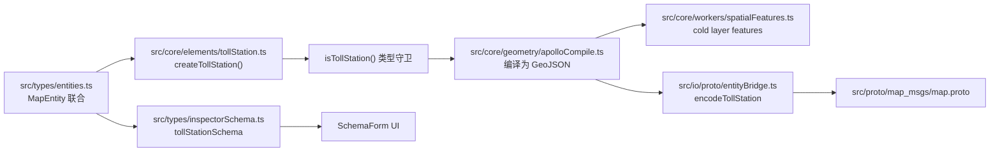

# 新增一个地图元素

地图元素 (Map Element) 是 Apollo HD Map 的具名实体：Lane、Junction、
Crosswalk、Signal、StopSign、SpeedBump、Yield、ClearArea、RSU、ParkingSpace、
BarrierGate、PNCJunction…… 它和[绘制工具](./adding-a-new-drawing-tool)是不同
的概念：绘制工具是 **怎么画**，元素是 **画出来的是什么**。

::: tip 何时新增元素
当你需要：

- 协议层（Apollo proto）有对应字段
- 在 inspector 里需要一组特定属性
- 在 cold layer 里有独立的样式
- 在 export 时需要序列化为单独的 message
  满足任一条都建议建为元素。否则用通用几何（Polyline/Polygon）即可。
  :::

## 目标 (Goal)

新增一个 **TollStation (收费站)** 元素：

- 几何：单个矩形多边形 + heading。
- 属性：站点编号、车道数、是否启用 ETC。
- inspector 显示：站点编号 / 车道数 / ETC 开关。
- export：进 `tollStation` repeated 字段。

## 前置条件 (Prerequisites)

- 已读 [Anti-corruption Layer](../architecture/anti-corruption)，理解
  `entityOps` 适配层为什么存在。
- 知道 cold layer / hot layer 的差异。
- 你要新增的元素已经在 `src/proto/*.proto` 里有对应 message（或你愿意先
  扩 proto）。

## 元素链路全景



## 步骤 (Step-by-step)

### 1. 扩展 `MapEntity` 联合

```ts
// src/types/entities.ts
export interface TollStationEntity {
  id: string;
  entityType: 'tollStation';
  polygon: PointENU[]; // 4 点矩形
  heading: number; // 弧度
  stationCode: string;
  laneCount: number;
  etcEnabled: boolean;
  overlapIds: string[];
}

export type MapEntity =
  | LaneEntity
  | JunctionEntity
  | CrosswalkEntity
  // ...
  | TollStationEntity; // 新增
```

::: warning 顺序敏感
TS 联合的成员顺序会影响 `entityType` 自动补全的展示。把新成员放在末尾，
不要在中间插入，避免 git diff 大爆炸。
:::

### 2. 写 type guard

```ts
// src/core/elements/tollStation.ts
import type { MapEntity, TollStationEntity } from '@/types/entities';

export function isTollStation(e: MapEntity): e is TollStationEntity {
  return e.entityType === 'tollStation';
}
```

### 3. 写工厂 + 默认值

```ts
import { nanoid } from 'nanoid';
import type { LngLat } from '@/types/entities';

export function createTollStation(rect: LngLat[], heading: number): TollStationEntity {
  if (rect.length !== 4) throw new Error('TollStation requires 4-point rect');
  return {
    id: `toll_${nanoid(12)}`,
    entityType: 'tollStation',
    polygon: rect.map(([x, y]) => ({ x, y })),
    heading,
    stationCode: '',
    laneCount: 1,
    etcEnabled: false,
    overlapIds: [],
  };
}
```

### 4. 接入 `entityOps` 适配层

```ts
// src/lib/entityOps.ts
import { isTollStation } from '@/core/elements/tollStation';

export function getEntityCenter(e: MapEntity): LngLat {
  if (isTollStation(e)) {
    const cx = e.polygon.reduce((s, p) => s + p.x, 0) / e.polygon.length;
    const cy = e.polygon.reduce((s, p) => s + p.y, 0) / e.polygon.length;
    return [cx, cy];
  }
  // ... 其它分支
}
```

::: danger 不要绕过 entityOps
任何要触碰 Apollo proto 字段的 UI 代码必须走 `entityOps`。直接 import
`@/core/geometry/apolloCompile` 是协议泄漏，proto v2 升级时会全场翻车。
检查命令：

```bash
git grep "from '@/core/geometry/apolloCompile'" -- 'src/components/**' 'src/hooks/**'
```

非空结果 = 新泄漏。
:::

### 5. 写 cold layer feature 编译

```ts
// src/core/workers/spatialFeatures.ts
function compileTollStationFeatures(e: TollStationEntity): GeoJSON.Feature[] {
  return [
    {
      type: 'Feature',
      id: e.id,
      properties: {
        id: e.id,
        kind: 'tollStation',
        etc: e.etcEnabled,
        layer: 'tollStation/fill',
      },
      geometry: {
        type: 'Polygon',
        coordinates: [[...e.polygon.map((p) => [p.x, p.y]), [e.polygon[0].x, e.polygon[0].y]]],
      },
    },
  ];
}
```

然后在 `compileEntity()` 里加分支：

```ts
case 'tollStation':
  return compileTollStationFeatures(entity);
```

### 6. 注册 inspector schema

```ts
// src/types/inspectorSchema.ts
export const tollStationSchema: EntitySchema<TollStationEntity, TollStationFormValues> = {
  entityType: 'tollStation',
  label: '收费站',
  validation: tollStationFormSchema, // zod
  fields: [
    {
      kind: 'string',
      name: 'stationCode',
      label: '站点编号',
      section: '基础',
      read: (e) => e.stationCode,
      write: (e, v) => ({ ...e, stationCode: v }),
    },
    {
      kind: 'number',
      name: 'laneCount',
      label: '车道数',
      section: '基础',
      min: 1,
      max: 32,
      step: 1,
      read: (e) => e.laneCount,
      write: (e, v) => ({ ...e, laneCount: v }),
    },
    {
      kind: 'boolean',
      name: 'etcEnabled',
      label: 'ETC',
      section: '设备',
      read: (e) => e.etcEnabled,
      write: (e, v) => ({ ...e, etcEnabled: v }),
    },
  ],
};
```

详见 [扩展 Inspector](./extending-the-inspector)。

### 7. 接 export

```ts
// src/io/proto/entityBridge.ts
function encodeTollStation(e: TollStationEntity): proto.TollStation {
  return proto.TollStation.create({
    id: { id: e.id },
    polygon: { points: e.polygon },
    heading: e.heading,
    stationCode: e.stationCode,
    laneCount: e.laneCount,
    etcEnabled: e.etcEnabled,
  });
}

// 在 buildMapMessage 里追加 repeated:
mapMessage.tollStation = entities.filter(isTollStation).map(encodeTollStation);
```

### 8. 接 import

```ts
// src/io/proto/entityBridge.ts
function decodeTollStation(m: proto.TollStation): TollStationEntity {
  return {
    id: m.id?.id ?? `toll_${nanoid(12)}`,
    entityType: 'tollStation',
    polygon: m.polygon?.points ?? [],
    heading: m.heading ?? 0,
    stationCode: m.stationCode ?? '',
    laneCount: m.laneCount ?? 1,
    etcEnabled: m.etcEnabled ?? false,
    overlapIds: [],
  };
}
```

### 9. 写测试

```ts
// src/core/elements/__tests__/tollStation.test.ts
it('factory builds rect with heading 0', () => {
  const e = createTollStation(
    [
      [0, 0],
      [1, 0],
      [1, 1],
      [0, 1],
    ],
    0,
  );
  expect(e.polygon).toHaveLength(4);
  expect(isTollStation(e)).toBe(true);
});

// src/io/__tests__/roundTrip.test.ts
it('TollStation survives import-export round trip', () => {
  const original = createTollStation(
    [
      [0, 0],
      [1, 0],
      [1, 1],
      [0, 1],
    ],
    0,
  );
  const encoded = encodeTollStation(original);
  const decoded = decodeTollStation(encoded);
  expect(decoded.stationCode).toBe(original.stationCode);
  expect(decoded.polygon).toEqual(original.polygon);
});
```

## 修改的文件 (Files modified)

| 文件                                              | 改动             |
| ------------------------------------------------- | ---------------- |
| `src/types/entities.ts`                           | 加联合成员       |
| `src/core/elements/tollStation.ts`                | 工厂 + guard     |
| `src/lib/entityOps.ts`                            | 适配层分支       |
| `src/core/workers/spatialFeatures.ts`             | cold layer 编译  |
| `src/types/inspectorSchema.ts`                    | inspector schema |
| `src/lib/schemas.ts`                              | zod form schema  |
| `src/io/proto/entityBridge.ts`                    | 解码             |
| `src/io/proto/entityBridge.ts`                    | 编码             |
| `src/proto/map_msgs/map.proto` （如不存在）       | 新 message       |
| `src/core/elements/__tests__/tollStation.test.ts` | 单测             |
| `src/io/__tests__/roundTrip.test.ts`              | round-trip       |

## 测试清单 (Testing checklist)

- [ ] 工厂参数缺失会抛错，不会落盘半成品。
- [ ] type guard 在所有现有元素上返回 false。
- [ ] cold layer 渲染：实际看到收费站填充色。
- [ ] inspector 字段双向：读 -> 改 -> 写回，FormState 与 mapStore 一致。
- [ ] import/export round-trip 数值精确（包括 proto2 optional 字段）。
- [ ] 与 lane / junction overlap 时，`overlapIds` 自动维护。

## 常见坑 (Common pitfalls)

### overlap 不更新

`overlapIds` 由 `overlap.worker.ts` 派生，不要手填。如果 worker 没识别新
元素，去 `src/core/workers/overlapBridge.ts` 加分支。

### 渲染层缺样式

`maplibre` style 里没有该 `properties.kind`，cold layer 编译出来了但是
不可见。在 `src/components/map/style.ts` 加 layer：

```ts
{
  id: 'tollStation/fill',
  type: 'fill',
  source: 'cold',
  filter: ['==', ['get', 'kind'], 'tollStation'],
  paint: { 'fill-color': 'var(--ams-tollstation-fill)' },
}
```

### inspector 编辑后地图不变

读写 adapter 不对称。`read(write(e, v))` 必须等于 `v`。写一条单测验证。

### 导出 proto 字段为 0/空

proto2 optional 字段需要显式 set。检查 `src/types/apollo.ts` 的字段是否
为 optional，并在 encode 里用 `!== undefined` 判断而不是 truthy。

## 相关源码 (Source links)

- [`src/types/entities.ts`](https://github.com/SakuraPuare/apollo-map-studio/blob/main/src/types/entities.ts)
- [`src/core/elements/`](https://github.com/SakuraPuare/apollo-map-studio/tree/main/src/core/elements)
- [`src/lib/entityOps.ts`](https://github.com/SakuraPuare/apollo-map-studio/blob/main/src/lib/entityOps.ts)
- [`src/core/workers/spatialFeatures.ts`](https://github.com/SakuraPuare/apollo-map-studio/blob/main/src/core/workers/spatialFeatures.ts)
- [`src/types/inspectorSchema.ts`](https://github.com/SakuraPuare/apollo-map-studio/blob/main/src/types/inspectorSchema.ts)
- [`src/io/proto/entityBridge.ts`](https://github.com/SakuraPuare/apollo-map-studio/blob/main/src/io/proto/entityBridge.ts)
- [`src/io/proto/entityBridge.ts`](https://github.com/SakuraPuare/apollo-map-studio/blob/main/src/io/proto/entityBridge.ts)
- [`src/proto/map_msgs/map.proto`](https://github.com/SakuraPuare/apollo-map-studio/blob/main/src/proto/map_msgs/map.proto)

## 进阶 (Advanced)

### 衍生字段

如果元素有 derivable 字段（例如 lane 的 `length` 由 centralCurve 推算），
在 `src/core/elements/derive.ts` 写派生函数，并用 `markUserOverride` 跟踪
用户覆盖：

```ts
import { markUserOverride } from '@/core/elements/derive';

write: (e, v) => markUserOverride({ ...e, laneCount: v }, 'laneCount'),
```

这让 import 时不会用 proto 默认值覆盖用户手动改过的字段。

### 与 lane 拓扑联动

如果新元素需要参与拓扑图（如 PNCJunction），在
`src/core/workers/laneJunctionGraph.ts` 加端点贡献逻辑。否则 graph
recompute 会忽略它。

::: tip 上线节奏
推荐三段式提交：

1. types + factory + guard + 单测
2. import/export + round-trip 单测
3. inspector schema + cold layer 样式 + UI 手测
   每段独立 review，互不阻塞。
   :::
