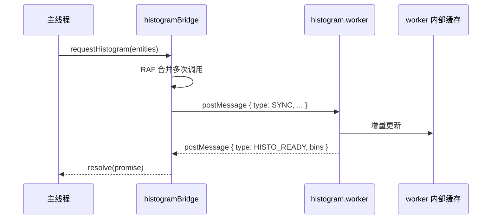

# 新增一个 Web Worker

Workers 把昂贵的同步计算挪出主线程：cold layer 编译、空间索引、几何
裁剪、overlap 派生都在 worker 里跑。本章演示如何新增一个 worker：
契约、合并、bridge、测试。

::: tip 何时新增 worker

- 主线程长任务 > 16ms（卡帧）。
- 计算可异步且没有 DOM/Canvas 依赖。
- 输入输出可结构化克隆（无函数、无 class instance、无 SharedArrayBuffer
  之外的不可克隆类型）。

否则（短任务 / 高频小数据）放主线程更省事，跨线程的 postMessage 开销会
吃掉收益。
:::

## 目标 (Goal)

新增一个 **车道宽度直方图 worker**：输入 mapStore 全部 lanes，输出每条 lane
的宽度采样直方图（离线统计，不卡帧）。

## 前置条件 (Prerequisites)

- 已读 [Cold Layer Pipeline](../architecture/cold-layer)。
- 知道 `spatial.worker.ts` / `overlap.worker.ts` 的契约。
- 你的工作内容确实 > 16ms（先 measure 再下手）。

## Worker 总览



## 步骤 (Step-by-step)

### 1. 在 `protocol.ts` 中定义消息

```ts
// src/core/workers/protocol.ts
export type HistogramRequest =
  | { type: 'HISTO_SYNC'; requestId: string; entities: SerializedEntity[] }
  | { type: 'HISTO_QUERY'; requestId: string; binCount: number };

export type HistogramResponse = { type: 'HISTO_READY'; requestId: string; bins: number[] };
```

::: warning 给消息名加前缀
`HISTO_*` 前缀避免与 `SYNC`、`HIT_TEST` 等公用名字冲突。Worker 单文件 OK，
将来若多 worker 共享一个 channel 则必须前缀。
:::

### 2. 创建 worker 文件

```ts
// src/core/workers/histogram.worker.ts
/// <reference lib="webworker" />
import type { HistogramRequest, HistogramResponse } from './protocol';

let cache = new Map<string, number[]>(); // entityId -> width samples

self.onmessage = (ev: MessageEvent<HistogramRequest>) => {
  const msg = ev.data;
  switch (msg.type) {
    case 'HISTO_SYNC': {
      cache = new Map();
      for (const e of msg.entities) {
        if (e.entityType !== 'lane') continue;
        cache.set(
          e.id,
          e.leftSamples.map((s) => s.width),
        );
      }
      reply({ type: 'HISTO_READY', requestId: msg.requestId, bins: computeBins(8) });
      break;
    }
    case 'HISTO_QUERY':
      reply({ type: 'HISTO_READY', requestId: msg.requestId, bins: computeBins(msg.binCount) });
      break;
  }
};

function computeBins(n: number): number[] {
  // ... 直方图算法
  return new Array(n).fill(0);
}

function reply(r: HistogramResponse) {
  (self as unknown as Worker).postMessage(r);
}
```

::: danger 不要在 worker 里 import React / DOM
worker 上下文没有 `window`、`document`、`React`。任何此类 import 在打包时
看不出错，运行时崩溃。把工具放在 `src/core/workers/utils/` 子目录，明确
worker-only。
:::

### 3. 写主线程 bridge

```ts
// src/core/workers/histogramBridge.ts
import HistogramWorker from './histogram.worker?worker';
import type { HistogramRequest, HistogramResponse } from './protocol';
import { nanoid } from 'nanoid';
import type { MapEntity } from '@/types/entities';

const worker = new HistogramWorker();
const pending = new Map<string, (r: HistogramResponse) => void>();

worker.onmessage = (ev) => {
  const r = ev.data as HistogramResponse;
  pending.get(r.requestId)?.(r);
  pending.delete(r.requestId);
};

let rafToken: number | null = null;
let queuedEntities: MapEntity[] | null = null;

export function requestHistogramSync(entities: MapEntity[]): void {
  queuedEntities = entities;
  if (rafToken !== null) return;
  rafToken = requestAnimationFrame(() => {
    const requestId = nanoid(8);
    worker.postMessage({ type: 'HISTO_SYNC', requestId, entities: queuedEntities! });
    queuedEntities = null;
    rafToken = null;
  });
}

export function queryBins(binCount: number): Promise<number[]> {
  return new Promise((resolve) => {
    const requestId = nanoid(8);
    pending.set(requestId, (r) => {
      if (r.type === 'HISTO_READY') resolve(r.bins);
    });
    worker.postMessage({ type: 'HISTO_QUERY', requestId, binCount });
  });
}
```

::: tip RAF 合并 = 60fps 的命脉
mapStore 在一次 zundo 操作里可能触发 5 次订阅回调。直接每次 postMessage
就是 5 次跨线程 clone。用 RAF 合并到下一帧只发 1 次，ToolStrip 流畅度
立竿见影。
:::

### 4. Vite worker import 配置

`?worker` 后缀是 Vite 内置语法，会把 worker 打包成独立 chunk。无需额外
配置。`?worker&inline` 则内联（小文件可用，大文件别用）。

### 5. 主线程调用

```ts
// src/components/StatsPanel.tsx
import { requestHistogramSync, queryBins } from '@/core/workers/histogramBridge';

useEffect(() => {
  const unsub = mapStore.subscribe((s) => requestHistogramSync([...s.entities.values()]));
  return unsub;
}, []);

const refresh = async () => {
  const bins = await queryBins(16);
  setBins(bins);
};
```

### 6. 测试

Vitest 默认在 jsdom 环境，worker 不可用。两种方案：

**A. 直接测算法**（推荐）：把 worker 逻辑分到纯函数 `computeBins.ts`
独立测，worker 只做 message routing。

```ts
// src/core/workers/__tests__/computeBins.test.ts
import { computeBins } from '../computeBins';
it('produces 8 bins from samples', () => {
  expect(computeBins([1, 2, 3], 8)).toHaveLength(8);
});
```

**B. 用 `vitest --environment node` + `worker_threads`** 跑端到端，
仅在确实需要时使用，集成测试代价高。

## 修改的文件 (Files modified)

| 文件                                             | 改动            |
| ------------------------------------------------ | --------------- |
| `src/core/workers/protocol.ts`                   | 新消息类型      |
| `src/core/workers/histogram.worker.ts`           | worker 实现     |
| `src/core/workers/histogramBridge.ts`            | RAF 合并 bridge |
| `src/core/workers/computeBins.ts`                | 纯函数（可测）  |
| `src/core/workers/__tests__/computeBins.test.ts` | 单测            |
| `src/components/StatsPanel.tsx`                  | 使用方          |

## 测试清单 (Testing checklist)

- [ ] worker 文件单独打包：`pnpm build` 后 `dist/assets/` 有
      `histogram-*.js` chunk。
- [ ] 1k entities SYNC 不卡主线程：DevTools Performance 看 main thread
      gap < 4ms。
- [ ] 同帧 100 次调用合并为 1 次 postMessage（看 worker `onmessage` 计数）。
- [ ] 错误消息有 `requestId`，pending map 能定位回响应。
- [ ] worker 崩溃后 bridge 不死锁：用 `worker.onerror` 兜底所有 pending。

## 常见坑 (Common pitfalls)

### `postMessage` clone 慢

数据里有 `Map`、`Set`、circular reference，结构化克隆退化甚至失败。
传输前 normalize 成 plain object / array。检查工具：

```ts
console.time('clone');
structuredClone(payload);
console.timeEnd('clone');
```

### Transferable 没用上

`ArrayBuffer` 大数组应当 transfer 而不是 clone：

```ts
worker.postMessage({ buffer }, [buffer]); // 第二参数 = transfer list
```

GeoJSON Feature 字符串无法 transfer，先 `JSON.stringify` + `TextEncoder`
变 `Uint8Array` 再 transfer 是常见优化。

### Worker import 路径不对

Vite 要求 `?worker` 后缀。直接 `import` worker 文件会被当普通模块打包，
浏览器执行时拿不到 `WorkerGlobalScope`。

### 多次 RAF 嵌套导致永不发送

`rafToken !== null` 守卫一定要在 RAF 回调中清除，否则后续调用全部被吞。
单测用 `vi.useFakeTimers()` + `vi.advanceTimersToNextFrame()` 验证。

### worker 与 main 共享类型

Workers 自己也是 TS 编译，但它们 **不能** import `@/components/*`。
保持 worker 只依赖 `@/types/*`、`@/core/workers/*`、`@/core/geometry/*`。
否则 tree-shake 失败时整个 React 都会被打进 worker chunk。

## 相关源码 (Source links)

- [`src/core/workers/protocol.ts`](https://github.com/SakuraPuare/apollo-map-studio/blob/main/src/core/workers/protocol.ts)
- [`src/core/workers/spatial.worker.ts`](https://github.com/SakuraPuare/apollo-map-studio/blob/main/src/core/workers/spatial.worker.ts)
- [`src/core/workers/spatialBridge.ts`](https://github.com/SakuraPuare/apollo-map-studio/blob/main/src/core/workers/spatialBridge.ts) — RAF 合并参考实现
- [`src/core/workers/overlap.worker.ts`](https://github.com/SakuraPuare/apollo-map-studio/blob/main/src/core/workers/overlap.worker.ts)

## 进阶 (Advanced)

### 增量协议

参考 `spatial.worker.ts` 的 `INCREMENTAL` 消息：只传 `added` /
`removed` / `updated`，worker 内部维护 cache，避免每次 SYNC 整表重算。
P1 phase 完成后大幅降低 postMessage 开销。

### 流式响应

worker 可以把结果分块返回：

```ts
self.postMessage({ type: 'HISTO_CHUNK', offset: 0, total: 1000, items: chunk });
// ...
self.postMessage({ type: 'HISTO_DONE' });
```

主线程边收边渲，1k entities 时首屏延迟从 80ms 降到 10ms。

### Shared Worker 与 ServiceWorker

跨多个 tab 共享计算？用 SharedWorker。但注意：MapLibre 与 Electron
渲染进程的兼容性需要单独验证。本项目当前未使用 SharedWorker。

::: warning 不要做的事

- 在 worker 里 fetch 用户文件（违反 CSP，且不可靠）。
- 在 worker 里 `eval()`（CSP `script-src` 直接 block）。
- 在 worker 里维持长期 setInterval（页面切走仍跑，电池杀手）。
  :::
