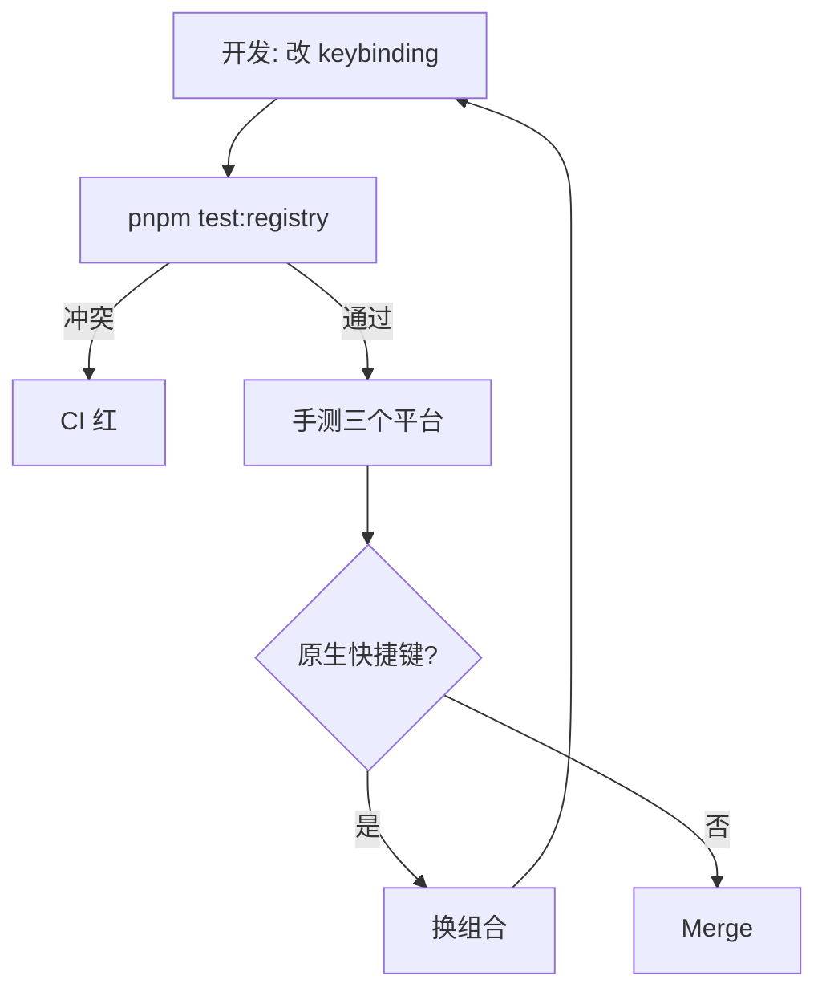

# 自定义快捷键

快捷键 = `ActionDef.keybinding` 字段。修改一个 Action 的快捷键不需要碰
键盘事件代码，只改 registry。本章覆盖：基础 keybinding、跨平台映射、冲突
检测、用户级覆盖。

::: tip 一次只学一件事
如果你还没读过 [新增 Action](./adding-a-new-action)，先去那里了解 ActionDef
结构，再回来。
:::

## 目标 (Goal)

- 把 "撤销" 从 `Ctrl+Z` 改成 `Ctrl+Shift+Z`（用于演示）。
- 在 macOS 自动变成 `⌘⇧Z`。
- 检测 `Ctrl+S` 与浏览器原生快捷键的冲突。

## KeyBinding 数据结构

```ts
// src/core/actions/registry/types.ts
export interface KeyBinding {
  key: string; // 单字符或 Key code（如 'Escape'、'F1'）
  ctrlOrMeta?: boolean; // ⌘ on macOS, Ctrl elsewhere
  ctrlKey?: boolean; // 强制 Ctrl（罕用）
  metaKey?: boolean; // 强制 Cmd（罕用）
  shiftKey?: boolean;
  altKey?: boolean;
  allowInInput?: boolean; // 默认 false
}
```

::: warning 用 `ctrlOrMeta`，不要用 `ctrlKey` / `metaKey`
99% 的快捷键想表达的是 "主修饰键"。`ctrlOrMeta: true` 在 macOS = ⌘，在
Linux/Windows = Ctrl。直接用 `ctrlKey` / `metaKey` 会让 macOS 用户按 Ctrl
而你的应用没反应。
:::

## 步骤 (Step-by-step)

### 1. 改 ActionDef

```ts
// src/core/actions/registry/definitions.ts
{
  id: 'edit.undo',
  label: '撤销',
  keybinding: { key: 'z', ctrlOrMeta: true, shiftKey: true },
  // ...
}
```

### 2. `pnpm test` 验证 registry 不报冲突

```ts
// src/core/actions/__tests__/registry.test.ts
it('keybindings are unique', () => {
  const seen = new Set<string>();
  for (const a of ACTION_DEFS) {
    if (!a.keybinding) continue;
    const key = JSON.stringify(a.keybinding);
    expect(seen.has(key)).toBe(false);
    seen.add(key);
  }
});
```

跑这条测试如果挂了 = 冲突。换组合键。

### 3. 平台感知文案

```ts
import { formatShortcut } from '@/core/actions/registry';

// 在菜单项展示：
formatShortcut({ key: 'z', ctrlOrMeta: true, shiftKey: true });
// macOS:  '⌘⇧Z'
// Linux:  'Ctrl+Shift+Z'
```

`formatShortcut` 自动用 `isMacPlatform()` 判断。永远不要手拼字符串。

### 4. 处理浏览器原生冲突

下表中的快捷键 **不要** 抢：浏览器拦在 React 之前，你的 handler 永远收
不到。

| 快捷键   | 浏览器行为   | 替代           |
| -------- | ------------ | -------------- |
| `Ctrl+W` | 关 tab       | `Ctrl+Shift+W` |
| `Ctrl+T` | 新 tab       | `Ctrl+Shift+T` |
| `Ctrl+N` | 新窗口       | `Alt+N`        |
| `Ctrl+P` | 打印         | `Ctrl+Shift+P` |
| `Ctrl+/` | （部分系统） | `Ctrl+Shift+/` |
| `F11`    | 全屏         | 用菜单项       |

::: warning Electron ≠ 浏览器
`pnpm electron:dev` 下 `Ctrl+W` / `Ctrl+T` 等可被自定义。但要保持 Web
版本和 Electron 版本一致体验，仍建议避开这些组合。
:::

### 5. 输入框中允许触发

默认全局快捷键在 `<input>`、`<textarea>`、`contenteditable` 元素聚焦时
被吞。如果是 "保存所有" 这种全局动作，加 `allowInInput: true`：

```ts
{
  id: 'file.save',
  keybinding: { key: 's', ctrlOrMeta: true, allowInInput: true },
}
```

::: danger 不要给删除类动作开 `allowInInput`
用户在搜索框敲 `Backspace` 是删字符，不是删实体。误开会导致意外数据丢失。
:::

## 跨平台映射对照表

| keybinding                                 | macOS 显示 | Linux/Win 显示 |
| ------------------------------------------ | ---------- | -------------- |
| `{ key: 'z', ctrlOrMeta: 1 }`              | `⌘Z`       | `Ctrl+Z`       |
| `{ key: 's', ctrlOrMeta: 1 }`              | `⌘S`       | `Ctrl+S`       |
| `{ key: 'F1' }`                            | `F1`       | `F1`           |
| `{ key: 'd', altKey: 1 }`                  | `⌥D`       | `Alt+D`        |
| `{ key: '/', shiftKey: 1, ctrlOrMeta: 1 }` | `⌘?`       | `Ctrl+?`       |

## 冲突检测流程



## 用户级覆盖（未来计划）

::: tip Roadmap
当前不支持用户自定义 keybinding。**计划**通过 `settingsStore.userKeyMap`
覆盖默认值；优先级 `userKeyMap > ActionDef.keybinding`。文档将在该功能落地
后更新。
:::

## 修改的文件 (Files modified)

| 文件                                          | 改动                  |
| --------------------------------------------- | --------------------- |
| `src/core/actions/registry/definitions.ts`    | 改 `keybinding` 字段  |
| `src/core/actions/__tests__/registry.test.ts` | 唯一性 / 显示格式断言 |

## 测试清单 (Testing checklist)

- [ ] `pnpm test src/core/actions` 通过。
- [ ] macOS / Linux / Windows 各按一次新组合，命令触发。
- [ ] 菜单项与 tooltip 文案随平台变化（看 `formatShortcut` 输出）。
- [ ] 输入框聚焦时该快捷键 **不应** 触发（除非 `allowInInput`）。
- [ ] 浏览器开发者工具控制台看到 `KeyBinding matched: edit.undo`（在 dev
      log 开 `KEY_BINDINGS` 频道）。

## 常见坑 (Common pitfalls)

### `key` 大小写

Web 标准 `KeyboardEvent.key` 在按住 Shift 时返回大写字母（`'Z'`），不按
返回小写（`'z'`）。**KeyBinding 用小写** —— `matchesKeybinding` 会做
case-insensitive 比较。

### 物理键 vs 字符

法语键盘 `M` 在 QWERTY 的 `;` 位。如果你想绑物理键位，用
`KeyboardEvent.code`（如 `'KeyM'`）而不是 `key`。本项目目前默认 `key`，
如确有需要可在 ActionDef 加 `useCode: true` 字段（待实现）。

### 与 maplibre 默认手势冲突

maplibre 的 `Shift+鼠标拖拽` 是矩形缩放，`Ctrl+鼠标拖拽` 是 pitch。
不要在 ActionDef 里复用这些组合做 click action。

### F-键被 OS 占用

`F11` 全屏（Win/Linux），`F12` DevTools（Chrome），`F4` Alt+F4 关闭。
建议 F-key 仅用于 F1（帮助）/ F2（重命名）。

## 相关源码 (Source links)

- [`src/core/actions/registry/types.ts`](https://github.com/SakuraPuare/apollo-map-studio/blob/main/src/core/actions/registry/types.ts) — `KeyBinding` 接口
- [`src/core/actions/registry/helpers.ts`](https://github.com/SakuraPuare/apollo-map-studio/blob/main/src/core/actions/registry/helpers.ts) — `matchesKeybinding`、`formatShortcut`、`isMacPlatform`
- [`src/hooks/useActionDispatcher.ts`](https://github.com/SakuraPuare/apollo-map-studio/blob/main/src/hooks/useActionDispatcher.ts) — action 执行 + keybinding listener

## 进阶 (Advanced)

### 多键序列（chord）

VS Code 风格 `Ctrl+K Ctrl+S`。当前项目 **不支持**；如需支持，参考
`useActionDispatcher` 增加 chord buffer + timeout（300ms）。注意 chord
模式下 ESC 必须能取消整个 chord。

### 仅在特定 FSM 状态生效

```ts
{
  id: 'tool.confirmDraw',
  keybinding: { key: 'Enter' },
  enabledStates: ['drawPolyline', 'drawPolygon'], // FSM gate
}
```

`useActionDispatcher` 在 dispatch 前检查当前 FSM state value。

## 用户调研建议

正式发版前，建议把核心快捷键打印成一张 cheatsheet 截图，丢给 5-10 个
用户跑 30 分钟测试，记录：

| 项目                               | 通过率目标 |
| ---------------------------------- | ---------- |
| 用户能否记住 5 个核心快捷键        | ≥ 80%      |
| 与本地编辑器（VS Code / QGIS）冲突 | ≤ 1 个     |
| 触发频率最高的功能是否有快捷键     | 100%       |

数据反馈到 `keybinding` 调整。常见结果：

- 删除 / 复制 / 撤销三联是用户最频繁，必绑。
- 工具切换（V/L/P 等单字符）大幅提速绘制。
- 视图操作（fit-to-content、reset zoom）很多人忘记，需要在 statusbar
  显示提示。

::: tip 一句话总结
**永远** 用 `ctrlOrMeta`、**永远** 用 `formatShortcut` 显示、**永远** 跑
唯一性测试。三件事做到，跨平台快捷键就稳。
:::

## 默认快捷键参考

| 操作            | 快捷键              |
| --------------- | ------------------- |
| 命令面板        | `Ctrl+K`            |
| 撤销 / 重做     | `Ctrl+Z` / `Ctrl+Y` |
| 保存            | `Ctrl+S`            |
| 选择 / 移动工具 | `V`                 |
| 绘制 polyline   | `L`                 |
| 绘制多边形      | `P`                 |
| 删除选中        | `Delete`            |
| 取消当前操作    | `Escape`            |
| 适应内容        | `Ctrl+0`            |
| 切换网格        | `Ctrl+'`            |

完整列表见 `src/core/actions/registry/definitions.ts`。修改任何一项都
请按本章流程走一遍。

## 总结

新增或修改快捷键的最小步骤：

1. 在 `definitions.ts` 改 / 加 `keybinding`。
2. 跑唯一性单测。
3. 在三平台手测（包括输入框聚焦场景）。
4. 在 PR 截图 / 录屏。

绝不绕过 ActionDef 直接写 `addEventListener('keydown', ...)`。
任何全局键盘 listener 必须经 `useActionDispatcher`。
