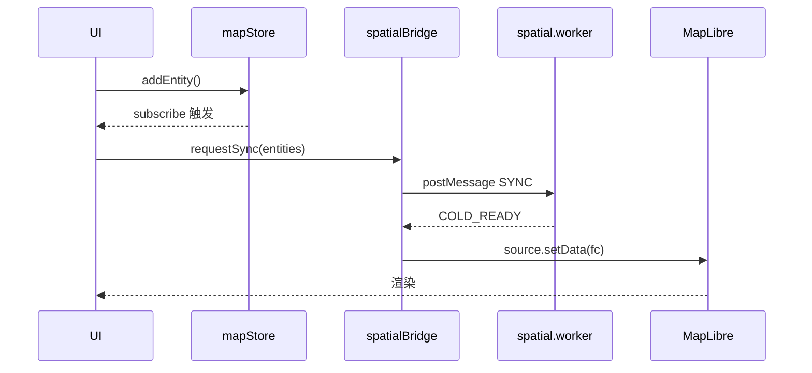

# 调试地图管线

地图管线 = mapStore → entityOps → spatial.worker → maplibre cold layer →
渲染。任何一节卡住都会出现 "实体在数据里但没显示"、"FPS 跳水" 等症状。
本章给你一套系统化排查方法。

::: tip 调试金字塔

1. **看数据**（mapStore） —— 实体在不在？
2. **看 worker** —— SYNC 是否成功？hit-test 走没走？
3. **看 maplibre** —— source 是否更新？feature 是否进了 layer？
4. **看 FSM** —— 当前 state 是不是预期？
5. **看 React** —— 组件 render 次数？

按顺序往下查，不要乱跳。
:::

## 调试链路全景



## 1. 浏览器 DevTools 基础配置

### Source Maps

`vite.config.ts` 已经默认开启 dev sourcemaps。验证：

```bash
pnpm dev
# 打开 DevTools → Sources → 应能看到 .ts/.tsx 文件而不是 .js
```

production build 默认 **不** 出 sourcemap，避免源码泄漏。如果排查
production 构建，临时打开：

```ts
// vite.config.ts
build: {
  sourcemap: true;
}
```

### React DevTools

安装 React DevTools 浏览器扩展。重点看：

- **Components 面板**：选中组件，看 props 和 hooks state。
- **Profiler 面板**：录一段交互，看哪个组件 re-render 多了。

::: warning re-render 不一定是性能问题
React 重渲非常快，真正卡的是 maplibre 重绘。先用 maplibre debug 模式
确认 GPU 路径，再回头看 React。
:::

### MapLibre debug=true

```ts
// src/components/map/MapCanvas.tsx
const map = new maplibregl.Map({
  // ...
  debug: import.meta.env.DEV,
});
```

或运行时切换：

```js
// DevTools console
window.__map.showTileBoundaries = true;
window.__map.showCollisionBoxes = true;
window.__map.showOverdrawInspector = true;
```

`showOverdrawInspector` 红 = 重绘，亮红区域是性能罪魁。

## 2. 看 mapStore

```js
// DevTools console
const s = window.__mapStore.getState();
console.log('entity count:', s.entities.size);
console.log(
  'first lane:',
  [...s.entities.values()].find((e) => e.entityType === 'lane'),
);
```

::: tip 暴露 store 给 console
`src/store/mapStore.ts` 在 `import.meta.env.DEV` 下挂到 `window.__mapStore`，
production 自动剥离。
:::

### 验证 zundo 历史

```js
const tmp = window.__mapStore.temporal.getState();
console.log('past:', tmp.pastStates.length, 'future:', tmp.futureStates.length);
```

`pastStates.length` 不增长 = 你的 mutation 没被记录（可能用了 `setState`
而非 `produce`）。

## 3. Worker 调试

### Chrome DevTools

DevTools → Sources → Threads 面板会列出 worker 线程。点进去能下断点、看
console。

### console 跨线程

worker 里 `console.log` 出现在 worker 自己的 console group（顶部 dropdown
切换）。看不到别忘了切线程。

### postMessage 监控

```js
const original = window.__spatialWorker.postMessage.bind(window.__spatialWorker);
window.__spatialWorker.postMessage = (msg) => {
  console.log('TX', msg.type, msg);
  original(msg);
};
window.__spatialWorker.addEventListener('message', (ev) =>
  console.log('RX', ev.data.type, ev.data),
);
```

::: warning 不要用 `JSON.stringify(msg)` 打长消息
1k entity 的 SYNC 字符串化几兆，DevTools 直接卡死。打 `msg.type` 即可。
:::

### Worker 不响应

按顺序排查：

1. **Worker 加载失败？** Network 面板看 `*.worker.js` 状态。
2. **Worker 抛异常？** `worker.onerror` 应该在 bridge 里日志化。
3. **消息名拼错？** worker `onmessage` switch 里 default 加 warn。
4. **死循环？** Performance 面板录制，worker thread 100% CPU = 死循环。

## 4. MapLibre 内部状态

```js
// 当前所有 source
window.__map.getStyle().sources;

// cold source 的 GeoJSON
window.__map.getSource('cold').serialize();

// 当前所有 layer
window.__map.getStyle().layers.map((l) => l.id);

// 某个 lane 的 feature
window.__map.querySourceFeatures('cold', { filter: ['==', 'id', 'lane_xxx'] });
```

### "feature 在 source 里但没渲染"

99% 是 layer filter 不匹配。检查 `properties.kind` 拼写、layer 顺序
（被遮盖）、`paint.fill-opacity` 是否为 0。

### "缩放级别看不见"

layer `minzoom` / `maxzoom` 限制。`window.__map.getZoom()` 看当前级别。

## 5. FSM Inspector

XState 5 提供了 `@statelyai/inspect`：

```ts
// src/core/fsm/editorMachine.ts
import { createBrowserInspector } from '@statelyai/inspect';
const { inspect } = createBrowserInspector({ autoStart: import.meta.env.DEV });

export const editorActor = createActor(editorMachine, { inspect }).start();
```

打开 https://stately.ai/registry/inspect 即可看到实时 FSM transitions。

### 命令行查看当前状态

```js
window.__editorActor.getSnapshot().value;
window.__editorActor.getSnapshot().context;
```

## 6. Log Channels

`browser DevTools console / worker protocol logs` 定义了分类日志：

| Channel        | 用途                     |
| -------------- | ------------------------ |
| `FSM`          | FSM transitions          |
| `WORKER_SYNC`  | spatial worker SYNC 时序 |
| `KEY_BINDINGS` | 键盘事件匹配             |
| `COLD_LAYER`   | cold source setData      |
| `OVERLAP`      | overlap 推导             |
| `IMPORT`       | apollo 导入解码          |
| `EXPORT`       | apollo 导出编码          |

启用：

```js
// DevTools console
localStorage.setItem('log:channels', 'FSM,WORKER_SYNC,COLD_LAYER');
location.reload();
```

或 URL 参数：`?log=FSM,WORKER_SYNC`。

::: tip 默认全关
production 全关 = 0 噪音。dev 也全关 = 最低开销。按需打开。
:::

## 7. Electron 调试

```bash
pnpm electron:dev
```

主进程：在终端里看 `console.log`。
渲染进程：和 web 一样，DevTools `Cmd+Opt+I`（macOS）或 `Ctrl+Shift+I`。

主进程加断点：

```bash
# 启动时
electron --inspect=5858 .
# Chrome 打开 chrome://inspect → Configure → 加 localhost:5858
```

## 8. 性能 profiling

### 录帧

DevTools → Performance → Record 5 秒，跑你的复现路径。

关注：

- **Main thread 长任务**（红条）—— 大于 16ms 必须修。
- **Layout shift / forced reflow** —— 通常是 React + maplibre style 变更
  顺序不对。
- **Worker 线程**（最下方 swimlane）—— SYNC 时间不应阻塞主线程。

### Vitest bench

不复现卡顿但想看回归：

```bash
pnpm bench
node scripts/check-bench-budget.mjs bench-results.json
```

详见 [基准测试](../contributing/benchmarking)。

## 修改的文件 (Files modified)

调试不直接改文件，但你可能需要：

| 文件                                              | 改动               |
| ------------------------------------------------- | ------------------ |
| `vite.config.ts`                                  | 临时打开 sourcemap |
| `src/components/map/MapCanvas.tsx`                | `debug: true`      |
| `browser DevTools console / worker protocol logs` | 加新 channel       |

## 常见症状速查

| 症状                 | 第一步排查                             |
| -------------------- | -------------------------------------- |
| 实体没出现           | mapStore 数据 → cold source feature    |
| 撤销后崩溃           | FSM 是否收到 CANCEL                    |
| Pan 卡顿             | maplibre debug overdraw inspector      |
| Worker 不响应        | Network 面板 + worker.onerror          |
| 快捷键无效           | log channel `KEY_BINDINGS`             |
| 导出 proto 字段空    | proto2 optional 是否显式 set           |
| 导入后文本框为空     | inspector schema read adapter          |
| FPS 在 1k 实体后骤降 | RAF 合并是否生效（看 worker 调用频率） |

## 相关源码 (Source links)

- [`browser DevTools console / worker protocol logs`](browser DevTools console / worker protocol logs)
- [`src/store/mapStore.ts`](https://github.com/SakuraPuare/apollo-map-studio/blob/main/src/store/mapStore.ts) — `__mapStore` 全局挂载
- [`src/components/map/MapCanvas.tsx`](https://github.com/SakuraPuare/apollo-map-studio/blob/main/src/components/map/MapCanvas.tsx)
- [Architecture: Cold Layer Pipeline](../architecture/cold-layer)

::: danger 不要在 production 留 console.log
ESLint 已经配 `no-console: warn (allow: warn,error)`。如果你必须 log
生产线索，用 log channel + `localStorage` 控制开关。
:::
