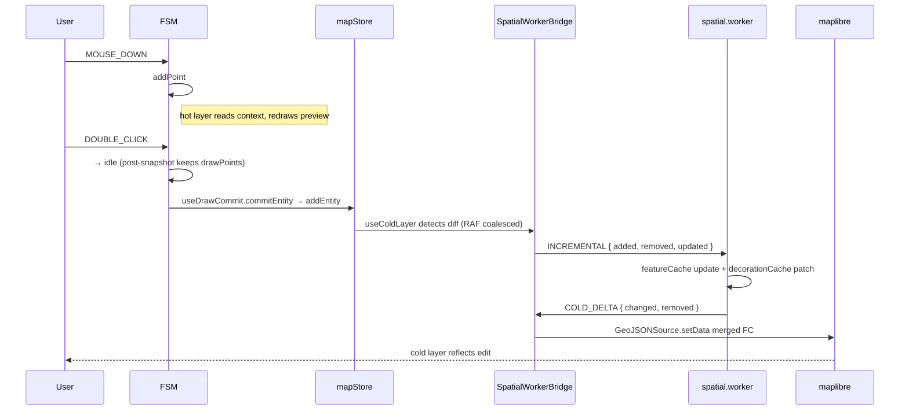

# Debugging the Map Pipeline

The map pipeline has four moving parts that often get blamed for each
other:

- **FSM** (`editorMachine`) — what mode is the editor in, what's the
  active draft / drag.
- **Stores** (`mapStore`, `uiStore`, `settingsStore`) — committed
  entities, UX preferences.
- **Cold layer** (worker round-trip → maplibre `setData`) — committed
  geometry on screen.
- **Hot layer** (RAF, no worker) — in-flight drawing / drag preview.

This recipe gives concrete debug recipes for the failure modes that
recur most often, plus a quick-reference flag matrix.

## Debug flag matrix

| Symptom                                 | First check                                                | Then                                 |
| --------------------------------------- | ---------------------------------------------------------- | ------------------------------------ |
| Cold layer stale after edit             | `SpatialWorkerBridge` postMessage in DevTools / Worker tab | `useColdLayer` RAF coalesce          |
| Hot layer flicker / off-by-one          | FSM POST-transition snapshot in `useDrawCommit`            | XState devtools state log            |
| Hit test selects nothing / wrong entity | `spatialHitTest` Mercator scale + radius                   | RBush bbox in worker state           |
| Junction stitching wrong                | `decorationCache` invalidation, `LaneJunctionGraph` deps   | INCREMENTAL affected-set             |
| Undo corrupts next CONFIRM              | R1 closure in `useActionDispatcher` (CANCEL before undo)   | `undoCancel.test.ts` regression      |
| Inspector edit ignored                  | `assertEditable()` license gate                            | `methods.watch` diff returning early |
| Tool button doesn't activate            | `getToggleState('defaultMode')` / FSM `activeElement`      | action registry `drawTool` field     |

## Pipeline overview



## Recipe 1 — Cold layer not updating

Symptom: edit committed, FSM idle, but the cold-layer GeoJSON looks
stale.

### Where the data flows

`mapStore.entities` → `useColdLayer` (RAF coalesced) → `SpatialWorkerBridge.send({ type: 'INCREMENTAL', ... })` → `spatial.worker.ts` → `COLD_DELTA` → `useColdLayer` → `map.getSource('cold').setData(...)`.

### Diagnosis

1. **Open DevTools → Application → Storage**, then DevTools → Sources
   → Workers (Chrome) and confirm `spatial.worker.ts` is listed.
2. **Switch to the Network tab → Worker filter** and reload. You
   should see one request for the worker bundle.
3. **Open the Console with the worker context selected** (top-left
   dropdown) and check for thrown errors. A worker exception kills
   subsequent processing silently from the main thread's POV — the
   `SpatialWorkerBridge.onerror` handler rejects all pending
   promises but doesn't always surface to the user.
4. **In the main-thread console**, log the bridge round-trip:
   ```js
   const { useMapStore } = await import('/@fs/.../store/mapStore.ts');
   useMapStore.subscribe((s) => console.log('entities:', s.entities.size));
   ```
   Edit the map; the count should change. If it does, mapStore is
   fine. If not, the dispatcher / form bypassed `mapStore`.
5. **Confirm `useColdLayer` is firing.** Add a `console.warn` inside
   the RAF callback and watch the timing — a missing animation
   schedule (component unmounted? a `useEffect` cleanup left a stale
   handle?) means the worker never gets the message.
6. **Confirm the worker received the request.** Add
   `console.warn('worker req:', e.data.type)` inside
   `self.onmessage` in `spatial.worker.ts` (debug only, revert
   before commit).

### Common cause

A handler that calls `mapStore.set(...)` in a way that bypasses the
zundo-wrapped store getters. Always use `addEntity` /
`updateEntity` / `removeEntity` from `mapStore.getState()`.

## Recipe 2 — Hot layer flicker / off-by-one

Symptom: while drawing, the live preview shows the wrong number of
points, or the last click "doesn't take" until the next mousemove.

### The post-transition snapshot rule

`useDrawCommit` subscribes to FSM transitions:

```ts
// src/hooks/useDrawCommit.ts
const subscription = actorRef.subscribe((snapshot) => {
  const prevState = prevSnapshot.value as string;
  const nextState = snapshot.value as string;

  if (nextState === 'idle' && isDrawingState(prevState)) {
    commitEntity(prevState, snapshot.context.drawPoints, …);
    actorRef.send({ type: 'RESET' });
  }
  prevSnapshot = snapshot;
});
```

The commit reads **`snapshot.context.drawPoints`** (post-transition),
not `prevSnapshot.context.drawPoints`. The transition's `addPoint`
action runs before the state changes, so `prevSnapshot` is missing
exactly one point.

### Diagnosis

1. Reproduce the flicker, then check FSM transitions in the XState
   devtools panel (or a `console.log` in the FSM subscription):
   - Confirm `prevState` is a draw state and `nextState` is `idle`.
   - Confirm `drawPoints.length` in the **post-transition** snapshot
     matches what the user clicked.
2. If `drawPoints` is short by one, somewhere in the transition you
   have `actions: 'resetDraw'` on the commit edge — that clears the
   context before commit reads it. Move `resetDraw` out; let
   `useDrawCommit` send `RESET` after commit instead.
3. If the polyline silently drops the last point on double-click,
   verify `useMapEventRouter.isDuplicateInput`. The dblclick dedup
   is in the input layer; if the FSM also slices the last point, the
   user loses one click. The FSM trusts the input layer here — see
   the comments in `editorMachine.ts` near `sharedDrawEvents`.

## Recipe 3 — Hit test wrong

Symptom: clicking on a lane near the edge selects a different lane,
or no entity at all.

### Where the work happens

`spatialHitTest.ts` performs RBush bbox lookup, then geo-distance
filter. The geo-distance is **Mercator-aware** — at high latitudes,
1° of longitude is much shorter than 1° of latitude. The radius is
expressed in metres and converted using the Mercator scale at the
clicked latitude.

### Diagnosis

1. Confirm the click reached the worker. Add a temporary
   `console.warn('HIT_TEST:', point, radius)` at the top of the
   hit-test handler in `spatialRequests.ts`.
2. Confirm the radius is reasonable. The default in `useColdLayer`
   converts pixel tolerance to metres using the current zoom. At
   zoom 18, ~6px ≈ 0.5m; at zoom 12, ~6px ≈ 30m.
3. Check the RBush bbox includes the clicked point. The bbox is
   `[minX, minY, maxX, maxY]` in **lon/lat**. If you migrated a
   feature to a different coordinate system somewhere, the entity is
   indexed at coordinates the test will never reach.
4. Check the geo-distance comparison. The worker uses
   `mercatorScaleAt(latitude)` to scale longitude differences before
   computing distance. A hit test that misses lanes only at high
   latitudes is almost always a missing scale call.

## Recipe 4 — Junction not stitching

Symptom: two lanes sharing an endpoint don't join their boundaries
visually.

### Where the work happens

`src/core/geometry/laneJunctions.ts` performs boundary stitching;
`src/core/workers/laneJunctionGraph.ts` tracks the dependency
graph (`LaneJunctionGraph.getDependents(id)`) so INCREMENTAL updates
re-decorate only the affected set.

### Diagnosis

1. Confirm the two lanes share an endpoint within tolerance. The
   stitching test compares endpoints with a small epsilon; if your
   lanes are 0.6m apart at endpoints, they don't stitch.
2. Confirm `decorationCache` invalidation. In INCREMENTAL flow, the
   affected set is `pre-update dependents ∪ changed lanes ∪
post-update dependents`. If you edited a lane that **becomes** a
   junction neighbour after the edit, the pre-update graph doesn't
   know about it — the affected set is built across both snapshots.
3. Force a full SYNC to confirm whether the issue is incremental
   logic or the underlying stitch:
   - Trigger an action that re-runs SYNC (e.g. import the same map,
     or temporarily disable INCREMENTAL in `useColdLayer`).
   - If the stitch shows up after SYNC, the bug is in incremental
     dependency tracking.
   - If it still doesn't, the bug is in `decorateBoundary` itself.
4. `LaneJunctionGraph` debug: add a `console.warn` inside
   `getDependents` showing the lane id and returned set. Compare
   against what you expect from the edited lane's neighbours.

## Recipe 5 — Undo corrupts next CONFIRM

Symptom: drawing → `Ctrl+Z` mid-draw → continue drawing → the next
CONFIRM produces a malformed entity.

This is the R1 regression. `useMapStore` is partialised
(`partialize: { entities }`), so `temporal.undo()` rolls back
`mapStore.entities` but leaves the FSM holding stale `drawPoints` /
`dragPointIndex`. The next CONFIRM writes against a corrupted draft.

### Fix (already shipped)

`useActionDispatcher.ts` wraps undo/redo:

```ts
const historyWithCancel = (op: 'undo' | 'redo') => {
  actorRef.send({ type: 'CANCEL' });
  if (op === 'undo') useMapStore.temporal.getState().undo();
  else useMapStore.temporal.getState().redo();
};
```

CANCEL is safe in every state — draw → idle+resetDraw, selected →
idle+deselect, editingPoint → selected, idle is a no-op.

### Regression test

`src/hooks/__tests__/undoCancel.test.ts` asserts the ordering. If
you change the dispatcher's history wiring, run that test first.

::: warning Don't bypass the dispatcher
Calling `useMapStore.temporal.getState().undo()` directly from any
new menu item / keyboard handler / IPC bridge defeats this fix. Route
through the dispatcher's `execute('undo')` so CANCEL fires.
:::

## Recipe 6 — Inspector edit ignored

Symptom: typing into the inspector form has no effect on the canvas.

### Diagnosis ladder

1. **License gate**: open the license banner. If the app is in any
   non-editable state, edits short-circuit at `assertEditable()`.
   Verify `LicenseState.canEdit === true`.
2. **Watch diff returns early**: `simpleForms.tsx` patterns return
   early when the new value equals the entity's current value. If
   you accidentally normalise input (`Number(value)` → `0` from `''`),
   the form thinks the value didn't change.
3. **`updateEntity` not called**: instrument the form's
   `methods.watch(...)` callback with a console log to confirm it
   fires on input.
4. **`updateEntity` returns null**: `mapStore.updateEntity` is a
   no-op when the entity doesn't exist. Confirm the entity id from
   the form matches `mapStore.entities`.

## Recipe 7 — Tool button doesn't activate

Symptom: clicking a ToolStrip tool selects it, but the cursor / FSM
state doesn't reflect the new tool.

### Diagnosis

1. Open DevTools → Console and dispatch the action manually:
   ```js
   window.__dispatcher.execute('tool:drawPolyline');
   ```
   (Only available if you wired `__dispatcher` to `window` for
   debugging — it's not in production.)
2. Verify the action def in `definitions.ts` has `drawTool:
'<state>'` matching a real FSM state name. Misspell `drawPolyline`
   as `drawPolyLine` and the FSM silently ignores `SELECT_TOOL`.
3. Verify the dispatcher's auto-handler loop:
   ```ts
   for (const action of ACTION_DEFS) {
     if (action.drawTool) {
       map.set(action.id, () => actorRef.send({ type: 'SELECT_TOOL', tool: action.drawTool }));
     }
   }
   ```
   If you replaced this with explicit `map.set` calls, you risk
   missing newly-added tools.

## Console / DevTools cheat sheet

```js
// 1. Inspect committed entities count
useMapStore.getState().entities.size;

// 2. Inspect FSM state
__actorRef?.getSnapshot().value;

// 3. Inspect FSM context
__actorRef?.getSnapshot().context;

// 4. Force a SYNC instead of INCREMENTAL (debug only)
useColdLayer.__forceSync = true;

// 5. Snapshot the cold layer GeoJSON
JSON.stringify(map.getSource('cold')._data);

// 6. Inspect license state
useLicenseStore.getState();
```

(Some of these helpers require a tiny `window.__actorRef = actorRef`
patch in dev mode. Add and revert as needed.)

## Cross-references

- [/architecture/overview](../architecture/overview.md) — full pipeline diagram
- [/architecture/state-management](../architecture/state-management.md) — store + FSM contracts
- [/api/core](../api/core/) — worker bridge, FSM, hit-test APIs
- [adding-a-worker](./adding-a-worker.md) — for tracing a new worker round-trip
- [adding-a-new-drawing-tool](./adding-a-new-drawing-tool.md) — post-transition snapshot rule
