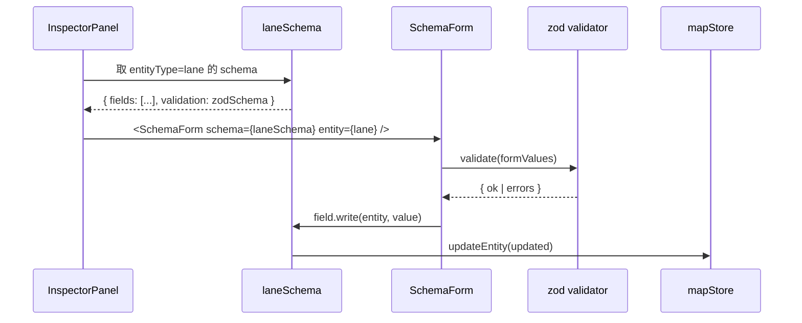

# 扩展 Inspector

Inspector 是右侧属性面板。在重构前，每个实体都有自己的 React 表单组件
（lane.tsx、junction.tsx ……）。schema-driven 方案让单一 `SchemaForm`
组件渲染任何实体，新增字段只改一处。

::: tip 现状
Lane 已经是 schema-driven 试点。Junction / Parking / Signal / StopSign
仍走 bespoke form，逐步迁移中。新增实体时**直接用 schema 路线**，不要
走老 bespoke 路。
:::

## 目标 (Goal)

给 Lane 新增一个 "建议跟车距离 (recommendedFollowDistance)" 字段：

- 表单显示为 number input。
- 范围 0-200，默认 30。
- zod 校验 + onChange gate。
- 写回 mapStore 时维持单位。

## 前置条件 (Prerequisites)

- 已读 [新增地图元素](./adding-a-new-element)。
- 知道 zod schema 与 react-hook-form 的协作方式。
- 熟悉 InspectorSchema 的 read/write adapter 模式（见
  `src/types/inspectorSchema.ts` 注释）。

## Schema 渲染流程



## 步骤 (Step-by-step)

### 1. 扩 zod form schema

```ts
// src/lib/schemas.ts
import { z } from 'zod';

export const laneSchema = z.object({
  // ... 现有字段
  recommendedFollowDistance: z.number().min(0).max(200).default(30),
});

export type LaneFormValues = z.infer<typeof laneSchema>;
```

### 2. 扩实体类型

```ts
// src/types/apollo.ts
export interface LaneEntity {
  // ... 现有字段
  recommendedFollowDistance?: number; // proto2 optional
}
```

### 3. 在 InspectorSchema 加 FieldDef

```ts
// src/types/inspectorSchema.ts
import { laneSchema, type LaneFormValues } from '@/lib/schemas';
import type { LaneEntity } from '@/types/apollo';

export const laneInspectorSchema: EntitySchema<LaneEntity, LaneFormValues> = {
  entityType: 'lane',
  label: '车道',
  validation: laneSchema,
  fields: [
    // ... 现有 fields
    {
      kind: 'number',
      name: 'recommendedFollowDistance',
      label: '建议跟车距离 (m)',
      section: '驾驶建议',
      min: 0,
      max: 200,
      step: 1,
      read: (e) => e.recommendedFollowDistance ?? 30,
      write: (e, v) => ({ ...e, recommendedFollowDistance: v }),
      ownsPaths: ['recommendedFollowDistance'],
    },
  ],
};
```

`read` 提供默认值（proto2 optional 字段可能缺失），`write` immutable
返回新对象。

### 4. 在 SchemaForm 检查 section 渲染

`src/components/layout/panels/SchemaForm.tsx` 自动按 `section` 分组渲染。
"驾驶建议" 是新 section，会变成新的 `<fieldset>`。无需改组件。

### 5. 写校验

```ts
// src/lib/schemas.ts
export const laneSchema = z
  .object({
    recommendedFollowDistance: z.number().min(0).max(200),
    speedLimit: z.number().positive(),
  })
  .refine(
    (v) => v.recommendedFollowDistance < v.speedLimit * 3, // 简单业务规则
    { message: '建议跟车距离过大，与限速不一致', path: ['recommendedFollowDistance'] },
  );
```

::: warning onChange gate
`SchemaForm` 把 zod schema 传给 `useForm({ resolver: zodResolver(schema), mode: 'onChange' })`。
**这是有意为之**——规避 commit 6a83d9d 的 silent-write bug：onSubmit
gate 让用户必须手动提交，破坏所见即所得。保留 onChange。
:::

### 6. 写测试

```ts
// src/types/__tests__/inspectorSchema.test.ts
import { laneInspectorSchema } from '../inspectorSchema';
import { createLane } from '@/core/elements/lane';

it('read returns default 30 when proto field absent', () => {
  const lane = createLane(/* ... */);
  delete lane.recommendedFollowDistance;
  const field = laneInspectorSchema.fields.find((f) => f.name === 'recommendedFollowDistance')!;
  expect(field.read(lane)).toBe(30);
});

it('write is immutable', () => {
  const lane = createLane(/* ... */);
  const field = laneInspectorSchema.fields.find((f) => f.name === 'recommendedFollowDistance')!;
  const next = field.write(lane, 50);
  expect(next).not.toBe(lane);
  expect(next.recommendedFollowDistance).toBe(50);
});
```

### 7. 验证 mapStore round-trip

手测：

1. 选中一条 lane。
2. 在 inspector 改 "建议跟车距离" 为 50。
3. DevTools console：`window.__mapStore.getState().entities.get(<id>).recommendedFollowDistance` 应为 50。
4. Ctrl+Z 撤销，应恢复 30（或缺失）。
5. 导出 → 重新导入 → 字段仍为 50（如果你改了 proto encode/decode）。

## 自定义 FieldKind

内置 kinds：`number` / `string` / `boolean` / `select` / `enum` /
`textArea` / `lengthDerived` / `laneRefList`。

新增自定义 kind：

```ts
// 1. 加类型
export interface ColorFieldDef<TEntity, TFormValues, TKey extends keyof TFormValues> {
  kind: 'color';
  name: TKey;
  label: string;
  section: string;
  read: (e: TEntity) => TFormValues[TKey];
  write: (e: TEntity, v: TFormValues[TKey]) => TEntity;
}
export type FieldDef<E, F, K extends keyof F> = /* 联合 */ | ColorFieldDef<E, F, K>;

// 2. 在 SchemaForm 加 case
case 'color':
  return <ColorPicker {...registerProps} />;
```

::: tip 一个新 kind = 一个 PR
别在加字段的 PR 里顺手扩 kind。"扩 kind" 是 InspectorSchema 框架级改动，
单独 review、单独测试、单独记 changelog。
:::

## 修改的文件 (Files modified)

| 文件                                          | 改动                |
| --------------------------------------------- | ------------------- |
| `src/types/apollo.ts`                         | 新 optional 字段    |
| `src/lib/schemas.ts`                          | zod schema 扩展     |
| `src/types/inspectorSchema.ts`                | 新 FieldDef         |
| `src/types/__tests__/inspectorSchema.test.ts` | read/write 单测     |
| `src/io/proto/entityBridge.ts`                | proto entity bridge |

## 测试清单 (Testing checklist)

- [ ] 表单 onChange 立即校验红框（输入 -1）。
- [ ] mapStore 写回正确，类型 `number`（不是 `string`）。
- [ ] proto2 optional 字段缺失时显示默认值，写回时确实落到 proto。
- [ ] Ctrl+Z 撤销恢复字段。
- [ ] round-trip：导出 → 删 mapStore → 导入 → 字段还在。
- [ ] 切换到另一条 lane 再切回来，FormState 正确重新挂载。

## 常见坑 (Common pitfalls)

### 切换实体后表单残留旧值

`SchemaForm` 必须用 `key={entity.id}` 强制 remount。否则 react-hook-form
保留旧 register。检查 `<SchemaForm key={entity.id} />`。

### 写回触发无限循环

`write` 返回 `{ ...e, x: v }` 必须返回 **新对象**，否则 zustand 浅比较
认为没变；但同时不能 `read(write(e, v)) !== v`，否则下次 render 又写回去
触发循环。adapter 必须是 idempotent。

### 单位错乱

UI 显示 km/h，底层存 m/s。`read` 做 ÷3.6，`write` 做 ×3.6。一定要在
adapter 里做转换，不要在组件里做。

### bespoke 表单残留

如果你在迁移已有实体，记得 `InspectorForms.tsx` 里把 `case 'lane'` 从
`<LaneForm />` 切到 `<SchemaForm schema={laneInspectorSchema} />`。
忘记切换 = 你写的 schema 永远没人渲染。

### proto2 optional vs required

`required` 字段缺失会让 protobufjs 抛错。`recommendedFollowDistance` 一定
要在 proto 里 `optional`，否则 import 旧文件会爆。

## 相关源码 (Source links)

- [`src/types/inspectorSchema.ts`](https://github.com/SakuraPuare/apollo-map-studio/blob/main/src/types/inspectorSchema.ts) — 接口与 lane pilot
- [`src/lib/schemas.ts`](https://github.com/SakuraPuare/apollo-map-studio/blob/main/src/lib/schemas.ts) — zod 表单 schema
- [`src/components/layout/panels/SchemaForm.tsx`](https://github.com/SakuraPuare/apollo-map-studio/blob/main/src/components/layout/panels/SchemaForm.tsx)
- [`src/components/layout/panels/InspectorForms/lane.tsx`](https://github.com/SakuraPuare/apollo-map-studio/blob/main/src/components/layout/panels/InspectorForms/lane.tsx) — 旧 bespoke form 参考
- [`src/components/layout/panels/InspectorForms/pncJunction.tsx`](https://github.com/SakuraPuare/apollo-map-studio/blob/main/src/components/layout/panels/InspectorForms/pncJunction.tsx)

## 进阶 (Advanced)

### 跨字段联动（dependent fields）

```ts
{
  kind: 'number',
  name: 'speedLimit',
  // ...
  onWriteSideEffect: (entity, value) => {
    // 联动调整建议跟车距离
    return { ...entity, recommendedFollowDistance: Math.max(value * 0.5, 10) };
  },
}
```

### 条件可见

```ts
{
  kind: 'boolean',
  name: 'allowOvertaking',
  visibleWhen: (entity) => entity.type !== 'PARKING',
}
```

### 自定义渲染（escape hatch）

```ts
{
  kind: 'custom',
  render: ({ entity, onChange }) => <MyWidget value={...} onChange={...} />,
}
```

::: warning custom 是逃生口
能用内置 kind 别用 custom。custom 跳过 schema 校验、跳过 telemetry、
跳过国际化基础设施。用前问自己 "这真的不是新 kind 吗"。
:::

::: tip 一句话
**所有** UI 操作走 schema → adapter → mapStore。直接编辑组件 ref / state
= 撤销失效 + 单测无依据。
:::
