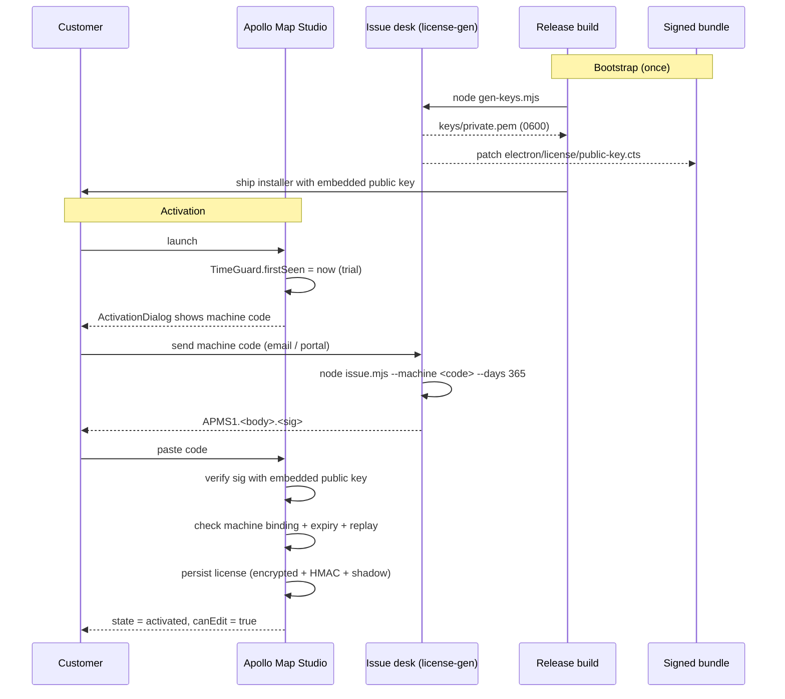
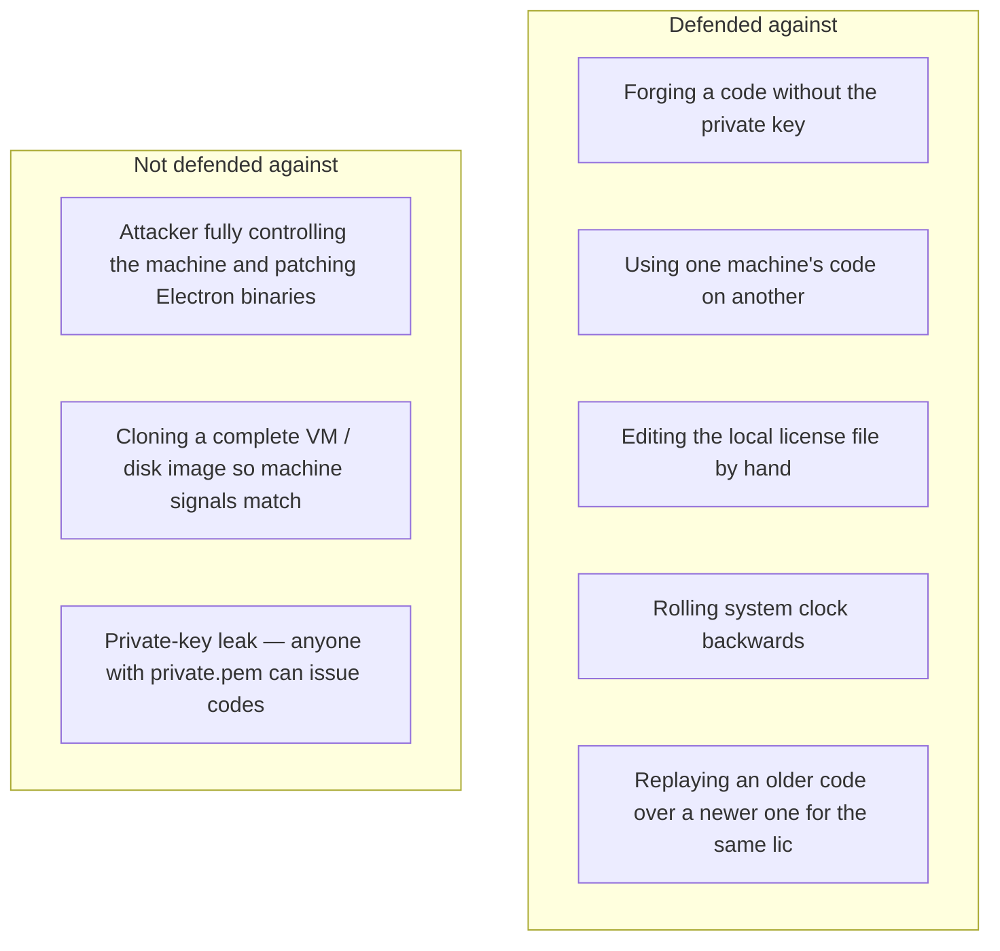

# Issuing License Keys

The desktop build enforces an offline activation system using Ed25519
signatures, machine-id binding, and a tamper-detecting time guard. The
private key never ships with the app — only the matching public key is
embedded in `electron/license/public-key.cts`.

This recipe walks through:

1. Generating the keypair.
2. Embedding the public key into the desktop bundle.
3. Issuing an activation code for a customer machine.
4. Verifying the code against the embedded key.
5. Threat-model boundaries — what the system protects against and what
   it doesn't.

## File map

```text
tools/license-gen/
  gen-keys.mjs         # generate / rotate Ed25519 keypair
  issue.mjs            # sign an activation code for a machine
  verify.mjs           # offline sanity-check a code against the embedded key
  package.json         # `npm run gen-keys | issue | verify`
  keys/
    .gitkeep
    private.pem        # CREATED — must stay off the device that ships builds
    public.pem         # human-readable copy of the embedded key

electron/license/
  public-key.cts       # embedded public key + APP_PEPPER + TOKEN_PREFIX
  manager.cts          # main-process activation state machine + IPC
  crypto.cts           # Ed25519 / AES-GCM / HMAC / HKDF
  machine-id.cts       # machine-code derivation
  storage.cts          # three-file mirrored license storage
  time-guard.cts       # tamper / time-rollback detection
  types.cts            # token payload + renderer state types
```

## Token format

Activation codes are printable strings:

```text
APMS1.<base64url(payload)>.<base64url(ed25519-signature)>
```

Payload (decoded):

```ts
interface LicensePayload {
  v: 1;
  lic: string; // license id, e.g. LIC-2026-05-02-3F2A91
  machine: string; // machine code, e.g. ABCD-EFGH-JKLM-NPQR
  issued: number; // epoch ms
  expires: number; // epoch ms; 0 = perpetual (avoid)
  features?: string[];
  name?: string;
  nonce: string;
}
```

The signature covers the `bodyB64` string, not the JSON. The desktop
app verifies signature with `LICENSE_PUBLIC_KEY_PEM` from
`electron/license/public-key.cts`.

## End-to-end issue + verify



## Step 1 — Generate the keypair (once)

On a controlled signing machine:

```sh
node tools/license-gen/gen-keys.mjs
```

Effects:

- Writes `tools/license-gen/keys/private.pem` with mode `0600`.
- Writes `tools/license-gen/keys/public.pem` (informational copy).
- **Atomically rewrites** `electron/license/public-key.cts` so the
  bundled public key matches the new private key.

If `private.pem` already exists, the script refuses to overwrite. Pass
`--rotate` to force regeneration — this is a release-grade event (see
"Rotating keys" below).

::: danger Private key handling

- Never check `tools/license-gen/keys/private.pem` into git.
  `keys/.gitkeep` is the only file in that directory that should be
  tracked.
- Never copy the private key onto build infrastructure, customer
  machines, demo bundles, or bug-report attachments.
- Treat the signing host like a CA — minimal access, audited usage,
  encrypted backups.
  :::

## Step 2 — Commit the embedded public key

The `gen-keys.mjs` script patches `electron/license/public-key.cts`
in place. **Commit the patched file** with the next release. If you
forget, the shipped app still uses the previous public key and rejects
codes issued from the new private key.

```sh
git diff electron/license/public-key.cts
git add electron/license/public-key.cts
git commit -m "chore(license): rotate Ed25519 keypair"
```

## Step 3 — Get the customer's machine code

The customer launches the desktop app and copies the code from the
activation dialog. Format:

```text
ABCD-EFGH-JKLM-NPQR
```

The code is derived in `electron/license/machine-id.cts`:

1. Collect platform / arch / OS release major / hostname.
2. Collect CPU model + count + memory bucket.
3. Pick a stable non-virtual MAC; fall back if unavailable.
4. Read `/etc/machine-id` (Linux), `IOPlatformUUID` (macOS), or
   `wmic csproduct UUID` (Windows).
5. HMAC-SHA256 with `APP_PEPPER`, take 80 bits, base32-encode,
   group into four blocks of four.

The first computation is persisted to `userData/.lic-machine.dat` so
later launches detect machine-id drift.

## Step 4 — Issue the code

```sh
node tools/license-gen/issue.mjs \
  --machine ABCD-EFGH-JKLM-NPQR \
  --days 365 \
  --name "Customer Inc."
```

Arguments (full table in `tools/license-gen/README.md`):

| Flag               | Default                              | Notes                                                                 |
| ------------------ | ------------------------------------ | --------------------------------------------------------------------- |
| `--machine` / `-m` | required                             | Customer's machine code; must match `^[A-Z0-9]{4}(-[A-Z0-9]{4}){3}$`. |
| `--days`           | `365`                                | Days to expiry; range `(0, 36525]`.                                   |
| `--expires`        | absent                               | ISO-8601 absolute expiry; overrides `--days` when supplied.           |
| `--name`           | empty                                | Customer name displayed in the activation dialog.                     |
| `--lic`            | auto `LIC-YYYY-MM-DD-XXXXXX`         | License id; reuse the same id when renewing.                          |
| `--features`       | empty                                | Reserved.                                                             |
| `--key`            | `tools/license-gen/keys/private.pem` | Override the signing key path.                                        |
| `--quiet`          | false                                | Suppress preamble; print only the code.                               |

Output: the activation code on stdout, the human-readable summary on
stderr. Redirect stdout to capture the code:

```sh
node tools/license-gen/issue.mjs \
  --machine ABCD-EFGH-JKLM-NPQR \
  --days 365 \
  --quiet > code.txt
```

## Step 5 — Sanity-check with `verify.mjs`

Before sending the code, verify against the **embedded** public key —
this confirms the customer's installed app will accept it:

```sh
node tools/license-gen/verify.mjs --code "$(cat code.txt)"
```

Output:

```json
{
  "valid": true,
  "payload": {
    "v": 1,
    "lic": "LIC-2026-05-02-3F2A91",
    "machine": "ABCD-EFGH-JKLM-NPQR",
    "issued": 1714694400000,
    "expires": 1746230400000,
    "name": "Customer Inc.",
    "nonce": "…"
  }
}
```

Exit codes:

| Code | Meaning                                                   |
| ---- | --------------------------------------------------------- |
| `0`  | Signature valid.                                          |
| `1`  | `--code` missing.                                         |
| `2`  | Token format malformed.                                   |
| `3`  | Cannot extract embedded public key from `public-key.cts`. |
| `4`  | Signature invalid.                                        |

If exit `4` after a key rotation, you're verifying with the old
embedded key — make sure the rotation commit is on the branch you
verify from.

## Step 6 — Send the code

The activation code is safe to email / print / paste in tickets —
without the matching machine code, an attacker cannot use it. The
customer pastes it into the activation dialog; the main-process
`LicenseManager` validates and persists it.

## Renewals

Renewing reuses the same `lic` id with a later `expires`:

```sh
node tools/license-gen/issue.mjs \
  --machine ABCD-EFGH-JKLM-NPQR \
  --lic LIC-2026-05-02-3F2A91 \
  --days 365
```

The desktop `LicenseManager` accepts an upgrade — replacing an
existing license with a later expiry — but **rejects downgrades** of
the same `lic` (a shorter expiry on the same id is treated as replay).

## Rotating keys

Rotation invalidates every code signed with the old private key:

```sh
node tools/license-gen/gen-keys.mjs --rotate
```

After rotation:

1. Commit the new `electron/license/public-key.cts`.
2. Release a new build (old installers still trust the old key).
3. Re-issue codes for every active customer.
4. Existing installs of older builds keep working with their existing
   codes until they upgrade.

::: warning Don't rotate `APP_PEPPER`
`APP_PEPPER` (in `electron/license/public-key.cts`) participates in
local storage encryption and HMAC key derivation. Changing it
invalidates every customer's locally stored license and clock state.
There is currently no migration path; treat `APP_PEPPER` as
permanent until a deliberate migration is designed.
:::

## Threat model



What the layered defenses give you:

- **Ed25519 signature** — without `private.pem`, fake codes won't
  verify. Cost: zero runtime overhead.
- **Machine binding** — codes carry the destination's machine code.
  A code for machine A is rejected on machine B.
- **Three-file mirrored storage** (`license.dat`, `.lic-state.json`,
  `.lic-shadow.dat` in `userData/`) — tampering with one file is
  caught by cross-checks; missing or mismatched files mark the
  install `tampered` and force re-activation.
- **TimeGuard** — encrypted clock state (`userData/.lic-clock.dat`)
  records the high-water mark, anchors mtime against the install dir,
  and detects rollbacks larger than a 5-minute grace window.
- **Replay protection** — same `lic` with shorter expiry rejected.

What the system **cannot** prevent:

- A determined attacker with full machine control patches the
  Electron main process, removes the verifier call, or modifies the
  embedded public key. This is the inherent limit of offline
  activation; mitigation is out-of-band (legal / commercial).
- Private-key leak — once `private.pem` is out, key rotation +
  re-issuing is the only remedy.
- VM / image cloning that preserves all hardware signals — machine
  code may collide.

## Trial period and tamper sticky-flag

`LicenseManager` defaults to a 7-day trial. `TimeGuard` writes
`firstSeen` on first launch. While no valid license is installed:

| Condition                          | State           | `canEdit` |
| ---------------------------------- | --------------- | --------- |
| `now < firstSeen`                  | `not_started`   | false     |
| `firstSeen ≤ now < firstSeen + 7d` | `trial`         | true      |
| `now ≥ firstSeen + 7d`             | `expired_trial` | false     |

`tampered` is **sticky** — once raised, the install stays read-only
even if the underlying signal returns to normal. Production IPC has no
reset; recovery is a support flow that clears
`userData/license.dat` / `.lic-state.json` / `.lic-shadow.dat` /
`.lic-clock.dat` and re-activates.

## Read-only enforcement

The license gate is enforced at three layers:

1. `useActionDispatcher.execute()` — calls `assertEditable()` before
   running edit-category, tool, selection, or `connectLanes` actions.
2. `mapStore.addEntity / updateEntity / removeEntity / reparentEntity`
   — `assertEditable()` again, defensive against any caller that
   bypasses the dispatcher.
3. UI affordances — `LicenseBanner` and the `ActivationDialog` give
   visible feedback when `canEdit === false`.

::: warning Import-replace path
The "import Apollo map" code path replaces the entire entity map at
once. It currently does **not** route through `assertEditable()`. If
you expose new bulk-replacement APIs, add an `assertEditable()` call
or document the gap explicitly so support can audit it.
:::

## Verification checklist

1. After running `gen-keys.mjs`, `git status` should show
   `electron/license/public-key.cts` modified and
   `tools/license-gen/keys/private.pem` **untracked**.
2. `node tools/license-gen/verify.mjs --code "$(cat code.txt)"` exits
   `0` for codes you just issued.
3. The machine code printed in the activation dialog matches the
   `payload.machine` shown in the verify output.
4. After activation, `LicenseState.canEdit` is `true` and the banner
   disappears.
5. Manually advance the system clock past `expires` — the next launch
   reports `expired_license` and `canEdit` flips to `false`.

## Cross-references

- `tools/license-gen/README.md` — complete reference, troubleshooting,
  ops guidance
- [packaging-desktop-builds](./packaging-desktop-builds.md) — how the
  embedded public key reaches the installer
- [/api/electron](../api/electron/) — `LicenseManager`, `TimeGuard`,
  storage internals
