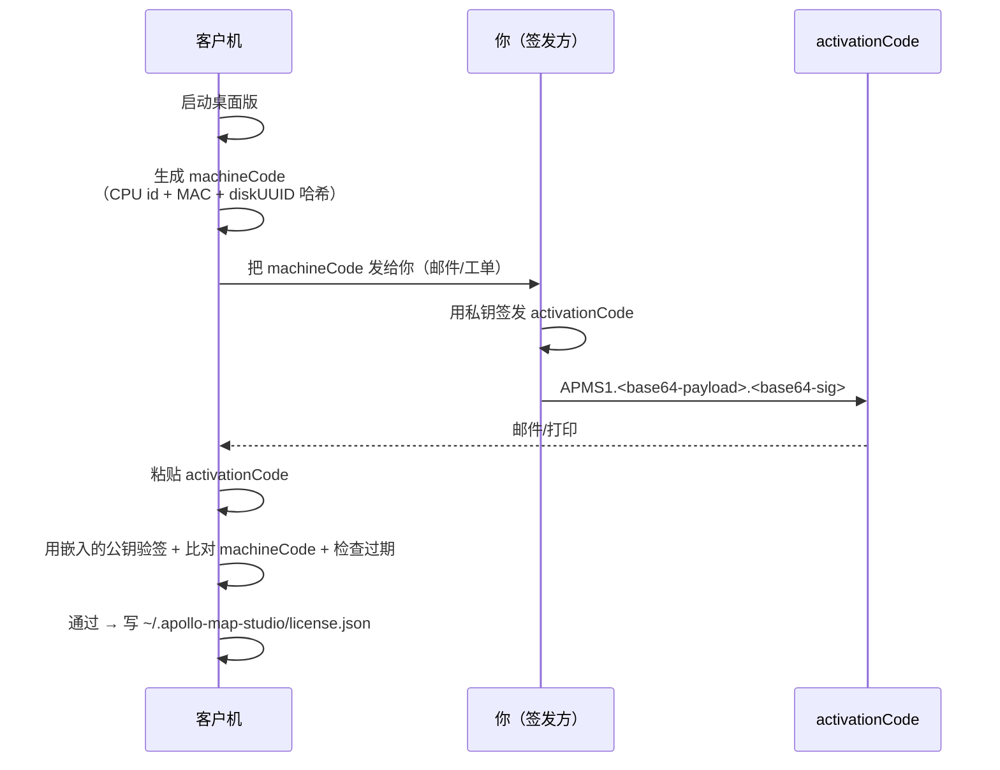

# 签发离线激活码

Apollo Map Studio 桌面版用 Ed25519 签名做离线激活：客户端生成
machineCode → 你用私钥签发 activationCode → 客户端验签放行。整个过程
**不需要联网**，特别适合内网 / 涉密场景。

::: danger 私钥唯一性
私钥泄漏 = 任何人都能签发激活码。永远不要把 `tools/license-gen/keys/private.pem`
提交到 git；keys/ 目录已在 `.gitignore`。生产私钥必须保存在 HSM /
1Password Vault / 离线机器中。
:::

## 目标 (Goal)

为客户 "Customer Inc." 签发一张 365 天的桌面激活码，绑定 machineCode
`ABCD-EFGH-JKLM-NPQR`。

## 前置条件 (Prerequisites)

- 已生成密钥对（`pnpm --filter license-gen gen-keys`）。
- 公钥 `tools/license-gen/keys/public.pem` 已嵌入 Electron 主进程
  （`electron/license/manager.cts`）。
- 私钥 `tools/license-gen/keys/private.pem` 仅在签发机器上存在。

## 离线激活总览



## 步骤 (Step-by-step)

### 1. 一次性：生成密钥对

在签发专用机器上：

```bash
cd tools/license-gen
pnpm install
node gen-keys.mjs --out keys/
```

输出：

```
keys/private.pem   # 仅你保存
keys/public.pem    # 嵌入 Electron 包
```

::: warning 永远不要复用私钥
每个产品线 / 主版本 一对密钥。`v1` 与 `v2` 升级时换私钥，能让旧激活码
作废。
:::

### 2. 嵌入公钥

```ts
// electron/license/manager.cts
import { readFileSync } from 'node:fs';
import path from 'node:path';

const PUBLIC_KEY_PEM = readFileSync(
  path.join(__dirname, '../../tools/license-gen/keys/public.pem'),
  'utf8',
);
```

build 时 Electron Builder 会把公钥打进 asar。验证打包结果：

```bash
pnpm package:linux
# 解压 release/linux-unpacked/resources/app.asar
# 公钥应当在内
```

### 3. 客户提供 machineCode

桌面版启动后，未激活时会弹出对话框显示：

```
Machine Code: ABCD-EFGH-JKLM-NPQR
```

让客户复制并发给你。

::: tip machineCode 不可逆
machineCode = `sha256(cpu-id || mac || disk-uuid)` 截断 + 分组。**不能**
反推机器信息——你拿到的只是个不透明的标识。
:::

### 4. 签发激活码

```bash
node tools/license-gen/issue.mjs \
  --machine ABCD-EFGH-JKLM-NPQR \
  --days 365 \
  --name "Customer Inc." \
  --lic LIC-2026-0042
```

输出（缩短示例）：

```
APMS1.eyJsaWMiOiJMSUMtMjAyNi0wMDQyIi...eyJleHAiOjE3...AaBbCc...
```

### 5. 把激活码发给客户

邮件 / 工单 / 加密附件均可。激活码包含：

- license id（用于撤销追踪）
- machineCode（绑定机器）
- expiresAt（过期时间，UTC ISO）
- features（保留给将来）
- 签名

::: tip 激活码可以公开
没有匹配的 machineCode，攻击者无法在另一台机器使用。所以激活码本身
不是秘密，但 machineCode + activationCode 同时泄漏 = 多设备复用。
建议在邮件里只放激活码，machineCode 由客户自己保留。
:::

### 6. 客户激活

桌面版"激活"对话框 → 粘贴 activationCode → "验证"。
通过时落地 `~/.apollo-map-studio/license.json`，下次启动直接通过。

### 7. 续期 / 替换机器

到期前 30 天客户端弹通知。用同样的命令重新签发：

```bash
node tools/license-gen/issue.mjs \
  --machine ABCD-EFGH-JKLM-NPQR \
  --days 365 \
  --name "Customer Inc." \
  --lic LIC-2027-0042
```

换机器时让客户提供新 machineCode，签发新激活码即可。

## 命令行参数 (CLI flags)

| Flag         | 说明                                        |
| ------------ | ------------------------------------------- |
| `--machine`  | 客户机器码（必填）                          |
| `--days`     | 有效天数；与 `--expires` 二选一             |
| `--expires`  | 绝对过期时间，ISO8601                       |
| `--name`     | 客户名称（落进激活码 metadata，非签名内容） |
| `--features` | 逗号列表，保留给未来 feature flag           |
| `--lic`      | license id；默认按 `LIC-YYYY-NNNN` 自动分配 |
| `--key`      | 私钥路径，默认 `keys/private.pem`           |
| `--quiet`    | 只输出激活码，无前导 banner                 |

## 修改的文件 (Files modified)

签发本身不改代码。涉及代码改动通常是：

| 文件                                | 何时改                           |
| ----------------------------------- | -------------------------------- |
| `tools/license-gen/issue.mjs`       | 加新 feature flag / 自定义元数据 |
| `tools/license-gen/verify.mjs`      | 同步验签逻辑                     |
| `electron/license/manager.cts`      | 客户端验签策略                   |
| `electron/license/storage.cts`      | 持久化路径 / 加密                |
| `tools/license-gen/keys/public.pem` | 主版本升级换密钥时               |

## 测试清单 (Testing checklist)

- [ ] `node tools/license-gen/verify.mjs --machine X --code Y` 本地验签通过。
- [ ] 在干净机器上启动桌面版，输入激活码，能进入主界面。
- [ ] 改一个字符的激活码 / machineCode → 验证失败。
- [ ] 把系统时间调到过期日之后 → 桌面版应回到激活界面（grace period
      可配，默认 24h）。
- [ ] 同一激活码在另一台机器输入 → 拒绝。

## 常见坑 (Common pitfalls)

### 验签通过但客户端报 "expired"

服务器签发时用 `--expires` 而你机器时区不对。永远用 ISO UTC：
`2027-01-01T00:00:00Z`，不要用本地时间。

### 私钥误提交到 git

立刻：

```bash
# 1. 历史擦除（对所有 fork、镜像同时执行）
git filter-repo --path tools/license-gen/keys/private.pem --invert-paths
# 2. 立即生成新密钥对
node tools/license-gen/gen-keys.mjs --out keys/
# 3. 发布带新公钥的紧急版本
# 4. 旧激活码全部作废，重新签发
```

::: danger 这是 P0 事故
立即拉群、立刻轮换、不要犹豫。
:::

### 客户的 machineCode 每次启动都变

可能客户使用了虚机 + 没有持久化 MAC。建议给虚机用户单独 SKU，绑定
licenseSeed 而非 machineCode。或要求客户固定 MAC。

### 激活后还是反复弹激活窗

`~/.apollo-map-studio/license.json` 写盘失败（权限 / 磁盘满）。检查
路径：`echo $HOME` + `ls -la ~/.apollo-map-studio/`。Windows 上对应
`%APPDATA%\apollo-map-studio\`。

### 多个 license 文件冲突

如果客户复制了 license.json 到另一台机器，本地 machineCode 不匹配会
报错。教育客户每次新机器要重新激活；不要复制 license 文件。

## 相关源码 (Source links)

- [`tools/license-gen/issue.mjs`](https://github.com/SakuraPuare/apollo-map-studio/blob/main/tools/license-gen/issue.mjs)
- [`tools/license-gen/verify.mjs`](https://github.com/SakuraPuare/apollo-map-studio/blob/main/tools/license-gen/verify.mjs)
- [`tools/license-gen/gen-keys.mjs`](https://github.com/SakuraPuare/apollo-map-studio/blob/main/tools/license-gen/gen-keys.mjs)
- [`tools/license-gen/README.md`](https://github.com/SakuraPuare/apollo-map-studio/blob/main/tools/license-gen/README.md)
- [`electron/license/manager.cts`](https://github.com/SakuraPuare/apollo-map-studio/blob/main/electron/license/manager.cts)

## 进阶 (Advanced)

### Feature flag

```bash
node issue.mjs --machine X --days 365 --features draw,export,pncJunction
```

电脑端在 `electron/license/manager.cts` 解出 `features` 数组，UI 用
`useLicenseFeatures()` 控制按钮可见性：

```ts
const { has } = useLicenseFeatures();
{has('pncJunction') && <DrawPncJunctionButton />}
```

### 撤销列表（CRL）

私钥泄漏前都做不到精确撤销。可选方案：

1. 内嵌 `revoked: ['LIC-2026-0042']` 列表，每次发版更新（粗粒度）。
2. 客户端定期联网拉 CRL（破坏离线属性）。

::: tip 当前策略
本项目当前不实现 CRL。靠 `--days` 短期签发（1 年）+ 紧急版本换公钥
应对极端情况。
:::

### 时间证明

担心客户改本地时间绕开过期？写入 license.json 时同时记录上次启动时间，
新启动时间 < 上次启动时间 = 时钟回拨，警告并退出。本项目已实现
"monotonic launch timestamp"。

::: warning 不是真正的 DRM
任何客户端验证都可被反编译绕过。激活码的目的是 **合规 + 计费**，不是
防止盗版。盗版用户从来不是付费用户的潜在转化群体——把精力放在易用性
上更划算。
:::
