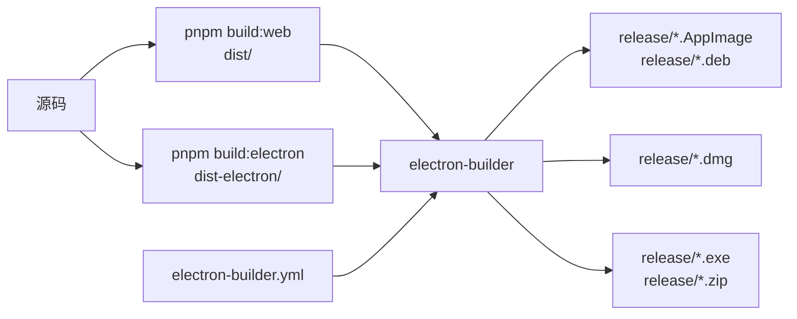
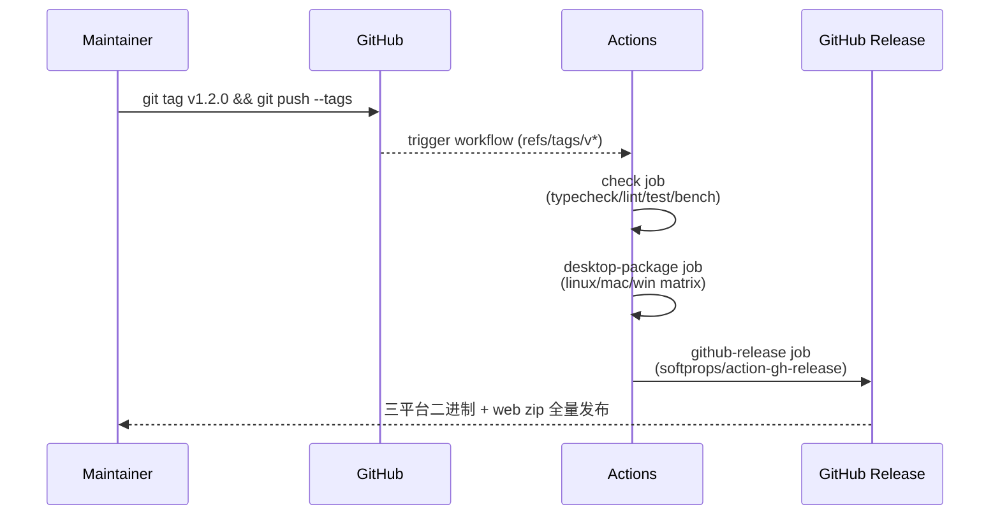

# 打包桌面版本

桌面版基于 Electron + electron-builder。`package.json` 提供
`package:linux` / `package:mac` / `package:win` 三个脚本；CI 在每个
平台分别跑，tag 推送到 main 时自动 release。

::: tip 三道关

1. **Web 资产** —— `pnpm build:web` 产出 `dist/`。
2. **Electron 主进程** —— `pnpm build:electron` 编译 TypeScript 到
   `dist-electron/`。
3. **electron-builder** —— 打包成原生安装包，写入 `release/`。

`pnpm package:*` 一次性串完。
:::

## 目标 (Goal)

本机产出三平台安装包：

- Linux：AppImage + .deb
- macOS：DMG (universal)
- Windows：NSIS 安装器 + 便携 zip

## 前置条件 (Prerequisites)

- Node 20+, pnpm 10+。
- macOS 包必须在 macOS 上打（电子签名只能本机做）。
- Windows 包可在 Linux 上交叉打（无签名时）；但 NSIS code signing 需
  Windows + 证书 token。
- 已在 `~/.apollo-map-studio/license.json` 验证测过 license 流程
  ([签发激活码](./issuing-license-keys))。

## 打包流水线



## 步骤 (Step-by-step)

### 1. 本地干净打 Linux 包

```bash
pnpm install --frozen-lockfile
pnpm package:linux
ls release/
# Apollo Map Studio-1.0.0-linux-x64.AppImage
# Apollo Map Studio-1.0.0-linux-amd64.deb
```

`release/` 内还有 `builder-debug.yml`、`builder-effective-config.yaml`，
是 builder 自检产物，CI 已 exclude，本地可忽略。

### 2. 配置 `electron-builder.yml`

核心字段：

```yaml
appId: com.apollo-map-studio.app
productName: Apollo Map Studio
directories:
  output: release
files:
  - dist/**/*
  - dist-electron/**/*
  - package.json
asar: true
extraMetadata:
  main: dist-electron/main.cjs
  dependencies: {} # 关键：清空，避免把 dev deps 拉进 asar
publish: null
```

::: warning `dependencies: {}` 是有意为之
electron-builder 默认会把 `package.json.dependencies` 全部 npm install 进
打包，但所有运行时代码已经被 vite bundling 进 `dist-electron/`，再装一遍
是无意义的几百 MB。手动清零。
:::

### 3. 添加 macOS 配置

```yaml
mac:
  category: public.app-category.developer-tools
  target:
    - target: dmg
      arch: [x64, arm64]
    - target: zip
      arch: [x64, arm64]
  hardenedRuntime: false # 开发期；发版需要 true + entitlements
```

打包：

```bash
pnpm package:mac
# release/Apollo Map Studio-1.0.0-mac-x64.dmg
# release/Apollo Map Studio-1.0.0-mac-arm64.dmg
```

### 4. 代码签名（macOS）

无签名版本会在 macOS Gatekeeper 触发 "已损坏" 警告。正式签名需要：

```bash
# 一次性安装证书到 Keychain
security import developer-id.p12 -P 'password'

# 设置环境变量
export CSC_LINK=$(base64 < developer-id.p12)
export CSC_KEY_PASSWORD='password'
export APPLE_ID='your@dev.account'
export APPLE_APP_SPECIFIC_PASSWORD='abcd-efgh-ijkl-mnop'
export APPLE_TEAM_ID='ABCDE12345'

pnpm package:mac
```

::: danger 不要把证书提交到 git
`developer-id.p12` 永远不进 repo。CI 用 GitHub secrets 注入：
`secrets.MAC_CSC_LINK` / `secrets.MAC_CSC_KEY_PASSWORD` / etc.
:::

### 5. 公证（macOS）

```yaml
mac:
  hardenedRuntime: true
  notarize:
    teamId: ABCDE12345
```

环境变量同上。`pnpm package:mac` 会自动上传到 Apple 公证服务，等待
2-15 分钟。

### 6. Windows NSIS

```yaml
win:
  target:
    - target: nsis
      arch: [x64]
    - target: zip
      arch: [x64]
  artifactName: ${productName}-${version}-${os}-${arch}.${ext}
nsis:
  oneClick: false # 显示安装向导
  perMachine: false # 默认 per-user
  allowToChangeInstallationDirectory: true
```

代码签名（EV / OV cert）：

```bash
export CSC_LINK=$(base64 < windows-cert.pfx)
export CSC_KEY_PASSWORD='password'
pnpm package:win
```

::: warning EV 证书用 USB token
EV 证书私钥不可导出，必须 USB token 上签。CI 上做 EV 签名很麻烦，常见
方案：本地交付前签 + 上传到 GitHub Release。
:::

### 7. Linux AppImage / .deb

```yaml
linux:
  category: Development
  maintainer: Apollo Map Studio <maintainers@apollo-map-studio.local>
  target:
    - target: AppImage
      arch: [x64]
    - target: deb
      arch: [x64]
```

无需签名，但 AppImage 推荐带 zsync 文件支持增量更新（暂未启用）。

## CI Release 工作流



完整 workflow：[`.github/workflows/ci.yml`](https://github.com/SakuraPuare/apollo-map-studio/blob/main/.github/workflows/ci.yml)。

## 修改的文件 (Files modified)

| 文件                       | 改动                        |
| -------------------------- | --------------------------- |
| `electron-builder.yml`     | 平台 target、签名、公证配置 |
| `electron/main.cts`        | 主进程入口逻辑              |
| `electron/preload.ts`      | 渲染进程桥接                |
| `package.json` `scripts`   | 打包命令                    |
| `.github/workflows/ci.yml` | CI release matrix           |

## 测试清单 (Testing checklist)

- [ ] `pnpm package:linux` 在 Ubuntu 22.04 出 AppImage 与 deb，双击都能跑。
- [ ] `pnpm package:mac` 在 macOS 14 出 DMG，`xattr -d com.apple.quarantine`
      后能开。
- [ ] `pnpm package:win` 在 Windows 11 出 NSIS，安装器能修改安装目录。
- [ ] 安装后首次启动出 license 激活弹窗。
- [ ] 离线运行：拔网线启动应仍能进编辑器（除了首次激活）。
- [ ] 增量解压：DMG 内 app 大小 < 250 MB（asar 压缩生效）。
- [ ] 启动时间 < 3s（measure with `electron --inspect`）。

## 常见坑 (Common pitfalls)

### `dependencies` 把整个 node_modules 打进去

`extraMetadata.dependencies: {}` 没设。检查 asar 大小，超 200 MB 必查。

### macOS "已损坏，无法打开"

未签名 / 公证。开发自测可用：

```bash
xattr -d com.apple.quarantine /Applications/Apollo\ Map\ Studio.app
```

但发给客户必须签名 + 公证。

### Windows SmartScreen 警告

无 EV 签名都会出 "Microsoft Defender SmartScreen 已阻止"。需要积累
信誉（Microsoft Defender Reputation Service）或买 EV 证书直接通过。

### Linux .deb 缺依赖

```yaml
linux:
  desktop:
    Categories: 'Development;Graphics'
deb:
  depends: ['libgtk-3-0', 'libnotify4', 'libnss3']
```

电子默认会推断，但偶尔漏。

### 路径大小写跨平台问题

Linux 大小写敏感，macOS 默认不敏感，Windows 不敏感。在 `import` 写错
大小写时 macOS 本地不报错但 Linux CI 红。提交前跑 `pnpm build:web` 在
Linux 上验证（CI 会替你）。

### 启动时报 `Cannot find module 'dist-electron/main.cjs'`

`pnpm build:electron` 没跑，或 `tsconfig.electron.json` 输出路径变了。
检查 `package.json.main` 与 `electron-builder.yml.extraMetadata.main`
保持一致。

## 相关源码 (Source links)

- [`electron-builder.yml`](https://github.com/SakuraPuare/apollo-map-studio/blob/main/electron-builder.yml)
- [`electron/main.cts`](https://github.com/SakuraPuare/apollo-map-studio/blob/main/electron/main.cts)
- [`tsconfig.electron.json`](https://github.com/SakuraPuare/apollo-map-studio/blob/main/tsconfig.electron.json)
- [`.github/workflows/ci.yml`](https://github.com/SakuraPuare/apollo-map-studio/blob/main/.github/workflows/ci.yml) — `desktop-package` matrix
- [electron-builder docs](https://www.electron.build/)

## 进阶 (Advanced)

### 自动更新 (electron-updater)

未启用。要启用：

1. `pnpm add electron-updater`
2. `electron-builder.yml` 加 `publish: { provider: 'github' }`
3. `electron/main.cts` 加 `autoUpdater.checkForUpdatesAndNotify()`

::: warning 自动更新需要签名
未签名包 autoUpdater 拒绝接受新包，避免被中间人替换。
:::

### 多语言安装器 (NSIS)

```yaml
nsis:
  installerLanguages: ['en_US', 'zh_CN']
  language: '2052' # zh_CN
```

### 开机自启

`electron/main.cts`：

```ts
app.setLoginItemSettings({ openAtLogin: true });
```

提供给用户开关，默认 false。

::: tip 发版仪式感
Tag 后做一次 5 分钟手测：装包 → 激活 → 导入示例地图 → 画一条 lane →
导出 → 卸载。这五步走通 = 用户能跑通。
:::
