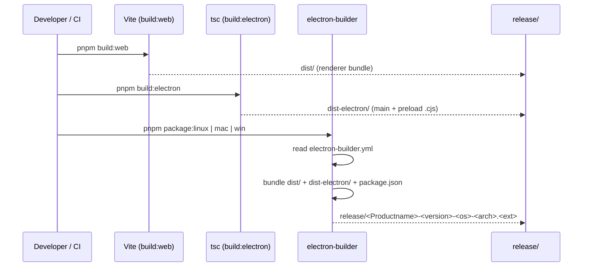

# Packaging Desktop Builds

Desktop artifacts are produced by `electron-builder` driven from
`electron-builder.yml`. The web build is shared with the browser
target — `pnpm package:*` runs `pnpm build:desktop`
(web + Electron main) first, then hands the output to
`electron-builder` for OS-specific bundling.

## Pipeline overview



## Local commands

From `package.json`:

```jsonc
{
  "build": "vite build",
  "build:web": "vite build",
  "build:electron": "tsc -p tsconfig.electron.json",
  "build:desktop": "pnpm build:web && pnpm build:electron",
  "package": "pnpm build:desktop && electron-builder --dir --publish never",
  "package:linux": "pnpm build:desktop && electron-builder --linux --x64 --publish never",
  "package:mac": "pnpm build:desktop && electron-builder --mac --x64 --arm64 --publish never",
  "package:win": "pnpm build:desktop && electron-builder --win --x64 --publish never",
}
```

| Command              | Output                                                            |
| -------------------- | ----------------------------------------------------------------- |
| `pnpm package`       | Unpacked directory under `release/` for inspection. No installer. |
| `pnpm package:linux` | `release/*.AppImage` + `release/*.deb` (x64).                     |
| `pnpm package:mac`   | `release/*.dmg` + `release/*.zip` for both `x64` and `arm64`.     |
| `pnpm package:win`   | `release/*.exe` (NSIS) + `release/*.zip` (x64).                   |

`--publish never` keeps electron-builder offline. The Apollo Map Studio
release flow uses CI to attach artifacts to a GitHub Release after
package commands finish (see [release-process](../contributing/release-process.md)).

## `electron-builder.yml` walkthrough

The full file lives at the repo root:

```yaml
appId: com.apollo-map-studio.app
productName: Apollo Map Studio
directories:
  output: release
files:
  - dist/**/*
  - dist-electron/**/*
  - package.json
  - '!node_modules/**/*'
asar: true
npmRebuild: false
compression: normal
extraMetadata:
  main: dist-electron/main.cjs
  dependencies: {}
publish: null
```

Key fields and why they're set:

| Field                            | Reason                                                                                                     |
| -------------------------------- | ---------------------------------------------------------------------------------------------------------- |
| `files`                          | Whitelist; only ship the renderer + main bundles, not source or `node_modules`.                            |
| `asar: true`                     | Pack `dist/` and `dist-electron/` into one read-only archive. Cuts file count, marginally faster IO.       |
| `npmRebuild: false`              | We don't have native modules at runtime; skip rebuild, much faster CI.                                     |
| `extraMetadata.dependencies: {}` | Stop electron-builder from inspecting `node_modules` to filter prod deps. We've already curated `files`.   |
| `extraMetadata.main`             | Override `package.json` main field at install time so the production entry resolves to the bundled `.cjs`. |
| `publish: null`                  | Disable auto-publish to GitHub. CI handles release upload separately.                                      |

Per-platform sections set the targets:

```yaml
mac:
  category: public.app-category.developer-tools
  target: [{ target: dmg, arch: [x64, arm64] }, { target: zip, arch: [x64, arm64] }]
  hardenedRuntime: false # set true + entitlements when notarising

win:
  target: [{ target: nsis, arch: [x64] }, { target: zip, arch: [x64] }]
  artifactName: ${productName}-${version}-${os}-${arch}.${ext}

nsis:
  oneClick: false
  perMachine: false
  allowToChangeInstallationDirectory: true

linux:
  category: Development
  maintainer: Apollo Map Studio <maintainers@apollo-map-studio.local>
  target: [{ target: AppImage, arch: [x64] }, { target: deb, arch: [x64] }]
  artifactName: ${productName}-${version}-${os}-${arch}.${ext}
```

## Signing and notarisation

The repo ships **unsigned** builds today:

- `mac.hardenedRuntime: false` — no notarisation pipeline configured.
- `CSC_IDENTITY_AUTO_DISCOVERY: false` is set in CI to prevent
  electron-builder from finding any developer cert.
- Windows binaries are unsigned; users see a SmartScreen prompt on
  first launch.

To enable signing in a fork:

### macOS

1. Install a Developer ID Application certificate in the keychain.
2. Set `mac.hardenedRuntime: true` in `electron-builder.yml`.
3. Create `electron-builder` entitlements files
   (`build/entitlements.mac.plist`) and reference them as
   `mac.entitlements` / `mac.entitlementsInherit`.
4. Set the env vars before packaging:
   ```sh
   export CSC_IDENTITY_AUTO_DISCOVERY=true
   export APPLE_ID="dev@example.com"
   export APPLE_APP_SPECIFIC_PASSWORD="abcd-efgh-ijkl-mnop"
   export APPLE_TEAM_ID="ABCDE12345"
   pnpm package:mac
   ```
5. Verify: `codesign -dvv release/*.dmg/Contents/MacOS/Apollo*` and
   `spctl --assess --type execute …` should both succeed.

### Windows

1. Obtain a code-signing certificate (`.pfx`).
2. Set:
   ```sh
   export CSC_LINK="file:///path/to/cert.pfx"
   export CSC_KEY_PASSWORD="…"
   pnpm package:win
   ```
3. Verify with `signtool verify /pa release/*.exe`.

::: warning Don't commit certs
`.pfx` and `.p12` files belong outside the repo. Use repository
secrets in CI; never inline them into `electron-builder.yml` or env
files.
:::

## CI workflow

`.github/workflows/ci.yml` packages on every push to `main` / `v1`
and on tag pushes. Relevant excerpt:

```yaml
desktop-package:
  name: Desktop package (${{ matrix.os }})
  runs-on: ${{ matrix.os }}
  needs: check
  strategy:
    matrix:
      include:
        - os: ubuntu-latest
          package-script: package:linux
          artifact-name: apollo-map-studio-linux
        - os: macos-latest
          package-script: package:mac
          artifact-name: apollo-map-studio-macos
        - os: windows-latest
          package-script: package:win
          artifact-name: apollo-map-studio-windows
  steps:
    # … checkout, pnpm install …
    - name: Build desktop artifacts
      run: pnpm ${{ matrix.package-script }}
      env:
        CSC_IDENTITY_AUTO_DISCOVERY: false
        GH_TOKEN: $&#123;&#123; secrets.GITHUB_TOKEN &#125;&#125;
    - name: Upload desktop artifacts
      uses: actions/upload-artifact@v7
      with:
        name: ${{ matrix.artifact-name }}
        path: |
          release/*.AppImage
          release/*.deb
          release/*.dmg
          release/*.zip
          release/*.exe
          !release/**/builder-debug.yml
          !release/**/builder-effective-config.yaml
        if-no-files-found: error
```

The `github-release` job depends on `check` and `desktop-package`,
runs only for tag refs (`refs/tags/v*`), and uses
`softprops/action-gh-release@v3` to publish artifacts. See
[release-process](../contributing/release-process.md).

## Local sanity checks

After `pnpm package:linux`:

```sh
ls release/
#  Apollo Map Studio-1.0.0-linux-x64.AppImage
#  Apollo Map Studio-1.0.0-linux-x64.deb
chmod +x "release/Apollo Map Studio-1.0.0-linux-x64.AppImage"
"./release/Apollo Map Studio-1.0.0-linux-x64.AppImage" --no-sandbox
```

The app should boot to the activation dialog (or trial banner). If the
window is blank, open DevTools (`Ctrl+Shift+I` from the Electron menu)
and check the renderer console for missing assets — almost always a
`files` whitelist gap in `electron-builder.yml`.

## Common mistakes

- **Forgetting `pnpm build:desktop`.** `electron-builder` reads
  `dist/` and `dist-electron/`. If they're stale, you ship the
  previous bundle.
- **Adding a runtime dep without rebuilding `dependencies: {}` logic.**
  We deliberately ship an empty `dependencies` object via
  `extraMetadata.dependencies: {}`. If you add a native module that
  must live in `node_modules`, you also need to flip `npmRebuild: true`
  and update `files` to include the relevant subtree.
- **Bumping the version in `package.json` only.** `electron-builder`
  uses that version for filenames; CI's tag detection
  (`startsWith(github.ref, 'refs/tags/v')`) relies on the tag string
  alone. Match the two.
- **Running `pnpm package` on a dirty tree.** The output filename
  embeds `version`, not the git sha. Two builds on the same version
  produce filenames that overwrite each other. Bump version (or use
  `--dir`) when iterating.

## Cross-references

- [/contributing/release-process](../contributing/release-process.md)
  for tag → release artifact flow
- [/contributing/development-setup](../contributing/development-setup.md)
  for `pnpm electron:dev` (live dev shell)
- [issuing-license-keys](./issuing-license-keys.md) for the license
  binding that desktop builds enforce
