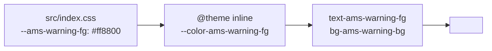

# 用 `ams-*` token 做主题

设计系统以 `ams-*` 命名的 CSS 自定义属性为唯一颜色 / 间距 / 字体 size
来源。Tailwind 4 通过 `@theme` 把它们映射成 utility class。**不要**在
组件里直接写 hex / rgb 数字。

::: tip 命名空间
`ams` = Apollo Map Studio。`--ams-*` 与 `--bg-*`、`--fg-*` 等通用变量
分隔，避免与第三方主题冲突（dockview、shadcn registry 都有自己的 token）。
:::

## 目标 (Goal)

新增 `--ams-warning-fg` / `--ams-warning-bg` 一对 token，用于编辑器
里 "几何自相交警告" 提示条。

## 前置条件 (Prerequisites)

- 已读 [Design System](../design/)。
- 知道 Tailwind 4 的 `@theme` 语法。
- 项目用 `@tailwindcss/vite` 插件加载 `src/index.css`。

## Token 流程



## 步骤 (Step-by-step)

### 1. 在 `tokens.css` 加 token

```css
/* src/index.css */
:root {
  /* ... 现有 */
  --ams-warning-fg: #b16500;
  --ams-warning-bg: #fff4e0;
}

@media (prefers-color-scheme: dark) {
  :root {
    --ams-warning-fg: #ffae5e;
    --ams-warning-bg: #3a2a10;
  }
}
```

::: warning 同时给亮 / 暗
任何新 token 必须双值。深色模式漏配 = 用户切换时白底黄字看不见。
跑视觉回归（手测两次）。
:::

### 2. 在 `@theme` 注册

```css
/* src/index.css */
@theme inline {
  --color-ams-warning-fg: var(--ams-warning-fg);
  --color-ams-warning-bg: var(--ams-warning-bg);
}
```

`inline` 让 Tailwind 在 build 时直接展开变量引用，runtime CSS 文件
不会有重复声明。

### 3. 在组件用

```tsx
// src/components/notifications/SelfIntersectWarning.tsx
export function SelfIntersectWarning({ message }: { message: string }) {
  return (
    <div className="text-ams-warning-fg bg-ams-warning-bg px-4 py-2 rounded-md">⚠ {message}</div>
  );
}
```

::: tip 仅用 utility，不用内联 style
内联 `color: var(--ams-warning-fg)` 可行但破坏 Tailwind 的
可发现性。组件用 className，深度自定义才用 `style`。
:::

### 4. 写 Storybook 或视觉示例（如启用）

```tsx
// src/components/notifications/__stories__/Warning.stories.tsx
export const Default = () => <SelfIntersectWarning message="车道边界自相交" />;
```

::: tip 没 Storybook 就用文档站
项目当前不用 Storybook。可以在 VitePress `examples/` 用 `<ClientOnly>`
嵌一个组件预览。
:::

### 5. 跑视觉测试

- 切到亮 / 暗主题，文字与背景对比可读。
- 选中状态、hover 状态、disabled 状态各看一次。
- 与相邻组件（toast、status bar）对比，色调不冲突。

## 现有 token 类目

| 前缀               | 用途               | 示例                   |
| ------------------ | ------------------ | ---------------------- |
| `--ams-bg-*`       | 背景层级           | `--ams-bg-canvas`      |
| `--ams-fg-*`       | 前景文字           | `--ams-fg-default`     |
| `--ams-border-*`   | 边框               | `--ams-border-subtle`  |
| `--ams-accent-*`   | 主品牌色           | `--ams-accent-primary` |
| `--ams-warning-*`  | 警告色（本节新增） | `--ams-warning-fg`     |
| `--ams-error-*`    | 错误色             | `--ams-error-fg`       |
| `--ams-success-*`  | 成功色             | `--ams-success-fg`     |
| `--ams-grid-*`     | 网格 / 标尺        | `--ams-grid-major`     |
| `--ams-lane-*`     | 车道渲染           | `--ams-lane-fill`      |
| `--ams-junction-*` | 路口渲染           | `--ams-junction-fill`  |

## 命名规范

::: tip 语义优先
`--ams-warning-fg` ✅
`--ams-orange-600` ❌（颜色具体值会被替换；语义名永远稳定）

`--ams-bg-canvas` ✅
`--ams-bg-1` ❌（数字层级语义不清，谁是顶谁是底？）
:::

## 迁移策略

发现现有代码里写死颜色：

```tsx
<div className="text-[#b16500] bg-[#fff4e0]"> ⚠ ... </div>
```

替换流程：

1. 识别该色的 **语义**（这里是 warning）。
2. 在 tokens.css 加或复用对应 token。
3. 替换 className。
4. 跑亮 / 暗双视觉对比。
5. 单独 PR 提交，标题 `refactor(theme): replace hex colors with ams-warning tokens`。

::: warning 不要批量替换
不同地方的同一色值可能有不同语义。一处是 warning，一处是 highlight；
盲目 sed 会让以后调主题改的范围变大。一处一处看。
:::

## 修改的文件 (Files modified)

| 文件                              | 改动                     |
| --------------------------------- | ------------------------ |
| `src/index.css`                   | 新 token + `@theme` 注册 |
| 组件文件                          | 使用新 utility class     |
| `docs/reference/color-palette.md` | 文档表格补一行           |

## 测试清单 (Testing checklist)

- [ ] 亮 / 暗主题对比度都 >= WCAG AA（4.5:1 文字 / 3:1 图形）。
- [ ] 没有任何组件再写 `#xxx` / `rgb(...)`（`grep -r '#[0-9a-f]\{6\}' src/components`）。
- [ ] Tailwind 自动生成 utility（`grep '\.text-ams-warning-fg' dist/`）。
- [ ] DevTools Computed 面板显示 `color: rgb(...)` 来自 `var(--ams-warning-fg)`。
- [ ] 改 token 颜色，所有用到的地方同步变化（一致性证明）。

## 常见坑 (Common pitfalls)

### `bg-ams-foo` 没生成 utility

`@theme` 里必须用 `--color-ams-foo` 前缀（颜色） / `--spacing-ams-foo`
（间距） / `--font-ams-foo`（字体）。Tailwind 4 按前缀决定生成哪类
utility。详见 [Tailwind 4 theme 文档](https://tailwindcss.com/docs/theme)。

### 暗色下 `prefers-color-scheme` 不生效

是否在 `<html>` 上设置了 `data-theme="..."` 而不是依赖系统主题？
`prefers-color-scheme` 媒体查询只在 `data-theme` 未设置时生效。
确认逻辑或改用 `[data-theme='dark']` 选择器。

### shadcn token 与 ams token 混用

shadcn 自带 `--background` / `--foreground` 等。**不要** 让两组 token
互相 alias。组件库内部用 shadcn token，业务 UI 用 ams token，桥接
通过组件 wrapper：

```tsx
// shadcn Button wrapper
<Button className="bg-ams-accent-primary text-white" />
```

### Tailwind class 冲突

`text-red-500` 与 `text-ams-warning-fg` 同时写时，CSS 顺序决定胜负。
推荐统一改 ams token，避免一会 token 一会 raw color 的混乱。

## 相关源码 (Source links)

- [`src/index.css`](https://github.com/SakuraPuare/apollo-map-studio/blob/main/src/index.css)
- [`vite.config.ts`](https://github.com/SakuraPuare/apollo-map-studio/blob/main/vite.config.ts) — `@tailwindcss/vite` 插件
- [Design System: Colors](../reference/color-palette)
- [Tailwind v4 theme docs](https://tailwindcss.com/docs/theme)

## 进阶 (Advanced)

### 多 brand 支持

```css
:root[data-brand='partner-x'] {
  --ams-accent-primary: #6633cc;
}
```

主题切换时改 `<html data-brand='partner-x'>`，所有 token 一键切换。

### 设计同步

把 tokens.css 同步到 Figma：

1. 用 [Variables Bridge](https://www.figma.com/community/plugin/...) 一类
   插件导入 CSS Variables。
2. 设计师在 Figma 改值后导出 → 工程师 review token diff → merge。
3. 文档站 `docs/reference/color-palette.md` 里嵌入 token 预览表（手动）。

### Brand 守卫脚本

CI 跑：

```bash
pnpm exec lint:no-raw-colors src/components
```

自定义脚本扫 `#xxxxxx` / `rgb(` / `hsl(`，发现就 fail。本项目尚未启用，
建议作为 P3 加上。

## 设计审查清单

发新组件前自检：

- [ ] 没写任何 `#xxx` / `rgb()` / `hsl()`。
- [ ] 颜色全部走 ams token（语义命名）。
- [ ] 间距用 Tailwind 内置 spacing 或 `--spacing-ams-*`。
- [ ] 字号用 `--font-ams-*`，不用 px / rem 字面量。
- [ ] 亮 / 暗主题对比度都 ≥ AA。
- [ ] 高对比度系统（`prefers-contrast: high`）下仍可读。
- [ ] 焦点状态可见 (`focus-visible:ring-ams-accent-primary`)。

## 与 maplibre 渲染配合

map 上的图层颜色不能用 Tailwind utility（maplibre 走自己的样式系统）。
但 maplibre 支持 `'paint': { 'fill-color': ['get', 'color'] }`，可以让
`spatial.worker.ts` 编译 feature 时把 token 解出 hex 再注入 properties：

```ts
// src/core/workers/spatialFeatures.ts
import { getCssVariable } from './styleVars';

const laneFill = getCssVariable('--ams-lane-fill');
feature.properties.color = laneFill;
```

`getCssVariable` 在主线程把 `getComputedStyle(document.documentElement)`
的值传给 worker（worker 自己拿不到 CSS context）。主题切换时 main
重新调用一次即可。

::: tip 一句话
**所有** 颜色 / 间距 / 字号 → ams token；**所有** 组件 → utility class。
两条规矩遵守，主题切换是配置，不是 code change。
:::
