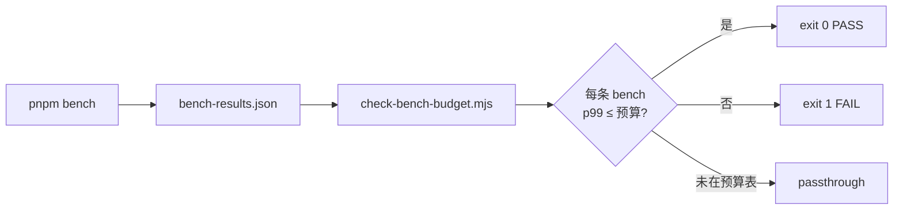

# 性能预算

本页是 `scripts/bench-budgets.json` 的逐条解读，外加 `scripts/check-bench-budget.mjs`
的逻辑摘要。CI 在 `pnpm bench` 之后调用守卫脚本，把每条 bench 的 p99 与本表
比对，超出即 `exit 1`。

::: tip 数值含义

- **p99**：100 次采样后第 99 百分位耗时（毫秒）。比 mean 更鲁棒地反映尾延迟。
- **预算 ≠ 目标**：预算是「不能更慢」的硬上限，留有 ~1.5x 的 GitHub Actions runner 抖动
  buffer，本地 mean 通常远低于预算。
  :::

## 文件位置

| 路径                             | 作用                                                           |
| -------------------------------- | -------------------------------------------------------------- |
| `scripts/bench-budgets.json`     | 预算表，本页源头                                               |
| `scripts/check-bench-budget.mjs` | CI 校验脚本                                                    |
| `bench-results.json`             | `pnpm bench --outputJson bench-results.json` 输出，CI 临时文件 |

## 校验流程



## 当前预算（`scripts/bench-budgets.json`）

```json
{
  "10-point polyline, 3.5m offset": { "p99Ms": 1 },
  "100-point polyline, 3.5m offset": { "p99Ms": 3 },
  "1000-point polyline, 3.5m offset": { "p99Ms": 40 },
  "full stitch — 10-lane linear chain": { "p99Ms": 3 },
  "full stitch — 100-lane linear chain": { "p99Ms": 6 },
  "full stitch — 100 lanes / 50 isolated junctions": { "p99Ms": 6 },
  "incremental — 100-lane chain, 1 lane decorated": { "p99Ms": 5 },
  "incremental — 100-lane chain, 3 lanes decorated": { "p99Ms": 5 }
}
```

## Bench 命名约定

::: tip 命名规范

- **必须以衡量对象开头**：`<algorithm> — <input description>`，例如 `full stitch — 100-lane chain`。
- **数字直接出现**：避免 vague 的 small/medium/large；写 `100-lane` 才便于扫表。
- **使用 em-dash（—）作为分隔符**：与现有 budgets 保持一致，便于复制粘贴。
- **必须与 `bench-budgets.json` 完全一致**：脚本按字符串精确匹配。
  :::

## Bench 详解

### `10-point polyline, 3.5m offset`

| 项目     | 值                                                            |
| -------- | ------------------------------------------------------------- |
| 文件     | `src/core/geometry/__tests__/offsetPolyline.bench.ts:27`      |
| p99 上限 | **1 ms**                                                      |
| 衡量对象 | 偏移多段线核心算法在 10 点输入下的耗时                        |
| 衡量目标 | 保证短 polyline 偏移在「亚毫秒级」以支持 hot layer 60fps 拖拽 |

### `100-point polyline, 3.5m offset`

| 项目     | 值                                                       |
| -------- | -------------------------------------------------------- |
| 文件     | `src/core/geometry/__tests__/offsetPolyline.bench.ts:31` |
| p99 上限 | **3 ms**                                                 |
| 衡量对象 | 100 点 polyline 偏移                                     |
| 衡量目标 | 中等长度 lane（典型 100 点）偏移耗时上限                 |

### `1000-point polyline, 3.5m offset`

| 项目     | 值                                                       |
| -------- | -------------------------------------------------------- |
| 文件     | `src/core/geometry/__tests__/offsetPolyline.bench.ts:35` |
| p99 上限 | **40 ms**                                                |
| 衡量对象 | 1000 点 polyline 偏移                                    |
| 衡量目标 | 极端长 lane 容忍上限；超过 40ms 必须切异步 / 抽样        |

### `full stitch — 10-lane linear chain`

| 项目     | 值                                                      |
| -------- | ------------------------------------------------------- |
| 文件     | `src/core/geometry/__tests__/laneJunctions.bench.ts:73` |
| p99 上限 | **3 ms**                                                |
| 衡量对象 | 10 lane 线性链全量缝合                                  |
| 衡量目标 | 小图全量重建保留交互级响应                              |

### `full stitch — 100-lane linear chain`

| 项目     | 值                                                      |
| -------- | ------------------------------------------------------- |
| 文件     | `src/core/geometry/__tests__/laneJunctions.bench.ts:77` |
| p99 上限 | **6 ms**                                                |
| 衡量对象 | 100 lane 线性链全量缝合                                 |
| 衡量目标 | 中等规模地图导入或大批量编辑全量重建上限                |

### `full stitch — 100 lanes / 50 isolated junctions`

| 项目     | 值                                                      |
| -------- | ------------------------------------------------------- |
| 文件     | `src/core/geometry/__tests__/laneJunctions.bench.ts:81` |
| p99 上限 | **6 ms**                                                |
| 衡量对象 | 100 lane 配 50 个孤立 junction                          |
| 衡量目标 | 多 junction 对全量缝合 cost 不应有明显放大              |

### `incremental — 100-lane chain, 1 lane decorated`

| 项目     | 值                                                                 |
| -------- | ------------------------------------------------------------------ |
| 文件     | `src/core/geometry/__tests__/laneJunctions.bench.ts:92`            |
| p99 上限 | **5 ms**                                                           |
| 衡量对象 | 100 lane 链上单 lane 增量装饰（Phase E）                           |
| 衡量目标 | 单 lane 编辑应远低于 full stitch；触顶意味着 dependency graph 失效 |

### `incremental — 100-lane chain, 3 lanes decorated`

| 项目     | 值                                                      |
| -------- | ------------------------------------------------------- |
| 文件     | `src/core/geometry/__tests__/laneJunctions.bench.ts:96` |
| p99 上限 | **5 ms**                                                |
| 衡量对象 | 100 lane 链上 3 lane 同时增量装饰                       |
| 衡量目标 | 多 lane batch 增量耗时近似线性                          |

## `check-bench-budget.mjs` 行为速览

```js
// scripts/check-bench-budget.mjs:35-50
function collectBenches(report) {
  // 递归遍历 vitest --outputJson 树，收集
  // { name: string, p99Ms: number } 叶子。
}
// scripts/check-bench-budget.mjs:60-80
for (const bench of benches) {
  const budget = budgets[bench.name];
  if (!budget) {
    unbudgeted.push(bench);    // passthrough：未配置预算的不报错
    continue;
  }
  if (bench.p99Ms > budget.p99Ms) {
    violations.push(...);      // 超出预算 → exit 1
  } else {
    passed.push(...);
  }
}
```

输出三块：

| 块                                 | 含义                         |
| ---------------------------------- | ---------------------------- |
| `PASS:`                            | 命中预算且未超               |
| `No budget defined (passthrough):` | 跑了但本表没声明，不计入失败 |
| `FAIL:`                            | 超过预算，CI 退出码 1        |

## 用法示例

本地复现 CI 守卫：

```bash
pnpm bench --outputJson bench-results.json
node scripts/check-bench-budget.mjs bench-results.json
```

Vitest 输出形如：

```text
## Perf budget report

PASS:
  10-point polyline, 3.5m offset: p99=0.412ms (ceiling 1ms)
  100-point polyline, 3.5m offset: p99=2.103ms (ceiling 3ms)
  ...
```

## 调整预算的流程

::: warning 不要随手改预算
预算是性能护栏。每次调整必须 PR + 解释原因。
:::

1. **先排查环境**：本地 mean 异常说明本地负载，而非性能退化。
2. **采样多次**：CI 抖动正常约 1.5x；连续 3 次失败再考虑收紧 / 放宽。
3. **写明上下文**：PR 描述附上「为什么这次需要放宽」或「为什么这次能收紧」。
4. **同步本页**：本页表格必须与 `bench-budgets.json` 一致。
5. **附性能图**：tighten 时附带 baseline 对比，说明 ROI。

## 与其它性能机制的关系

| 机制                        | 时机              | 粒度                        |
| --------------------------- | ----------------- | --------------------------- |
| `bench-budgets.json`        | CI 每次 push / PR | 单个算法 p99                |
| 冷热分层                    | 运行时            | 渲染管线吞吐                |
| `decorationCache` (Phase E) | 运行时            | 增量装饰受影响集            |
| `useColdLayer` RAF coalesce | 运行时            | 多次 entity 变化 → 单次重建 |

## 历史背景

::: tip 为什么现有 8 条 bench

- **Phase B**：引入 polyline offset 三档（10 / 100 / 1000 点），对应 hot
  layer 拖拽场景的下界 / 中位 / 极端长度。
- **Phase D**：引入 full-stitch 三档（10 / 100 / 100+50 junctions），覆盖
  小图、中图、含路口的中图。
- **Phase E**：引入 incremental 两档（1 / 3 lane decorated），守护增量装饰
  路径的复杂度近似常数。

未来若引入新关键路径（例如导出 / 导入工作流），新增 bench 时同步：

1. 在 `src/**/__tests__/*.bench.ts` 写新的 `bench(label, fn)`。
2. 在 `scripts/bench-budgets.json` 配上 p99 上限。
3. 在本页相应章节添加条目。
   :::

## p99 与 mean 的关系

CI 用 p99 是因为 **尾延迟才是用户体验的天花板**。一个 mean 0.5ms 的算法
偶尔抖到 50ms，会在 60fps 拖拽中被肉眼感知。p99 把这种偶发抖动直接暴露。

| 指标 | 用途               | 示例                     |
| ---- | ------------------ | ------------------------ |
| mean | 「平均下来多快」   | 性能优化 PR 中的进步幅度 |
| p50  | 「典型情况多快」   | 大多数普通操作的耗时     |
| p99  | 「最慢的 1% 多慢」 | CI guard、用户感知的卡顿 |
| max  | 「最坏情况多慢」   | 不稳定，CI 不用          |

## 跨 runner 抖动

| Runner                         | 相对本地   | 备注               |
| ------------------------------ | ---------- | ------------------ |
| 本地 Mac M-series              | 1.0x       | 基准               |
| ubuntu-latest（GitHub-hosted） | ≈ 1.2–1.5x | 共享 CPU，磁盘抖动 |
| ubuntu-latest（self-hosted）   | ≈ 1.0x     | 取决于物理机       |
| windows-latest                 | ≈ 1.5x     | Node 启动慢        |
| macos-latest                   | ≈ 1.1x     | 一般稳定           |

::: warning 当前 budget 基于 ubuntu-latest
所有 p99 ceiling 都按 GitHub-hosted ubuntu-latest 校准。本地跑明显高于 ceiling
但 CI 通过，先怀疑环境而不是代码。
:::

## 相关文档

- [CI Pipeline](/reference/ci-pipeline)
- [冷热分层](/architecture/cold-hot-layers)
- [Junction 缝合](/architecture/junction-stitching)
- [架构总览](/architecture/overview)
- [Glossary：bench-budgets](/reference/glossary#bench-budgets)
