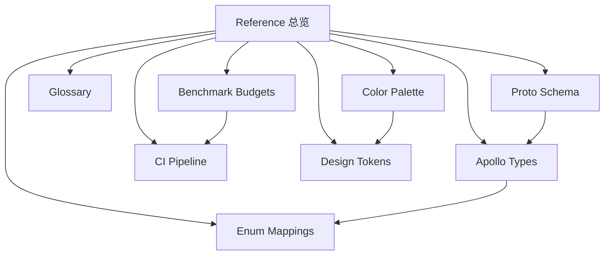

# Reference 总览

Reference 章节是 Apollo Map Studio 的「权威检索表」。这里收录的内容不讲故事、
不教概念、不解释「为什么」，只回答「这个字段的精确定义是什么」。当你在调
试 round-trip 偏差、对照 Apollo proto 字段、或排查 CI 性能预算红线时，本章
节就是单一事实来源。

::: tip 本章节定位

- **所有数值与类型必须可验证**：每个枚举、每个字段都标注源文件路径与行号。
- **结构对照而非教学**：教学性内容请前往 [Guide](/guide/getting-started)。
- **双语镜像**：每个 zh 页都有对应的 [English mirror](/en/reference/)。
  :::

## Reference 章节速查矩阵

| 你正在做什么                       | 优先打开                                                                          |
| ---------------------------------- | --------------------------------------------------------------------------------- |
| 阅读架构文档遇到不认识的词         | [Glossary](/reference/glossary)                                                   |
| 检查导入导出 round-trip 是否丢字段 | [Proto Schema](/reference/proto-schema) + [Apollo Types](/reference/apollo-types) |
| 处理 inspector 表单中的枚举下拉    | [Enum Mappings](/reference/enum-mappings)                                         |
| 回答「CI 上 bench 为什么挂了」     | [Benchmark Budgets](/reference/benchmark-budgets)                                 |
| 回答「desktop-package job 失败了」 | [CI Pipeline](/reference/ci-pipeline)                                             |
| 设计新组件挑色                     | [Color Palette](/reference/color-palette)                                         |
| 判断字号 / 间距 / 圆角 / 阴影      | [Design Tokens](/reference/design-tokens)                                         |

## 章节地图



## 完整页面索引

| 页面                                              | 主要内容                                                                                                                                | 适用场景                                                  |
| ------------------------------------------------- | --------------------------------------------------------------------------------------------------------------------------------------- | --------------------------------------------------------- |
| [Glossary 术语表](/reference/glossary)            | base_map、Cold/Hot Layer、FSM、Junction Graph、MapEntity、Anti-corruption Layer、RBush、MGRS、UTM 等 ≥ 80 条术语。                      | 团队 onboarding、阅读架构文档时查词。                     |
| [Proto Schema](/reference/proto-schema)           | `src/proto/` 下全部 `.proto` 文件，包括 `basic_msgs/geometry.proto`、`map_msgs/*.proto`、`editor/editor_meta.proto` 的 message 与字段。 | 校对 Apollo 二进制 round-trip、设计新元素时确认字段编号。 |
| [Apollo Types](/reference/apollo-types)           | `src/types/apollo.ts` 中每一个 `export` 的 TypeScript 类型与接口。                                                                      | 代码内类型查找、写新 inspector form 前确认字段名。        |
| [Enum Mappings](/reference/enum-mappings)         | `src/lib/enumLabels.ts` 中所有枚举：proto 数值 ↔ 字符串字面量 ↔ 人类可读 label。                                                        | UI 显示语义对照、生成下拉菜单选项。                       |
| [Benchmark Budgets](/reference/benchmark-budgets) | `scripts/bench-budgets.json` 中每条 bench 名称、p99 上限、所在文件、衡量目标。                                                          | 调查 CI perf 失败、性能优化目标制定。                     |
| [CI Pipeline](/reference/ci-pipeline)             | `.github/workflows/ci.yml` 与 `docs-preview.yml` 的全部 job、step、env、trigger。                                                       | 排查 CI 失败、增加新 job、理解 release 流程。             |
| [Color Palette](/reference/color-palette)         | `src/index.css` 中的 `ams-*` 色彩 token，含语义角色与暗色版本。                                                                         | 写新组件时挑选语义色、保证视觉一致性。                    |
| [Design Tokens](/reference/design-tokens)         | 字体（Syne / JetBrains Mono）、间距、圆角、阴影、动效 token，色彩 token 交叉链接。                                                      | 新增视觉规范、对齐 shadcn/ui 与项目设计语言。             |

## 各页面字段密度速览

为了让你提前知道每页大致需要多少时间扫读，这里给出主观「字段密度」估计：

| 页面              | 字段 / 表格密度                                 | 建议扫读时间 |
| ----------------- | ----------------------------------------------- | ------------ |
| Glossary          | 80+ 条术语，每条 1-3 行                         | 10–20 分钟   |
| Apollo Types      | 30+ 接口，每接口 5-25 字段                      | 20–40 分钟   |
| Proto Schema      | 21 个 .proto 文件                               | 20–40 分钟   |
| Enum Mappings     | 13 类枚举共 ~70 值                              | 10–20 分钟   |
| Benchmark Budgets | 96 条 bench                                     | 10–20 分钟   |
| CI Pipeline       | 2 workflow，3 job                               | 10–15 分钟   |
| Color Palette     | 12 色彩 token + Dockview 17 变量                | 5–10 分钟    |
| Design Tokens     | typography / spacing / radius / shadow / motion | 10–15 分钟   |

## 阅读顺序建议

针对不同角色推荐不同的阅读路径：

### 新加入的工程师

1. [Glossary 术语表](/reference/glossary) — 把项目专有名词 / Apollo 名词扫一遍。
2. [Apollo Types](/reference/apollo-types) — 拿到 TypeScript 视角的全景。
3. [Proto Schema](/reference/proto-schema) — 对照 wire 字节真相。
4. [架构总览](/architecture/overview) — 切回架构章节继续。

### 数据保真 / 协议对接同学

1. [Proto Schema](/reference/proto-schema) — 一切以 `.proto` 为准。
2. [Apollo Types](/reference/apollo-types) — 检查 TS 是否漏了 `optional`。
3. [Enum Mappings](/reference/enum-mappings) — 校验枚举 round-trip。
4. [导出引擎](/architecture/export-engine) / [Worker 协议](/architecture/worker-protocol) — 进入实现细节。

### 性能 / 工程化同学

1. [Benchmark Budgets](/reference/benchmark-budgets) — 当前性能护栏。
2. [CI Pipeline](/reference/ci-pipeline) — 失败定位手册。
3. [冷热分层](/architecture/cold-hot-layers) — 性能模型本身。

### UI / 设计系统同学

1. [Color Palette](/reference/color-palette) — 色彩语义。
2. [Design Tokens](/reference/design-tokens) — 字体 / 间距 / 圆角 / 阴影。
3. [设计令牌（架构视角）](/architecture/design-tokens) — Tailwind 4 `@theme` 注入机制。

## Reference 与 Architecture / API 的边界

为避免内容重复或缺失，这里画一条清晰的线：

| 内容                | Reference 收录  | Architecture 收录 | API 收录         |
| ------------------- | --------------- | ----------------- | ---------------- |
| 字段精确定义        | ✅              | ❌（仅引用）      | ❌               |
| 设计动机 / 为什么   | ❌              | ✅                | ❌               |
| 函数签名 / 调用方式 | ❌              | ❌                | ✅               |
| 流程图              | 必要时 ✅       | 主战场 ✅         | ❌               |
| 行号引用            | ✅              | 选用              | ✅               |
| 性能数据            | ✅              | ❌                | ❌               |
| 示例代码            | 类型 / 工具用法 | 系统级例子        | 函数 / hook 调用 |

## 与其他章节的关系

| 章节                                   | 角色     | 与 Reference 的关系                                        |
| -------------------------------------- | -------- | ---------------------------------------------------------- |
| [Guide](/guide/getting-started)        | 教学     | 任何「概念解释」都在 Guide；Reference 不重复。             |
| [Architecture](/architecture/overview) | 设计     | 架构页解释「为什么」、Reference 给「精确数值」，二者互链。 |
| [API](/api/)                           | 函数签名 | API 页给函数级文档，Reference 给类型 / 枚举 / 常量级文档。 |
| [Recipes](/recipes/)                   | 任务流   | 任务页可能引用 Reference 表格作为参数。                    |
| [Contributing](/contributing/)         | 贡献规范 | Reference 是回答 reviewer「这个字段定义在哪」的入口。      |

## 维护约定

::: warning 修改 Reference 页前的检查

1. **必须先读源文件**：使用 `Read` 工具确认行号与字段名，禁止凭印象编辑。
2. **同步双语**：每个 zh 页改动都要镜像到 [/en/reference/](/en/reference/) 同名页。
3. **保留来源链接**：示例 `src/lib/enumLabels.ts:47-55` 形式的 line ref 必须真实可点。
4. **不写未发布内容**：Reference 反映 `main` / `v1` 当前 commit 状态，不展望未来。
   :::

## 反馈

发现字段对不上、行号已偏移、或希望补充新元素？

- 在 [GitHub Issues](https://github.com/SakuraPuare/apollo-map-studio/issues) 开 `docs:reference` label 的 issue。
- 也可以直接 PR 修改本页，CI 会自动跑 `pnpm docs:build`。

## Reference 章节常见提问

::: tip Q：Reference 页与 API 页有什么区别
A：Reference 是「类型 / 枚举 / 常量级」的查表，API 是「函数级」的调用文档。
比如 `LaneEntity` 的字段在 Reference，`addEntity()` 的参数在 API。
:::

::: tip Q：行号偏移了怎么办
A：直接发 PR 更新行号；reviewer 会用 `git log` 复核漂移。如果你只想报告
偏移，可以开 issue，但更鼓励 PR。
:::

::: tip Q：能不能不维护双语
A：不能。中英双语是项目的硬约定，CI 在 `pnpm docs:build` 阶段会同时构建
两个语种，丢失任何一个会导致死链。
:::

## Reference 章节贡献流程

1. 选定要补充 / 修订的页面（从 [Reference 总览](#完整页面索引) 入口）。
2. 用 `Read` 工具阅读对应源文件，记录涉及的字段、行号、值。
3. 编辑对应的 `docs/reference/*.md` **与** `docs/en/reference/*.md` 双语镜像。
4. 在描述中保留行号引用（`src/foo.ts:42-58`），并保证它们指向当前 commit 的真实位置。
5. 本地跑 `pnpm docs:build` 检查是否有死链或编译错误。
6. PR 提交，等待 docs maintainer 审核。

## 反查：从源文件到 Reference 页

| 改了什么文件                 | 必须同步更新                                                                                                                |
| ---------------------------- | --------------------------------------------------------------------------------------------------------------------------- |
| `src/proto/**/*.proto`       | [Proto Schema](/reference/proto-schema)、[Apollo Types](/reference/apollo-types)、[Enum Mappings](/reference/enum-mappings) |
| `src/types/apollo.ts`        | [Apollo Types](/reference/apollo-types)、[Enum Mappings](/reference/enum-mappings)                                          |
| `src/lib/enumLabels.ts`      | [Enum Mappings](/reference/enum-mappings)                                                                                   |
| `scripts/bench-budgets.json` | [Benchmark Budgets](/reference/benchmark-budgets)                                                                           |
| `.github/workflows/*.yml`    | [CI Pipeline](/reference/ci-pipeline)                                                                                       |
| `src/index.css`（`@theme`）  | [Color Palette](/reference/color-palette)、[Design Tokens](/reference/design-tokens)                                        |
| 增加新术语 / 重命名          | [Glossary](/reference/glossary)                                                                                             |

## 模板片段

下面给出一个写新 reference 条目的最小模板，复制后修改即可：

```markdown
## 新增枚举：FooType

来源：`src/proto/map_msgs/map_foo.proto:42-50`，`src/types/foo.ts:18-22`，
`src/lib/enumLabels.ts:160-165`。

| Proto # | TS 字面量 | UI Label |
| ------- | --------- | -------- |
| 0       | `UNKNOWN` | Unknown  |
| 1       | `BAR`     | Bar      |
| 2       | `BAZ`     | Baz      |
```

## 写作风格速查

- **段落长度**：每段 1–4 句；超过就拆。
- **代码块标语言**：`ts`、`proto`、`json`、`yaml`、`bash`，便于高亮。
- **表格行数**：超过 12 行考虑分组，否则失去查表价值。
- **链接**：跨章节链接使用相对路径 `/reference/...`，绝对 URL 仅用于外部资源。
- **emoji / 表情**：禁用。本项目文档保持冷静工程语调。

## 跨表搜索清单（按问题类型）

::: tip 拷贝即用
表格右列直接给出建议的查表起点，避免读者来回跳转。
:::

| 我想找什么                            | 起点                                              |
| ------------------------------------- | ------------------------------------------------- |
| 「BoundaryType=3 是哪种线？」         | [Enum Mappings](/reference/enum-mappings)         |
| 「LaneEntity 都有哪些字段？」         | [Apollo Types](/reference/apollo-types)           |
| 「这个字段在 wire 上的编号？」        | [Proto Schema](/reference/proto-schema)           |
| 「为什么 CI bench 失败了？」          | [Benchmark Budgets](/reference/benchmark-budgets) |
| 「desktop-package 在哪个 OS 上跑？」  | [CI Pipeline](/reference/ci-pipeline)             |
| 「`bg-ams-bg-base` 实际是哪个颜色？」 | [Color Palette](/reference/color-palette)         |
| 「dialog 应该用什么阴影？」           | [Design Tokens](/reference/design-tokens)         |
| 「FSM 这个词到底指什么？」            | [Glossary](/reference/glossary)                   |

## 反查关系：Reference → 源文件

| Reference 页      | 主要源文件                                                                          |
| ----------------- | ----------------------------------------------------------------------------------- |
| Apollo Types      | `src/types/apollo.ts`                                                               |
| Enum Mappings     | `src/lib/enumLabels.ts`                                                             |
| Proto Schema      | `src/proto/**/*.proto`                                                              |
| Benchmark Budgets | `scripts/bench-budgets.json`, `scripts/check-bench-budget.mjs`, `src/**/*.bench.ts` |
| CI Pipeline       | `.github/workflows/ci.yml`, `.github/workflows/docs-preview.yml`                    |
| Color Palette     | `src/index.css` (`@theme`)                                                          |
| Design Tokens     | `src/index.css`, `tailwind.config`, shadcn/ui 组件                                  |

## 文档治理

- **CODEOWNERS**：Reference 章节由 docs maintainer 与原作者同时审核。
- **review checklist**：reviewer 必须用 `Read` 工具核对至少一处行号引用。
- **CI**：`pnpm docs:build` 在每个 PR 上跑，VitePress 死链与编译错误会失败 build。
- **deploy**：合入 main / v1 后由 `docs-preview.yml` 自动部署到 GitHub Pages。

## 快速链接

- 仓库：<https://github.com/SakuraPuare/apollo-map-studio>
- 中文 Reference 入口：[/reference/](/reference/)
- 英文 Reference 入口：[/en/reference/](/en/reference/)
- Apollo HD Map 协议官方仓库：<https://github.com/ApolloAuto/apollo>
- VitePress 文档站点：通过 `docs-preview.yml` 部署到 GitHub Pages。
- 反馈 / 建议：开 GitHub Issue，使用 `docs:reference` label。
