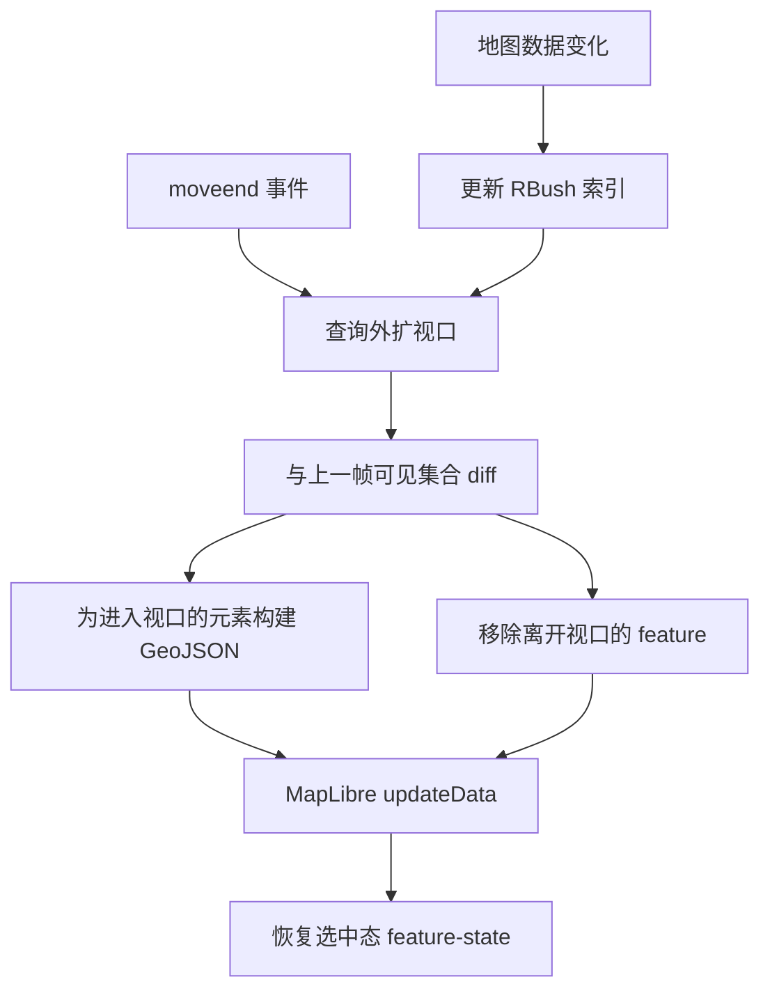

# 视口裁剪设计

## 背景

当地图包含 5 万条以上车道时，把全部 GeoJSON feature 一次性交给 MapLibre 会让 `setData()` / `updateData()` 成本随总数据量增长。MapLibre 内部会做瓦片化，但应用层仍然需要把数据推入 source。视口裁剪的目标是：MapLibre source 中只保留当前视口及其缓冲区域内的元素，视口外元素保留在编辑器数据层和空间索引中。

## 方案概述

系统为全部地图元素维护一棵 RBush 空间索引。视口移动或地图数据变化时，查询当前视口外扩后的范围，与上一次可见集合做 diff，只为进入或离开视口的元素增删 feature。



## 核心模块

建议由 `src/map/viewportCuller.ts` 统一管理视口裁剪。它负责三件事：

- 维护所有元素 bbox 的 RBush 索引。
- 记录每个 source 当前可见的元素 ID 集合。
- 统一向 MapLibre GeoJSON source 写入数据，替代散落的边界层、元素层和 source diff 更新路径。

### 索引条目

```ts
interface SpatialEntry {
  minX: number;
  minY: number;
  maxX: number;
  maxY: number;
  id: string;
  elementType:
    | 'lane'
    | 'junction'
    | 'crosswalk'
    | 'signal'
    | 'stop_sign'
    | 'clear_area'
    | 'speed_bump'
    | 'parking_space';
}
```

每个地图元素对应一条索引记录。车道 bbox 来自已缓存的边界多边形，其它元素使用自身 polygon 或 linestring 坐标计算 bbox。bbox 计算逻辑应抽成共享工具，避免重叠计算、命中测试和视口裁剪各自维护一份实现。

## 索引生命周期

| 事件           | 操作                                     |
| -------------- | ---------------------------------------- |
| 导入完成       | 使用 `rbush.load(allEntries)` 批量建索引 |
| 新增元素       | `rbush.insert(entry)`                    |
| 编辑几何       | 移除旧 bbox，再插入新 bbox               |
| 删除元素       | `rbush.remove(entry)`                    |
| 清空或重新导入 | `rbush.clear()` 后重新 `load`            |

索引随 store 变化增量维护。实现上可以复用现有的引用 diff 思路：只有几何引用变化的元素才重新计算 bbox。

## 视口同步流程

`syncViewport(map)` 在两类场景执行：

1. 用户平移或缩放后触发 `moveend`。
2. 导入、绘制、编辑、删除、撤销或重做导致地图数据变化。

同步步骤如下：

1. 读取 `map.getBounds()`，按视口宽高各外扩 50%，得到带缓冲的查询范围。
2. 用 RBush 查询范围内的 `SpatialEntry`。
3. 与上一轮 `_visibleIds` 做集合差异：
   - 新进入视口：构建 GeoJSON feature 并通过 `updateData({ add })` 加入 source。
   - 离开视口：通过 `updateData({ remove })` 从 source 删除。
   - 仍在视口：跳过，避免重复写入。
4. 更新 `_visibleIds`。
5. 对受影响 source 重新应用选中态和高亮态。

## Feature 构建

车道通常会生成填充、中心线、边界、箭头、连接关系等多类 feature，应复用已有的车道 feature 构建函数。其它元素继续复用当前元素层的转换逻辑。

车道连接关系需要单独处理：连接线跨越两条车道，只要源车道或目标车道在可见集合中，连接线就应该可见。由于连接线很轻量，可以在每次同步时基于可见车道重建，而不是单独维护复杂索引。

## 选中元素

当前选中的元素应始终进入可见集合，即使它已经被平移到视口外。这样可以保持 selection `feature-state` 和后续定位行为一致。选中状态变化时，如果新选中的元素尚未加载到 source，需要立即补入对应 feature。

## 首次导入体验

大地图首次导入时不再逐步加载全量 feature，而是：

1. 分块构建 RBush 索引。
2. 查询初始视口。
3. 只把初始视口内的 feature 写入 source。
4. 用户平移到新区域时再加载对应元素。

这样地图可以更快进入可交互状态，且 MapLibre source 的 feature 数量稳定受视口大小约束。

## 与现有渲染管线的关系

| 现有能力                  | 处理方式                        |
| ------------------------- | ------------------------------- |
| `buildLaneFeaturesInto()` | 继续复用，用于车道 feature 构建 |
| `boundaryCache`           | 继续复用，用于车道边界和 bbox   |
| `selectionStateManager`   | 继续复用，用于恢复选中态        |
| `updateData()`            | 继续作为增量写 source 的通道    |
| 全量边界/元素层更新       | 由 `syncViewport()` 接管        |
| source diff engine        | 可被视口可见集 diff 替代        |

## 性能预期

| 操作              | 复杂度                | 5 万车道估计耗时 |
| ----------------- | --------------------- | ---------------- |
| 构建索引          | O(n)                  | 约 50 ms         |
| 查询视口          | O(log n + k)          | 约 1-5 ms        |
| 可见集 diff       | O(k)                  | 约 1 ms          |
| 构建新增 feature  | O(entering)           | 约 1-5 ms        |
| `updateData` 增删 | O(entering + leaving) | 约 5-10 ms       |
| 单元素编辑        | O(log n)              | 小于 1 ms        |
| 单次平移/缩放同步 | -                     | 约 10-20 ms      |

这里的 `k` 是视口内元素数量，通常为数百到数千。

## 边界情况

- **缩放到全图**：如果一次查询返回超过 1 万个元素，可以切换到全量加载模式；当查询数量低于 8000 时再恢复裁剪，避免在阈值附近频繁抖动。
- **元素跨越视口边界**：外扩查询范围可以覆盖部分可见元素，减少边缘 pop-in。
- **撤销/重做**：大规模状态变化可以触发索引重建和一次完整 `syncViewport()`。
- **fitBounds**：最终会触发 `moveend`，由同一同步流程处理。
- **图层可见性切换**：隐藏类型不构建 feature；重新显示后在下一轮同步中补入可见元素。

## 验证清单

1. 导入 5 万条以上车道的地图，确认 MapLibre source 中只包含视口附近的 feature。
2. 平移地图，新区域元素应平滑出现，缓冲区内不应明显闪烁。
3. 选中元素后平移，选中态应保持。
4. 编辑车道后，几何和索引应立即更新。
5. 撤销/重做后，地图显示与数据状态一致。
6. 缩放到全图时，全量模式应接管；缩回局部视图后恢复裁剪。
7. 平移/缩放同步耗时应保持在约 20 ms 以内。
